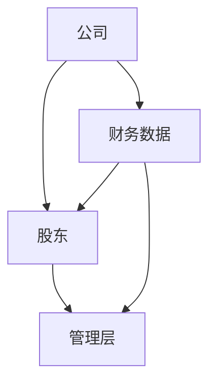
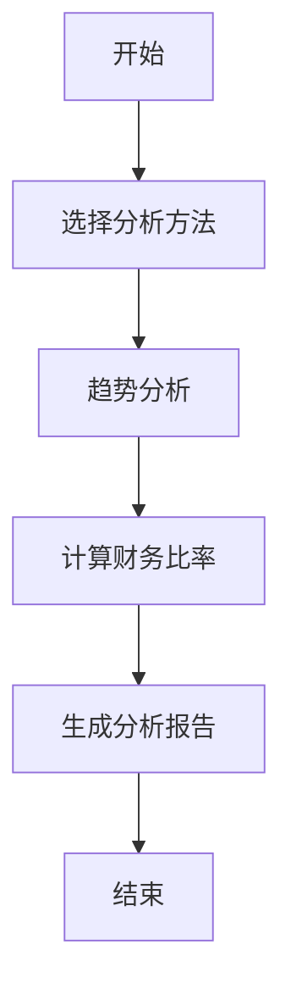
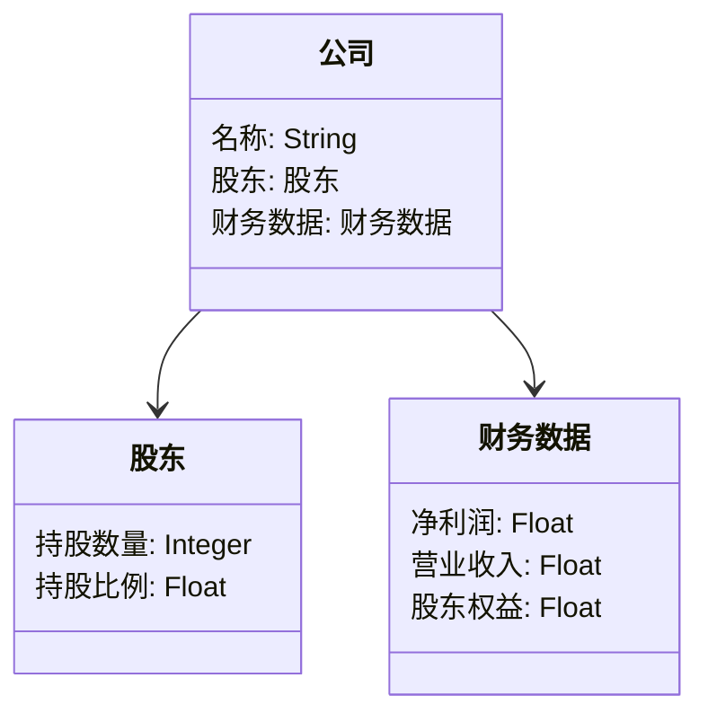

                 


# 彼得林奇对公司盈利质量的深度分析

## 关键词：盈利质量，彼得·林奇，投资分析，财务指标，投资策略

## 摘要：本文深入分析了彼得·林奇在公司盈利质量评估方面的独特见解和方法。通过详细讲解盈利质量的核心概念、分析算法、系统架构及实际案例，本文为投资者提供了如何有效评估企业盈利能力的实用指南。从数学模型到实际应用，本文全面解析了盈利质量分析的各个方面，帮助读者掌握这一关键投资技能。

---

# 第一部分: 盈利质量的核心概念与背景介绍

## 第1章: 盈利质量的定义与重要性

### 1.1 盈利质量的定义与重要性

#### 1.1.1 盈利质量的定义
盈利质量是指企业在一定时期内实现的利润与其所消耗的资源之间的比率。它不仅反映了企业创造利润的能力，还体现了企业在经营过程中资源配置的效率。

#### 1.1.2 盈利质量在投资分析中的重要性
盈利质量是投资者评估企业价值的重要指标。高盈利质量意味着企业能够持续创造利润，从而为股东带来更高的回报。投资者通常通过分析企业的盈利质量来判断其投资价值。

#### 1.1.3 彼得·林奇对盈利质量的关注点
彼得·林奇在其投资分析中，特别关注企业的盈利能力和成长潜力。他认为，企业的盈利质量不仅取决于当前的盈利能力，还取决于其未来的增长潜力。

### 1.2 盈利质量的背景与问题背景

#### 1.2.1 企业盈利质量的演变
随着经济环境的变化，企业盈利质量的评估标准也在不断演变。从传统的单一指标分析到多维度的综合评估，盈利质量的分析方法更加多样化。

#### 1.2.2 投资者关注盈利质量的必要性
在复杂的市场环境中，投资者需要通过盈利质量分析来识别高潜力企业，降低投资风险。

#### 1.2.3 盈利质量与企业价值的关系
盈利质量是连接企业内在价值与市场价值的重要桥梁。高盈利质量的企业通常具有更高的市场价值。

### 1.3 彼得·林奇的分析框架

#### 1.3.1 彼得·林奇的投资理念
彼得·林奇主张长期投资，注重企业的基本面分析。他认为，企业的内在价值是其未来现金流的现值，而盈利质量是评估企业价值的重要因素。

#### 1.3.2 他如何定义盈利质量
彼得·林奇认为，盈利质量不仅包括当前的盈利能力，还包括企业的成长性和稳定性。他特别关注企业的净利润率和ROE（净资产收益率）等指标。

#### 1.3.3 他的分析方法与步骤
1. **数据收集**：收集企业的财务报表，包括收入表、资产负债表和现金流量表。
2. **关键指标计算**：计算净利润率、ROE等关键指标。
3. **趋势分析**：分析企业的历史财务数据，判断其盈利能力的趋势。
4. **行业对比**：将企业的财务指标与行业平均水平进行对比，评估其相对表现。

---

## 第2章: 盈利质量的核心概念与联系

### 2.1 盈利质量的核心要素

#### 2.1.1 净利润
净利润是企业的总收益减去总成本和费用。它是评估企业盈利能力的核心指标。

#### 2.1.2 每股收益（EPS）
每股收益是净利润除以流通股数，反映每股的盈利能力。EPS越高，企业的盈利能力越强。

#### 2.1.3 营业利润率
营业利润率是净利润除以营业收入，衡量企业每单位收入的盈利能力。高营业利润率表明企业成本控制能力强。

#### 2.1.4 净资产收益率（ROE）
ROE是净利润除以股东权益，衡量股东投资的回报率。高ROE表明企业利用股东资金的效率高。

### 2.2 盈利质量的核心概念对比

#### 2.2.1 盈利能力指标对比表格
| 指标名称   | 公式                         | 主要用途           |
|------------|------------------------------|-------------------|
| 净利润     | 净利润 = 收入 - 成本 - 费用   | 评估整体盈利能力   |
| 每股收益   | EPS = 净利润 / 流通股数      | 评估每股的盈利能力 |
| 营业利润率 | 营业利润率 = 净利润 / 收入    | 评估收入的盈利能力 |
| ROE        | ROE = 净利润 / 股东权益      | 评估股东资金的回报率 |

#### 2.2.2 盈利质量与财务健康的关系
盈利质量高通常意味着企业财务健康，反之则可能存在问题。例如，低ROE可能表明企业资金利用效率低，或者存在管理问题。

### 2.3 实体关系图（ER图）



---

## 第3章: 盈利质量的算法原理与数学模型

### 3.1 盈利质量分析的算法原理

#### 3.1.1 趋势分析法
趋势分析法通过比较企业过去几年的财务数据，判断其盈利能力的趋势。例如，计算过去五年的净利润增长率，判断企业盈利能力是否稳定或增长。

#### 3.1.2 比率分析法
比率分析法通过计算和比较不同财务比率，评估企业的盈利能力。例如，计算企业的ROE和行业平均水平进行比较。

#### 3.1.3 同行业对比法
同行业对比法将企业的财务指标与行业平均水平或竞争对手进行对比，评估其相对表现。

### 3.2 盈利质量的数学模型

#### 3.2.1 净资产收益率（ROE）公式
$$ROE = \frac{净利润}{股东权益}$$

#### 3.2.2 营业利润率公式
$$营业利润率 = \frac{净利润}{营业收入}$$

#### 3.2.3 每股收益（EPS）公式
$$EPS = \frac{净利润}{流通股数}$$

### 3.3 算法流程图（Mermaid）



---

## 第4章: 盈利质量的系统分析与架构设计

### 4.1 系统分析

#### 4.1.1 问题场景介绍
本系统旨在帮助投资者分析企业的盈利质量，评估其投资价值。系统需要收集企业的财务数据，计算各项财务指标，生成分析报告。

#### 4.1.2 系统功能设计（领域模型）



---

## 第5章: 项目实战

### 5.1 环境安装

#### 5.1.1 安装Python和相关库
```bash
pip install pandas numpy matplotlib
```

### 5.2 核心实现源代码

#### 5.2.1 计算ROE的代码
```python
import pandas as pd

def calculate_roe(net_profit, shareholders_equity):
    return net_profit / shareholders_equity

# 示例数据
data = {
    '公司': ['公司A', '公司B', '公司C'],
    '净利润': [100, 150, 200],
    '股东权益': [500, 600, 700]
}

df = pd.DataFrame(data)
df['ROE'] = df.apply(lambda x: calculate_roe(x['净利润'], x['股东权益']), axis=1)
print(df)
```

#### 5.2.2 生成趋势图的代码
```python
import matplotlib.pyplot as plt

# 示例数据
years = [2018, 2019, 2020, 2021, 2022]
revenues = [1000, 1200, 1300, 1400, 1500]
profits = [100, 120, 130, 140, 150]

plt.figure(figsize=(10, 6))
plt.plot(years, revenues, label='收入')
plt.plot(years, profits, label='利润')
plt.title('公司收入与利润趋势图')
plt.xlabel('年份')
plt.ylabel('金额')
plt.legend()
plt.show()
```

### 5.3 案例分析

#### 5.3.1 案例背景
以苹果公司为例，分析其2020年的盈利质量。

#### 5.3.2 数据收集
从苹果公司的2020年财务报表中获取以下数据：
- 净利润：$574亿美元
- 营业收入：$2790亿美元
- 股东权益：$1476亿美元

#### 5.3.3 计算指标
- 净利润率：$$574 / 2790 = 0.2057 \text{（20.57%）}$$
- ROE：$$574 / 1476 = 0.389 \text{（38.9%）}$$

#### 5.3.4 分析结果
苹果公司在2020年的净利润率为20.57%，ROE为38.9%，均高于行业平均水平，表明其盈利能力强，股东资金利用效率高。

---

## 第6章: 最佳实践与小结

### 6.1 小结
盈利质量分析是评估企业投资价值的重要环节。通过计算和比较关键财务指标，投资者可以更好地判断企业的盈利能力和成长潜力。

### 6.2 注意事项
- 数据的准确性和及时性是盈利质量分析的基础。
- 应结合行业特点和企业实际情况，灵活运用分析方法。
- 长期关注企业的财务数据和市场环境变化，及时调整投资策略。

### 6.3 拓展阅读
- 彼得·林奇的《投资最重要的事情》
- 《财务报表分析与股票投资》

---

通过本文的详细分析，读者可以掌握彼得·林奇的盈利质量分析方法，并能够将其应用于实际投资中，提高自身的投资能力。

