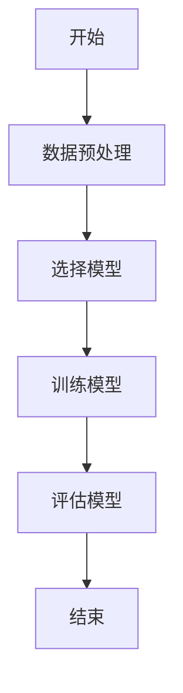
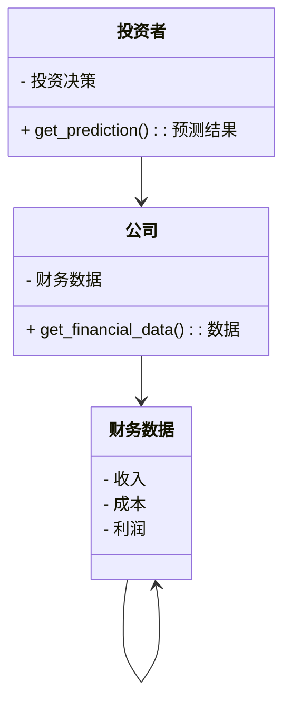

                 


# 彼得林奇对公司盈利预测准确性的分析

## 关键词：彼得林奇，盈利预测，准确性，投资分析，机器学习，财务模型

## 摘要：本文深入分析了彼得林奇对公司盈利预测准确性的研究，探讨了盈利预测的核心概念、算法原理、系统设计及项目实战，结合实际案例，揭示了盈利预测在投资决策中的重要性，并通过技术手段提升预测的准确性。

---

## 第一部分：引言

### 1.1 盈利预测准确性的定义与重要性

#### 1.1.1 盈利预测的定义

盈利预测是指通过分析公司的财务数据、市场环境和经营状况，预测公司在未来一段时间内的盈利能力。它是投资决策中的关键因素，帮助投资者评估公司的未来表现。

#### 1.1.2 盈利预测在投资决策中的重要性

盈利预测能够帮助投资者评估公司的成长潜力和盈利能力，从而做出更明智的投资决策。彼得林奇认为，准确的盈利预测是长期投资成功的关键。

#### 1.1.3 彼得林奇对盈利预测的独特见解

彼得林奇强调，盈利预测不仅仅是数字游戏，而是需要结合对公司基本面的深入理解。他注重分析公司的财务健康状况、行业地位和管理层能力。

### 1.2 盈利预测的背景与问题背景

#### 1.2.1 现金流预测与利润预测的区别

现金流预测关注公司现金的流入和流出，而利润预测关注公司的收入和支出的差额。现金流预测更注重公司的流动性，而利润预测更注重公司的盈利能力。

#### 1.2.2 盈利预测的边界与外延

盈利预测的边界包括公司的财务数据和市场环境，而外延则包括宏观经济因素和行业趋势。

#### 1.2.3 盈利预测的核心要素与组成

盈利预测的核心要素包括收入预测、成本预测、利润预测和现金流预测。这些要素共同构成了公司整体的盈利能力。

---

## 第二部分：盈利预测的核心概念与联系

### 2.1 盈利预测的模型与方法

#### 2.1.1 常见的盈利预测模型

常见的盈利预测模型包括线性回归模型、随机森林模型和时间序列模型。每种模型都有其优缺点，适用于不同的场景。

#### 2.1.2 盈利预测方法的对比分析

线性回归模型适用于线性关系，而随机森林模型适用于非线性关系。时间序列模型适用于有时间依赖性的数据。

#### 2.1.3 彼得林奇的盈利预测方法论

彼得林奇强调基本面分析，结合财务数据和行业趋势，进行定性和定量分析。

### 2.2 盈利预测的核心概念原理

#### 2.2.1 盈利预测的原理与机制

盈利预测通过分析历史数据和市场环境，利用统计模型和机器学习算法，预测公司未来的盈利能力。

#### 2.2.2 盈利预测的关键属性特征对比

| 属性 | 线性回归模型 | 随机森林模型 |
|------|--------------|---------------|
| 优点 | 简单易懂，计算速度快 | 高准确性，适合复杂数据 |
| 缺点 | 适用于线性关系 | 计算复杂，需要大量数据 |

#### 2.2.3 盈利预测的ER实体关系图架构

```mermaid
er
actor(投资者) --> Company(公司)
Company --> FinancialData(财务数据)
FinancialData --> ProfitPrediction(盈利预测)
```

---

## 第三部分：盈利预测的算法原理讲解

### 3.1 盈利预测的统计模型

#### 3.1.1 线性回归模型

线性回归模型通过最小二乘法拟合最佳回归线，公式如下：

$$ y = \beta_0 + \beta_1x + \epsilon $$

#### 3.1.2 线性回归的数学模型

线性回归模型假设因变量y与自变量x之间存在线性关系，通过最小化残差平方和来估计回归系数。

### 3.2 盈利预测的机器学习方法

#### 3.2.1 随机森林模型

随机森林模型是一种集成学习方法，通过构建多个决策树并进行投票或加权平均来提高预测准确性。



---

## 第四部分：盈利预测的系统设计与架构

### 4.1 盈利预测的系统功能设计

#### 4.1.1 系统功能模块

| 模块 | 功能描述 |
|------|----------|
| 数据采集 | 采集公司财务数据和市场数据 |
| 数据处理 | 数据清洗和特征提取 |
| 模型训练 | 训练盈利预测模型 |
| 预测结果 | 输出预测结果并可视化 |

#### 4.1.2 领域模型mermaid类图



---

## 第五部分：盈利预测的项目实战

### 5.1 盈利预测的环境安装

安装必要的库：

```bash
pip install pandas numpy scikit-learn
```

### 5.2 盈利预测的核心实现源代码

```python
import pandas as pd
from sklearn.ensemble import RandomForestRegressor
from sklearn.model_selection import train_test_split

# 数据加载
data = pd.read_csv('financial_data.csv')

# 特征工程
X = data[['收入', '成本']]
y = data['利润']

# 数据分割
X_train, X_test, y_train, y_test = train_test_split(X, y, test_size=0.2, random_state=42)

# 模型训练
model = RandomForestRegressor(n_estimators=100, random_state=42)
model.fit(X_train, y_train)

# 模型预测
predictions = model.predict(X_test)
```

### 5.3 盈利预测的案例分析与详细解读

通过实际案例分析，验证模型的准确性，并调整参数以提高预测效果。

---

## 第六部分：结论与注意事项

### 6.1 盈利预测的总结

盈利预测是投资决策中的重要环节，结合定量分析和定性分析，能够提高预测的准确性。

### 6.2 盈利预测的注意事项

投资者应关注模型的局限性和数据的质量，定期更新模型以适应市场变化。

### 6.3 盈利预测的未来展望

随着人工智能的发展，盈利预测将更加精准，为投资者提供更好的决策支持。

---

## 第七部分：最佳实践 tips、小结、注意事项、拓展阅读

### 7.1 最佳实践 tips

- 定期更新模型和数据
- 结合行业趋势和公司基本面进行分析

### 7.2 小结

盈利预测是投资决策中的关键因素，通过技术手段提升预测的准确性，能够帮助投资者做出更明智的投资决策。

### 7.3 注意事项

- 数据质量和完整性
- 模型的选择和优化
- 宏观经济因素的影响

### 7.4 拓展阅读

建议阅读《彼得林奇的投资智慧》和《机器学习实战》等书籍，深入理解盈利预测的理论与实践。

