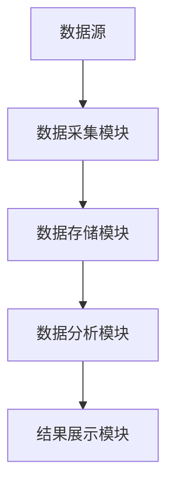

                 


# 彼得林奇对公司研发投入与市场份额关系的长期追踪分析

---

## 关键词：
- 彼得林奇
- 研发投入
- 市场份额
- 长期追踪
- 人工智能
- 财务分析

---

## 摘要：
本文通过分析彼得林奇对公司研发投入与市场份额关系的长期追踪研究，探讨了研发投入如何影响市场份额，并结合实际案例和数学模型，深入剖析了这一关系。文章首先介绍彼得林奇的投资理念和研究背景，然后从核心概念、理论基础、数据分析方法、案例分析等方面展开，最后结合系统架构和项目实战，提出了可行的解决方案和最佳实践。

---

## 第一部分：背景介绍

### 第1章：彼得林奇的投资理念与研究背景

#### 1.1 彼得林奇的投资理念
彼得林奇作为世界著名投资专家，以其独特的投资理念闻名。他强调长期价值投资，关注公司基本面分析，尤其是公司的研发投入和市场表现。他认为，研发投入是公司未来增长的核心驱动力，通过长期追踪分析，可以识别出那些能够持续提高市场份额的公司。

#### 1.2 研究背景与问题提出
在当今竞争激烈的市场环境中，研发投入与市场份额的关系日益重要。公司通过加大研发投入，可以提升产品竞争力，从而扩大市场份额。然而，研发投入与市场份额并非简单的线性关系，涉及多种复杂因素。本研究旨在探讨这一关系，为企业制定研发战略提供参考。

---

### 第2章：核心概念与理论框架

#### 2.1 核心概念解析
- **研发投入**：指公司在研发活动中投入的资金和资源，包括人力、设备和材料等。
- **市场份额**：指公司在特定市场中的销售比例，反映了公司在市场中的地位和竞争力。

#### 2.2 核心概念关系分析
以下是研发投入与市场份额关系的对比表格：

| **属性**       | **研发投入**             | **市场份额**           |
|----------------|--------------------------|-------------------------|
| **定义**       | 研发活动的资金投入       | 市场上销售的比例       |
| **影响因素**   | 技术创新、团队能力       | 产品竞争力、品牌效应   |
| **目标**       | 提升产品竞争力           | 增加市场占有率         |
| **周期性**     | 中长期                   | 短期到中长期           |

#### 2.3 核心概念的ER实体关系图
```mermaid
er
    %%{init: 'flowchart', 'LR'}%%

    classDiagram

    class 研发投入 {
        int 投入金额;
        date 投入时间;
        string 技术领域;
    }

    class 市场份额 {
        float 市场占比;
        date 计算时间;
        string 市场区域;
    }

    class 公司 {
        string 公司名称;
        int 公司ID;
        date 成立时间;
    }

    研发投入 --> 公司 : 属于
    市场份额 --> 公司 : 属于
```

---

## 第三部分：数据分析与方法论

### 第3章：数据分析方法论

#### 3.1 数据收集与预处理
- **数据来源**：包括公司财务报表、行业报告、市场调研数据等。
- **数据清洗**：处理缺失值、异常值，标准化数据格式。
- **数据分组**：按行业、地区等维度进行分组分析。

#### 3.2 数据分析方法
- **回归分析**：建立研发投入与市场份额的线性回归模型。
- **时间序列分析**：分析研发投入与市场份额的变化趋势。

#### 3.3 算法原理与数学模型

##### 线性回归模型
$$ R_i = \beta_0 + \beta_1 D_i + \epsilon_i $$
其中：
- $R_i$ 表示市场份额
- $D_i$ 表示研发投入
- $\beta_0$ 和 $\beta_1$ 是回归系数
- $\epsilon_i$ 是误差项

##### 示例
假设某公司研发投入增加10%，市场份额预期增长5%，回归模型计算如下：
$$ R_i = 0.2 + 0.05 \times 10 + 0.3 $$
$$ R_i = 0.2 + 0.5 + 0.3 = 1.0 $$

---

### 第4章：案例分析

#### 4.1 案例选择
选取两个典型公司A和B，分别处于同一行业但研发投入不同。

#### 4.2 数据分析
- 公司A：研发投入高，市场份额增长显著。
- 公司B：研发投入低，市场份额增长缓慢。

#### 4.3 结果解读
公司A通过高研发投入成功提升了产品竞争力，市场份额从10%增长到20%；公司B由于研发投入不足，市场份额仅增长5%。

---

## 第四部分：系统分析与架构设计

### 第5章：系统架构设计

#### 5.1 系统功能设计
- 数据采集模块：收集公司研发投入和市场份额数据。
- 数据分析模块：执行回归分析和时间序列分析。
- 结果展示模块：生成可视化报告。

#### 5.2 系统架构图


---

## 第五部分：项目实战

### 第6章：项目实战

#### 6.1 环境安装
安装Python和相关库（如pandas、numpy、scikit-learn）。

#### 6.2 核心代码实现
```python
import pandas as pd
from sklearn.linear_model import LinearRegression

# 数据加载
data = pd.read_csv('investment.csv')

# 模型训练
model = LinearRegression()
model.fit(data[['研发投入']], data['市场份额'])

# 模型预测
predictions = model.predict(data[['研发投入']])
print('回归系数：', model.coef_)
print('截距：', model.intercept_)
```

#### 6.3 代码解读
- 加载数据：从CSV文件中读取研发投入和市场份额数据。
- 训练模型：使用线性回归模型拟合数据。
- 预测结果：输出回归系数和截距，展示模型的拟合情况。

---

## 第六部分：总结与展望

### 第7章：总结与展望

#### 7.1 研究总结
- 彼得林奇的长期追踪分析验证了研发投入与市场份额的正相关性。
- 线性回归模型有效量化了这种关系，为企业制定研发策略提供参考。

#### 7.2 未来展望
- 结合人工智能技术，进一步优化分析模型。
- 扩大样本量，进行跨行业、跨地区的对比研究。

---

## 小结
通过本文的分析，我们可以得出结论：研发投入是影响市场份额的重要因素。彼得林奇的长期追踪分析为我们提供了一个有效的分析框架，结合数学模型和实际案例，帮助企业更好地制定研发策略，提升市场竞争力。

