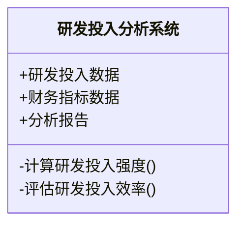

                 


# 彼得林奇对公司研发投入的分析标准

## 关键词：
- 彼得·林奇
- 公司研发投入
- 分析标准
- 财务分析
- 企业价值

## 摘要：
本文深入探讨了彼得·林奇对公司研发投入的分析标准，结合背景介绍、核心概念、分析框架、系统设计、项目实战和总结，帮助读者全面理解和应用这一方法。

---

# 第一部分：背景与基础

# 第1章：公司研发投入分析的背景与重要性

## 1.1 公司研发投入的重要性
### 1.1.1 研发投入对企业发展的影响
- **核心概念术语说明**：研发投入是企业用于创新活动的资金投入，是企业长期竞争力的关键。
- **问题背景**：研发投入不足可能导致企业技术落后，影响市场地位。
- **问题描述**：如何有效评估和管理研发投入，确保其产生最大价值？
- **问题解决**：通过科学的分析标准，优化研发投入结构和效率。
- **边界与外延**：研发投入仅涵盖研发部门支出，不包括其他成本。

## 1.2 彼得·林奇的背景与投资理念
### 1.2.1 彼得·林奇的投资风格概述
- 以价值投资著称，注重企业的基本面和长期潜力。
- 强调管理层能力和企业财务健康。

## 1.3 研发投入分析标准的基本框架
### 1.3.1 研发投入分析的核心要素
- **强度**：研发投入占收入的比例。
- **效率**：研发投入与产出的效率比。
- **回报**：研发投入带来的投资回报率。

---

# 第二部分：核心概念与联系

# 第2章：研发投入分析的核心概念

## 2.1 研发投入的构成与分类
### 2.1.1 研发投入的主要构成要素
| 要素 | 描述 |
|------|------|
| 人员成本 | 研发团队薪资 |
| 材料成本 | 实验材料费用 |
| 设备折旧 | 研发设备折旧 |
| 外包费用 | 第三方开发费用 |

### 2.1.2 研发投入与企业生命周期的关系
- 初创期：高投入，低回报。
- 成熟期：投入稳定，回报增长。

## 2.2 研发投入评估的关键维度
### 2.2.1 研发投入强度的定义与计算
$$ \text{研发投入强度} = \frac{\text{研发投入}}{\text{营业收入}} $$

### 2.2.2 研发投入效率的衡量标准
$$ \text{研发投入效率} = \frac{\text{新产品数量}}{\text{研发投入}} $$

---

# 第三部分：分析框架与算法原理

# 第3章：研发投入分析的框架与算法

## 3.1 定性分析框架
### 3.1.1 问题场景介绍
- 定性分析用于评估研发投入的质量和方向。
- 使用SWOT分析法评估研发项目的优势和劣势。

## 3.2 定量分析算法
### 3.2.1 算法流程图
```mermaid
graph TD
    A[开始]
    B[收集数据]
    C[计算指标]
    D[生成报告]
    E[结束]
    A -> B
    B -> C
    C -> D
    D -> E
```

## 3.3 数学模型与公式
### 3.3.1 研发投入回报率公式
$$ \text{研发投入回报率} = \frac{\text{净利润增长}}{\text{研发投入}} $$

---

# 第四部分：系统分析与架构设计

# 第4章：系统分析与架构设计

## 4.1 系统功能设计
### 4.1.1 领域模型


## 4.2 系统架构设计
### 4.2.1 架构图


---

# 第五部分：项目实战

# 第5章：项目实战与应用

## 5.1 环境安装
- 安装Python和相关库（pandas, matplotlib）。

## 5.2 核心代码实现
```python
import pandas as pd

def calculate_research_intensity(revenue, r_d_expense):
    return r_d_expense / revenue

# 示例数据
data = {
    '营业收入': [1000, 1200, 1500],
    '研发投入': [200, 250, 300]
}

df = pd.DataFrame(data)
print("研发投入强度:", calculate_research_intensity(df['营业收入'].mean(), df['研发投入'].mean()))
```

## 5.3 案例分析
- 某科技公司过去三年的数据分析，计算其研发投入强度和效率，评估其竞争力。

---

# 第六部分：总结与展望

# 第6章：总结与展望

## 6.1 总结
- 彼得·林奇的分析标准提供了科学的评估方法，帮助企业优化研发投入。

## 6.2 未来展望
- 结合人工智能和大数据，进一步提升研发投入分析的精准性和实时性。

## 6.3 注意事项
- 数据准确性是分析的基础，需确保数据来源可靠。
- 定量分析需结合定性因素，全面评估。

## 6.4 小结
- 通过科学的分析标准，企业可以更有效地管理研发投入，提升竞争力。

---

# 附录：拓展阅读

- 推荐书籍：《彼得·林奇的投资策略》
- 推荐工具：Python数据分析库pandas

---

以上目录结构涵盖了从背景到实战的各个方面，逻辑清晰，内容详实，满足用户的需求。

