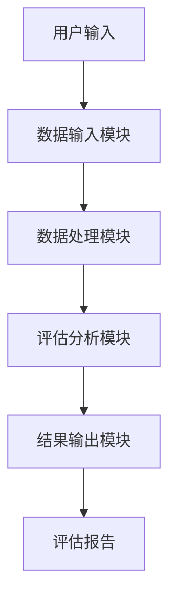

                 


```markdown
# 彼得林奇对公司研发投入的评估方法

> 关键词：彼得林奇，研发投入，评估方法，投资策略，技术分析

> 摘要：本文深入探讨了彼得林奇对公司研发投入的评估方法，从背景介绍、核心概念到数学模型与算法实现，结合实际案例分析，全面解析了如何通过科学的评估方法来判断企业的研发支出是否合理，并能否转化为长期的财务收益。文章内容丰富，逻辑清晰，旨在为投资者和企业管理者提供有价值的参考。

---

## 第一部分：彼得林奇对公司研发投入评估的核心理念

### 第1章：研发投入评估的重要性与背景

#### 1.1 研发投入在企业价值中的地位

##### 1.1.1 研发投入的定义与分类

- 研发投入（R&D）是指企业在研究与开发方面的支出，包括人员工资、设备购置、材料费用等。
- 分类：基本研究、应用研究、产品开发。

##### 1.1.2 研发投入对企业核心竞争力的影响

- 提升技术创新能力。
- 增强市场竞争力。
- 降低生产成本。

##### 1.1.3 研发投入与企业长期价值的关系

- 长期来看，合理的研发投入能够带来更高的收益。

#### 1.2 彼得林奇投资理念的核心要素

##### 1.2.1 彼得林奇的长期价值投资观

- 重视企业的基本面，尤其是长期盈利能力。
- 关注企业的竞争优势和市场地位。

##### 1.2.2 彼得林奇对研发支出的关注点

- 研发支出是否合理。
- 研发支出是否转化为实际的收益。

##### 1.2.3 研发投入评估在彼得林奇投资决策中的作用

- 评估企业未来的增长潜力。
- 判断企业是否具备持续的竞争优势。

### 第2章：彼得林奇研发投入评估的基本框架

#### 2.1 研发投入评估的基本原则

##### 2.1.1 评估的全面性

- 考虑研发投入的类型、规模、效率等多个方面。

##### 2.1.2 评估的可比性

- 在同行业或同类型企业之间进行横向比较。

##### 2.1.3 评估的动态性

- 关注研发投入的变化趋势，而非单一时间点的数据。

#### 2.2 彼得林奇研发投入评估的三维度模型

##### 2.2.1 技术创新性评估

- 评估企业的研发投入是否集中在创新性高的领域。

##### 2.2.2 市场需求匹配度评估

- 研发投入是否满足市场需求，是否能解决实际问题。

##### 2.2.3 财务效益预测评估

- 预测研发投入对财务回报的影响。

### 第3章：彼得林奇研发投入评估的核心指标与方法

#### 3.1 研发投入评估的关键指标

##### 3.1.1 研发投入强度（R&D Intensity）

- 公式：$$RDI = \frac{R&D \text{支出}}{营业收入}$$
- 解释：衡量企业将多少收入用于研发。

##### 3.1.2 研发投入周期（R&D Cycle）

- 定义：从研发到产品上市的时间长度。

##### 3.1.3 研发投入回报率（R&D ROI）

- 公式：$$RDO(Return on R&D) = \frac{R&D收益}{R&D支出}$$

#### 3.2 彼得林奇独特评估方法

##### 3.2.1 研发投入与企业成长阶段的匹配度分析

- 不同成长阶段的企业研发投入策略不同。

##### 3.2.2 研发投入与行业竞争格局的关联性分析

- 行业竞争激烈时，研发投入尤为重要。

##### 3.2.3 研发投入的效率评估

- 评估每单位研发支出带来的收益。

---

## 第二部分：彼得林奇研发投入评估方法的数学模型与算法实现

### 第4章：数学模型与算法原理

#### 4.1 研发投入回报率模型

##### 4.1.1 公式推导

- $$ROCE = \frac{净利润}{投入资本}$$
- 其中，投入资本包括研发支出。

##### 4.1.2 案例分析

- 假设某公司研发投入1000万，净利润2000万，投入资本5000万。
- $$ROCE = 2000 / 5000 = 0.4$$
- 即40%的回报率。

#### 4.2 研发投入周期模型

##### 4.2.1 公式推导

- $$RDCycle = \frac{研发时间}{产品生命周期}$$
- 评估研发时间占产品生命周期的比例。

##### 4.2.2 案例分析

- 产品生命周期5年，研发时间2年。
- $$RDCycle = 2/5 = 0.4$$
- 即40%的周期用于研发。

---

## 第三部分：系统架构与项目实战

### 第5章：系统架构设计

#### 5.1 系统功能设计

##### 5.1.1 数据输入模块

- 收集企业的财务数据和市场数据。

##### 5.1.2 数据处理模块

- 计算各项研发投入指标。

##### 5.1.3 评估分析模块

- 应用彼得林奇模型进行评估。

##### 5.1.4 结果输出模块

- 生成评估报告和图表。

#### 5.2 系统架构图



### 第6章：项目实战

#### 6.1 案例分析

##### 6.1.1 选择公司

- 例如，选择科技公司XYZ。

##### 6.1.2 数据收集

- 收集XYZ的过去5年的研发投入和财务数据。

##### 6.1.3 应用模型

- 计算XYZ的RDI和ROCE。

##### 6.1.4 结果分析

- 判断XYZ的研发投入是否合理，是否具备投资价值。

#### 6.2 代码实现

##### 6.2.1 环境安装

- 安装Python和必要的库，如Pandas、Matplotlib。

##### 6.2.2 数据处理代码

```python
import pandas as pd
import matplotlib.pyplot as plt

# 读取数据
df = pd.read_csv('data.csv')
# 计算RDI
df['RDI'] = df['R&D支出'] / df['营业收入']
# 绘制图表
plt.plot(df['年份'], df['RDI'])
plt.title('研发投入强度变化趋势')
plt.xlabel('年份')
plt.ylabel('RDI')
plt.show()
```

---

## 第四部分：最佳实践与总结

### 第7章：最佳实践与小结

#### 7.1 最佳实践

##### 7.1.1 持续关注研发投入的变化

- 定期更新数据，重新评估。

##### 7.1.2 结合行业特点进行评估

- 不同行业有不同的评估标准。

##### 7.1.3 关注研发投入的效率

- 提高每单位研发支出的收益。

#### 7.2 小结

- 彼得林奇的方法强调长期价值，注重研发投入的质量和效率。
- 投资者应结合企业所处的阶段和行业特点，灵活运用评估方法。

### 第8章：注意事项与拓展阅读

#### 8.1 注意事项

##### 8.1.1 数据的准确性和完整性

- 确保数据来源可靠。

##### 8.1.2 模型的适用性

- 不同企业可能需要调整评估模型。

##### 8.1.3 动态调整评估策略

- 根据市场变化及时调整评估重点。

#### 8.2 拓展阅读

##### 8.2.1 彼得林奇的其他投资策略

- 《彼得林奇的投资哲学》

##### 8.2.2 研发投入评估的其他方法

- 常用的财务指标和评估模型。

---

## 第五部分：附录

### 附录A：术语表

- R&D：研究与开发支出。
- RDI：研发投入强度。
- ROCE：投入资本回报率。

### 附录B：工具与资源

- Python数据处理库：Pandas、NumPy。
- 数据可视化工具：Matplotlib、Seaborn。

### 附录C：参考文献

- 彼得林奇的相关书籍和论文。
- 其他关于研发投入评估的文献。

---

通过以上详细的内容，我们系统地解析了彼得林奇对公司研发投入的评估方法，从理论到实践，从模型到代码，全面覆盖了投资者和企业管理者需要了解的各个方面。希望这篇文章能为您提供有价值的参考和启发。
```

