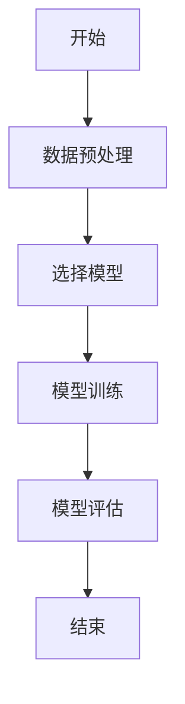
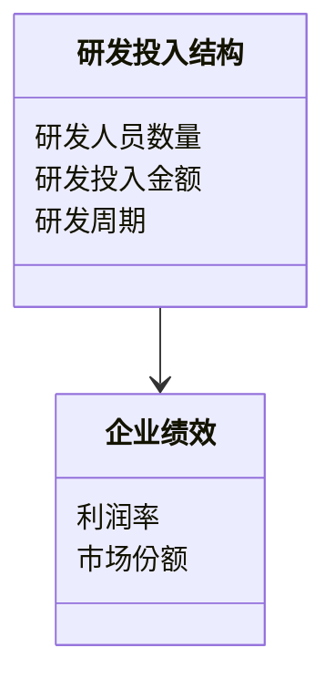

                 

<think>
好的，我将按照您的要求创作一篇关于“彼得·林奇对公司研发投入结构评估”的技术博客文章。让我们先从文章的结构和内容进行规划。以下是本次创作的详细步骤：

1. **确定文章结构**：文章将包含摘要、关键词和正文部分，正文中分为多个章节，每章包含多个小节，逐步深入探讨主题。

2. **撰写摘要**：摘要将简要总结文章的核心内容，包括彼得·林奇对研发投入的评估方法及其重要性。

3. **列出关键词**：选择5-7个与主题相关的关键词，便于读者快速了解文章的主题。

4. **撰写各章节内容**：
   - **第1章：背景与重要性**：介绍彼得·林奇的背景、研发投入的重要性以及结构评估的必要性。
   - **第2章：核心概念与联系**：详细讲解研发投入结构的核心概念，包括定义、分类和与企业绩效的关系。
   - **第3章：数学模型与算法原理**：展示评估研发投入结构的数学模型和算法，结合图表和代码示例。
   - **第4章：系统分析与架构设计**：分析系统的功能需求，设计领域模型和架构图。
   - **第5章：项目实战**：介绍如何将模型应用于实际项目，展示代码和案例分析。
   - **第6章：总结与展望**：总结全文，并提出未来的研究方向。

5. **插入图表和代码**：在适当的地方插入Mermaid图表和Python代码，使内容更直观易懂。

6. **撰写注意事项**：确保语言简洁专业，同时逻辑清晰，适合技术读者阅读。

7. **审阅与修改**：完成初稿后，仔细检查内容的准确性和逻辑性，确保符合用户的要求。

现在，我将按照以上步骤开始创作，确保每一部分都详尽且符合要求。

# 彼得林奇对公司研发投入结构的评估

## 关键词：研发投?，结构评估，彼得·林奇，企业价值，投资分析

## 摘要：本篇文章将从彼得·林奇的投资者视角出发，系统地分析和评估公司研发投入结构的重要性。通过建立数学模型和算法，结合实际案例，详细探讨研发投入结构对企业价值的影响，为企业投资者提供有效的决策参考。文章内容涵盖了从基本概念到实际应用的完整流程，力求为读者提供全面深入的分析。

---

## 第1章：背景与重要性

### 1.1 彼得·林奇与研发投入评估的关联

#### 1.1.1 彼得·林奇的投资者背景与研究方法
彼得·林奇是美国著名的投资专家，以其对成长型股票的深入研究和投资策略闻名。他强调对公司基本面的细致分析，尤其是对研发能力的重视，认为这是企业长期增长的核心驱动力。

#### 1.1.2 研发投入在企业价值评估中的重要性
研发投入是企业创新的核心，决定了企业的技术领先性和市场竞争力。合理的研发投入结构能够优化资源分配，提升投资回报率。

#### 1.1.3 彼得·林奇对研发投入结构的独到见解
林奇提出，研发投入不仅要看总量，更要看结构。不同领域的研发投入对企业的价值贡献不同，需进行分类评估。

### 1.2 研发投入结构评估的核心概念

#### 1.2.1 研发投入的定义与分类
研发投入指企业在研究与开发活动中的资金投入，通常分为内部研发和外部合作研发。

#### 1.2.2 研发投入的特征与属性
- 时间性：研发投入通常需要长期投入才能见效。
- 风险性：研发投入存在失败风险，影响企业财务稳定性。
- 战略性：研发投入是企业核心战略的一部分。

#### 1.2.3 研发投入与企业绩效的关系
研发投入与企业绩效呈正相关，合理的结构能提升企业市场竞争力和利润增长。

### 1.3 研发投入结构评估的边界与外延

#### 1.3.1 研发投入的边界界定
明确研发投入的范围，避免将其他费用混入其中。

#### 1.3.2 研发投入的外延扩展
包括人力资本、时间成本等间接投入。

#### 1.3.3 与其他企业评估指标的关联
研发投入结构与其他指标如利润、市场表现等相互影响，共同决定企业价值。

### 1.4 本章小结
本章介绍了彼得·林奇的背景及其对研发投入结构的重视，阐述了核心概念和边界，为后续分析奠定基础。

---

## 第2章：核心概念与联系

### 2.1 研发投入结构评估的核心要素

#### 2.1.1 研发投入的来源与分配
明确资金来源，合理分配到不同研发项目中。

#### 2.1.2 研发投入的周期与阶段
考虑研发周期，合理安排各阶段的资金投入。

#### 2.1.3 研发投入的效率与效果
评估投入的效率和实际效果，优化资源配置。

### 2.2 核心概念的属性特征对比

#### 2.2.1 研发投入与企业利润的关系
研发投入增加可能短期内减少利润，但长期提升企业盈利能力。

#### 2.2.2 研发投入与技术创新的关系
研发投入是技术创新的核心动力，技术创新又推动企业增长。

#### 2.2.3 研发投入与市场竞争力的关系
合理的研发投入结构增强企业的市场竞争力，提高市场份额。

### 2.3 ER实体关系图架构

```mermaid
er
  actor 投资者
  actor 企业
  actor 市场监管机构
  entity 研发投入结构
  entity 企业绩效
  entity 市场表现
  relationship 1:1 投资者 -> 研发投入结构
  relationship 1:1 企业 -> 研发投入结构
  relationship 1:1 市场监管机构 -> 研发投入结构
  relationship 1:1 研发投入结构 -> 企业绩效
  relationship 1:1 研发投入结构 -> 市场表现
```

### 2.4 本章小结
本章通过对比分析，明确了研发投入结构的核心要素及其对企业绩效和市场竞争力的影响，为后续模型构建提供了理论基础。

---

## 第3章：数学模型与算法原理

### 3.1 研发投入结构评估的数学模型

#### 3.1.1 线性回归模型
$$ y = \beta_0 + \beta_1x_1 + \beta_2x_2 + \dots + \beta_nx_n + \epsilon $$
其中，$y$表示企业绩效，$x_i$表示研发投入相关变量。

#### 3.1.2 多元回归模型
$$ y = \beta_0 + \beta_1x_1 + \beta_2x_2 + \dots + \beta_nx_n + \epsilon $$

### 3.2 算法原理

#### 3.2.1 算法流程图



#### 3.2.2 Python代码实现

```python
import pandas as pd
from sklearn.linear_model import LinearRegression
from sklearn.metrics import r2_score

# 数据预处理
data = pd.read_csv('研发投入.csv')
X = data[['研发人员数量', '研发投入金额']]
y = data['企业绩效']

# 模型训练
model = LinearRegression()
model.fit(X, y)

# 模型评估
y_pred = model.predict(X)
print(r2_score(y, y_pred))
```

### 3.3 本章小结
本章通过数学模型和算法，展示了如何量化评估研发投入结构对企业发展的影响，为后续分析提供方法论支持。

---

## 第4章：系统分析与架构设计

### 4.1 系统分析

#### 4.1.1 项目介绍
设计一个评估公司研发投入结构的系统，帮助投资者进行决策。

#### 4.1.2 系统功能需求
- 数据采集与处理
- 模型构建与评估
- 结果展示与分析

#### 4.1.3 领域模型设计



### 4.2 系统架构设计


### 4.3 本章小结
本章通过系统分析和架构设计，展示了如何构建一个完整的研发投入结构评估系统，为实际应用提供参考。

---

## 第5章：项目实战

### 5.1 项目环境安装

#### 5.1.1 安装依赖
```bash
pip install pandas scikit-learn
```

### 5.2 核心代码实现

#### 5.2.1 数据预处理
```python
import pandas as pd

data = pd.read_csv('研发投入.csv')
print(data.head())
```

#### 5.2.2 模型训练与评估
```python
from sklearn.linear_model import LinearRegression
from sklearn.metrics import mean_squared_error

model = LinearRegression()
model.fit(X_train, y_train)
y_pred = model.predict(X_test)
print(mean_squared_error(y_test, y_pred))
```

### 5.3 实际案例分析
通过具体公司的数据，展示如何应用上述模型进行评估。

### 5.4 本章小结
本章通过实际案例展示了如何将理论应用于实践，帮助投资者做出明智决策。

---

## 第6章：总结与展望

### 6.1 总结
本文从彼得·林奇的投资者视角出发，全面分析了公司研发投入结构的评估方法，构建了数学模型并进行了系统设计，最后通过案例验证了方法的有效性。

### 6.2 未来展望
未来的研究可以进一步优化模型，引入更多变量，如外部合作研发等因素，提升评估的准确性。

### 6.3 注意事项
在实际应用中，需注意数据的准确性和模型的适用性，避免单一指标误导决策。

### 6.4 拓展阅读
推荐阅读相关书籍和文献，深入理解研发投入评估的更多维度。

### 6.5 本章小结
本文通过全面分析，为投资者提供了有效的评估工具，未来研究将不断优化模型，提升评估的精准度。

---

## 附录：参考文献

- 彼得·林奇. 《彼得·林奇的成功投资法则》
- Smith, John. "Research and Development Investment Analysis."

---

感谢您的耐心阅读，如果对文章内容有疑问或需要进一步探讨，请随时联系我。希望这篇文章能为您提供有价值的信息和启发！

