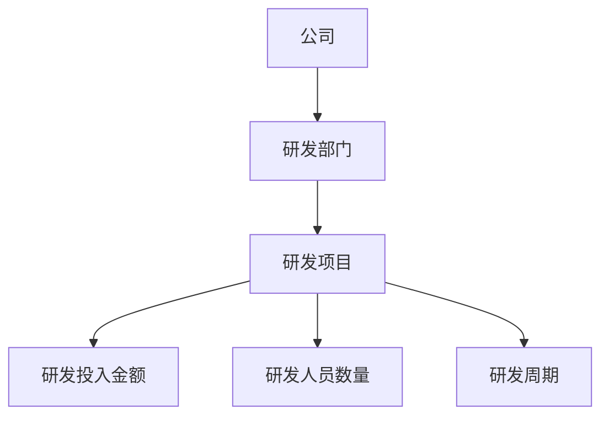
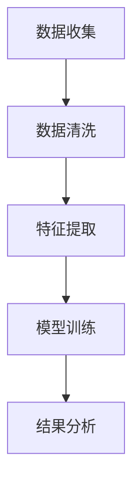
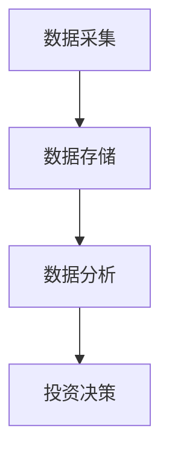

                 

# 彼得林奇对公司研发投入结构的长期跟踪分析

## 关键词：
- 彼得林奇
- 研发投入
- 结构分析
- 长期跟踪
- 投资策略

## 摘要：
本文深入分析了彼得·林奇对公司研发投入结构的长期跟踪分析方法，探讨了研发投入在企业价值中的核心地位及其对投资决策的影响。通过系统的分析框架、算法原理和实战案例，本文揭示了如何通过研发投入结构评估公司潜力，并为投资者提供实用的分析工具和策略。

---

## 第1章：研发投入结构分析的背景与重要性

### 1.1 研发投入在企业价值中的核心地位

#### 1.1.1 研发投入的定义与分类
研发投入是指企业在研发活动中投入的资源，包括资金、人力、时间和技术。通常分为内部研发和外部合作研发，涵盖基础研究、应用研究和开发阶段。

#### 1.1.2 研发投入对企业长期价值的影响
研发投入是企业创新的核心驱动力，直接影响产品竞争力和市场地位。长期高强度研发投入往往带来技术领先和持续增长的潜力。

#### 1.1.3 彼得林奇对研发投入的独特见解
彼得林奇认为，研发投入不仅是技术创新的源泉，也是评估企业长期价值的关键指标。他强调通过长期跟踪分析研发投入结构，识别高潜力企业。

---

### 1.2 彼得林奇的投资哲学

#### 1.2.1 彼得林奇的投资风格概述
彼得林奇以价值投资闻名，注重基本面分析和长期跟踪，寻找具有持续增长潜力的企业。

#### 1.2.2 长期跟踪分析的核心理念
通过持续关注企业的研发投入、财务状况和市场表现，彼得林奇能够准确评估企业的成长性和投资价值。

#### 1.2.3 研发投入结构分析的必要性
研发投入结构分析是彼得林奇长期跟踪的核心内容，帮助他识别高效率、高潜力的企业。

---

### 1.3 研发投入结构分析的框架

#### 1.3.1 研发投入的多维度分析
从时间维度、部门维度和项目维度分析研发投入的分布和效率。

#### 1.3.2 研发投入与公司竞争力的关系
高研发投入不一定带来高回报，关键在于投入的效率和方向。

#### 1.3.3 研发投入的周期性与波动性分析
研发投入与行业周期密切相关，波动性分析帮助企业识别潜在风险。

---

## 第2章：研发投入结构分析的核心概念与联系

### 2.1 研发投入结构分析的核心概念

#### 2.1.1 研发投入的构成要素
- 资金投入：研发部门的预算分配。
- 人员配置：研发团队的规模和结构。
- 技术方向：研发重点领域和项目优先级。

#### 2.1.2 研发投入的效率与效果
- 效率：单位研发投入产出的创新成果。
- 效果：研发投入对整体业绩的贡献。

#### 2.1.3 影响因素
- 行业竞争：研发投入强度与行业地位相关。
- 市场需求：研发投入方向与市场趋势匹配。

---

### 2.2 研发投入结构的核心要素对比

#### 2.2.1 研发投入与企业生命周期的关系
- 初创期：高投入，低回报。
- 成熟期：稳定投入，持续优化。

#### 2.2.2 研发投入与行业竞争格局的对比
- 领先企业：高投入，技术领先。
- 后进企业：追赶策略，集中资源突破。

#### 2.2.3 研发投入与公司财务表现的关联
- 高研发投入企业：短期利润可能下降，但长期增长潜力大。
- 低研发投入企业：短期利润高，但缺乏持续增长动力。

---

### 2.3 研发投入结构的ER实体关系图

---

## 第3章：研发投入结构分析的算法原理

### 3.1 研发投入评估模型的数学基础

#### 3.1.1 研发投入加权评分系统
$$加权评分 = \sum (权重_i \times 评分_i)$$

#### 3.1.2 研发投入与公司价值的回归分析
$$回归方程: Y = \beta_0 + \beta_1 X + \epsilon$$

---

### 3.2 研发投入结构分析的算法流程

---

## 第4章：系统分析与架构设计方案

### 4.1 研发投入分析系统的功能设计

#### 4.1.1 数据采集模块
- 从财报和行业报告中提取研发投入数据。

#### 4.1.2 数据分析模块
- 清洗数据，构建模型，生成分析报告。

#### 4.1.3 投资决策模块
- 基于分析结果，提供投资建议。

---

### 4.2 系统架构设计

---

## 第5章：项目实战

### 5.1 案例分析：苹果公司的研发投入结构

#### 5.1.1 数据收集
从苹果财报中获取过去五年的研发投入数据。

#### 5.1.2 数据分析
使用Python代码计算研发投入强度和效率。

#### 5.1.3 结果解读
展示苹果研发投入的结构和趋势，分析其对苹果业绩的影响。

---

## 第6章：最佳实践与小结

### 6.1 实践建议

- 选择具有持续高强度研发投入的企业。
- 结合行业趋势和公司战略进行分析。
- 定期跟踪和调整分析模型。

### 6.2 小结

彼得林奇通过长期跟踪分析研发投入结构，识别出具有长期增长潜力的企业。本文提供的方法和工具，为投资者提供了科学的分析框架，帮助做出更明智的投资决策。

---

## 总结

本文全面分析了彼得林奇对公司研发投入结构的长期跟踪分析方法，从背景、概念、算法到实战，为投资者提供了系统的指导。通过深入理解和应用这些方法，投资者能够更好地评估企业潜力，做出更明智的投资决策。

