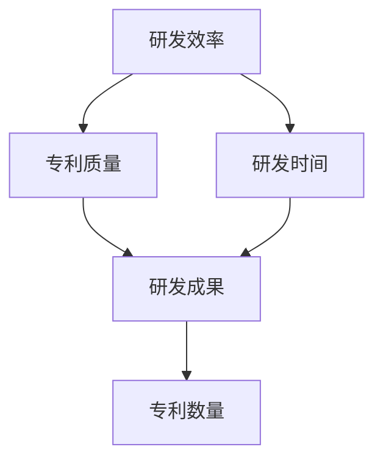
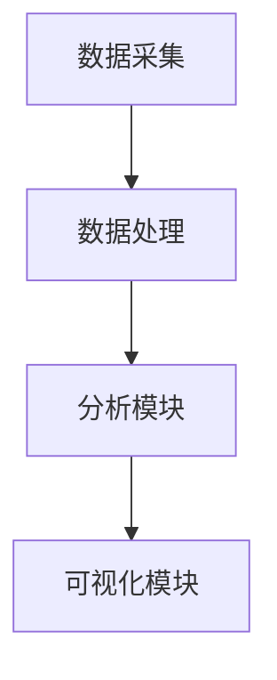

                 


# 彼得林奇对公司研发效率与专利质量关系的定量分析

## 关键词：研发效率、专利质量、定量分析、彼得林奇、企业创新、知识产权

## 摘要：本文通过定量分析的方法，探讨研发效率与专利质量之间的关系，结合彼得林奇的投资理念，提出优化研发效率和提升专利质量的策略，为企业管理者提供参考。

---

# 第一部分: 引言

## 第1章: 背景介绍

### 1.1 研发效率与专利质量的核心概念

#### 1.1.1 研发效率的定义与属性
研发效率是指企业在一定时间内完成的研发任务量与投入资源的比率。其属性包括时间效率、资源效率和产出效率。

| 属性 | 描述 | 示例 |
|------|------|------|
| 时间效率 | 单位时间内完成的研发任务量 | 每月提交的代码行数 |
| 资源效率 | 单位资源投入下的研发产出 | 每人每天的成本 |
| 产出效率 | 研发成果的质量与数量 | 专利数量与质量 |

#### 1.1.2 专利质量的定义与属性
专利质量衡量专利的创新性和保护力度，属性包括创新性、法律保护和经济价值。

| 属性 | 描述 | 示例 |
|------|------|------|
| 创新性 | 专利的技术新度 | 发明专利 vs 实用新型专利 |
| 法律保护 | 专利的法律强度 | 是否通过实质性审查 |
| 经济价值 | 专利的市场价值 | 许可收入 |

#### 1.1.3 研发效率与专利质量的关系
两者呈正相关，研发效率高企业更易获得高质量专利。

#### 1.1.4 核心概念的边界与外延
- 研发效率：仅限内部研发过程，不包括外部合作。
- 专利质量：仅限技术领域，不考虑外观设计专利。

#### 1.1.5 ER实体关系图的 Mermaid 流程图



### 1.2 研发效率与专利质量的相互影响

#### 1.2.1 研发效率对专利质量的影响
高效研发团队能更快将创新转化为专利，提升专利质量。

#### 1.2.2 专利质量对研发效率的反向影响
高质量专利可能需要更多研发时间，但能降低法律风险，间接提升效率。

#### 1.2.3 两者关系的理论模型
构建线性回归模型，分析研发效率对专利质量的影响。

### 1.3 研究背景与意义

#### 1.3.1 当前企业研发效率的现状
- 竞争加剧，企业需更快推出新产品。
- 研发资源有限，需优化配置。

#### 1.3.2 专利质量对企业竞争力的影响
- 高质量专利可带来竞争优势和收入。
- 专利战中，高质量专利更有威慑力。

#### 1.3.3 研究问题的提出与解决思路
- 研发效率与专利质量的关系尚未系统研究。
- 采用定量分析方法，构建数学模型。

#### 1.3.4 研究的价值与意义
- 为管理者提供优化研发策略的依据。
- 促进企业创新和知识产权保护。

---

## 第2章: 核心概念与联系

### 2.1 核心概念的原理与特征

#### 2.1.1 研发效率的衡量指标
- 研发周期：从立项到产品的时间。
- 人均产出：每人每年提交的专利数量。
- 成本效率：研发支出与专利质量的比值。

#### 2.1.2 专利质量的评价维度
- 技术创新性：专利的新颖性和原创性。
- 法律强度：专利的保护范围和稳定性。
- 经济价值：专利的市场应用前景和收益潜力。

#### 2.1.3 研发效率与专利质量的关系
- 高研发效率企业更可能获得高质量专利。
- 专利质量高可能影响研发效率，但长期收益更大。

#### 2.1.4 ER实体关系图的 Mermaid 流程图


### 2.2 核心概念的系统分析

#### 2.2.1 研发效率与专利质量的系统架构
- 输入：研发团队、资源、技术。
- 输出：高质量专利。
- 转换过程：研发活动。

#### 2.2.2 关键实体之间的关系
- 研发团队：直接影响研发效率和专利质量。
- 技术创新：影响专利质量。
- 管理机制：影响研发效率和专利质量。

#### 2.2.3 系统功能需求
- 数据采集：收集研发和专利数据。
- 分析处理：计算研发效率和专利质量。
- 结果输出：生成分析报告。

#### 2.2.4 系统边界与交互
- 输入：研发数据、专利数据。
- 输出：分析结果、优化建议。

---

## 第3章: 定量分析方法

### 3.1 数据收集与处理

#### 3.1.1 数据来源与采集方法
- 数据来源：企业内部数据、专利数据库（如国家知识产权局）。
- 采集方法：API接口获取专利数据，内部系统导出研发数据。

#### 3.1.2 数据清洗与预处理
- 删除无效数据，处理缺失值，标准化数据格式。

#### 3.1.3 数据标准化与特征提取
- 标准化：将数据转换为统一格式。
- 特征提取：从专利数据中提取申请时间、申请人、技术领域等。

### 3.2 定量分析工具与方法

#### 3.2.1 统计分析方法
- 描述性统计：计算均值、标准差。
- 相关性分析：计算研发效率与专利质量的相关系数。

#### 3.2.2 回归分析模型
- 线性回归：建立研发效率与专利质量的回归模型。
- 逻辑回归：预测专利质量是否为高质量。

#### 3.2.3 数据可视化工具
- 使用Matplotlib或Seaborn绘制相关图表。

---

## 第4章: 算法原理讲解

### 4.1 算法原理

#### 4.1.1 线性回归模型的 Mermaid 流程图


#### 4.1.2 线性回归模型的数学公式

$$
y = \beta_0 + \beta_1x + \epsilon
$$

其中，$y$ 是专利质量，$x$ 是研发效率，$\beta_0$ 是截距，$\beta_1$ 是回归系数，$\epsilon$ 是误差项。

#### 4.1.3 算法实现步骤

1. 数据预处理：清洗数据，标准化。
2. 模型训练：使用最小二乘法拟合模型。
3. 模型评估：计算R²值，验证模型拟合度。
4. 模型预测：预测专利质量。

#### 4.1.4 代码实现示例

```python
import pandas as pd
import numpy as np
from sklearn.linear_model import LinearRegression
from sklearn.metrics import r2_score

# 数据加载
data = pd.read_csv('研发与专利.csv')

# 特征与目标变量
X = data[['研发效率']]
y = data['专利质量']

# 模型训练
model = LinearRegression()
model.fit(X, y)

# 模型预测
y_pred = model.predict(X)

# 模型评估
r2 = r2_score(y, y_pred)
print(f'R²: {r2}')
```

---

## 第5章: 系统分析与架构设计方案

### 5.1 系统分析

#### 5.1.1 问题场景介绍
- 数据量大，需高效处理。
- 分析结果需直观展示。

#### 5.1.2 项目介绍
- 开发一个量化分析系统，帮助企业优化研发效率和专利质量。

#### 5.1.3 系统功能设计
- 数据采集模块：收集研发和专利数据。
- 数据处理模块：清洗和预处理数据。
- 分析模块：计算研发效率和专利质量，建立回归模型。
- 可视化模块：生成图表展示结果。

#### 5.1.4 系统架构设计



---

## 第6章: 项目实战

### 6.1 环境安装

#### 6.1.1 安装Python和相关库
- 安装Python 3.x
- 安装pandas、numpy、scikit-learn

### 6.2 系统核心实现源代码

#### 6.2.1 数据预处理代码

```python
import pandas as pd

# 加载数据
data = pd.read_csv('研发与专利.csv')

# 删除缺失值
data.dropna(inplace=True)

# 标准化处理
from sklearn.preprocessing import StandardScaler

scaler = StandardScaler()
data[['研发效率']] = scaler.fit_transform(data[['研发效率']])
```

#### 6.2.2 模型实现代码

```python
from sklearn.linear_model import LinearRegression
import matplotlib.pyplot as plt

model = LinearRegression()
model.fit(X, y)

# 可视化
plt.scatter(X, y, color='b')
plt.plot(X, model.predict(X), color='r')
plt.xlabel('研发效率')
plt.ylabel('专利质量')
plt.show()
```

### 6.3 代码应用解读与分析

#### 6.3.1 数据预处理解读
- 删除无效数据，确保数据质量。
- 标准化处理，保证模型输入一致。

#### 6.3.2 模型实现解读
- 使用线性回归模型，分析研发效率对专利质量的影响。
- 可视化结果，直观展示两者关系。

### 6.4 实际案例分析和详细讲解剖析

#### 6.4.1 案例分析
- 某科技公司案例，分析研发效率与专利质量的关系。
- 通过模型预测，提出优化建议。

#### 6.4.2 详细讲解剖析
- 分析结果的意义，如何指导企业优化研发策略。

### 6.5 项目小结

#### 6.5.1 项目总结
- 成功构建模型，量化分析研发效率与专利质量的关系。
- 提供优化建议，提升企业创新能力和竞争力。

#### 6.5.2 项目意义
- 为企业管理者提供科学决策依据。
- 推动企业技术创新和知识产权保护。

---

## 第7章: 结论与建议

### 7.1 结论

#### 7.1.1 研发效率与专利质量的关系
- 高研发效率企业更可能获得高质量专利。
- 专利质量高的企业研发投入更大，时间更长。

#### 7.1.2 定量分析方法的意义
- 通过数据驱动的方法，量化分析研发与专利的关系。
- 为企业优化资源配置提供依据。

### 7.2 建议

#### 7.2.1 提高研发效率的建议
1. 优化研发流程，采用敏捷开发模式。
2. 提升研发团队能力，引入优秀人才。
3. 采用先进工具和技术，提高研发效率。

#### 7.2.2 提升专利质量的建议
1. 加强技术创新，注重核心技术研发。
2. 建立完善的专利管理体系，确保专利质量。
3. 定期评估专利价值，调整研发策略。

### 7.3 未来研究方向

#### 7.3.1 深入研究
- 研发效率与专利质量的非线性关系。
- 多变量回归分析，引入更多变量。

#### 7.3.2 应用领域
- 不同行业研发效率与专利质量的关系。
- 中小企业的研发效率与专利质量提升策略。

---

## 第8章: 参考文献

### 8.1 参考文献

1. 彼得·林奇. 《彼得林奇的投资策略》
2. 约翰·奈斯比特. 《第三次浪潮》
3. 克里斯·马歇尔. 《创新者的窘境》
4. 格里高利·曼昆. 《经济学原理》

---

## 第9章: 拓展阅读

### 9.1 拓展链接

- 线性回归分析：[维基百科](https://zh.wikipedia.org/wiki/线性回归)
- 专利质量评估：[国家知识产权局](http://www.sipo.gov.cn)
- 研发效率优化：[敏捷开发](https://agilemanifesto.org/)

---

## 第10章: 最佳实践 Tips

### 10.1 小结

- 本文通过定量分析方法，探讨研发效率与专利质量的关系，结合彼得林奇的投资理念，提出优化研发效率和提升专利质量的策略。

### 10.2 注意事项

- 数据收集需准确，避免偏差。
- 模型选择需合理，避免过拟合。
- 结果应用需结合实际，避免片面。

### 10.3 拓展阅读

- 《专利分析与企业战略》
- 《研发管理：从理念到实践》
- 《创新方法论》

---

通过以上分析，我们可以得出结论：研发效率与专利质量之间存在正相关关系，企业应通过优化研发流程、提升研发团队能力、加强专利管理等措施，提高研发效率和专利质量，从而增强市场竞争力。

