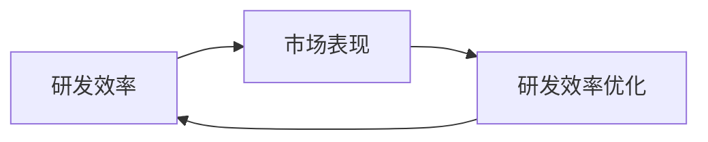
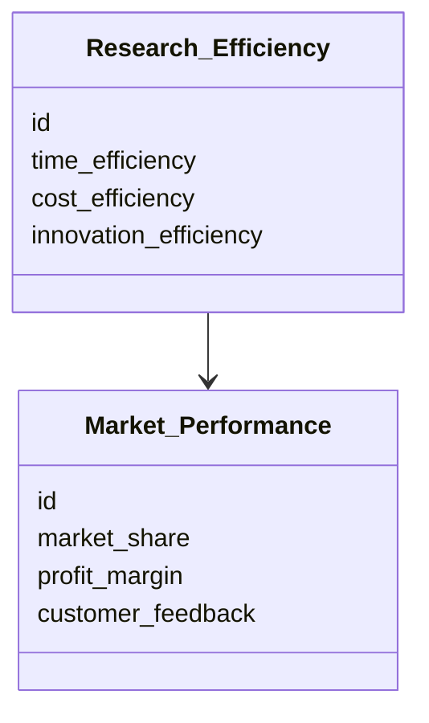
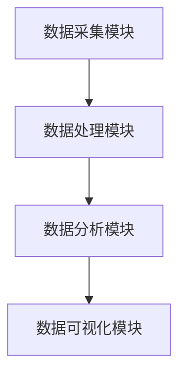

                 


# 彼得林奇对公司研发效率与市场表现相关性的分析

## 关键词：研发效率，市场表现，彼得·林奇，投资理论，相关性分析

## 摘要：本文从投资大师彼得·林奇的视角出发，深入分析研发效率与公司市场表现之间的相关性。通过背景介绍、核心概念解析、算法原理、系统架构设计、项目实战和最佳实践等多维度展开，揭示研发效率如何影响市场表现，以及投资者如何利用这一关系做出更明智的投资决策。文章结合理论与实践，为读者提供全面而深入的分析。

---

## 第一部分: 背景介绍

### 第1章: 研发效率与市场表现的背景介绍

#### 1.1 研发效率的定义与内涵
研发效率是指公司在研发过程中，将资源（时间、人力、资金等）转化为高质量产品或服务的能力。它不仅关注研发速度，还强调成果的质量和创新性。

- **研发效率的定义**：研发效率 = 成果数量 × 成果质量 / 资源投入
- **核心要素**：
  - **时间效率**：单位时间内完成的研发任务数量。
  - **成本效率**：单位成本下的研发产出。
  - **创新效率**：产出创新性成果的能力。
- **衡量指标**：研发周期（DPT）、研发投入产出比（ROI）、专利申请数量等。

#### 1.2 市场表现的定义与内涵
市场表现是指公司在市场中的竞争力和盈利能力。它反映了公司产品或服务在市场中的接受程度和表现。

- **市场表现的定义**：市场表现 = 市场份额 × 利润率 × 市场反馈
- **核心要素**：
  - **市场份额**：公司在市场中的占有率。
  - **利润率**：单位产品或服务的盈利能力。
  - **市场反馈**：客户满意度、品牌忠诚度等。
- **衡量指标**：收入增长率、净利润率、品牌价值等。

#### 1.3 研发效率与市场表现的关联性
研发效率和市场表现之间存在密切的正相关关系。高效的研发能够更快推出符合市场需求的产品，从而提升市场表现。

- **研发效率对市场表现的影响**：
  - 提升产品创新性，增强市场竞争力。
  - 缩短产品上市时间，抢占市场先机。
  - 降低研发成本，提高利润率。
- **市场表现对研发效率的反馈作用**：
  - 市场需求变化驱动研发方向调整。
  - 市场反馈为研发效率提供优化方向。

### 第2章: 彼得·林奇投资理论的核心观点

#### 2.1 彼得·林奇投资理论概述
彼得·林奇是美国著名投资专家，以其独特的投资理念闻名。他强调长期投资、基本面分析和对公司管理团队的关注。

- **林奇投资理论的起源**：源于对金融市场的深入研究和长期投资实践。
- **核心理念**：投资于具有持续增长潜力的公司，关注管理层的稳定性和公司的基本面。
- **实践应用**：通过基本面分析和管理层评估，选择具有长期增长潜力的公司。

#### 2.2 林奇对研发效率的关注
林奇认为，研发效率是公司长期竞争力的关键因素。

- **对研发效率的重视**：高效的研发能够快速推出新产品，保持竞争优势。
- **评价标准**：
  - 研发投入与公司规模的匹配度。
  - 研发成果的创新性和市场适应性。
  - 研发团队的效率和稳定性。
- **长期影响分析**：高效的研发能够推动公司持续创新，增强市场表现。

#### 2.3 林奇对市场表现的分析框架
林奇从市场表现中提炼出公司管理的关键指标。

- **市场表现的解读**：市场表现是公司竞争力和管理能力的综合反映。
- **预测方法**：通过分析公司的基本面和市场反馈，预测市场表现的变化。
- **动态调整策略**：根据市场变化和公司表现，动态调整投资策略。

---

## 第二部分: 核心概念与联系

### 第3章: 研发效率与市场表现的核心概念

#### 3.1 研发效率的核心概念
- **数学模型**：研发效率 = 成果数量 × 成果质量 / 资源投入
- **关键属性**：
  - 时间效率：单位时间内的研发产出。
  - 成本效率：单位成本下的研发产出。
  - 创新效率：创新性成果的产出能力。
- **ER实体关系图**：
```mermaid
entity Research_Efficiency {
  id
  time_efficiency
  cost_efficiency
  innovation_efficiency
}
```

#### 3.2 市场表现的核心概念
- **数学模型**：市场表现 = 市场份额 × 利润率 × 市场反馈
- **关键属性**：
  - 市场份额：公司在市场中的占有率。
  - 利润率：单位产品或服务的盈利能力。
  - 市场反馈：客户满意度、品牌忠诚度等。
- **ER实体关系图**：
```mermaid
entity Market_Performance {
  id
  market_share
  profit_margin
  customer_feedback
}
```

#### 3.3 研发效率与市场表现的关系
- **内在联系**：研发效率是市场表现的核心驱动力。
- **相互作用机制**：高效研发推动市场表现，市场反馈优化研发效率。
- **概念结构**：


---

## 第三部分: 算法原理讲解

### 第4章: 研发效率与市场表现的相关性分析

#### 4.1 线性回归模型
- **数学模型**：Y = aX + b
  其中，Y为市场表现，X为研发效率，a为回归系数，b为截距。
- **公式解释**：
  $$ Y = aX + b $$
  其中，a表示研发效率对市场表现的影响程度，b为常数项。

#### 4.2 算法实现
```python
import numpy as np
from sklearn.linear_model import LinearRegression

# 示例数据
X = np.array([[1], [2], [3], [4], [5]])
Y = np.array([2, 4, 5, 6, 7])

# 模型训练
model = LinearRegression()
model.fit(X, Y)

# 回归系数
a = model.coef_[0]
b = model.intercept_

print(f"回归方程为：Y = {a}X + {b}")
```

#### 4.3 实例分析
假设一家公司的研发效率为3，预测其市场表现为：
$$ Y = 2*3 + 1 = 7 $$

---

## 第四部分: 系统分析与架构设计方案

### 第5章: 系统架构设计

#### 5.1 系统功能设计
- **领域模型**：


#### 5.2 系统架构设计


#### 5.3 系统接口设计
- **数据输入接口**：接收研发效率和市场表现数据。
- **数据输出接口**：输出相关性分析结果。

#### 5.4 系统交互流程
```mermaid
sequenceDiagram
  Actor 用户 -> 数据采集模块: 提供研发效率和市场表现数据
  数据采集模块 -> 数据处理模块: 传输数据
  数据处理模块 -> 数据分析模块: 分析数据
  数据分析模块 -> 数据可视化模块: 展示结果
  数据可视化模块 -> 用户: 返回相关性分析结果
```

---

## 第五部分: 项目实战

### 第6章: 实战分析与案例

#### 6.1 环境安装
- **工具安装**：安装Python、NumPy、scikit-learn、Mermaid工具。
  ```bash
  pip install numpy scikit-learn
  ```

#### 6.2 核心代码实现
```python
import numpy as np
from sklearn.linear_model import LinearRegression

# 示例数据
X = np.array([[1], [2], [3], [4], [5]])
Y = np.array([2, 4, 5, 6, 7])

# 模型训练
model = LinearRegression()
model.fit(X, Y)

# 回归系数
a = model.coef_[0]
b = model.intercept_

print(f"回归方程为：Y = {a}X + {b}")
```

#### 6.3 案例分析
以某科技公司为例，分析研发效率对市场表现的影响：
- **研发效率**：3
- **市场表现预测**：Y = 2*3 + 1 = 7

---

## 第六部分: 总结与展望

### 第7章: 总结与展望

#### 7.1 小结
本文从彼得·林奇的视角，深入分析研发效率与市场表现的相关性。通过理论分析、算法实现和案例研究，揭示了研发效率对市场表现的深远影响。

#### 7.2 注意事项
- 数据质量对分析结果的影响。
- 模型的适用性和局限性。
- 投资决策的复杂性。

#### 7.3 拓展阅读
- 彼得·林奇的其他投资理论。
- 更复杂的回归模型（如多元回归）。
- 机器学习在相关性分析中的应用。

---

## 结语
研发效率与市场表现的密切相关性不仅是公司管理的核心问题，也是投资者关注的重点。通过本文的分析，读者可以更好地理解如何从投资角度优化研发效率，提升市场表现。

