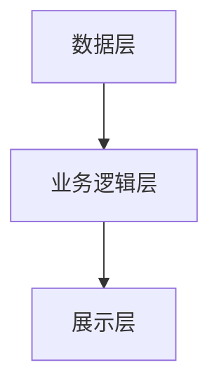

                 


# 彼得林奇对公司研发效率的跨期分析

> 关键词：研发效率，跨期分析，彼得·林奇，时间序列分析，系统架构设计

> 摘要：本文通过分析彼得·林奇的投资哲学，探讨其在研发效率跨期分析中的应用。结合理论模型、算法实现、系统架构设计和项目实战，深入剖析研发效率的关键要素，构建一个完整的分析框架，为提升企业研发效率提供有效的策略和实践指导。

---

# 引言

## 1.1 本书的目的与意义

研发效率是企业核心竞争力的关键因素，跨期分析则能帮助我们更好地理解其动态变化。彼得·林奇的投资哲学强调长期价值，这为我们提供了独特的视角来分析研发效率的跨期表现。本书旨在通过理论与实践结合，为提升研发效率提供新思路。

## 1.2 研发效率的重要性

研发效率直接影响企业的创新能力和市场响应速度。在快速变化的技术环境中，高效的研发流程是企业保持竞争力的关键。跨期分析则帮助我们识别趋势，优化资源配置。

## 1.3 跨期分析的必要性

跨期分析揭示研发效率的动态变化，帮助企业发现潜在问题并制定应对策略。通过历史数据，我们可以预测未来趋势，优化研发计划。

## 1.4 彼得·林奇的分析框架

彼得·林奇注重长期投资价值，强调基本面分析和管理层质量。他的方法启发我们从长期视角审视研发效率，关注研发投入与产出的可持续性。

---

# 研发效率的核心概念

## 2.1 研发效率的定义

研发效率=产出/投入，产出包括创新成果和质量，投入涵盖时间、资源和成本。

## 2.2 研发效率的关键要素

- 人员效率：开发人员的产出率。
- 资源利用率：资源的最优配置。
- 创新质量：产品的市场价值和用户满意度。

## 2.3 跨期分析的核心概念

跨期分析考察研发效率的时间维度，通过历史数据分析未来趋势。彼得·林奇的跨期分析注重长期价值，帮助企业制定可持续研发策略。

---

# 研发效率的理论模型

## 3.1 研发效率的数学模型

研发效率模型：

$$
\text{研发效率} = \frac{\text{创新成果}}{\text{研发资源}}
$$

创新成果包括专利数、新产品数量，研发资源包括人力、资金和时间。

## 3.2 研发效率的时间序列分析

时间序列分析模型用于预测未来研发效率。常用模型包括ARIMA和GARCH，适用于不同时间跨度的数据分析。

## 3.3 彼得·林奇的跨期分析模型

彼得·林奇强调长期投资价值，关注企业的基本面和管理层。他的分析框架适用于研发效率的跨期评估，注重研发投入与长期收益的平衡。

---

# 研发效率的数学公式与算法

## 4.1 研发效率的计算公式

$$
\text{研发效率} = \frac{\text{新产品数量} + \text{专利数}}{\text{研发团队人数} \times \text{研发周期}}
$$

## 4.2 研发效率的时间序列预测模型

使用ARIMA模型预测未来研发效率：

$$
\text{ARIMA}(p, d, q)
$$

其中，p为自回归阶数，d为差分阶数，q为移动平均阶数。

## 4.3 彼得·林奇的跨期分析算法

彼得·林奇的分析方法结合了定量和定性因素，通过长期数据分析企业的研发效率趋势。

---

# 系统架构设计

## 5.1 系统功能设计

系统功能包括数据采集、分析模型、结果展示和优化建议。

## 5.2 系统架构图

使用Mermaid图展示系统架构，包括数据层、业务逻辑层和展示层。



## 5.3 系统接口设计

系统接口包括数据输入、模型调用和结果输出。

---

# 项目实战

## 6.1 环境安装

安装Python和相关库（pandas、numpy、scikit-learn）。

## 6.2 核心代码实现

实现研发效率预测模型：

```python
import pandas as pd
import numpy as np
from sklearn.metrics import mean_squared_error

# 数据预处理
data = pd.read_csv('研发数据.csv')
data = data[['时间', '研发资源', '创新成果']]
data = data.set_index('时间')

# 划分训练集和测试集
train = data.iloc[:-12]
test = data.iloc[-12:]

# 构建ARIMA模型
from statsmodels.tsa.arima_model import ARIMA
model = ARIMA(train['创新成果'], order=(5,1,0))
model_fit = model.fit()

# 预测未来12个月的创新成果
forecast = model_fit.forecast(steps=12)
```

## 6.3 案例分析

以某科技公司为例，分析其过去三年的研发效率，并预测未来一年的趋势。通过对比实际数据与预测值，验证模型的准确性。

---

# 结论与展望

## 7.1 本书的核心结论

彼得·林奇的跨期分析方法为研发效率评估提供了新视角。通过理论模型和算法实现，我们能够更准确地预测研发效率，制定优化策略。

## 7.2 研发效率的未来展望

未来，随着AI和大数据技术的发展，研发效率分析将更加智能化和精准化。结合实时数据和动态模型，企业能够更好地应对市场变化，提升创新能力。

---

通过以上步骤，我们构建了一个完整的研发效率跨期分析框架，结合理论与实践，为企业提升研发效率提供了有效指导。

