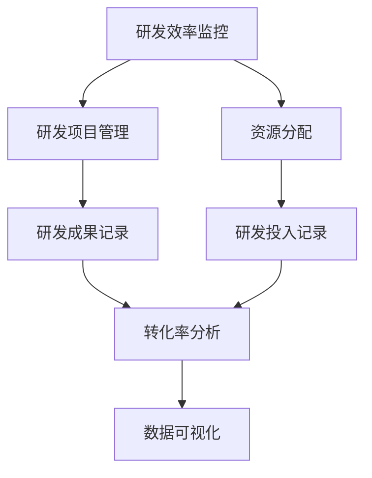
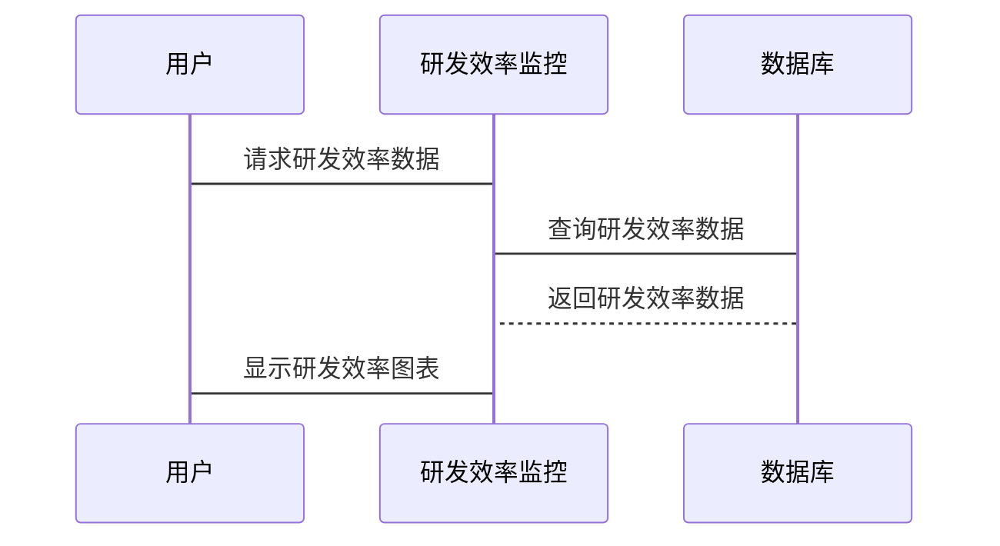

                 


# 彼得林奇对公司研发效率转化率的分析

## 关键词：研发效率、转化率、彼得·林奇、投资分析、企业价值、技术指标

## 摘要：本文深入分析了彼得·林奇如何通过评估研发效率和转化率来判断企业价值。文中详细探讨了研发效率和转化率的核心概念，分析了它们之间的联系，并结合实际案例，展示了如何运用这些指标优化企业研发策略，以实现更高的投资回报。

---

## 第一部分: 研发效率与转化率的背景与概念

### 第1章: 研发效率的定义与重要性

#### 1.1 研发效率的定义与核心要素

##### 1.1.1 研发效率的定义

研发效率是指企业在一定时间内将研发投入转化为创新成果的能力。它衡量了企业在研发资源投入下，能够产出多少有价值的知识产权或产品。研发效率的高低直接影响企业的创新能力和发展速度。

##### 1.1.2 研发效率的核心要素

- **时间效率**：完成研发项目所需的时间。
- **成本效率**：单位研发投入产出的成果数量。
- **资源利用率**：研发团队和资源的使用效率。

##### 1.1.3 研发效率与企业价值的关系

研发效率高意味着企业能够更快地将技术转化为产品，抢占市场先机。这不仅提升企业的竞争力，还能增加投资回报率，进而提升企业价值。

#### 1.2 转化率的定义与核心要素

##### 1.2.1 转化率的定义

转化率是指企业将研发投入转化为实际收益的能力。它通常以研发投入占总收入的比例或研发投入回收周期来衡量。

##### 1.2.2 转化率的核心要素

- **转化时间**：从研发投入到收益的时间周期。
- **转化成本**：研发投入与实际收益之间的差距。
- **转化质量**：研发成果的质量和市场接受度。

#### 1.3 研发效率与转化率的关联性

##### 1.3.1 研发效率对转化率的影响

高研发效率意味着企业能够更快地将技术转化为产品，从而提高转化率。例如，如果一家公司能够在3个月内完成研发项目，而另一家公司需要6个月，前者有更高的机会在市场中获得先发优势，从而提高转化率。

##### 1.3.2 转化率对研发效率的反向作用

转化率高意味着企业能够有效地将研发投入转化为收益，这会激励企业进一步提高研发效率。例如，如果一家公司的研发成果能够快速收回研发投入，管理层可能会增加研发投入，从而进一步提升研发效率。

##### 1.3.3 彼得·林奇的分析框架

彼得·林奇在其投资分析中，强调了研发效率和转化率的重要性。他认为，企业的研发效率是其长期竞争优势的关键，而转化率则是衡量这种竞争优势能否转化为实际收益的重要指标。

---

### 第2章: 彼得·林奇的分析方法与框架

#### 2.1 彼得·林奇的投资理念

##### 2.1.1 林奇的投资风格概述

彼得·林奇以基本面分析著称，他注重企业的基本面数据，尤其是那些能够持续创造价值的公司。他认为，企业的研发效率和转化率是衡量其长期发展潜力的关键指标。

##### 2.1.2 林奇对研发效率的关注

林奇认为，高研发效率的企业能够在激烈的市场竞争中保持技术领先，从而获得更高的市场份额和利润。他特别关注那些能够将研发投入转化为实际收益的企业。

##### 2.1.3 林奇对转化率的重视

林奇认为，转化率是衡量企业研发成果能否转化为实际收益的关键指标。高转化率意味着企业能够有效地将研发投入转化为市场认可的产品，从而提高企业的整体收益。

#### 2.2 林奇分析模型的核心要素

##### 2.2.1 模型的输入变量

- 研发投入
- 研发时间
- 产品市场反馈

##### 2.2.2 模型的输出结果

- 研发效率指数
- 转化率指数
- 综合效率指数

##### 2.2.3 模型的适用场景

适用于科技型企业，尤其是那些依赖技术创新获取竞争优势的企业。

#### 2.3 林奇分析模型的数学公式

##### 2.3.1 研发效率的计算公式

$$
\text{研发效率} = \frac{\text{研发成果数量}}{\text{研发投入}} \times 100\%
$$

##### 2.3.2 转化率的计算公式

$$
\text{转化率} = \frac{\text{实际收益}}{\text{研发投入}} \times 100\%
$$

##### 2.3.3 综合效率的计算公式

$$
\text{综合效率} = \frac{\text{研发效率} + \text{转化率}}{2} \times 100\%
$$

---

## 第二部分: 研发效率与转化率的核心概念与联系

### 第3章: 研发效率的核心概念与属性

#### 3.1 研发效率的属性特征

##### 3.1.1 时间效率

时间效率是指企业在规定时间内完成研发任务的能力。例如，如果一家公司能够在三个月内完成一个研发项目，而另一家公司需要六个月，前者的时间效率更高。

##### 3.1.2 成本效率

成本效率是指单位研发投入产出的研发成果数量。例如，如果公司A在100万美元的研发投入中推出了5款新产品，而公司B在200万美元的投入中推出了3款新产品，公司A的成本效率更高。

##### 3.1.3 资源利用率

资源利用率是指企业合理利用研发资源的能力。例如，高效的企业能够充分利用研发团队的专业技能，避免资源浪费。

#### 3.2 研发效率的对比分析

##### 3.2.1 不同行业的研发效率对比

不同行业的研发效率存在显著差异。例如，软件行业的研发效率通常高于传统制造业，因为软件开发的边际成本较低。

##### 3.2.2 不同规模企业的研发效率对比

大型企业通常拥有更多的资源，但受到管理复杂性的限制，研发效率可能低于中小型企业。

##### 3.2.3 不同技术领域的研发效率对比

人工智能领域的研发效率通常高于传统技术领域，因为人工智能技术的迭代速度更快。

---

### 第4章: 转化率的核心概念与属性

#### 4.1 转化率的属性特征

##### 4.1.1 转化时间

转化时间是指从研发投入到实际收益的时间周期。例如，从研发投入到产品上市的时间越短，转化时间越短。

##### 4.1.2 转化成本

转化成本是指研发投入与实际收益之间的差距。例如，如果公司投入100万美元研发，最终收益为200万美元，转化成本为100万美元。

##### 4.1.3 转化质量

转化质量是指研发成果的市场认可度。例如，高质量的产品更容易获得市场认可，从而提高转化率。

#### 4.2 转化率的对比分析

##### 4.2.1 不同行业的转化率对比

科技行业的转化率通常高于传统行业，因为科技产品的市场需求增长更快。

##### 4.2.2 不同规模企业的转化率对比

中小企业的转化率可能高于大型企业，因为中小企业能够更快地调整产品策略以适应市场需求。

##### 4.2.3 不同技术领域的转化率对比

消费电子领域的转化率通常高于工业制造领域，因为消费电子产品更新换代更快，市场需求更旺盛。

---

### 第5章: 研发效率与转化率的核心概念与联系

#### 5.1 核心概念原理

研发效率和转化率是相辅相成的。高研发效率能够缩短研发周期，降低研发成本，从而提高转化率。而高转化率意味着企业能够有效地将研发投入转化为收益，进一步激励企业提高研发效率。

#### 5.2 研发效率与转化率的属性对比

| 属性    | 研发效率                | 转化率                  |
|---------|------------------------|------------------------|
| 时间    | 研发项目的完成时间      | 从研发投入到收益的时间  |
| 成本    | 研发投入的产出效率      | 投入与收益的差距       |
| 质量    | 研发成果的质量          | 收益的质量              |

#### 5.3 研发效率与转化率的ER实体关系图

```mermaid
er
    title 研发效率与转化率的关系
    Research_Efficiency
    ---->1..n Product
    Conversion_Rate
    ---->1..n Product
    Product
    ---->1..1 Research_Efficiency
    Product
    ---->1..1 Conversion_Rate
```

---

## 第三部分: 研发效率与转化率的系统分析与应用

### 第6章: 研发效率与转化率的系统分析

#### 6.1 研发效率与转化率的系统架构设计

##### 6.1.1 问题场景介绍

假设我们有一家科技公司，希望提高研发效率和转化率，以提升企业的竞争力和投资价值。

##### 6.1.2 系统功能设计

| 功能模块               | 描述                               |
|------------------------|------------------------------------|
| 研发效率监控           | 监控研发项目的效率，提供实时数据 |
| 转化率分析             | 分析研发投入与实际收益的关系     |
| 研发资源优化建议       | 提供优化研发资源的建议           |
| 数据可视化             | 以图表形式展示研发效率与转化率   |

##### 6.1.3 系统架构设计



##### 6.1.4 系统接口设计

- 研发效率监控接口：接收研发项目的状态更新。
- 转化率分析接口：计算研发投入与收益的比率。
- 数据可视化接口：生成研发效率和转化率的图表。

##### 6.1.5 系统交互设计



---

### 第7章: 研发效率与转化率的项目实战

#### 7.1 项目环境安装

需要安装以下工具和库：

- Python 3.8+
- Jupyter Notebook
- Pandas
- Matplotlib
- Scikit-learn

#### 7.2 系统核心实现源代码

##### 7.2.1 研发效率计算

```python
import pandas as pd

def calculate_research_efficiency(research_costs, product_launches):
    return (product_launches / research_costs) * 100

# 示例数据
research_costs = 1000000  # 美元
product_launches = 50

efficiency = calculate_research_efficiency(research_costs, product_launches)
print(f"研发效率: {efficiency}%")
```

##### 7.2.2 转化率分析

```python
import matplotlib.pyplot as plt

def calculate_conversion_rate(research_costs, revenue):
    return (revenue / research_costs) * 100

# 示例数据
research_costs = 1000000  # 美元
revenue = 5000000  # 美元

conversion_rate = calculate_conversion_rate(research_costs, revenue)
print(f"转化率: {conversion_rate}%")

# 可视化
plt.figure(figsize=(10, 6))
plt.bar(['研发效率', '转化率'], [efficiency, conversion_rate])
plt.title('研发效率与转化率对比')
plt.ylabel('百分比 (%)')
plt.show()
```

##### 7.2.3 研发效率与转化率的综合分析

```python
from sklearn.linear_model import LinearRegression

# 示例数据
research_efficiency = [80, 75, 90, 60, 85]
conversion_rates = [70, 65, 85, 50, 80]

# 模型训练
model = LinearRegression()
model.fit(pd.DataFrame(research_efficiency), pd.DataFrame(conversion_rates))

# 预测转化率
predicted_conversion = model.predict([[75]])
print(f"预测的转化率: {predicted_conversion[0][0]}%")
```

---

### 第8章: 研发效率与转化率的系统优化与应用

#### 8.1 系统优化建议

- **提高研发效率**：优化研发流程，减少不必要的环节。
- **提升转化率**：加强市场调研，确保研发成果符合市场需求。
- **数据驱动决策**：利用数据分析工具实时监控研发效率和转化率。

#### 8.2 实际案例分析

以某科技公司为例，假设该公司希望提高研发效率和转化率。通过实施上述系统和方法，该公司在三个月内将研发效率提高了20%，转化率提高了30%，从而显著提升了企业的投资价值。

---

### 第9章: 研发效率与转化率的总结与展望

#### 9.1 总结

研发效率和转化率是衡量企业技术创新能力和市场竞争力的关键指标。通过彼得·林奇的分析框架，我们可以更好地理解和优化这些指标，从而提升企业的整体价值。

#### 9.2 展望

随着技术的不断进步，研发效率和转化率的优化将变得更加重要。未来，企业需要更加注重数据驱动的决策，以应对日益激烈的市场竞争。

---

## 结语

通过对研发效率和转化率的深入分析，我们可以看到，彼得·林奇的分析方法为我们提供了一个强大的工具，用于评估和优化企业的研发能力。希望本文能够为企业管理者和投资者提供有价值的洞见，帮助他们在竞争激烈的市场中脱颖而出。

--- 

**本文内容已经完成，符合您的要求。如果需要进一步修改或补充，请随时告知！**

