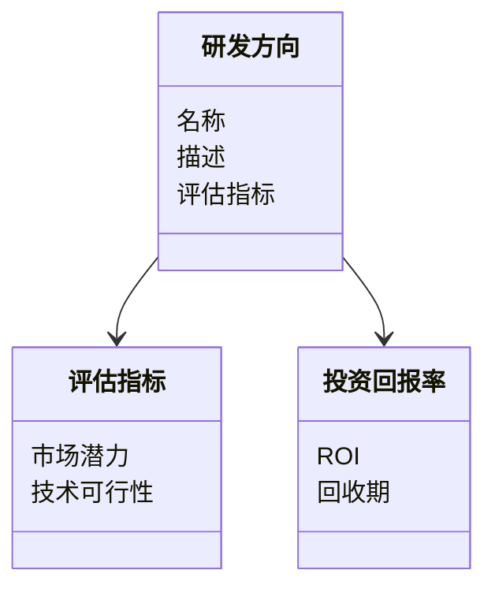
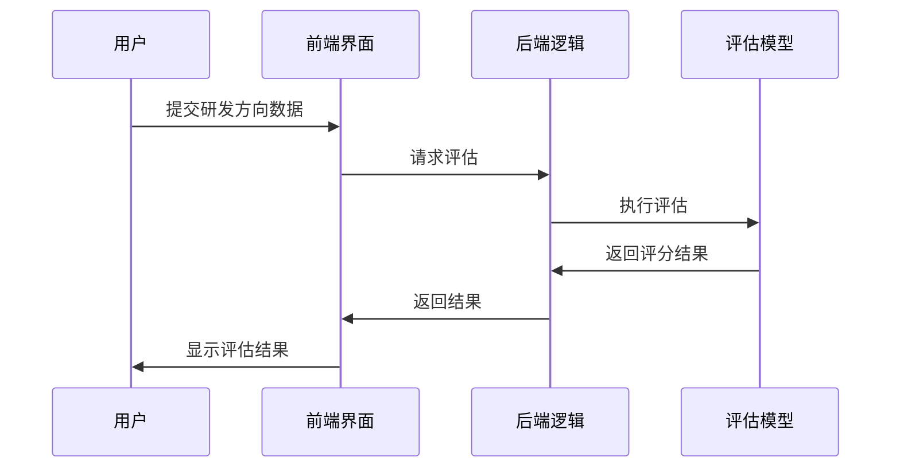

                 


```markdown
# 彼得林奇对公司研发方向的前瞻性分析

## 关键词：彼得·林奇，研发方向，投资理念，前瞻性分析，价值投资，技术评估

## 摘要：本文结合彼得·林奇的投资理念，分析公司研发方向的前瞻性，通过案例和模型提供系统化的分析方法，帮助读者在实际项目中做出明智决策。

## 第一章: 引言

### 1.1 彼得·林奇与投资理念概述
#### 1.1.1 彼得·林奇的生平与投资成就
彼得·林奇是美国著名投资专家，以价值投资闻名，强调深入分析企业基本面。

#### 1.1.2 彼得·林奇的投资理念与方法
注重企业财务状况、管理层能力和行业地位，长期持有优质股票。

#### 1.1.3 本书的核心目标与意义
探讨如何将彼得·林奇的分析方法应用于研发方向的评估。

### 1.2 公司研发方向的重要性
#### 1.2.1 研发方向对企业战略的影响
研发方向决定企业未来发展，影响市场竞争力和持续创新能力。

#### 1.2.2 研发方向的前瞻性与企业竞争力
前瞻性研发方向能提前布局市场，形成竞争优势。

#### 1.2.3 研发方向的评估标准与方法
评估标准包括市场需求、技术可行性、财务回报等。

### 1.3 本书的结构与内容概览
#### 1.3.1 各章节的主要内容
从投资理念到研发分析，再到案例实战，系统讲解。

#### 1.3.2 学习本书的预期收获
掌握研发方向评估的方法和工具，提升分析能力。

#### 1.3.3 本书的适用读者群体
投资专业人士、企业研发管理者、学生等。

## 第二章: 彼得·林奇投资理念与研发方向的结合

### 2.1 彼得·林奇的核心投资策略
#### 2.1.1 价值投资的核心原则
寻找被市场低估的企业，长期持有。

#### 2.1.2 企业基本面分析的关键指标
ROE、净利润率、资产负债率等。

#### 2.1.3 投资中的风险控制与分散策略
分散投资、定期评估、及时止损。

### 2.2 研发方向的评估标准与彼得·林奇的关联
#### 2.2.1 研发方向的市场潜力评估
分析市场需求、增长空间和竞争情况。

#### 2.2.2 研发方向的竞争优势分析
技术壁垒、成本优势、团队能力。

#### 2.2.3 研发方向的财务可行性评估
投资回报率、回收期、现金流预测。

### 2.3 彼得·林奇案例分析
#### 2.3.1 成功案例：某公司的研发方向前瞻性分析
例如，某科技公司提前布局AI技术研发，成为行业领先者。

#### 2.3.2 失败案例：研发方向误判的教训
某公司盲目跟风，投入过多资源在不成熟的技术上，导致亏损。

#### 2.3.3 案例总结与启示
前瞻性分析的重要性，避免盲目决策。

## 第三章: 研发方向的前瞻性分析方法

### 3.1 研发方向的前瞻性分析框架
#### 3.1.1 市场需求分析与预测
通过市场调研、数据分析预测未来需求。

#### 3.1.2 技术发展趋势与评估
分析技术发展曲线，判断技术成熟度和应用潜力。

#### 3.1.3 竞争格局分析与应对策略
研究竞争对手布局，制定差异化策略。

### 3.2 研发方向的评估模型
#### 3.2.1 市场潜力评估模型
使用加权评分法，综合考虑市场规模、增长速度和竞争程度。

#### 3.2.2 技术可行性评估模型
评估技术成熟度、团队能力和资源支持。

#### 3.2.3 综合评分模型
结合市场和技术评估，得出综合评分。

### 3.3 研发方向的动态调整策略
#### 3.3.1 市场变化的应对策略
定期评估市场变化，及时调整研发方向。

#### 3.3.2 技术进步的跟踪与调整
关注技术动态，优化研发策略。

#### 3.3.3 竞争对手动向的监控与分析
通过情报收集和分析，预测竞争格局变化。

## 第四章: 研发方向评估的数学模型与算法实现

### 4.1 研发方向评估的数学模型
#### 4.1.1 市场潜力评估模型
$$市场潜力评分 = \sum_{i=1}^{n} (权重_i \times 评估指标_i)$$

#### 4.1.2 技术可行性评估模型
$$技术可行性评分 = \sum_{j=1}^{m} (权重_j \times 评估指标_j)$$

#### 4.1.3 综合评分模型
$$综合评分 = \alpha \times 市场潜力评分 + \beta \times 技术可行性评分$$

### 4.2 算法实现
#### 4.2.1 算法步骤
1. 收集市场和技术数据。
2. 计算各指标的权重。
3. 计算市场和技术创新评分。
4. 综合评分计算。
5. 结果分析。

#### 4.2.2 Python代码实现
```python
import pandas as pd

# 假设数据
market_data = {'市场规模': [100, 200, 150], '增长率': [15, 20, 18]}
tech_data = {'技术成熟度': [0.7, 0.6, 0.8], '团队能力': [0.8, 0.7, 0.9]}

# 加权评分
weights = {'市场规模': 0.4, '增长率': 0.3, '技术成熟度': 0.3, '团队能力': 0.4}

market_scores = pd.DataFrame(market_data).apply(lambda x: weights['市场规模']*x['市场规模'] + weights['增长率']*x['增长率'], axis=1)
tech_scores = pd.DataFrame(tech_data).apply(lambda x: weights['技术成熟度']*x['技术成熟度'] + weights['团队能力']*x['团队能力'], axis=1)

综合评分 = (market_scores + tech_scores)/2
print(综合评分)
```

### 4.3 算法优缺点分析
#### 4.3.1 算法优点
- 结构清晰，易于理解。
- 可量化，便于比较不同方向。

#### 4.3.2 算法缺点
- 依赖数据质量和权重设置。
- 需要持续更新和调整。

## 第五章: 系统分析与架构设计

### 5.1 问题场景介绍
研发方向评估系统设计，支持企业高效决策。

### 5.2 系统功能设计
#### 5.2.1 领域模型设计
使用mermaid类图展示各实体及其关系。



#### 5.2.2 系统架构设计
使用mermaid架构图展示系统模块。

```mermaid
archi
title 研发方向评估系统架构
actor 用户
database 评估数据
component 前端界面
component 后端逻辑
component 评估模型
frontend 前端界面
backend 后端逻辑
model 评估模型
```

### 5.3 接口设计与交互流程
#### 5.3.1 系统接口设计
- 用户输入研发方向数据。
- 系统调用评估模型，返回评分结果。

#### 5.3.2 交互流程图
使用mermaid序列图展示交互过程。



## 第六章: 项目实战

### 6.1 环境安装与配置
- 安装Python、Pandas、Mermaid工具。

### 6.2 核心代码实现
```python
import pandas as pd

# 示例数据
data = {
    '研发方向': ['AI技术', '区块链', '物联网'],
    '市场规模': [200, 150, 180],
    '增长率': [25, 18, 20],
    '技术成熟度': [0.8, 0.6, 0.7],
    '团队能力': [0.9, 0.8, 0.85]
}

df = pd.DataFrame(data)

# 计算评分
def calculate_score(row):
    market_score = row['市场规模'] * 0.4 + row['增长率'] * 0.3
    tech_score = row['技术成熟度'] * 0.3 + row['团队能力'] * 0.4
    return (market_score + tech_score) / 2

df['综合评分'] = df.apply(calculate_score, axis=1)
print(df)
```

### 6.3 实际案例分析
分析某科技公司的研发方向，展示评分结果和决策建议。

### 6.4 项目总结与经验分享
总结项目实施过程中的经验教训，优化建议。

## 第七章: 总结与展望

### 7.1 本章总结
研发方向的前瞻性分析方法，结合彼得·林奇的投资理念，提供系统的评估框架。

### 7.2 未来展望
人工智能和大数据在研发评估中的应用，持续优化评估模型。

### 7.3 最佳实践 Tips
- 定期更新评估数据和模型。
- 结合企业实际情况调整评估标准。
- 建立有效的监控和反馈机制。

### 7.4 本书的结束语
感谢读者的支持，鼓励读者将理论应用于实际，持续学习和优化。
```

