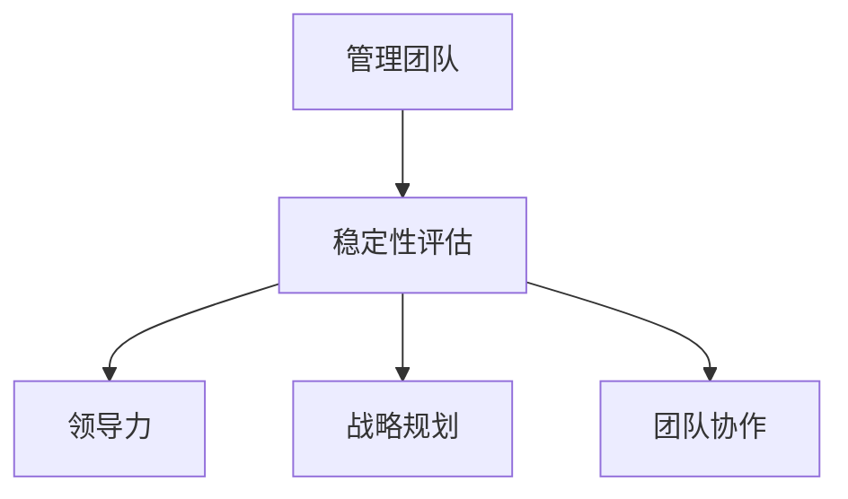
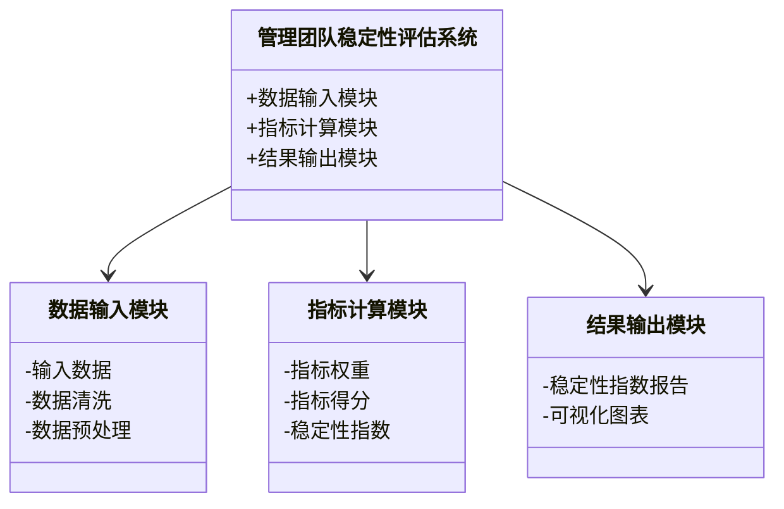
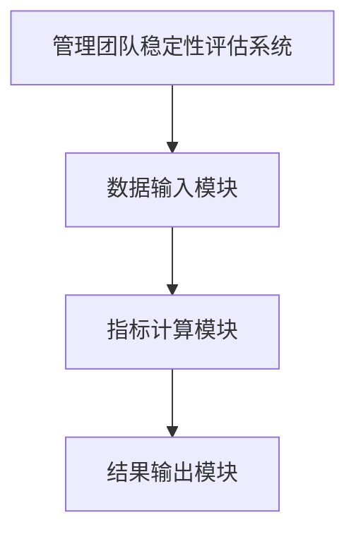
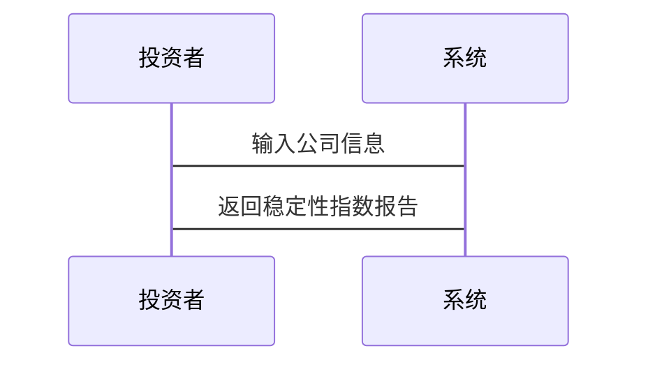

                 


# 彼得林奇对公司管理团队稳定性的评估

## 关键词：彼得·林奇、管理团队稳定性、投资评估、领导力、战略一致性

## 摘要：
本文基于彼得·林奇的投资理念，深入探讨如何评估公司管理团队的稳定性。通过定量与定性分析，结合实际案例，提出了一套全面的评估方法，帮助投资者和企业管理者识别稳定的管理团队，从而做出更明智的投资决策。

---

# 第1章: 彼得·林奇投资理念概述

## 1.1 彼得·林奇的背景与投资风格

### 1.1.1 彼得·林奇的生平简介
彼得·林奇（Peter Lynch）是美国著名投资家，曾任富达麦哲伦基金的经理，以其卓越的投资业绩闻名。他的投资哲学强调长期成长和基本面分析。

### 1.1.2 林奇的投资哲学与方法
林奇倡导“业余投资者”的理念，主张投资于自己熟悉的公司。他强调管理层的重要性，认为稳定的管理团队是公司长期成功的关键。

### 1.1.3 林奇对管理团队的重视
林奇认为，一个稳定的管理团队能够确保公司战略的连贯性和执行力，从而为股东创造长期价值。

---

## 1.2 管理团队稳定性的重要性

### 1.2.1 管理团队稳定性对企业发展的影响
稳定的管理团队能够应对市场波动，制定一致的战略规划，提升公司绩效。

### 1.2.2 管理团队稳定性对投资者决策的影响
投资者通过评估管理团队的稳定性，可以更准确地预测公司的未来表现，做出更明智的投资决策。

### 1.2.3 管理团队稳定性与企业绩效的关系
稳定的管理团队通常能够推动公司实现持续增长，而频繁的管理层变动可能导致战略摇摆和业绩下滑。

---

## 1.3 本章小结

### 1.3.1 林奇投资理念的核心要点
林奇的投资成功源于对管理团队的深入分析和长期关注。

### 1.3.2 管理团队稳定性评估的必要性
评估管理团队稳定性是投资者和企业管理者的重要任务，直接影响公司的长期发展。

### 1.3.3 本书的研究目标与框架
本文将结合定量和定性方法，系统地分析管理团队稳定性，提供实用的评估工具和方法。

---

# 第2章: 管理团队稳定性评估的核心概念

## 2.1 管理团队稳定性评估的背景与问题背景

### 2.1.1 管理团队稳定性评估的定义
管理团队稳定性评估是指通过对管理层的结构、稳定性、一致性和执行能力的分析，判断团队的稳定性。

### 2.1.2 问题背景与问题描述
在实际投资中，管理团队的频繁变动可能导致公司战略不一致，影响业绩。因此，如何评估管理团队的稳定性成为关键问题。

### 2.1.3 问题解决的必要性与目标
通过评估管理团队稳定性，投资者可以识别出稳定且有能力的管理团队，降低投资风险。

---

## 2.2 核心概念与联系

### 2.2.1 核心概念原理
管理团队稳定性评估涉及领导力、战略一致性和团队协作等多个方面。

### 2.2.2 概念属性特征对比表格
以下对比表格展示了管理团队稳定性评估中的关键概念及其属性特征：

| 概念       | 属性         | 特征描述                               |
|------------|--------------|----------------------------------------|
| 领导力     | 定性指标     | 领导风格、决策能力、激励能力           |
| 战略规划   | 综合指标     | 战略一致性、目标明确性、可执行性       |
| 团队协作   | 定量指标     | 协作效率、内部沟通、成员稳定性         |

### 2.2.3 ER实体关系图
以下为管理团队稳定性评估的概念关系图：



---

## 2.3 本章小结

### 2.3.1 核心概念的定义与联系
管理团队稳定性评估涉及多个方面，各概念之间相互关联，共同影响团队的稳定性。

### 2.3.2 概念结构与核心要素的组成
通过对比表格和ER图，我们明确了管理团队稳定性评估的核心要素及其关系。

### 2.3.3 本章内容的总结
本章为后续的评估方法奠定了基础，强调了领导力、战略规划和团队协作的重要性。

---

# 第3章: 管理团队稳定性评估的指标与方法

## 3.1 管理团队稳定性评估的指标体系

### 3.1.1 领导力评估指标
领导力评估包括领导风格、决策能力和激励能力。

### 3.1.2 战略一致性评估指标
战略一致性评估包括战略目标的一致性、可执行性和目标的明确性。

### 3.1.3 团队协作评估指标
团队协作评估包括协作效率、内部沟通和成员稳定性。

---

## 3.2 管理团队稳定性评估的具体方法

### 3.2.1 定量评估方法
定量方法包括计算团队成员的平均任期、领导层变动频率等。

### 3.2.2 定性评估方法
定性方法包括分析领导力风格、战略规划的一致性和团队协作效率。

### 3.2.3 综合评估方法
综合评估方法结合定量和定性分析，得出管理团队的稳定性指数。

---

## 3.3 管理团队稳定性评估的流程

### 3.3.1 收集数据
收集管理团队的结构、任期、战略规划和内部沟通等数据。

### 3.3.2 评估领导力
评估领导力的决策能力和激励能力。

### 3.3.3 评估战略一致性
分析战略目标的一致性和可执行性。

### 3.3.4 评估团队协作
评估团队成员的协作效率和内部沟通。

### 3.3.5 综合评估
结合定量和定性评估结果，得出管理团队的稳定性指数。

---

## 3.4 本章小结

### 3.4.1 管理团队稳定性评估的指标体系
本章详细介绍了领导力、战略一致性和团队协作的评估指标。

### 3.4.2 综合评估方法
通过综合评估方法，可以得出管理团队的稳定性指数。

### 3.4.3 本章内容的总结
本章为读者提供了全面的管理团队稳定性评估方法，便于实际应用。

---

# 第4章: 管理团队稳定性评估的算法原理

## 4.1 管理团队稳定性指数模型

### 4.1.1 稳定性指数的定义
稳定性指数是衡量管理团队稳定性的重要指标，范围在0到1之间。

### 4.1.2 稳定性指数的计算公式
稳定性指数的计算公式如下：

$$
\text{稳定性指数} = \frac{\sum (\text{指标权重} \times \text{指标得分})}{\sum \text{指标权重}}
$$

---

## 4.2 管理团队稳定性评估的算法流程

### 4.2.1 数据收集与预处理
收集管理团队的结构、任期、战略规划和内部沟通等数据，并进行清洗和标准化处理。

### 4.2.2 指标权重的确定
根据各指标的重要程度，确定各指标的权重。

### 4.2.3 指标得分的计算
根据各指标的表现，计算各指标的得分。

### 4.2.4 稳定性指数的计算
根据公式计算稳定性指数。

### 4.2.5 结果分析
分析稳定性指数的结果，判断管理团队的稳定性。

---

## 4.3 本章小结

### 4.3.1 稳定性指数模型的定义与计算公式
稳定性指数模型是衡量管理团队稳定性的重要工具。

### 4.3.2 算法流程
通过数据收集、指标权重确定、指标得分计算和稳定性指数计算，可以得出管理团队的稳定性指数。

### 4.3.3 本章内容的总结
本章详细介绍了稳定性指数模型的算法原理和计算步骤，为实际应用提供了指导。

---

# 第5章: 管理团队稳定性评估的系统架构

## 5.1 问题场景介绍

### 5.1.1 问题背景
在实际投资中，投资者需要评估管理团队的稳定性，以做出明智的投资决策。

### 5.1.2 项目介绍
本文将设计一个基于稳定性指数模型的管理团队稳定性评估系统。

---

## 5.2 系统功能设计

### 5.2.1 领域模型设计
以下是管理团队稳定性评估系统的类图：



---

## 5.3 系统架构设计

### 5.3.1 系统架构设计
以下是管理团队稳定性评估系统的架构图：



### 5.3.2 系统接口设计
系统接口包括数据输入接口、指标计算接口和结果输出接口。

### 5.3.3 系统交互设计
以下是管理团队稳定性评估系统的交互图：



---

## 5.4 本章小结

### 5.4.1 系统功能设计
通过领域模型设计，明确了系统的功能模块及其关系。

### 5.4.2 系统架构设计
通过架构图展示了系统的整体结构和模块之间的关系。

### 5.4.3 本章内容的总结
本章为管理团队稳定性评估系统提供了详细的系统设计，为后续的实现奠定了基础。

---

# 第6章: 管理团队稳定性评估的项目实战

## 6.1 项目环境安装

### 6.1.1 系统运行环境
建议使用Python 3.6及以上版本，安装必要的库如pandas、numpy等。

### 6.1.2 数据集准备
准备管理团队的结构、任期、战略规划和内部沟通等数据。

---

## 6.2 管理团队稳定性评估的核心实现

### 6.2.1 数据清洗与预处理
使用pandas库对数据进行清洗和预处理。

```python
import pandas as pd

# 读取数据
df = pd.read_csv('management_team.csv')

# 数据清洗
df.dropna(inplace=True)
df = df[~df.duplicated()]
```

### 6.2.2 指标权重的确定
根据各指标的重要程度，确定各指标的权重。

```python
# 定义指标权重
weights = {'领导力': 0.4, '战略一致性': 0.3, '团队协作': 0.3}
```

### 6.2.3 指标得分的计算
根据各指标的表现，计算各指标的得分。

```python
# 计算指标得分
scores = {
    '领导力': 0.85,
    '战略一致性': 0.75,
    '团队协作': 0.80
}
```

### 6.2.4 稳定性指数的计算
根据公式计算稳定性指数。

```python
# 计算稳定性指数
stability_index = sum(weights[i] * scores[i] for i in weights) / sum(weights.values())
print(f"稳定性指数: {stability_index}")
```

---

## 6.3 项目小结

### 6.3.1 环境安装与数据准备
通过安装必要的库和数据清洗，为后续的评估提供了基础。

### 6.3.2 核心实现
通过指标权重的确定、指标得分的计算和稳定性指数的计算，得出了管理团队的稳定性指数。

### 6.3.3 本章内容的总结
本章通过实际案例展示了如何应用稳定性指数模型进行管理团队稳定性评估。

---

# 第7章: 总结与展望

## 7.1 总结

### 7.1.1 核心观点回顾
管理团队稳定性是影响公司绩效和投资决策的重要因素。

### 7.1.2 本文的主要贡献
本文提出了基于稳定性指数模型的管理团队稳定性评估方法，并提供了系统的实现方案。

---

## 7.2 展望

### 7.2.1 未来研究方向
未来可以进一步研究如何结合更多因素，如市场环境和公司文化，完善评估模型。

### 7.2.2 拓展应用领域
本文的方法可以推广到其他领域，如非营利组织和政府机构的管理团队评估。

---

## 7.3 最佳实践 Tips

### 7.3.1 数据收集与清洗
确保数据的准确性和完整性，避免因数据问题影响评估结果。

### 7.3.2 指标权重的确定
根据具体情况进行调整，确保权重合理反映各指标的重要性。

### 7.3.3 结果分析
结合实际情况解释评估结果，避免机械应用模型。

---

## 7.4 注意事项

### 7.4.1 数据隐私与合规性
在数据收集和处理过程中，需遵守相关法律法规，保护数据隐私。

### 7.4.2 模型的适用性
根据具体场景调整模型，确保其适用性和有效性。

### 7.4.3 持续监控与更新
定期更新数据和评估结果，确保模型的有效性和时效性。

---

## 7.5 拓展阅读

### 7.5.1 相关书籍
- 《彼得·林奇的成功投资》
- 《管理团队的构建与优化》

### 7.5.2 相关文章
- 如何有效评估管理团队的稳定性
- 领导力在团队管理中的作用

---

## 7.6 本章小结

### 7.6.1 核心观点总结
管理团队稳定性评估是投资者和企业管理者的重要任务，本文提供了系统的解决方案。

### 7.6.2 未来研究方向
未来可以进一步完善评估模型，并拓展其应用领域。

### 7.6.3 最佳实践 Tips
在实际应用中，需注意数据质量、模型调整和持续监控。

---

# 结语

通过本文的系统介绍和详细分析，读者可以全面了解彼得·林奇对公司管理团队稳定性的评估方法，并能够实际应用这些方法进行评估。希望本文能为投资者和企业管理者提供有价值的参考，帮助他们做出更明智的决策。

