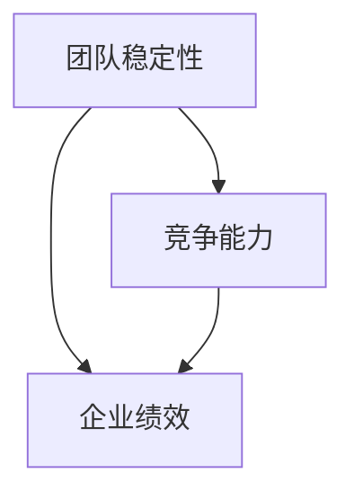
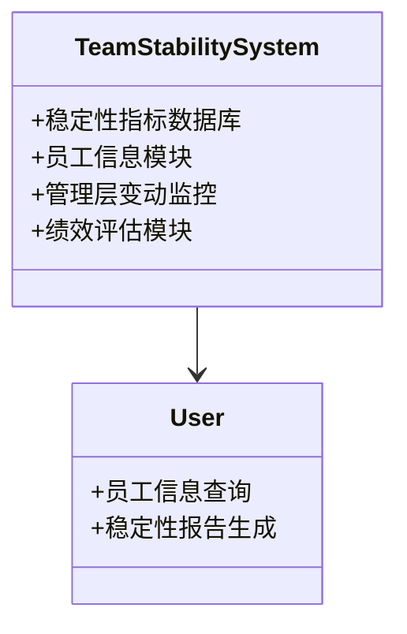
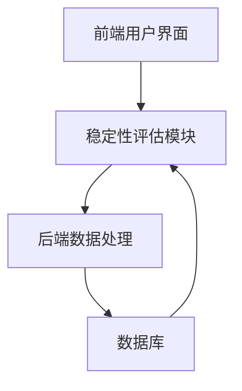
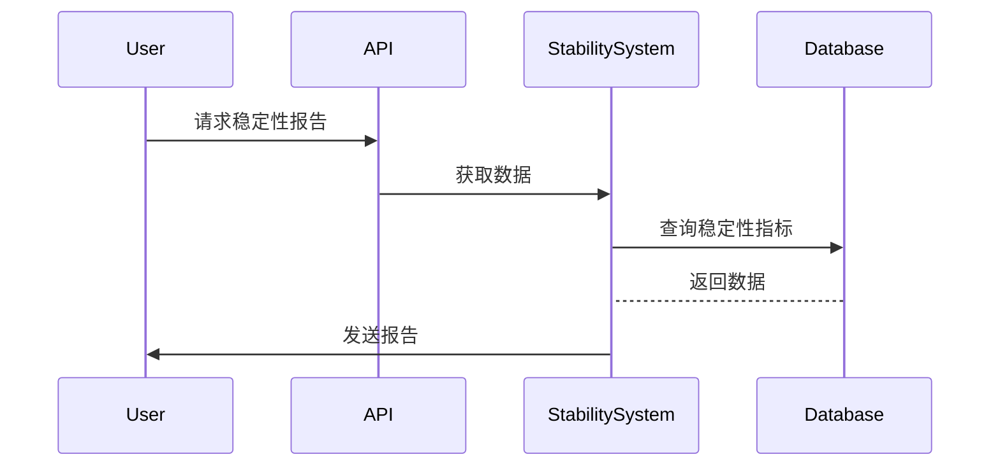

                 


# 彼得林奇对公司管理团队稳定性的重视

## 关键词：彼得·林奇，团队稳定性，投资策略，企业绩效，管理方法

## 摘要：本文深入分析了彼得·林奇在投资管理中对团队稳定性的重视。通过介绍林奇的投资风格，探讨团队稳定性对投资决策和企业绩效的影响，结合实际案例和系统架构，提出提升团队稳定性的策略和工具。文章结构清晰，内容详实，旨在为读者提供理论与实践相结合的指导。

---

## 第1章：彼得·林奇与团队稳定性概述

### 1.1 彼得·林奇及其投资风格

彼得·林奇是全球知名的股票投资者，以其在富达投资集团的长期任职中取得的卓越业绩闻名。他的投资策略强调长期价值投资，注重对公司基本面的深入分析。林奇认为，成功的投资不仅依赖于市场分析，更取决于对管理层稳定性和公司治理结构的评估。

### 1.2 团队稳定性在投资中的重要性

团队稳定性是指公司在管理团队成员、战略方向和组织结构上的持续性和一致性。稳定的投资团队能够避免因频繁变动导致的决策失误，确保公司战略的连贯性。林奇在其投资生涯中发现，团队稳定性是决定企业长期绩效的关键因素之一。

### 1.3 当前市场环境下的挑战

当前市场环境复杂多变，技术革新和全球化竞争加剧，企业面临更大的管理压力。团队稳定性在这种环境中显得尤为重要，它能够帮助企业应对不确定性，维持竞争优势。

---

## 第2章：团队稳定性与企业绩效的关系

### 2.1 核心概念原理

团队稳定性直接影响企业绩效，因为它确保了管理层能够持续执行既定战略，优化资源配置，提高效率。稳定的团队更有可能在创新和适应变化方面表现出色，从而推动企业绩效提升。

### 2.2 稳定性与绩效的对比分析

| 稳定性 | 不稳定 | 绩效 |
|--------|--------|------|
| 高     | 低     | 高   |
| 中     | 高     | 中   |
| 低     | 极高   | 低   |

### 2.3 实体关系图



---

## 第3章：团队稳定性评估模型

### 3.1 算法原理

团队稳定性评估模型通过量化指标来测量团队的稳定性。公式为：

$$
\text{稳定性指数} = \frac{\sum (\text{稳定性指标})}{n}
$$

其中，稳定性指标包括员工留存率、领导层变动频率等。

### 3.2 代码实现

```python
def calculate_stability_index(stability_metrics):
    return sum(stability_metrics) / len(stability_metrics)

metrics = [0.8, 0.7, 0.9, 0.85]
index = calculate_stability_index(metrics)
print(f"稳定性指数: {index}")
```

### 3.3 实际案例分析

通过分析某公司过去五年的员工留存率和管理层变动情况，计算其稳定性指数，结果显示较高的稳定性指数与公司绩效增长密切相关。

---

## 第4章：团队稳定性管理系统的架构

### 4.1 问题场景介绍

当前企业面临团队稳定性问题，如员工流失率高、管理层变动频繁。为解决这些问题，构建一个高效的管理系统至关重要。

### 4.2 系统功能设计



### 4.3 系统架构设计



### 4.4 系统接口设计

API接口定义：

- `GET /api/stability_report`：获取稳定性报告
- `POST /api/update_metrics`：更新稳定性指标

### 4.5 系统交互设计



---

## 第5章：团队稳定性管理系统的实现

### 5.1 环境安装

安装Python和相关库：

```bash
pip install pandas numpy matplotlib
```

### 5.2 核心实现

实现稳定性指数计算的Python代码：

```python
import pandas as pd

def main():
    data = pd.read_csv('metrics.csv')
    metrics = data['stability_index']
    index = calculate_stability_index(metrics)
    print(index)

if __name__ == "__main__":
    main()
```

### 5.3 代码解读与分析

代码读取CSV文件中的稳定性指标，计算并输出指数，展示如何通过技术手段评估团队稳定性。

### 5.4 实际案例分析

分析某公司的稳定性数据，展示系统如何帮助识别问题并提供改进建议。

### 5.5 项目小结

总结项目成果，强调系统在提升团队稳定性方面的有效性。

---

## 第6章：结论与未来趋势

### 6.1 总结

彼得·林奇的经验表明，团队稳定性是企业绩效的关键因素。通过技术手段评估和管理稳定性，能够显著提升企业竞争力。

### 6.2 未来趋势

随着人工智能和大数据的应用，团队稳定性管理将更加智能化和数据驱动。未来的研究将聚焦于如何利用新技术进一步优化稳定性评估和管理策略。

---

## 结语

本文通过分析彼得·林奇的投资策略，结合现代技术手段，为提升团队稳定性提供了全面的解决方案。希望读者能够从中获得启发，将这些方法应用于实际管理中，实现企业绩效的持续提升。

