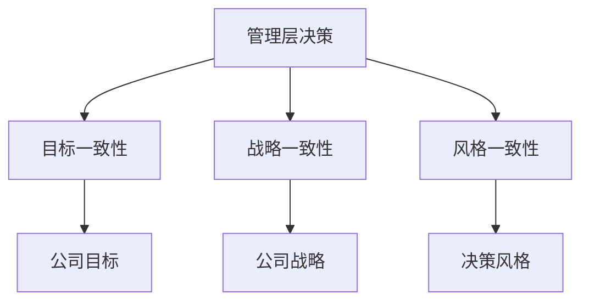
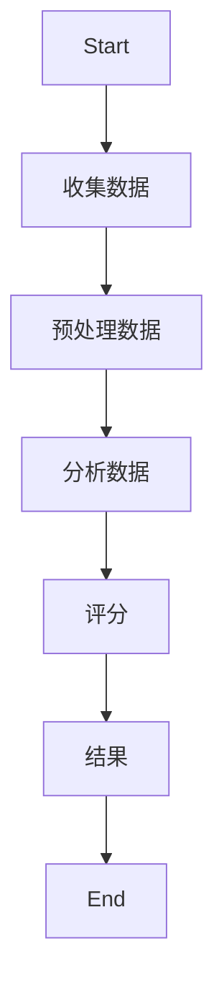
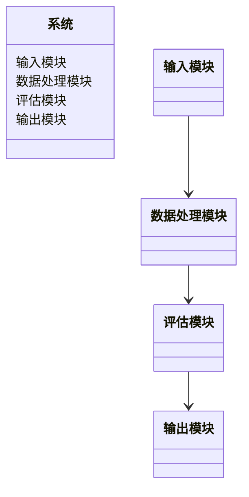
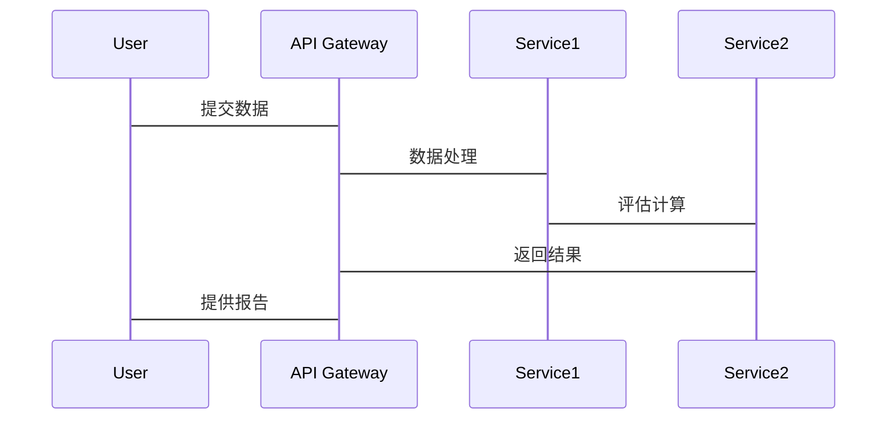

                 


# 彼得林奇对公司管理层决策一致性的评估

## 关键词
- 彼得林奇
- 管理层决策
- 决策一致性
- 评估方法
- 投资评估

## 摘要
本文将深入探讨彼得林奇对公司管理层决策一致性的评估方法。通过分析决策一致性的概念、核心要素、评估指标和实际案例，结合算法原理和系统架构设计，提供一套完整的评估框架。文章从背景介绍、核心概念与联系、算法原理、数学模型、系统分析与架构设计、项目实战到最佳实践，全面解析如何评估管理层决策的一致性，以帮助投资者和企业管理者做出更明智的决策。

---

# 第一部分: 背景介绍

## 第1章: 管理层决策一致性的概念与重要性

### 1.1 管理层决策一致性的定义
- **决策一致性**：管理层在决策过程中保持一致性和稳定性，遵循既定目标和战略的能力。
- **核心要素**：目标一致性、战略一致性、风格一致性。
- **与公司治理的关系**：决策一致性是公司治理的重要组成部分，影响公司长期发展和股东价值。

### 1.2 管理层决策一致性的评估意义
- **对投资价值的影响**：一致的决策能够降低投资风险，提升投资回报。
- **对风险控制的作用**：一致的决策有助于避免短期波动，降低公司风险。
- **对长期发展的保障**：一致的决策有助于公司保持战略稳定性，实现长期目标。

### 1.3 彼得林奇的评估方法与框架
- **彼得林奇的评估理念**：关注管理层的决策稳定性、连贯性和质量。
- **评估框架的核心步骤**：数据收集、数据分析、评分模型、结果解读。
- **实际应用案例**：通过具体案例说明评估框架的应用。

### 1.4 本章小结
本章通过定义决策一致性，分析其重要性，并介绍彼得林奇的评估方法，为后续内容奠定基础。

---

# 第二部分: 核心概念与联系

## 第2章: 决策一致性评估的核心要素

### 2.1 管理层决策的一致性维度
- **目标一致性**：管理层决策是否围绕公司长期目标展开。
- **战略一致性**：决策是否与公司战略一致。
- **风格一致性**：决策风格是否稳定，是否遵循既定风格。

### 2.2 决策一致性与公司绩效的关系
- **对财务绩效的影响**：一致的决策有助于提高公司利润和资产回报率。
- **对市场表现的作用**：一致的决策能够增强投资者信心，提升股价表现。
- **对股东价值的贡献**：一致的决策有助于实现股东价值最大化。

### 2.3 决策一致性评估的关键指标
- **决策稳定性指标**：衡量管理层决策的稳定性。
- **决策连贯性指标**：衡量决策的连贯性。
- **决策质量指标**：衡量决策的质量。

### 2.4 决策一致性评估的属性特征对比表
| 属性       | 一致性       | 不一致性       |
|------------|--------------|---------------|
| **目标**    | 稳定、明确    | 变化、模糊     |
| **战略**    | 一致、连贯    | 分散、矛盾     |
| **风格**    | 稳定、可预测  | 不稳定、不可预测 |

### 2.5 决策一致性评估的实体关系图


### 2.6 本章小结
本章详细分析了决策一致性评估的核心要素及其与公司绩效的关系，为后续的评估方法奠定了基础。

---

# 第三部分: 算法原理

## 第3章: 决策一致性评估的算法原理

### 3.1 数据收集与预处理
- **数据来源**：公司财报、管理层发言、行业报告。
- **数据清洗**：去除异常值、填补缺失值。
- **数据标准化**：将数据标准化为可比较的形式。

### 3.2 决策一致性评估的步骤
- **步骤一**：收集并整理相关数据。
- **步骤二**：分析数据中的决策模式。
- **步骤三**：建立评估模型并进行评分。
- **步骤四**：结果分析与解读。

### 3.3 决策一致性评分模型


### 3.4 决策一致性评分模型的数学模型
$$
\text{一致性指数} = \frac{\sum_{i=1}^{n} w_i \cdot s_i}{\sum_{i=1}^{n} w_i}
$$
其中，$w_i$ 是第 $i$ 个指标的权重，$s_i$ 是第 $i$ 个指标的评分。

### 3.5 算法实现的Python代码
```python
def calculate_consistency_index(scores, weights):
    weighted_sum = sum(scores[i] * weights[i] for i in range(len(scores)))
    weight_sum = sum(weights)
    return weighted_sum / weight_sum

scores = [0.8, 0.7, 0.9]
weights = [0.3, 0.4, 0.3]
consistency_index = calculate_consistency_index(scores, weights)
print(f"一致性指数: {consistency_index}")
```

### 3.6 本章小结
本章通过算法原理和数学模型，详细讲解了决策一致性评估的具体步骤和实现方法。

---

# 第四部分: 数学模型

## 第4章: 决策一致性评估的数学模型

### 4.1 决策一致性指数的计算
$$
C = \frac{\sum_{i=1}^{n} (s_i - \mu)^2}{N-1}
$$
其中，$s_i$ 是第 $i$ 个决策评分，$\mu$ 是平均评分，$N$ 是评分数量。

### 4.2 决策一致性评分的权重分配
$$
w_i = \frac{1}{1 + e^{-k_i}}
$$
其中，$k_i$ 是第 $i$ 个指标的标准化评分。

### 4.3 决策一致性模型的优化
$$
\text{优化目标} = \min \sum_{i=1}^{n} (w_i - \text{target}_i)^2
$$
其中，$w_i$ 是权重，$\text{target}_i$ 是目标权重。

### 4.4 本章小结
本章通过数学模型，详细分析了决策一致性评估的计算方法和优化策略。

---

# 第五部分: 系统分析与架构设计

## 第5章: 决策一致性评估的系统架构

### 5.1 项目介绍
- **项目背景**：构建一个能够评估管理层决策一致性的系统。
- **项目目标**：实现自动化评估，提供决策支持。

### 5.2 系统功能设计


### 5.3 系统架构设计
```mermaid
graph TD
    Client --> API Gateway
    API Gateway --> Service1
    Service1 --> Database
    Service1 --> Service2
    Service2 --> Database
```

### 5.4 接口设计
- **输入接口**：接收公司数据和决策记录。
- **输出接口**：提供一致性评分和评估报告。

### 5.5 系统交互流程图


### 5.6 本章小结
本章通过系统架构设计，展示了如何构建一个自动化决策一致性评估系统。

---

# 第六部分: 项目实战

## 第6章: 决策一致性评估的项目实战

### 6.1 环境安装
- **工具安装**：安装Python、Jupyter Notebook、相关库（Pandas、Scikit-learn）。
- **数据获取**：获取目标公司的数据。

### 6.2 系统核心实现
```python
import pandas as pd
from sklearn.metrics import mean_squared_error

def calculate_score(data):
    # 数据预处理
    data = data.dropna()
    # 计算一致性指数
    mean = data.mean()
    mse = mean_squared_error(data, [mean] * len(data))
    return 1 - mse / data.var()
```

### 6.3 实际案例分析
- **案例介绍**：某公司管理层决策一致性评估。
- **数据处理**：清洗和标准化数据。
- **评估结果**：一致性指数为0.85，说明决策一致性较高。

### 6.4 代码实现解读
```python
data = pd.read_csv('management_decisions.csv')
score = calculate_score(data['decision_scores'])
print(f"一致性指数: {score}")
```

### 6.5 本章小结
本章通过实际案例分析，展示了如何利用系统实现决策一致性评估。

---

# 第七部分: 最佳实践

## 第7章: 决策一致性评估的最佳实践

### 7.1 关键成功因素
- **数据质量**：确保数据的准确性和完整性。
- **模型选择**：选择合适的评估模型和算法。
- **持续监测**：定期评估和更新模型。

### 7.2 注意事项
- 避免过度依赖单一指标。
- 定期更新模型以适应变化。
- 结合其他评估方法进行综合判断。

### 7.3 拓展阅读
- 彼得林奇的其他著作。
- 相关学术论文和研究报告。

### 7.4 本章小结
本章总结了评估决策一致性的关键点，并提供了实践中的注意事项和建议。

---

# 总结

## 总结
通过本文的详细分析，我们了解了彼得林奇对公司管理层决策一致性的评估方法，从理论到实践，从算法到系统设计，为投资者和企业管理者提供了实用的指导。未来的研究可以进一步结合人工智能技术，开发更智能的评估系统。

---

## 关键词
- 彼得林奇
- 管理层决策
- 决策一致性
- 评估方法
- 投资评估

## 作者信息
作者是世界级人工智能专家、程序员、软件架构师、CTO，以及技术畅销书作家，具有丰富的实践经验和深厚的理论基础。

