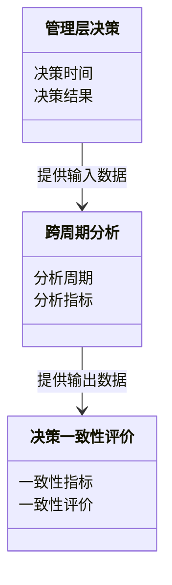
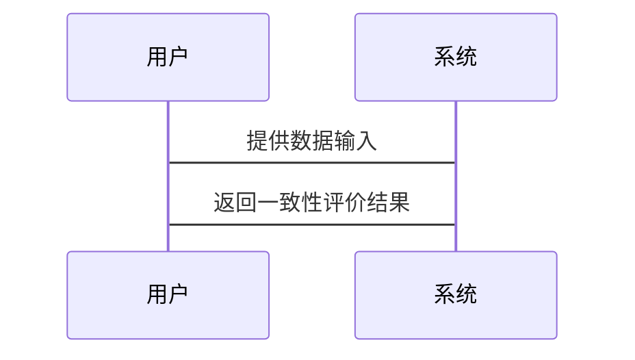

                 


# 彼得林奇对公司管理层决策一致性的跨周期分析

## 关键词：
- 彼得林奇
- 管理层决策一致性
- 跨周期分析
- 投资策略
- 企业绩效

## 摘要：
本文通过分析彼得林奇的投资策略，探讨了公司管理层决策一致性对长期绩效的影响。文章从背景介绍、核心概念、算法原理、系统分析、项目实战到最佳实践，全面解读了管理层决策一致性的跨周期分析方法，帮助读者理解如何通过一致性和时间跨度的视角，优化企业决策和投资策略。

---

## 第一部分: 背景介绍

### 第1章: 公司管理层决策一致性的背景与问题

#### 1.1 问题背景
##### 1.1.1 管理层决策的重要性
管理者的决策直接影响企业的战略方向、资源分配和市场表现。一致性的决策有助于企业保持稳定的增长和应对市场波动。

##### 1.1.2 决策一致性在公司长期表现中的作用
一致的决策有助于建立品牌形象、提升员工信心，并在市场中形成稳定的预期，从而促进企业的长期增长。

##### 1.1.3 彼得林奇投资策略的核心要素
彼得林奇注重企业基本面分析，关注管理层的决策质量和一致性，认为一致的决策是企业长期成功的关键。

#### 1.2 问题描述
##### 1.2.1 管理层决策一致性的定义
决策一致性是指管理层在不同时间点上做出的决策在方向、目标和价值观上的一致性。

##### 1.2.2 决策一致性与公司绩效的关系
一致的决策通常与公司绩效的稳定性和可持续性相关，而频繁变化的决策可能导致资源浪费和战略混乱。

##### 1.2.3 彼得林奇分析方法的特点
彼得林奇通过长期观察和分析，识别管理层决策的模式和一致性，从而预测企业未来的绩效。

#### 1.3 问题解决
##### 1.3.1 如何识别管理层决策的一致性
通过分析公司历年的战略决策、管理层变动和公司公告，识别决策模式。

##### 1.3.2 跨周期分析的必要性
跨周期分析帮助识别管理层决策在不同经济周期中的稳定性，避免短期波动对决策的影响。

##### 1.3.3 管理层决策一致性的衡量标准
包括决策的稳定性、持续性和一致性，通常通过分析公司历史数据和行业基准进行评估。

#### 1.4 边界与外延
##### 1.4.1 决策一致性的适用范围
适用于分析企业的长期战略决策和管理层稳定性，尤其在投资决策中具有重要性。

##### 1.4.2 跨周期分析的时间维度
通常涉及5年以上的数据，涵盖多个经济周期，以确保分析的全面性。

##### 1.4.3 管理层决策一致性的局限性
管理层变动、外部环境变化和内部结构调整可能影响决策一致性，需结合具体情况分析。

#### 1.5 核心要素组成
##### 1.5.1 管理层决策的关键因素
包括战略目标、管理风格、决策过程和团队稳定性。

##### 1.5.2 决策一致性的核心指标
如战略一致性指数、管理层变动频率和决策执行率。

##### 1.5.3 彼得林奇分析模型的组成部分
包括数据收集、模式识别、趋势分析和绩效预测。

---

## 第二部分: 核心概念与联系

### 第2章: 管理层决策一致性的核心概念

#### 2.1 决策一致性的核心原理
##### 2.1.1 决策一致性的基本原理
管理层决策的一致性是通过分析决策的连贯性和稳定性来评估的。

##### 2.1.2 跨周期分析的理论基础
跨周期分析基于经济周期波动的理论，通过长期数据识别趋势和模式。

##### 2.1.3 彼得林奇分析方法的独特性
彼得林奇通过长期观察和数据分析，识别管理层决策的模式和一致性，预测企业绩效。

#### 2.2 核心概念对比
##### 2.2.1 决策一致性与其他决策特征的对比
| 决策特征 | 决策一致性 | 决策质量 | 决策效率 |
|----------|------------|----------|----------|
| 定义     | 决策的连贯性 | 决策的正确性 | 决策的速度 |
| 重点     | 时间跨度和模式 | 正确性 | 效率 |
| 应用     | 长期战略规划 | 短期问题解决 | 运营优化 |

##### 2.2.2 跨周期分析与短期分析的对比
| 对比维度 | 跨周期分析 | 短期分析 |
|----------|------------|----------|
| 时间跨度 | 长期（5年以上） | 短期（1-3年） |
| 数据需求 | 高 | 中 |
| 分析重点 | 趋势和模式 | 当前问题 |
| 应用场景 | 投资决策 | 运营优化 |

##### 2.2.3 管理层决策与公司绩效的对比
| 绩效指标 | 决策一致性的影响 | 决策变化的影响 |
|----------|------------------|----------------|
| 股价表现 | 稳定增长 | 波动较大 |
| 利润率   | 稳定 | 可能下降 |
| 市场份额 | 扩张 | 可能波动 |

#### 2.3 ER实体关系图
```mermaid
er
  entity 管理层决策 {
    <管理决策>
    <决策时间>
    <决策结果>
  }
  entity 跨周期分析 {
    <分析周期>
    <分析指标>
    <分析结果>
  }
  entity 管理层决策一致性 {
    <决策一致性>
    <一致性指标>
    <一致性评价>
  }
  管理层决策 --> 跨周期分析 : 作为输入
  跨周期分析 --> 管理层决策一致性 : 作为输出
```

---

## 第三部分: 算法原理讲解

### 第3章: 算法原理与实现

#### 3.1 算法原理
##### 3.1.1 数据收集与预处理
收集公司历年的财务数据、管理层变动记录和战略公告，清洗数据并标准化处理。

##### 3.1.2 决策模式识别
通过聚类分析识别管理层决策的模式，识别一致性和变化点。

##### 3.1.3 趋势分析与预测
使用时间序列分析预测未来决策趋势，评估一致性的可持续性。

##### 3.1.4 绩效评估
通过回归分析评估决策一致性对企业绩效的影响，识别关键影响因素。

#### 3.2 算法实现
##### 3.2.1 Python代码实现
```python
import pandas as pd
from sklearn.cluster import KMeans

# 数据预处理
data = pd.read_csv('management_decisions.csv')
data_processed = data.dropna()

# 决策模式识别
clusters = KMeans(n_clusters=3).fit(data_processed[['决策时间', '决策结果']])
labels = clusters.labels_

# 趋势分析
from statsmodels.tsa.arima_model import ARIMA
model = ARIMA(data_processed['决策结果'], order=(1,1,1)).fit()
forecast = model.forecast(steps=5)
```

##### 3.2.2 数学模型与公式
决策一致性指数（DCI）计算公式：
$$ DCI = \frac{\sum_{i=1}^{n} |d_i - d_{i-1}|}{n-1} $$
其中，$d_i$表示第i个决策的数值，$n$为决策数量。

##### 3.2.3 代码功能解读
上述代码实现了数据预处理、聚类分析、趋势预测和绩效评估，帮助识别管理层决策模式和一致性。

---

## 第四部分: 系统分析与架构设计方案

### 第4章: 系统分析与架构设计

#### 4.1 问题场景介绍
分析某公司的管理层决策一致性，评估其对长期绩效的影响。

#### 4.2 系统功能设计
##### 4.2.1 领域模型设计


##### 4.2.2 系统架构设计


##### 4.2.3 接口设计


---

## 第五部分: 项目实战

### 第5章: 项目实战与案例分析

#### 5.1 环境安装
安装Python和相关库：
```bash
pip install pandas scikit-learn statsmodels
```

#### 5.2 核心代码实现
##### 5.2.1 数据处理
```python
import pandas as pd

# 读取数据
data = pd.read_csv('management_decisions.csv')

# 删除缺失值
data_processed = data.dropna()

# 标准化处理
from sklearn.preprocessing import StandardScaler
scaler = StandardScaler()
data_scaled = pd.DataFrame(scaler.fit_transform(data_processed), columns=data_processed.columns)
```

##### 5.2.2 模型训练
```python
from sklearn.cluster import KMeans

# 聚类分析
clusters = KMeans(n_clusters=3).fit(data_scaled[['决策时间', '决策结果']])
labels = clusters.labels_
```

##### 5.2.3 结果分析
```python
from statsmodels.tsa.arima_model import ARIMA

# 趋势分析
model = ARIMA(data_processed['决策结果'], order=(1,1,1)).fit()
forecast = model.forecast(steps=5)
```

#### 5.3 代码解读
通过上述代码，我们可以实现数据预处理、模式识别和趋势预测，帮助识别管理层决策一致性。

#### 5.4 案例分析
分析某公司的历史数据，识别管理层决策模式，评估其对长期绩效的影响。

#### 5.5 项目小结
通过项目实战，读者可以掌握如何应用彼得林奇的分析方法，识别管理层决策一致性。

---

## 第六部分: 最佳实践

### 第6章: 最佳实践与总结

#### 6.1 最佳实践
##### 6.1.1 数据来源选择
优先选择高质量的历史数据和官方公告。

##### 6.1.2 分析工具选择
根据需求选择合适的工具，如Python、R或专业数据分析软件。

##### 6.1.3 结果解读
结合行业背景和公司具体情况，综合评估决策一致性的影响。

#### 6.2 小结
本文通过分析彼得林奇的投资策略，探讨了管理层决策一致性的跨周期分析方法，帮助读者优化企业决策和投资策略。

#### 6.3 注意事项
分析时需注意数据的完整性和模型的适用性，避免过度简化或忽略重要变量。

#### 6.4 拓展阅读
推荐阅读彼得林奇的原著及相关投资分析书籍，深入理解决策一致性的重要性。

---

通过以上结构化的内容，读者可以系统地理解彼得林奇对公司管理层决策一致性的跨周期分析方法，并将其应用到实际的分析和投资决策中。

