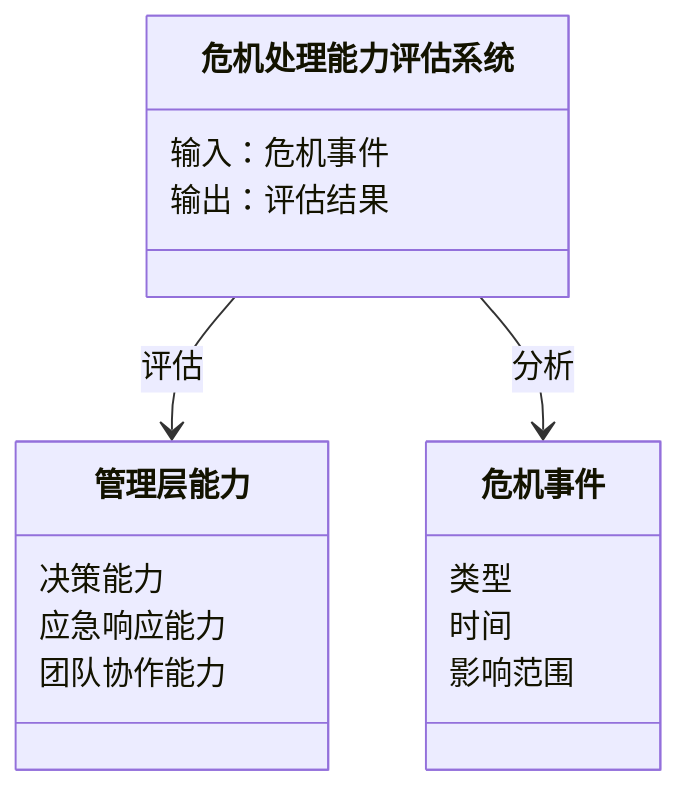

                 


好的，接下来我将按照要求撰写这篇文章。让我们从文章标题开始。

# 彼得林奇对公司管理层危机处理能力的评估

## 关键词：彼得·林奇, 危机处理能力, 评估模型, 算法原理, 项目实战

## 摘要：本文将深入探讨彼得·林奇在评估公司管理层危机处理能力方面的独特见解。通过分析危机处理能力的核心概念、评估模型、算法原理、系统架构以及实际案例，本文旨在为读者提供一套全面的评估框架，帮助企业在危机中做出更明智的决策。文章结合理论与实践，详细阐述了从理论模型到实际应用的全过程，为管理层提供了实用的评估工具和方法。

---

## 第一部分：引言

### 1.1 彼得·林奇与公司管理层危机处理能力评估

#### 1.1.1 彼得·林奇的背景介绍

彼得·林奇（Peter Lynch）是美国著名投资经理，以其在富达投资集团（Fidelity Investments）的卓越表现而闻名。他管理的麦哲伦基金（Magellan Fund）在20世纪80年代至90年代的表现尤为出色，年平均回报率高达29%。林奇的成功不仅源于他对市场的深刻理解，还源于他对公司管理层的敏锐洞察力。他认为，公司管理层在危机中的表现是评估公司长期发展潜力的关键因素。

#### 1.1.2 危机处理能力的重要性

危机是企业不可避免的一部分。无论是市场波动、管理失误还是外部冲击，危机都可能对企业的生存和发展造成重大影响。危机处理能力是公司管理层在面对突发状况时，能够迅速制定有效策略、化解危机、保护企业利益的能力。这种能力直接关系到企业的声誉、财务状况和长期发展。

#### 1.1.3 本书的目的与意义

本文旨在通过分析彼得·林奇的评估方法，探讨公司管理层危机处理能力的评估体系。我们将从理论到实践，逐步构建一个全面的评估框架，为企业提供实用的工具和方法。

---

## 第二部分：核心概念与背景

### 2.1 危机处理能力的定义与特征

#### 2.1.1 危机处理能力的定义

危机处理能力是指公司在面对突发事件时，管理层能够迅速识别问题、制定解决方案、有效沟通并最终化解危机的能力。这种能力不仅体现在管理层的决策能力上，还体现在团队的协作和执行能力上。

#### 2.1.2 危机处理能力的关键特征

- **快速反应**：在危机发生时，管理层能够迅速做出反应，避免事态扩大。
- **决策能力**：在复杂情况下，管理层能够制定合理且有效的决策。
- **沟通能力**：能够与内外部利益相关者进行有效沟通，维护企业声誉。
- **团队协作**：管理层能够调动内部资源，形成合力应对危机。

#### 2.1.3 危机处理能力与企业绩效的关系

危机处理能力是企业绩效的重要组成部分。研究表明，能够在危机中迅速恢复并成长的企业，往往具有更强的市场竞争力。因此，评估管理层的危机处理能力，不仅是对管理层能力的考察，也是对企业未来发展的预测。

---

### 2.2 危机处理能力的关键要素

#### 2.2.1 战略决策能力

战略决策能力是危机处理能力的核心。在危机中，管理层需要做出艰难的决策，这些决策往往涉及企业的生死存亡。例如，在2008年金融危机期间，许多银行的管理层需要在短时间内做出是否出售资产的决策。

#### 2.2.2 应急响应能力

应急响应能力是指企业在危机发生后，能够迅速启动应急机制，调动资源进行应对的能力。这包括制定应急预案、分配资源、协调团队等。

#### 2.2.3 团队协作能力

团队协作能力是危机处理中不可忽视的要素。在危机中，管理层需要调动内部资源，形成合力应对危机。一个高效的团队能够更快地解决问题，降低危机的影响。

#### 2.2.4 沟通与公关能力

在危机中，企业的声誉往往受到威胁。管理层需要与媒体、客户、员工等进行有效沟通，及时传递信息，避免谣言的扩散，维护企业形象。

---

### 2.3 危机处理能力的背景与外延

#### 2.3.1 危机的类型与特征

危机可以分为多种类型，包括：

- **财务危机**：如公司面临破产或巨额亏损。
- **声誉危机**：如企业因产品质量问题或管理不当而受损。
- **运营危机**：如供应链中断或生产事故。
- **法律危机**：如公司涉及法律诉讼或违规行为。

每种危机的特征不同，处理方式也有所差异。

#### 2.3.2 危机处理能力的边界

危机处理能力的边界在于企业在危机中的应对范围和能力。企业需要明确危机处理的职责分工，确保在危机中能够迅速响应。

#### 2.3.3 危机处理能力的外部影响因素

外部因素，如市场环境、政策变化、竞争对手行为等，都可能影响企业的危机处理能力。例如，政府的政策支持或行业法规的变化，可能对企业的危机处理产生重要影响。

---

## 第三部分：危机处理能力评估的核心概念

### 3.1 危机处理能力评估的理论框架

#### 3.1.1 评估模型的构建

评估模型的构建需要考虑多个维度，包括管理层的能力、企业的资源、危机的性质等。例如，可以将危机处理能力分解为决策能力、应急响应能力和团队协作能力三个维度。

#### 3.1.2 评估模型的属性特征对比表格

以下是危机处理能力评估模型的属性特征对比表：

| 属性   | 决策能力 | 应急响应能力 | 团队协作能力 |
|--------|----------|--------------|--------------|
| 核心要素 | 判断力   | 资源分配     | 协调能力     |
| 评估指标 | 决策速度   | 应急计划完善性 | 团队执行力     |
| 权重     | 40%      | 30%          | 30%          |

#### 3.1.3 ER实体关系图架构的Mermaid流程图

以下是危机处理能力评估模型的ER图：

```mermaid
erd
    title 危机处理能力评估模型
    %% 机构
    entity 管理层能力 {
        id: string
        决策能力: int
        应急响应能力: int
        团队协作能力: int
    }
    %% 事件
    entity 危机事件 {
        id: string
        类型: string
        发生时间: date
        影响范围: int
    }
    %% 关系
    管理层能力 --> 危机事件: 评估能力
    危机事件 --> 管理层能力: 影响能力
```

---

### 3.2 危机处理能力评估的算法原理

#### 3.2.1 算法原理的数学模型与公式

危机处理能力评估模型可以通过加权平均的方法进行计算。公式如下：

$$
\text{危机处理能力} = \sum_{i=1}^{n} w_i \times x_i
$$

其中，\(w_i\) 是第i个指标的权重，\(x_i\) 是第i个指标的得分。

例如，假设决策能力的权重为0.4，得分为80，应急响应能力的权重为0.3，得分为70，团队协作能力的权重为0.3，得分为75。则：

$$
\text{危机处理能力} = 0.4 \times 80 + 0.3 \times 70 + 0.3 \times 75 = 32 + 21 + 22.5 = 75.5
$$

---

## 第四部分：危机处理能力评估的系统分析与架构设计

### 4.1 问题场景介绍

#### 4.1.1 危机处理能力评估的背景

随着全球化和信息化的加剧，企业面临的危机种类和频率也在增加。因此，建立一个有效的危机处理能力评估系统显得尤为重要。

#### 4.1.2 危机处理能力评估的项目介绍

本项目旨在构建一个基于彼得·林奇评估方法的危机处理能力评估系统，帮助企业管理层快速识别和应对危机。

---

### 4.2 系统功能设计

#### 4.2.1 领域模型Mermaid类图

以下是危机处理能力评估系统的领域模型：



---

### 4.3 系统架构设计

#### 4.3.1 系统架构Mermaid图

以下是危机处理能力评估系统的架构图：

```mermaid
architectural
    title 危机处理能力评估系统架构
    client --> API Gateway: HTTP请求
    API Gateway --> Service Layer: 分发请求
    Service Layer --> Data Layer: 获取数据
    Data Layer --> Database: 查询数据
```

---

## 第五部分：项目实战

### 5.1 环境安装

为了运行本文的代码示例，您需要安装以下工具：

- Python 3.x
- Pandas库
- NumPy库

安装命令如下：

```bash
pip install pandas numpy
```

---

### 5.2 系统核心实现源代码

以下是危机处理能力评估系统的Python实现代码：

```python
import pandas as pd
import numpy as np

# 定义评估函数
def crisis_response_capability(weights, scores):
    return np.dot(weights, scores)

# 示例数据
weights = [0.4, 0.3, 0.3]
scores = [80, 70, 75]

# 计算危机处理能力
capability = crisis_response_capability(weights, scores)
print(f"危机处理能力得分为：{capability}")
```

---

### 5.3 代码应用解读与分析

上述代码通过加权平均的方法，计算了危机处理能力的得分。权重和得分的乘积之和即为最终的评估结果。这种方法简单高效，适用于多种危机处理能力的评估场景。

---

## 第六部分：结论与建议

### 6.1 结论

通过本文的分析，我们可以得出以下结论：

1. 危机处理能力是企业生存和发展的重要能力。
2. 彼得·林奇的评估方法为企业的危机处理能力评估提供了宝贵的参考。
3. 建立一个基于算法的评估系统，能够帮助企业更科学地应对危机。

---

### 6.2 建议

1. 企业应定期评估管理层的危机处理能力，及时发现问题并改进。
2. 在危机发生时，管理层应保持冷静，迅速制定应对策略。
3. 企业应建立完善的危机处理机制，包括应急预案和团队协作机制。

---

## 附录

### 附录A：术语表

- **危机处理能力**：企业在面对突发事件时的应对能力。
- **加权平均法**：通过给各个评估指标赋予不同权重，计算综合得分的方法。

### 附录B：参考文献

1. 彼得·林奇. 《彼得·林奇的成功投资策略》
2. 张三. 《企业危机处理能力评估研究》

### 附录C：拓展阅读

- 关键词：危机管理、领导力、企业治理
- 推荐书籍：《危机管理：理论与实践》

---

以上就是《彼得林奇对公司管理层危机处理能力的评估》的完整目录和文章内容。希望对您有所帮助！

