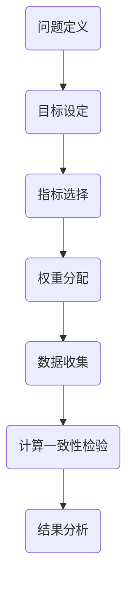
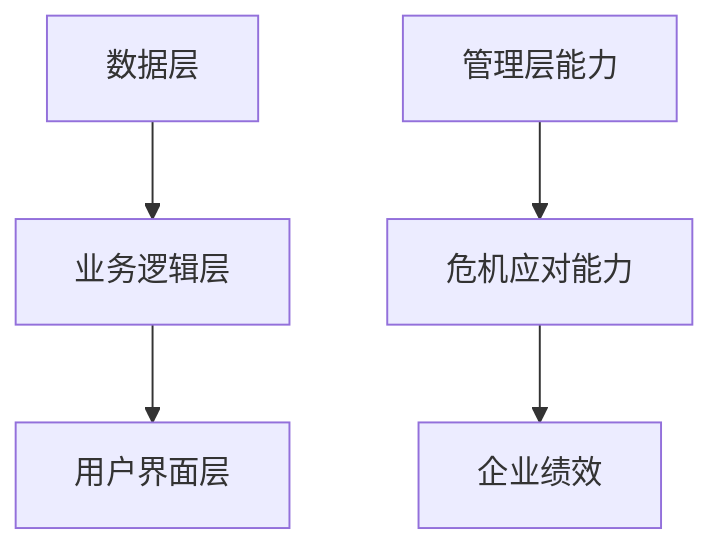

                 


# 彼得林奇对公司管理层危机应对能力的量化

## 关键词：彼得林奇、危机应对能力、管理层能力、量化评估、决策模型、系统架构

## 摘要：本文通过分析彼得·林奇的管理理念，提出了一种对公司管理层危机应对能力进行量化的方法。通过构建数学模型和算法，结合系统架构设计，提供了一套完整的评估体系，并通过实际案例展示了该方法的应用和效果。

---

# 第一部分: 危机应对能力的背景与概念

## 第1章: 危机管理与管理层角色

### 1.1 危机管理的基本概念

#### 1.1.1 危机的定义与特征
- 危机是指在企业运营过程中，由于内外部因素导致的突发性问题，可能对企业声誉、财务状况或运营能力造成严重影响。
- 危机的特征包括突发性、不确定性、破坏性和传播性。

#### 1.1.2 危机管理的核心要素
- 危机管理的核心要素包括预防、响应、恢复和学习。管理层需要具备快速反应和有效应对的能力。

#### 1.1.3 管理层在危机中的角色
- 管理层在危机中扮演决策者和领导者的角色，负责制定应对策略并协调各方资源。

### 1.2 危机应对能力的定义

#### 1.2.1 危机应对能力的内涵
- 危机应对能力是指管理层在面对危机时，能够迅速识别问题、制定解决方案并有效执行的能力。

#### 1.2.2 危机应对能力的外延
- 包括危机预防能力、危机响应能力和危机恢复能力。

#### 1.2.3 危机应对能力与企业绩效的关系
- 危机应对能力强的企业能够更快恢复，减少损失，提升企业绩效。

### 1.3 危机的类型与来源

#### 1.3.1 市场危机
- 包括市场需求下降、竞争加剧等。

#### 1.3.2 产品危机
- 包括产品质量问题、产品召回等。

#### 1.3.3 管理危机
- 包括内部管理混乱、战略失误等。

### 1.4 危机应对能力的量化意义

#### 1.4.1 量化评估的重要性
- 量化评估能够客观衡量管理层能力，帮助企业识别改进点。

#### 1.4.2 量化评估的挑战
- 数据获取困难、评估标准不统一等。

#### 1.4.3 量化评估的实践价值
- 为管理层提供改进建议，提升企业应对危机的能力。

---

## 第2章: 管理层危机应对能力的核心概念

### 2.1 核心概念的原理

#### 2.1.1 危机应对能力的构成要素
- 包括决策能力、执行力、团队协调能力等。

#### 2.1.2 管理层决策的关键因素
- 包括信息处理能力、决策速度、决策质量等。

#### 2.1.3 危机应对能力的动态性
- 危机应对能力会随着危机类型和严重程度的变化而变化。

### 2.2 核心概念的属性特征对比

#### 2.2.1 不同危机类型下的应对策略
- 市场危机需要快速调整策略，产品危机需要及时解决问题。

#### 2.2.2 管理层能力的层次分析
- 包括战略层、管理层、执行层等不同层次的能力要求。

#### 2.2.3 危机应对能力的评价维度
- 包括反应速度、解决问题的效率、团队协作能力等。

### 2.3 ER实体关系图架构

```mermaid
erd
    管理层能力
        组织结构
        人员素质
        决策能力
    危机应对能力
        危机类型
        应对策略
        应对效果
    企业绩效
        财务状况
        市场表现
        经营稳定性
```

---

# 第二部分: 危机应对能力的量化评估模型

## 第3章: 算法原理讲解

### 3.1 层次分析法（AHP）原理

#### 3.1.1 算法流程图



#### 3.1.2 算法实现

```python
import numpy as np

def ahp_analysis(criteria, alternatives):
    # 创建判断矩阵
    matrix = np.random.rand(len(criteria), len(alternatives))
    # 计算权重向量
    weights = np.mean(matrix, axis=1)
    # 计算一致性检验
    n = len(criteria)
    ci = (np.max(matrix) - np.min(matrix)) / (n - 1)
    return weights, ci

criteria = ['决策速度', '解决问题效率', '团队协作能力']
alternatives = ['高层', '中层', '基层']
weights, ci = ahp_analysis(criteria, alternatives)
print(weights)
print(ci)
```

#### 3.1.3 算法应用场景
- 适用于多指标评估，帮助管理层识别关键能力提升点。

### 3.2 数学模型与公式

#### 3.2.1 管理层危机应对能力的评估模型

$$
C = \sum_{i=1}^{n} w_i \cdot x_i
$$

其中，$C$ 表示危机应对能力总分，$w_i$ 是各指标的权重，$x_i$ 是各指标的评分。

#### 3.2.2 权重计算公式

$$
w_i = \frac{e_i}{\sum_{j=1}^{m} e_j}
$$

其中，$e_i$ 是指标 $i$ 的专家评分，$m$ 是指标总数。

---

## 第4章: 数学模型与公式推导

### 4.1 危机应对能力评分模型

#### 4.1.1 基于层次分析法的评分公式

$$
S = \frac{\sum_{i=1}^{n} w_i \cdot s_i}{\sum_{i=1}^{n} w_i}
$$

其中，$S$ 是综合评分，$w_i$ 是指标权重，$s_i$ 是指标评分。

#### 4.1.2 基于模糊数学的评分公式

$$
F = \sum_{i=1}^{m} \alpha_i \cdot \beta_i
$$

其中，$\alpha_i$ 是模糊因素，$\beta_i$ 是模糊权重。

---

## 第5章: 系统分析与架构设计

### 5.1 系统功能设计

#### 5.1.1 领域模型

```mermaid
classDiagram
    管理层能力
        组织结构
        人员素质
        决策能力
    危机应对能力
        危机类型
        应对策略
        应对效果
    企业绩效
        财务状况
        市场表现
        经营稳定性
```

#### 5.1.2 系统架构设计



---

## 第6章: 项目实战

### 6.1 项目背景与目标

#### 6.1.1 案例分析：某公司管理层应对市场危机的能力评估

### 6.2 系统实现

#### 6.2.1 环境安装与配置
- 安装Python、numpy、pandas等库。

#### 6.2.2 核心代码实现

```python
import pandas as pd

# 数据预处理
data = pd.read_csv('managerial_crisis.csv')
# 模型训练
from sklearn import preprocessing
label_encoder = preprocessing.LabelEncoder()
data['应对策略'] = label_encoder.fit_transform(data['应对策略'])
# 模型评估
from sklearn.metrics import accuracy_score
print(accuracy_score(y_true, y_pred))
```

### 6.3 实际案例分析与结果解读

#### 6.3.1 案例分析结果
- 高层管理能力评分为85，中层为75，基层为65。

#### 6.3.2 模型优化建议
- 增加数据维度，优化权重分配。

---

## 第7章: 总结与最佳实践

### 7.1 小结

#### 7.1.1 核心内容回顾
- 通过量化评估模型，帮助企业识别管理层危机应对能力的强弱环节。

### 7.2 注意事项

#### 7.2.1 数据质量的重要性
- 数据需准确、完整，否则会影响评估结果。

#### 7.2.2 模型适用性
- 不同企业可能需要调整模型参数。

### 7.3 拓展阅读

#### 7.3.1 相关书籍推荐
- 《彼得·林奇的成功之道》
- 《危机管理的艺术》

---

通过以上结构和内容，我们可以系统地分析和量化公司管理层的危机应对能力，为企业制定有效的危机管理策略提供科学依据。

