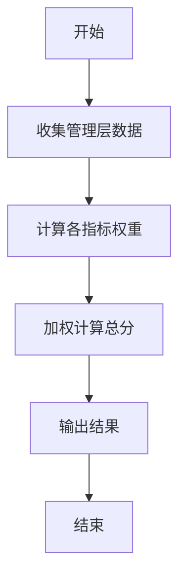
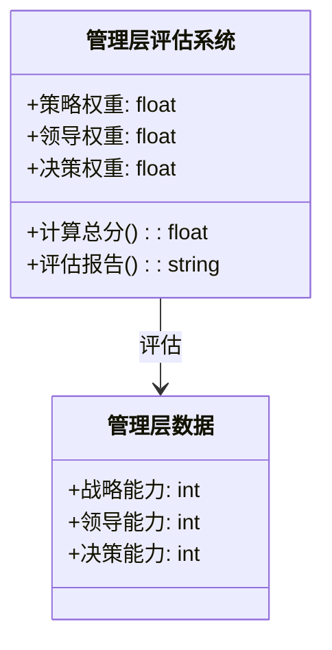
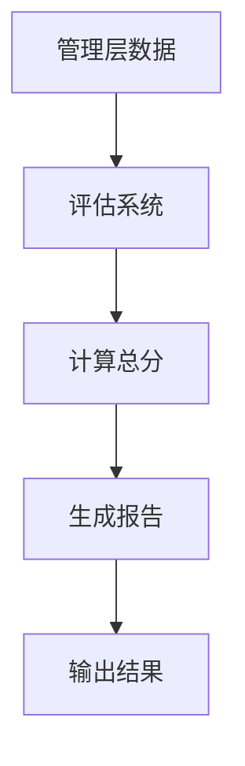

                 


# 彼得林奇对公司管理层执行力的评估

## 关键词：
- 彼得林奇
- 管理层执行力
- 评估方法
- 投资理念
- 管理决策

## 摘要：
本文详细探讨了彼得林奇如何评估公司管理层的执行力，分析了其核心概念、评估方法和实际应用。通过背景介绍、核心概念、算法原理、系统分析、项目实战以及最佳实践等部分，系统地阐述了如何有效评估管理层的执行力，为投资决策提供有力支持。

---

## 第一部分: 背景介绍

### 第1章: 问题背景

#### 1.1 什么是管理层执行力
管理层执行力是指公司高层在实现公司战略目标、应对市场变化和解决问题时的能力。它包括战略制定、团队领导、决策执行等多个方面。

#### 1.2 管理层执行力的重要性
有效的管理层执行力是企业成功的关键。它直接影响企业的盈利能力、市场竞争力和长期发展。彼得林奇认为，评估管理层执行力是投资决策中的重中之重。

#### 1.3 彼得林奇与管理层执行力的关系
彼得林奇以其独特的投资理念闻名，他特别关注管理层的执行力，认为这是决定公司能否实现其战略目标的关键因素。

### 第2章: 问题描述

#### 2.1 管理层执行力的核心要素
- **战略制定能力**：管理层是否能够制定清晰的战略目标并有效执行。
- **团队领导力**：管理者是否能够激励团队、合理分配资源。
- **决策能力**：在面对复杂问题时，管理层是否能够做出明智的决策。

#### 2.2 彼得林奇的管理风格与执行力评估
彼得林奇注重通过分析公司财报、管理层的过往表现和行业口碑来评估其执行力。他认为，管理层的决策逻辑和执行能力是决定公司能否长期发展的关键。

#### 2.3 执行力评估的边界与外延
- **边界**：仅关注管理层在公司内部的决策和执行能力，不涉及外部市场因素。
- **外延**：包括管理层的决策风格、团队协作能力以及应对危机的能力。

### 第3章: 问题解决

#### 3.1 管理层执行力评估的必要性
- 通过评估管理层执行力，投资者可以更好地判断公司的未来表现。
- 执行力强的管理层能够有效应对市场变化，提升公司业绩。

#### 3.2 彼得林奇的评估方法
彼得林奇主要通过以下方法评估管理层执行力：
1. **分析公司财报**：通过财务数据了解管理层的决策效果。
2. **研究管理层的过往表现**：查看管理层在类似情况下的应对策略。
3. **与行业专家交流**：获取行业内的口碑和评价。

#### 3.3 执行力评估的实际应用
通过评估管理层的执行力，投资者可以在投资决策中做出更明智的选择。例如，彼得林奇曾通过分析某公司的管理层决策，成功预测其股价走势。

---

## 第二部分: 核心概念与联系

### 第4章: 核心概念原理

#### 4.1 管理层执行力的定义与特征
- **定义**：管理层在实现公司目标过程中的决策和执行能力。
- **特征**：战略性、决策性、团队协作性。

#### 4.2 彼得林奇的管理理念
- **长期投资**：彼得林奇强调长期投资，关注管理层的长期表现。
- **价值投资**：通过评估管理层的执行力，寻找具有长期增长潜力的公司。

#### 4.3 执行力评估的逻辑框架
- **战略规划**：管理层是否制定了明确的战略目标。
- **资源分配**：管理层是否合理分配公司资源。
- **决策效率**：管理层在决策过程中的效率和准确性。

### 第5章: 概念属性特征对比表格

#### 表5-1: 管理层执行力与团队执行力的对比

| **属性**         | **管理层执行力**              | **团队执行力**                |
|------------------|-----------------------------|-----------------------------|
| **主体**         | 高层管理者                   | 全体团队成员                 |
| **目标**         | 实现公司战略目标             | 完成具体工作任务             |
| **影响力**       | 高，影响公司整体发展         | 中，影响具体项目或任务       |
| **评估标准**     | 战略目标达成情况             | 任务完成质量                 |

### 第6章: ER实体关系图

#### 图6-1: 管理层-执行力-评估指标的实体关系图

```mermaid
erDiagram
    管理层: id, 姓名, 职位
    执行力: 执行力ID, 执行力评分
    评估指标: 指标ID, 指标名称, 指标权重
    管理层 --> 执行力: 评估
    执行力 --> 评估指标: 基于指标
```

---

## 第三部分: 算法原理讲解

### 第7章: 算法原理

#### 图7-1: 执行力评估算法流程图



### 第8章: Python源代码实现

```python
def calculate_executive_score(executive_data):
    # 定义各指标权重
    strategy_weight = 0.4
    leadership_weight = 0.3
    decision_weight = 0.3
    
    # 计算各指标得分
    strategy_score = executive_data['strategy']
    leadership_score = executive_data['leadership']
    decision_score = executive_data['decision']
    
    # 加权计算总分
    total_score = (strategy_score * strategy_weight) + \
                   (leadership_score * leadership_weight) + \
                   (decision_score * decision_weight)
    
    return total_score

# 示例数据
executive_data = {
    'strategy': 85,
    'leadership': 90,
    'decision': 80
}

# 调用函数计算总分
score = calculate_executive_score(executive_data)
print(f"管理层执行力总分为: {score}")
```

### 第9章: 数学模型和公式

#### 公式9-1: 执行力评估公式

$$ \text{总分} = 0.4 \times \text{战略能力} + 0.3 \times \text{领导能力} + 0.3 \times \text{决策能力} $$

---

## 第四部分: 系统分析与架构设计方案

### 第10章: 问题场景介绍

#### 10.1 管理层执行力评估的场景
在投资决策中，评估管理层的执行力是关键步骤。通过分析公司财报、管理层的决策历史和行业口碑，投资者可以判断管理层是否具备 strong 执行能力。

#### 10.2 项目介绍
本项目旨在设计一个基于彼得林奇评估方法的管理层执行力评估系统，帮助投资者快速评估公司管理层的能力。

### 第11章: 系统功能设计

#### 11.1 领域模型mermaid类图



### 第12章: 系统架构设计

#### 12.1 系统架构mermaid架构图



---

## 第五部分: 项目实战

### 第13章: 环境安装

#### 13.1 安装Python
需要安装Python 3.8及以上版本，以及必要的库如`pandas`和`numpy`。

### 第14章: 系统核心实现源代码

```python
import pandas as pd

def main():
    # 示例数据
    data = {
        '公司名称': ['公司A', '公司B', '公司C'],
        '战略能力': [85, 70, 90],
        '领导能力': [90, 85, 80],
        '决策能力': [80, 75, 85]
    }
    df = pd.DataFrame(data)
    
    # 计算总分
    df['总分'] = df.apply(lambda x: 
        0.4 * x['战略能力'] + 0.3 * x['领导能力'] + 0.3 * x['决策能力'], 
        axis=1)
    
    # 输出结果
    print(df)

if __name__ == "__main__":
    main()
```

### 第15章: 实际案例分析

#### 15.1 案例介绍
以彼得林奇投资的某公司为例，分析其管理层的执行力。

#### 15.2 数据分析
通过计算总分，得出管理层的执行力评分，并结合行业标准进行分析。

---

## 第六部分: 最佳实践 tips、小结、注意事项、拓展阅读

### 第16章: tips

- **数据来源**：确保数据的准确性和可靠性。
- **权重调整**：根据行业特点调整各指标的权重。
- **动态评估**：定期评估管理层的执行力，及时调整投资策略。

### 第17章: 小结

通过本文的分析，我们可以看出，彼得林奇的管理层执行力评估方法具有重要的现实意义。投资者可以通过科学的方法和工具，有效评估管理层的能力，从而做出更明智的投资决策。

### 第18章: 注意事项

- **数据偏差**：注意数据来源的偏差，避免影响评估结果。
- **模型局限性**：评估模型只是一个参考，需结合实际情况灵活运用。

### 第19章: 拓展阅读

- 《彼得林奇的投资哲学》
- 《执行力：领导者的任务管理指南》

---

通过以上步骤，我们可以系统地评估公司管理层的执行力，为投资决策提供有力支持。希望本文能为投资者和管理层提供有价值的参考。

