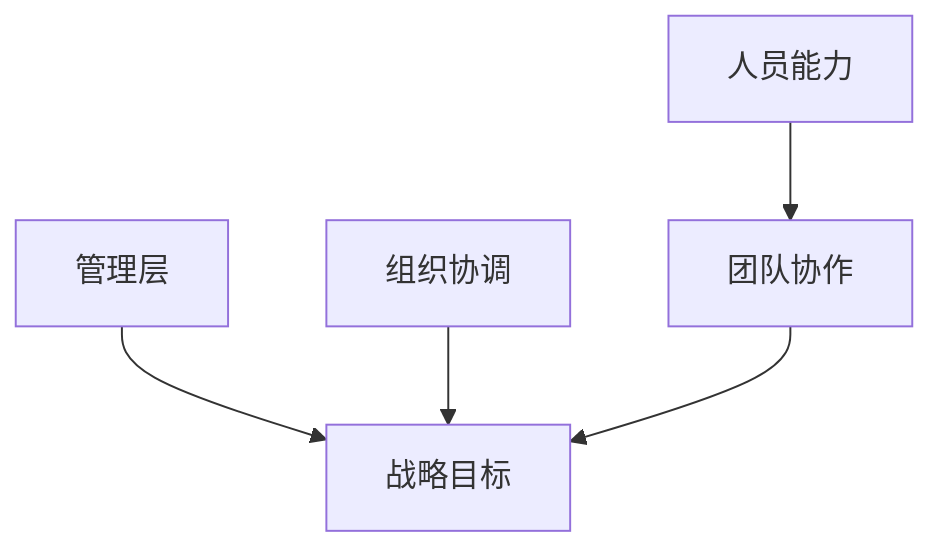
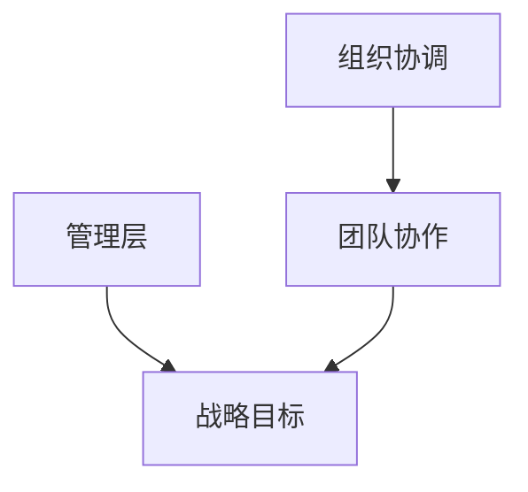
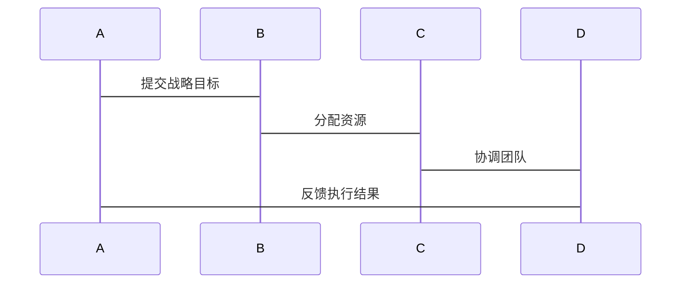

                 

<think>
好的，我将按照您的要求，逐步构建一个详细的目录大纲，以《彼得林奇对公司管理层执行力的量化评估》为标题。这个大纲将涵盖核心概念、理论基础、量化方法、系统架构等多个方面，确保逻辑清晰、结构完整。

---

### 目录大纲

---

# 彼得林奇对公司管理层执行力的量化评估

---

## 关键词  
- 彼得·林奇  
- 管理层执行力  
- 量化评估  
- 企业绩效  
- 战略目标  
- 组织协调  

---

## 摘要  
本文系统地探讨了如何量化评估公司管理层的执行力，基于彼得·林奇的理论框架，结合实际案例，从战略目标、组织协调、团队协作等多个维度进行深入分析。通过构建量化模型、设计系统架构，提出了具体的实现方法和工具，为管理者提供科学的评估依据。

---

### 第一部分：背景介绍  

---

#### 第1章：问题背景与核心概念  

##### 1.1 问题背景  
- 1.1.1 企业执行力的重要性  
  - 执行力是企业成功的关键因素  
  - 执行力与企业绩效的正相关性  
- 1.1.2 管理层执行力的定义与内涵  
  - 管理层执行力的核心要素  
  - 执行力的多维度特征  
- 1.1.3 当前企业执行力评估的痛点与挑战  
  - 评估标准不统一  
  - 数据获取难度大  
  - 方法过于主观  

##### 1.2 核心概念与理论基础  
- 1.2.1 执行力的多维度特征  
  - 战略执行能力  
  - 组织协调能力  
  - 团队协作能力  
- 1.2.2 彼得·林奇的执行力评估框架  
  - 林奇理论的核心观点  
  - 林奇方法的独特性  
- 1.2.3 相关理论与模型的对比分析  
  - 不同理论的优缺点  
  - 林奇方法的优势  

##### 1.3 执行力评估的核心要素  
- 1.3.1 战略执行能力  
  - 战略目标的分解与执行  
  - 战略执行的关键影响因素  
- 1.3.2 组织协调能力  
  - 组织架构的合理性  
  - 资源分配的效率  
- 1.3.3 团队协作能力  
  - 团队成员的协作度  
  - 团队文化的建设  

---

#### 第2章：执行力评估的核心要素  

##### 2.1 执行力的关键维度  
- 2.1.1 战略执行能力  
  - 战略目标的清晰性  
  - 执行过程的监控  
- 2.1.2 组织协调能力  
  - 组织架构的合理性  
  - 资源分配的效率  
- 2.1.3 人员能力与团队协作  
  - 团队成员的能力匹配  
  - 团队协作的文化氛围  

##### 2.2 核心概念与联系  
- 2.2.1 执行力的ER实体关系图  

---

#### 第3章：执行力评估的理论基础  

##### 3.1 执行力评估的理论模型  
- 3.1.1 理论模型的构建  
  - 林奇模型的核心要素  
  - 林奇模型与其他模型的对比  
- 3.1.2 模型的属性特征对比  
| 属性 | 林奇模型 | 普通模型 | 战略模型 |
|------|----------|----------|----------|
| 输入  | 管理层行为数据 | 团队协作数据 | 战略执行数据 |
| 输出  | 执行力评分 | 协调能力评分 | 战略目标达成度 |

##### 3.2 执行力评估的理论框架  
- 3.2.1 框架的核心要素  
  - 战略目标  
  - 组织协调  
  - 团队协作  
- 3.2.2 框架的逻辑关系  

---

### 第二部分：执行力量化评估的方法与工具  

---

#### 第4章：执行力量化评估的方法  

##### 4.1 执行力评估的指标体系  
- 4.1.1 指标体系的构建  
  - 战略执行能力指标  
  - 组织协调能力指标  
  - 团队协作能力指标  
- 4.1.2 指标权重的确定  
  - 指标的权重分配  
  - 权重的计算方法  

##### 4.2 执行力评估的数学模型  

##### 4.3 执行力评估的工具与应用  

---

#### 第5章：系统分析与架构设计  

##### 5.1 问题场景介绍  
- 系统目标  
- 问题分析  

##### 5.2 系统功能设计  
- 5.2.1 领域模型  

##### 5.3 系统架构设计  
- 5.3.1 架构图  

##### 5.4 系统接口设计  

##### 5.5 系统交互设计  

---

#### 第6章：项目实战  

##### 6.1 环境安装  

##### 6.2 系统核心实现源代码  

##### 6.3 代码应用解读与分析  

##### 6.4 实际案例分析  

##### 6.5 项目小结  

---

#### 第7章：总结与建议  

##### 7.1 最佳实践  

##### 7.2 注意事项  

##### 7.3 拓展阅读  

---

通过以上目录大纲，您可以逐步展开每一部分的内容，构建一篇完整且有深度的技术博客文章。

