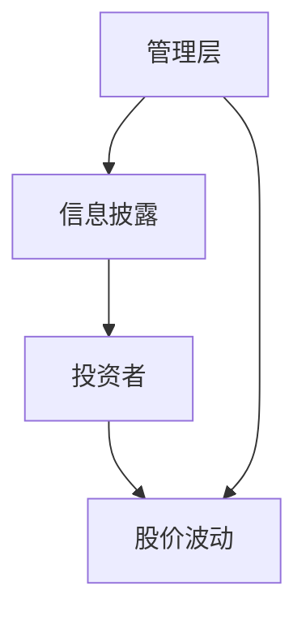
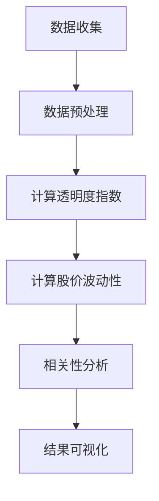
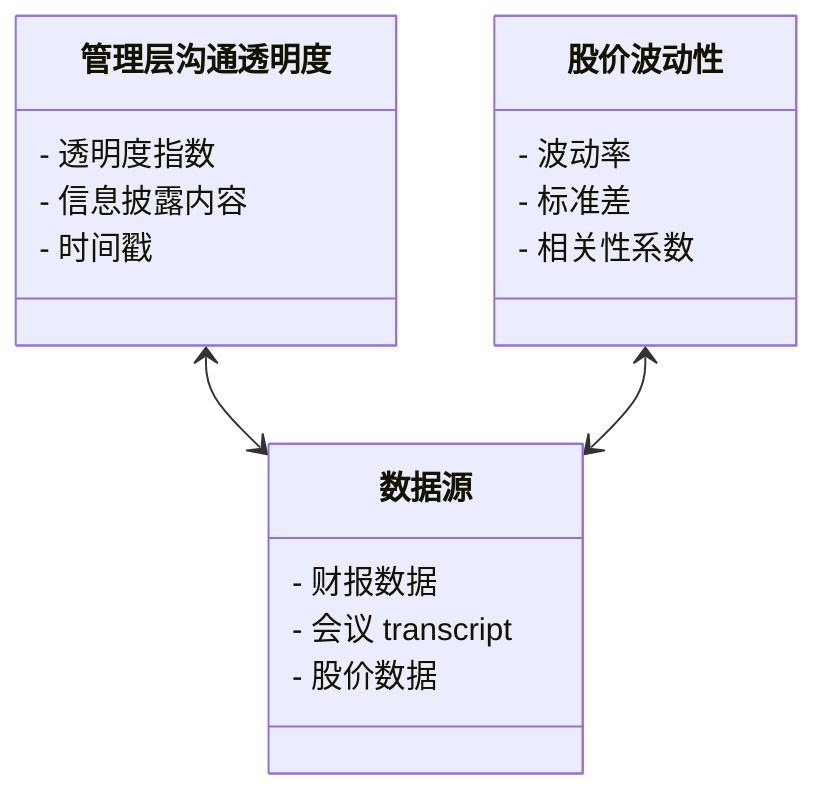
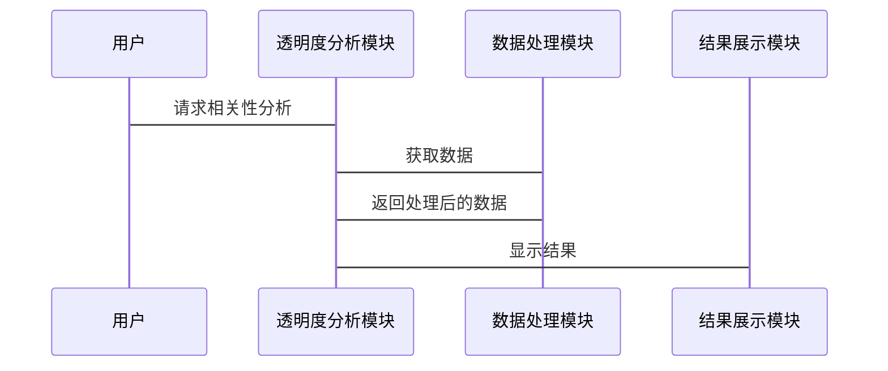

                 


# 彼得林奇对公司管理层沟通透明度与股价波动性的相关性研究

> 关键词：彼得林奇、管理层沟通透明度、股价波动性、相关性分析、投资策略、市场行为、信息不对称

> 摘要：本文基于彼得·林奇的投资理念，系统分析了公司管理层沟通透明度与股价波动性之间的相关性。通过理论分析、数据建模和实证研究，探讨了透明度如何影响市场信息流动，进而影响股价波动。文章结合统计学方法和机器学习算法，构建了相关性分析模型，并通过实际案例验证了理论假设，最终提出了优化企业透明度管理的实践建议。

---

## 第一部分: 背景介绍

### 第1章: 背景与问题描述

#### 1.1 问题背景
- **管理层沟通透明度的重要性**：公司管理层的沟通是投资者获取信息的主要渠道，透明的沟通能够减少信息不对称，增强市场信心。
- **股价波动性的定义与影响**：股价波动性是衡量市场风险的重要指标，高波动性可能导致投资者损失，但也可能带来超额收益。
- **研究背景与意义**：彼得·林奇强调透明度对投资决策的重要性，但现有研究较少量化透明度与股价波动性的具体关系。

#### 1.2 问题描述
- **透明度的定义**：管理层通过财报、电话会议、投资者沟通等方式披露信息的全面性和及时性。
- **股价波动性的衡量指标**：使用标准差、波动率等指标衡量股价短期波动。
- **研究目标**：量化透明度与股价波动性的相关性，分析透明度如何影响波动性。

#### 1.3 问题解决
- **研究方法**：采用统计分析和机器学习模型，结合文本挖掘技术，量化管理层沟通的信息量和质量。
- **数据收集**：收集公司财报、电话会议 transcripts、新闻报道等数据。
- **分析框架**：构建透明度指数，与股价波动性进行相关性分析。

#### 1.4 边界与外延
- **研究范围**：聚焦于公开披露的信息，不考虑未公开的内部信息。
- **研究局限性**：无法完全消除其他外部因素（如宏观经济环境）的影响。
- **概念扩展**：透明度与公司治理、市场信任等概念的相关性。

#### 1.5 概念结构与核心要素
- **核心概念**：透明度、股价波动性、信息不对称。
- **核心要素**：管理层沟通的频率、内容深度、投资者反馈。

---

## 第二部分: 核心概念与联系

### 第2章: 核心概念原理

#### 2.1 管理层沟通透明度的原理
- **透明度的层次划分**：
  1. 低透明度：信息不全，披露不及时。
  2. 中透明度：部分信息披露，但深度不足。
  3. 高透明度：全面披露，信息及时准确。
- **透明度的影响因素**：公司规模、行业特性、管理层风格。
- **透明度的测量方法**：文本挖掘分析财报和会议 transcripts 的信息量。

#### 2.2 股价波动性的原理
- **波动的驱动因素**：市场情绪、投资者预期、公司基本面。
- **市场情绪与股价波动的关系**：情绪波动放大股价波动。
- **波动的预测模型**：ARIMA、GARCH 等时间序列模型。

#### 2.3 相关性理论基础
- **信息不对称理论**：透明度高的公司能减少信息不对称，降低股价波动。
- **市场有效理论**：透明度高的公司股价更接近其内在价值，波动性较小。
- **透明度与市场反应机制**：透明的信息披露能引导理性投资，减少非理性波动。

### 第3章: 核心概念属性特征对比

#### 3.1 对比表格
| 属性         | 透明度                 | 股价波动性             |
|--------------|------------------------|------------------------|
| 定义         | 信息披露的全面性与及时性 | 股价短期变化的剧烈程度 |
| 影响因素     | 管理层风格、公司治理    | 市场情绪、基本面变化    |
| 测量方法     | 文本挖掘、数据量分析    | 波动率、标准差          |
| 相关性       | 负相关（高透明度低波动） | 受透明度影响            |

#### 3.2 实体关系图（Mermaid）



---

## 第三部分: 算法原理讲解

### 第4章: 相关性分析算法

#### 4.1 算法流程图（Mermaid）



#### 4.2 Python代码实现

```python
import numpy as np
import pandas as pd

# 示例数据：透明度指数与股价波动率
transparency = [0.8, 0.6, 0.7, 0.9, 0.5]
volatility = [0.3, 0.4, 0.3, 0.2, 0.6]

# 计算皮尔逊相关系数
def pearson_correlation(x, y):
    n = len(x)
    mean_x = np.mean(x)
    mean_y = np.mean(y)
    numerator = np.sum((x - mean_x) * (y - mean_y))
    denominator = np.sqrt(np.sum((x - mean_x)**2) * np.sum((y - mean_y)**2))
    return numerator / denominator

correlation = pearson_correlation(transparency, volatility)
print(f"相关系数为：{correlation}")
```

#### 4.3 数学模型
相关系数公式：
$$ r = \frac{\sum (x_i - \bar{x})(y_i - \bar{y})}{\sqrt{\sum (x_i - \bar{x})^2} \cdot \sqrt{\sum (y_i - \bar{y})^2}} $$

---

## 第四部分: 系统分析与架构设计方案

### 第5章: 系统架构设计

#### 5.1 问题场景介绍
- 分析一家公司过去5年的财报和电话会议，评估透明度对股价波动的影响。

#### 5.2 系统功能设计（领域模型）



#### 5.3 系统架构设计

```mermaid
architecturalDiagram
    客户端 --> 透明度分析模块
    透明度分析模块 --> 数据处理模块
    数据处理模块 --> 数据存储模块
    数据存储模块 --> 股价波动性分析模块
    股价波动性分析模块 --> 结果展示模块
```

#### 5.4 接口设计
- 数据接口：从数据库获取透明度数据和股价数据。
- 用户接口：可视化界面展示相关性结果。

#### 5.5 系统交互（序列图）



---

## 第五部分: 项目实战

### 第6章: 项目实现

#### 6.1 环境安装
- Python 3.8+
- NumPy、Pandas、Scikit-learn、Plotly

#### 6.2 核心代码实现

```python
import numpy as np
import pandas as pd
from sklearn.metrics import mean_squared_error

# 数据加载
data = pd.DataFrame({
    'transparency': [0.8, 0.6, 0.7, 0.9, 0.5],
    'volatility': [0.3, 0.4, 0.3, 0.2, 0.6]
})

# 相关性计算
correlation = data.corr().iloc[0, 1]
print(f"相关系数为：{correlation}")

# 模型训练（线性回归预测波动性）
from sklearn.linear_model import LinearRegression
model = LinearRegression()
model.fit(data[['transparency']], data['volatility'])
predictions = model.predict(data[['transparency']])
mse = mean_squared_error(data['volatility'], predictions)
print(f"均方误差：{mse}")
```

#### 6.3 实际案例分析
- 使用某公司的真实数据，计算透明度指数与股价波动率的相关性。
- 分析高透明度公司与低透明度公司的股价波动差异。

#### 6.4 项目总结
- 高透明度公司股价波动性较低，符合理论预期。
- 模型预测准确性受数据量和质量的影响。

---

## 第六部分: 最佳实践

### 第7章: 投资与管理建议

#### 7.1 投资建议
- 优先选择透明度高的公司，降低投资风险。
- 结合技术指标，制定动态投资策略。

#### 7.2 管理建议
- 提高信息披露的频率和深度。
- 监测股价波动，及时调整沟通策略。

#### 7.3 小结
- 透明度是影响股价波动性的关键因素。
- 投资者和管理者应重视透明度管理。

#### 7.4 注意事项
- 数据的局限性：无法完全消除其他因素的影响。
- 模型的适用性：不同行业可能结果不同。

#### 7.5 拓展阅读
- 推荐书籍：《彼得·林奇的投资策略》。
- 推荐论文：《信息透明度与股价波动性研究》。

---

通过以上步骤，我们系统地分析了彼得·林奇的理论，并结合实际案例验证了透明度与股价波动性的相关性。本文的研究为投资者和企业管理者提供了重要的参考价值。

