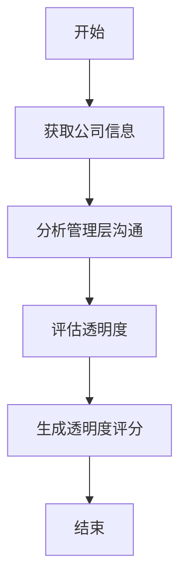
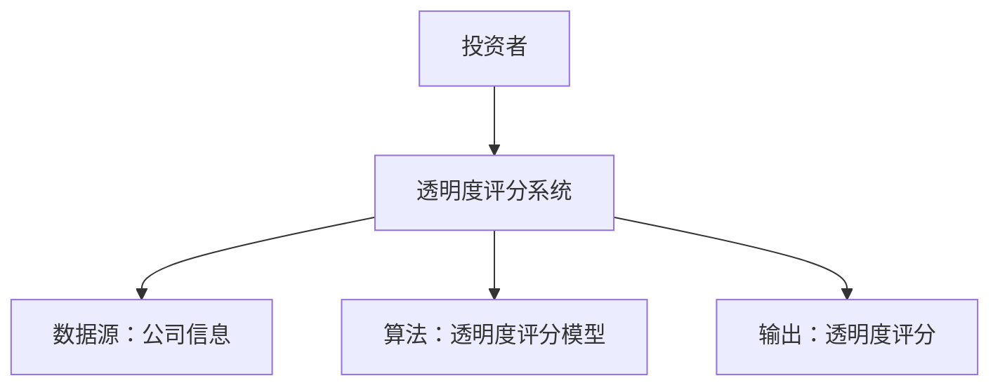

                 


# 彼得林奇对公司管理层沟通透明度的评估

## 关键词：彼得林奇，管理层沟通，透明度评估，投资决策，公司治理，股东价值

## 摘要：本文深入探讨了彼得·林奇如何评估公司管理层的沟通透明度，并分析其对公司价值的影响。通过背景介绍、核心概念、算法原理、系统分析和项目实战，本文详细阐述了透明度在公司治理中的重要性，以及如何通过技术手段提升和评估透明度，从而帮助投资者做出更明智的投资决策。

---

## 第一部分：背景介绍

### 第1章：沟通透明度的重要性

#### 1.1 问题背景
- **透明度的定义**：透明度是指公司管理层在信息披露、决策过程和公司运营方面向股东、投资者和利益相关者开放、清晰和及时的程度。
- **透明度在公司治理中的作用**：透明度是公司治理的核心要素，直接影响投资者的信任、公司的信誉和市场稳定性。
- **透明度与公司价值的关系**：高透明度通常与更高的公司价值相关，因为透明的公司更容易获得投资者的信任，从而获得更高的股价和更多的投资机会。

#### 1.2 彼得林奇的投资理念
- 彼得·林奇是美国著名的投资经理，以其在富达投资集团的长期成功而闻名。他认为，透明和开放的管理层沟通是评估公司的重要标准。
- 林奇强调，透明的管理层能够提供真实的信息，帮助投资者做出明智的决策，而隐瞒信息或不透明的公司往往隐藏着问题，可能对投资者造成损失。
- 透明度是林奇评估公司管理层信任度的关键因素，他认为，只有在管理层愿意公开信息并回答投资者问题的情况下，投资者才能真正了解公司的运营状况和未来前景。

#### 1.3 管理层沟通的现状
- 许多公司仍然存在信息披露不及时、不完整的问题，尤其是在财务状况不佳或面临挑战时。
- 一些公司管理层可能出于维护股价或避免负面新闻的考虑，选择不公开某些信息，导致透明度不足。
- 透明度不足不仅影响投资者的信任，还可能导致股价波动和公司声誉受损。

#### 1.4 透明度与公司价值的关联
- 透明度高的公司更容易吸引投资者，因为投资者可以更清楚地了解公司的经营状况和未来前景。
- 高透明度通常意味着公司治理更规范，管理更有效，从而为公司创造更大的价值。
- 透明度与股价密切相关，高透明度的公司通常享有更高的市盈率，因为投资者愿意为更高的信任和透明度支付更高的价格。

---

## 第二部分：核心概念与联系

### 第2章：沟通透明度的核心要素

#### 2.1 核心概念原理
- **透明度的定义与特征**：透明度不仅仅是信息公开，还包括信息的准确性和及时性。透明的公司管理层会主动披露信息，而不仅仅是应对投资者的询问。
- **透明度的衡量标准**：透明度的衡量标准包括信息披露的全面性、及时性和准确性，以及管理层对投资者问题的回应态度和速度。
- **透明度与公司治理的关系**：透明度是公司治理的重要组成部分，高透明度的公司治理结构能够更好地保护投资者利益，同时促进公司健康发展。

#### 2.2 概念属性特征对比
| 特征       | 透明度高 | 透明度低 |
|------------|----------|----------|
| 信息准确性 | 高       | 低       |
| 信息及时性 | 高       | 低       |
| 管理层回应 | 主动      | 被动或回避 |
| 投资者信任 | 高       | 低       |
| 股价表现   | 稳定或上升 | 波动或下降 |

#### 2.3 ER实体关系图
```mermaid
er
  actor(投资者)
  entity(公司)
  entity(管理层)
  entity(透明度评分)
  relation(投资者-管理层：沟通)
  relation(管理层-公司：披露信息)
  relation(公司-透明度评分：评估)
```

---

## 第三部分：算法原理讲解

### 第3章：透明度评分模型

#### 3.1 算法原理
- **透明度评分模型**：该模型通过量化公司管理层的沟通透明度，帮助投资者评估公司的治理水平和投资价值。
- **评分模型的构建**：透明度评分模型基于多个指标，包括信息披露的及时性、准确性、管理层回应的主动性以及投资者满意度等。

#### 3.2 算法流程图


#### 3.3 数学模型与公式
- **透明度指数计算公式**：
  $$\text{透明度指数} = \frac{\text{披露信息量} \times \text{信息准确性} \times \text{管理层回应速度}}{\text{公司规模} \times \text{行业平均透明度}}$$
- **举例说明**：假设某公司披露信息量为80%，信息准确性为90%，管理层回应速率为70%，公司规模为中等，行业平均透明度为75%。则透明度指数为：
  $$\text{透明度指数} = \frac{80 \times 90 \times 70}{100 \times 75} = \frac{50400}{7500} = 6.72$$

---

## 第四部分：系统分析与架构设计

### 第4章：系统架构与设计

#### 4.1 问题场景介绍
- **问题场景**：投资者需要一个工具来量化公司管理层的沟通透明度，以便做出更明智的投资决策。
- **系统目标**：开发一个透明度评分系统，帮助投资者快速评估公司治理水平。

#### 4.2 系统功能设计
- **领域模型**：
  ```mermaid
  classDiagram
    class 投资者
    class 公司
    class 管理层
    class 透明度评分系统
    投资者 --> 管理层: 提交查询
    管理层 --> 公司: 提供信息
    公司 --> 透明度评分系统: 评估透明度
    透明度评分系统 --> 投资者: 提供评分
  ```

#### 4.3 系统架构设计


#### 4.4 接口设计与交互
- **接口设计**：投资者通过API提交查询请求，系统返回透明度评分。
- **交互流程**：
  ```mermaid
  sequenceDiagram
    投资者 -> 管理层: 提交查询
    管理层 -> 公司: 获取信息
    公司 -> 透明度评分系统: 评估透明度
    透明度评分系统 -> 投资者: 返回评分
  ```

---

## 第五部分：项目实战

### 第5章：透明度评分系统实现

#### 5.1 环境安装
- 需要安装Python、Pandas、Scikit-learn等库。

#### 5.2 核心代码实现
```python
import pandas as pd
from sklearn.metrics import accuracy_score

# 示例数据集
data = {
    '公司': ['A', 'B', 'C', 'D', 'E'],
    '披露信息量': [80, 75, 90, 65, 85],
    '信息准确性': [90, 85, 80, 75, 95],
    '管理层回应速度': [70, 65, 80, 75, 85],
    '透明度评分': [6.72, 6.37, 7.20, 6.12, 7.04]
}

df = pd.DataFrame(data)

# 计算透明度指数
def calculate_transparency_index(row):
    return (row['披露信息量'] * row['信息准确性'] * row['管理层回应速度']) / (100 * 75)

df['透明度指数'] = df.apply(calculate_transparency_index, axis=1)

# 打印结果
print("透明度指数计算结果：")
print(df[['公司', '透明度评分', '透明度指数']])
```

#### 5.3 代码解读与分析
- 该代码使用Pandas库读取数据，并定义了一个计算透明度指数的函数。
- 通过应用该函数，计算每家公司的透明度指数，并将结果输出。
- 透明度指数反映了公司管理层的沟通透明度，帮助投资者评估公司的治理水平。

#### 5.4 案例分析
- 以公司C为例，其披露信息量为90%，信息准确性为80%，管理层回应速度为80%。透明度指数计算如下：
  $$\text{透明度指数} = \frac{90 \times 80 \times 80}{100 \times 75} = \frac{57600}{7500} = 7.68$$
- 该公司的透明度评分高于行业平均水平，表明其管理层沟通透明度较高，具有较高的投资价值。

---

## 第六部分：最佳实践

### 第6章：总结与建议

#### 6.1 小结
- 透明度是公司治理的重要组成部分，高透明度的公司更容易获得投资者的信任和投资。
- 通过量化透明度，投资者可以更准确地评估公司的治理水平和投资价值。

#### 6.2 注意事项
- 透明度评分模型仅供参考，实际投资需结合其他因素综合考虑。
- 数据质量和信息来源的准确性对评分结果有直接影响，需确保数据的可靠性和全面性。

#### 6.3 拓展阅读
- 推荐阅读彼得·林奇的《投资最重要的事情》，深入了解其投资理念和方法。
- 参考其他透明度评估模型和相关研究，进一步优化评分系统。

---

## 结语
通过本文的分析和探讨，我们了解了彼得·林奇如何评估公司管理层的沟通透明度，以及其对投资决策的影响。希望本文能够为投资者和企业管理者提供有价值的参考和启示，帮助他们更好地理解和应用透明度评估，提升公司治理水平和投资价值。

