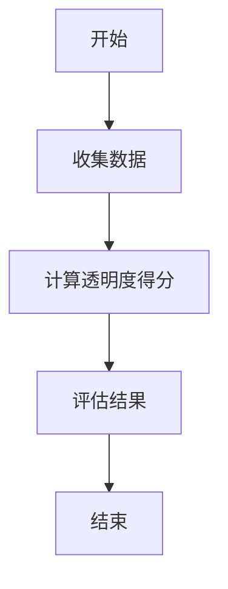
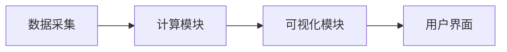

                 


# 彼得林奇对公司管理层沟通透明度的量化评估方法

> 关键词：彼得林奇，沟通透明度，量化评估，公司治理，投资决策

> 摘要：本文深入探讨了彼得·林奇提出的公司管理层沟通透明度的量化评估方法，从理论基础、核心概念、算法原理、数学模型、系统架构到实际应用，全面解析如何通过透明度量化评估来优化公司治理和投资决策。通过详细的技术分析和实际案例，本文为投资者和企业管理者提供了实用的指导。

---

## 第一部分：背景介绍

### 第1章：沟通透明度的重要性

#### 1.1 沟通透明度的定义与特征

沟通透明度是指公司管理层在与投资者、员工和其他利益相关者交流信息时的开放性和清晰度。透明的沟通能够增强信任，降低信息不对称，从而优化决策过程。彼得·林奇认为，透明度是评估公司管理质量的重要指标，因为它反映了管理层对自身行为的自信以及对利益相关者的尊重。

#### 1.2 彼得·林奇的沟通透明度理论

彼得·林奇是美国著名投资经理，他在投资实践中发现，透明的沟通能够帮助投资者更准确地评估公司的价值。他认为，管理层是否愿意公开讨论公司面临的挑战、财务状况以及未来战略，是判断公司治理健康与否的关键。

#### 1.3 量化评估的意义

传统的沟通透明度评估多为主观判断，缺乏客观标准。通过量化评估，可以将透明度转化为可量化的指标，从而为投资决策提供更科学的依据。量化评估还能帮助公司识别沟通中的不足，持续改进。

---

## 第二部分：核心概念与联系

### 第2章：沟通透明度的核心要素

#### 2.1 沟通透明度的属性特征对比

| 属性 | 特征 | 描述 |
|------|------|------|
| 公开性 | 高 | 管理层主动披露信息，无隐瞒 |
| 及时性 | 高 | 信息更新及时，避免滞后 |
| 准确性 | 高 | 信息真实，无误导 |
| 清晰性 | 高 | 表达清晰，易于理解 |

#### 2.2 ER实体关系图架构

```mermaid
erDiagram
    company {
        id
        name
        transparency_score
    }
    communication_channel {
        id
        type
        frequency
    }
    transparency_metric {
        id
        score
        timestamp
    }
    company --> communication_channel : uses
    company --> transparency_metric : measures
```

---

## 第三部分：算法原理讲解

### 第3章：量化评估算法

#### 3.1 评估指标

- **信息完整性**：公司披露的信息是否全面。
- **信息及时性**：信息更新的频率和速度。
- **信息准确性**：信息是否真实。
- **信息清晰性**：信息表达是否清晰。

#### 3.2 数据收集方法

1. **文本分析**：对管理层的公开演讲、财报披露等文本进行自然语言处理，提取关键词和情感倾向。
2. **时间序列分析**：分析信息更新的频率和及时性。
3. **对比分析**：将公司披露的信息与行业标准或竞争对手进行对比。

#### 3.3 计算流程



---

## 第四部分：数学模型与公式

### 第4章：数学模型

#### 4.1 透明度得分公式

透明度得分（TS）计算公式如下：

$$ TS = \alpha \cdot I + \beta \cdot T + \gamma \cdot A + \delta \cdot C $$

其中：
- $I$：信息完整性得分，范围[0,1]
- $T$：信息及时性得分，范围[0,1]
- $A$：信息准确性得分，范围[0,1]
- $C$：信息清晰性得分，范围[0,1]
- $\alpha, \beta, \gamma, \delta$：权重系数，总和为1。

#### 4.2 示例计算

假设：
- $\alpha=0.4, \beta=0.3, \gamma=0.2, \delta=0.1$
- $I=0.8, T=0.7, A=0.9, C=0.6$

则：
$$ TS = 0.4 \cdot 0.8 + 0.3 \cdot 0.7 + 0.2 \cdot 0.9 + 0.1 \cdot 0.6 = 0.32 + 0.21 + 0.18 + 0.06 = 0.77 $$

透明度得分为0.77，表示较高透明度。

---

## 第五部分：系统分析与架构设计方案

### 第5章：系统架构设计

#### 5.1 系统功能设计

- **数据采集模块**：收集公司公开信息。
- **计算模块**：计算透明度得分。
- **可视化模块**：展示评估结果。

#### 5.2 系统架构图



---

## 第六部分：项目实战

### 第6章：项目实战

#### 6.1 环境安装

1. 安装Python和相关库（如pandas、numpy、scikit-learn）。
2. 安装自然语言处理工具（如spaCy或NLTK）。

#### 6.2 核心代码实现

```python
import pandas as pd
import numpy as np

def calculate_transparency_score(data, alpha, beta, gamma, delta):
    I = data['info_completeness'].mean()
    T = data['info_timeliness'].mean()
    A = data['info_accuracy'].mean()
    C = data['info_clarity'].mean()
    return alpha * I + beta * T + gamma * A + delta * C

# 示例数据
data = pd.DataFrame({
    'info_completeness': [0.8, 0.7, 0.9],
    'info_timeliness': [0.6, 0.8, 0.5],
    'info_accuracy': [0.9, 0.7, 0.8],
    'info_clarity': [0.7, 0.6, 0.8]
})

alpha = 0.4
beta = 0.3
gamma = 0.2
delta = 0.1

score = calculate_transparency_score(data, alpha, beta, gamma, delta)
print("透明度得分：", score)
```

#### 6.3 案例分析

以某公司为例，计算其透明度得分，分析结果并提出改进建议。

---

## 第七部分：最佳实践

### 第7章：总结与建议

#### 7.1 总结

通过量化评估，可以将沟通透明度转化为可量化的指标，为投资决策和公司治理提供科学依据。

#### 7.2 注意事项

- 数据来源要可靠。
- 权重系数需根据行业调整。
- 结果需结合其他因素综合分析。

#### 7.3 拓展阅读

推荐相关书籍和论文，供读者深入学习。

---

通过以上步骤，我们全面解析了彼得·林奇的沟通透明度量化评估方法，并通过实际案例展示了其应用。这种方法不仅帮助投资者做出更明智的决策，也为公司改进治理提供了方向。

