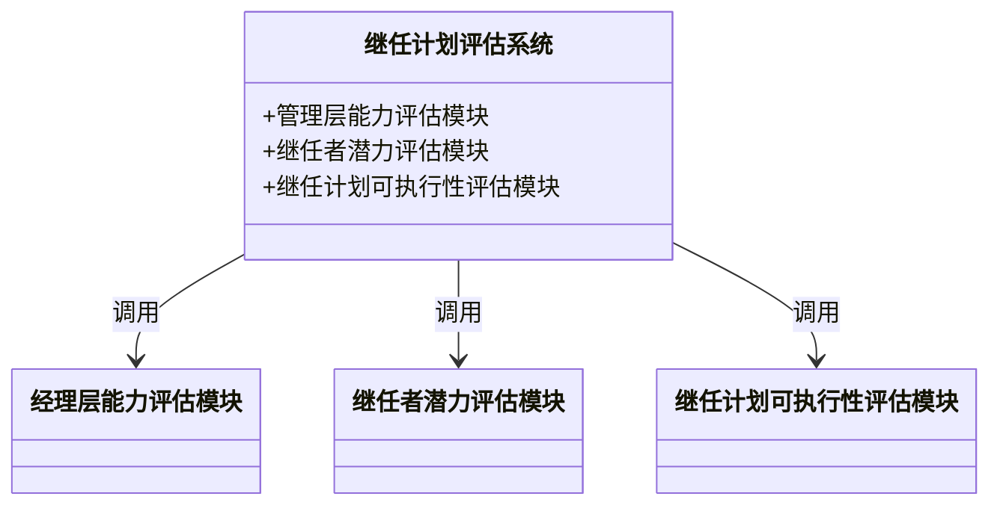
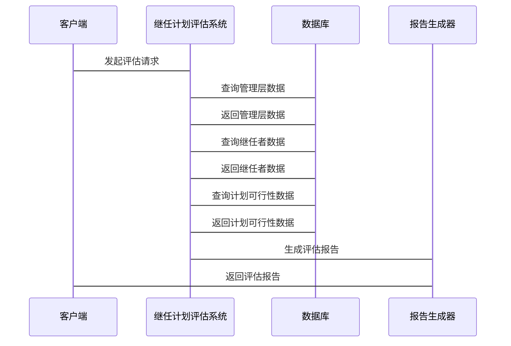

                 


# 彼得林奇对公司管理层继任计划的质量评估

## 关键词：
彼得·林奇，管理层继任计划，质量评估，领导力，公司治理，团队管理

## 摘要：
本文深入分析了彼得·林奇在评估公司管理层继任计划质量时的方法和标准。从领导力理论、公司治理框架到实际的评估指标，详细探讨了如何构建和优化管理层继任计划。通过系统分析和实战案例，本文为公司制定有效的管理层继任策略提供了实用的指导和建议。

---

## 第1章：管理层继任计划的重要性

### 1.1 继任计划的定义与作用
管理层继任计划是确保公司领导层平稳过渡的重要机制。通过科学的规划和评估，公司可以在关键职位出现空缺时，迅速找到合适的接替者，避免管理真空带来的风险。

#### 1.1.1 继任计划的定义
管理层继任计划是指公司为关键岗位制定的长期或短期接班人计划，旨在确保公司战略的连续性和稳定性。

#### 1.1.2 继任计划在公司治理中的作用
- 确保公司领导层的稳定性和连续性。
- 降低管理层突然离职带来的风险。
- 提高公司对未来领导层的适应能力。

#### 1.1.3 继任计划的必要性与挑战
- **必要性**：关键岗位的空缺可能引发公司运营中断，影响股价和客户信任。
- **挑战**：内部人才储备不足、外部人才引进困难、评估标准不统一等。

---

## 第2章：彼得·林奇的管理层继任计划评估方法

### 2.1 彼得·林奇的管理风格与投资理念
彼得·林奇以其独特的企业分析方法闻名，他注重企业的基本面和管理层能力。他认为，管理层的质量直接关系到企业的长期发展。

#### 2.1.1 彼得·林奇的投资哲学
- 价值投资：寻找被市场低估的优质企业。
- 管理层评估：关注管理层的决策能力、行业经验和企业忠诚度。

#### 2.1.2 彼得·林奇对管理层的关注点
- 管理层的稳定性：避免频繁更换高层管理者。
- 管理层的能力：关注领导层的行业知识和创新能力。
- 管理层的透明度：管理层是否愿意与投资者沟通，披露公司战略和财务状况。

#### 2.1.3 彼得·林奇的继任计划评估框架
- 管理层继任计划的透明度。
- 继任者的经验和能力。
- 继任计划的可执行性。

---

## 第3章：管理层继任计划的理论基础

### 3.1 领导力理论与继任计划的关系
领导力理论为管理层继任计划提供了理论支持。不同领导风格和能力的评估指标可以指导公司选择合适的继任者。

#### 3.1.1 领导力理论概述
- **特质理论**：领导者的性格特质决定其领导能力。
- **行为理论**：领导者的具体行为影响团队绩效。
- **权变理论**：领导风格应根据具体情况调整。

#### 3.1.2 领导力在继任计划中的应用
- **评估继任者的领导风格**：是否适合公司的文化和战略。
- **培养领导能力**：通过培训提升继任者的管理能力。

#### 3.1.3 领导力评估指标
- 沟通能力。
- 决策能力。
- 团队协作能力。
- 创新能力。

### 3.2 公司治理与继任计划的联系
公司治理框架为管理层继任计划提供了制度保障。

#### 3.2.1 公司治理的基本概念
- 公司治理是指董事会和管理层如何管理公司，确保股东利益最大化。

#### 3.2.2 继任计划在公司治理中的地位
- 良好的继任计划是公司治理的重要组成部分。
- 继任计划的制定需要董事会的监督和批准。

#### 3.2.3 公司治理框架下的继任计划设计
- 制定明确的继任计划流程。
- 设立专门的继任计划管理机构。

### 3.3 人力资源管理与继任计划的结合
人力资源管理为继任计划提供了技术支持。

#### 3.3.1 人力资源管理的基本概念
- 人力资源管理是指对公司员工的招聘、培训、绩效评估和薪酬管理等。

#### 3.3.2 继任计划在人力资源管理中的作用
- 通过绩效评估识别潜在的接班人。
- 通过培训提升继任者的管理能力。

#### 3.3.3 人力资源管理工具在继任计划中的应用
- 人才梯队建设。
- 绩效评估体系。
- 职位轮换制度。

---

## 第4章：管理层继任计划的质量评估核心要素

### 4.1 继任计划的核心要素分析
- **管理层能力评估**：评估现有管理层的能力是否符合公司战略。
- **继任者的潜力评估**：评估潜在继任者的领导能力和经验。
- **继任计划的可执行性**：评估继任计划的可行性，包括时间和资源投入。
- **继任计划的透明度与沟通**：确保公司内部和外部利益相关者了解继任计划。

### 4.2 继任计划质量评估的指标体系

#### 4.2.1 继任计划质量评估指标体系
| 指标类别 | 指标名称 | 指标描述 |
|----------|----------|----------|
| 管理能力 | 领导力 | 继任者的领导风格和决策能力 |
| 经验与背景 | 行业经验 | 继任者在相关行业的经验 |
| 战略契合度 | 战略匹配度 | 继任者是否符合公司未来发展战略 |
| 团队协作 | 团队支持度 | 继任者在团队中的协作能力 |
| 透明度 | 信息披露度 | 继任计划的透明度和沟通效果 |

---

## 第5章：彼得·林奇管理层继任计划评估的系统分析与设计

### 5.1 系统分析与架构设计方案

#### 5.1.1 项目介绍
- **项目目标**：建立一个基于彼得·林奇评估框架的管理层继任计划质量评估系统。
- **项目范围**：涵盖管理层能力评估、继任者潜力评估和继任计划的可执行性。

#### 5.1.2 系统功能设计（领域模型）



#### 5.1.3 系统架构设计


#### 5.1.4 系统接口设计



---

## 第6章：项目实战：基于彼得·林奇方法的继任计划评估系统实现

### 6.1 环境安装
- **工具安装**：安装Python、Jupyter Notebook、Mermaid和相关数据可视化库（如Matplotlib）。
- **数据准备**：收集公司管理层和继任者的相关数据，包括领导能力、行业经验和战略契合度等。

### 6.2 系统核心实现源代码

```python
# 继任计划评估系统实现代码

class LeadershipCapacity:
    def __init__(self, leadership_skills, decision_making, communication):
        self.leadership_skills = leadership_skills
        self.decision_making = decision_making
        self.communication = communication

class SuccessionPlanEvaluator:
    def __init__(self, leadership_capacity, potential_successors):
        self.leadership_capacity = leadership_capacity
        self.potential_successors = potential_successors

    def assess_capacity(self):
        score = (self.leadership_capacity.leadership_skills + 
                 self.leadership_capacity.decision_making + 
                 self.leadership_capacity.communication) / 3
        return score

    def identify_potential_successors(self):
        # 假设potential_successors是一个列表，每个元素是一个字典
        # 包含候选人的信息和评分
        pass

# 示例用法
leadership_skills = 85
decision_making = 80
communication = 75

leader = LeadershipCapacity(leadership_skills, decision_making, communication)
evaluator = SuccessionPlanEvaluator(leader, [])

print(evaluator.assess_capacity())
```

---

## 第7章：总结与展望

### 7.1 最佳实践 tips
- **注重领导力培养**：通过培训和实践提升管理层的领导能力。
- **建立透明的沟通机制**：确保公司内外的利益相关者了解继任计划。
- **定期评估与调整**：根据公司战略和市场环境的变化，定期评估和调整继任计划。

### 7.2 小结
彼得·林奇的管理层继任计划评估方法为我们提供了一个科学的框架，帮助公司制定和优化继任计划。通过理论与实践的结合，我们可以更好地识别和培养适合的继任者，确保公司的长期稳定发展。

### 7.3 注意事项
- **数据准确性**：评估系统中的数据必须准确可靠。
- **文化适应性**：继任计划需要适应公司的文化和价值观。
- **法律合规性**：确保继任计划符合相关法律法规。

### 7.4 拓展阅读
- 《The Peter Lynch Method for Succession Planning》
- 《Leadership and Succession Planning in Organizations》
- 《Corporate Governance and Succession Planning》

---

通过以上分析，我们可以看到，彼得·林奇的管理层继任计划评估方法为我们提供了一个全面的框架。结合理论分析和系统设计，我们可以更好地优化公司的继任计划，确保管理层的稳定性和公司的持续发展。

