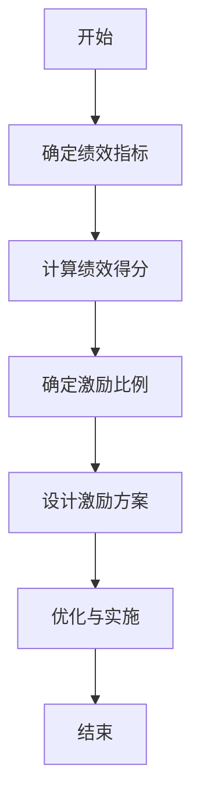
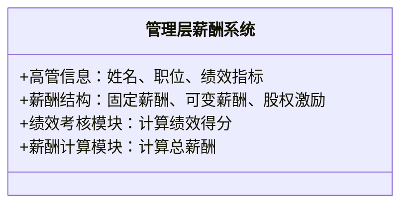

                 


# 彼得林奇对公司管理层薪酬结构的分析

## 关键词：  
- 彼得·林奇  
- 管理层薪酬结构  
- 薪酬设计  
- 股权激励  
- 绩效考核  

## 摘要：  
本文深入分析了彼得·林奇对管理层薪酬结构的独到见解，从理论到实践，详细探讨了如何设计合理的薪酬体系以实现公司绩效与高管激励的最优平衡。通过数学模型、系统架构和实际案例的分析，本文为优化公司治理提供了切实可行的解决方案。

---

## 第一部分: 背景介绍

### 第1章: 管理层薪酬结构的背景与问题

#### 1.1 管理层薪酬结构的定义  
- 管理层薪酬结构的组成部分：固定薪酬、可变薪酬、股权激励、福利与期权  
- 管理层薪酬的分类：短期激励、长期激励、混合激励  
- 管理层薪酬的特征：激励性、公平性、灵活性  

#### 1.2 管理层薪酬结构的重要性  
- 管理层薪酬与公司绩效的关系：薪酬结构对高管行为的引导作用  
- 管理层薪酬与员工激励的关系：高管激励如何影响团队绩效  
- 管理层薪酬与公司治理的关系：薪酬设计对股东利益的保障  

#### 1.3 管理层薪酬结构的现状与问题  
- 当前管理层薪酬结构的主要模式：固定工资+奖金+期权  
- 现有薪酬结构存在的问题：激励不足、激励过度、道德风险  
- 管理层薪酬结构优化的必要性：平衡短期目标与长期发展  

### 第2章: 彼得·林奇的分析方法与框架  

#### 2.1 彼得·林奇的分析背景  
- 彼得·林奇的个人简介：美国著名投资经理，擅长分析公司基本面  
- 彼得·林奇的投资理念：关注公司长期价值，注重管理层激励机制  
- 彼得·林奇的分析方法：从公司财务数据出发，分析管理层薪酬与公司绩效的关联  

#### 2.2 管理层薪酬结构的分析框架  
- 分析框架的构建逻辑：从公司治理角度出发，结合财务数据与市场表现  
- 分析框架的核心要素：高管薪酬与公司利润、高管薪酬与股价波动、高管薪酬与管理层稳定性  
- 分析框架的应用范围：适用于上市公司高管薪酬设计与优化  

#### 2.3 管理层薪酬结构的分析工具  
- 财务指标分析工具：ROE、ROA、净利润增长率  
- 非财务指标分析工具：员工满意度、创新指标、市场地位  
- 综合分析工具：构建多维度评价体系，结合定量与定性分析  

---

## 第二部分: 核心概念与联系

### 第3章: 管理层薪酬结构的核心概念  

#### 3.1 管理层薪酬结构的属性特征  
- 薪酬结构的激励性：如何通过薪酬设计激发高管积极性  
- 薪酬结构的公平性：高管薪酬与员工薪酬的合理比例  
- 薪酬结构的灵活性：根据公司发展阶段调整薪酬结构  

#### 3.2 管理层薪酬结构的ER实体关系图  
```mermaid
entity 管理层薪酬结构 {
  <<管理薪酬结构>> 
  - 管理层：高管人员
  - 薪酬项目：固定薪酬、可变薪酬、股权激励
  - 股东：公司股东
  - 绩效指标：财务指标、非财务指标
}
```

### 第4章: 管理层薪酬结构的数学模型与公式  

#### 4.1 管理层薪酬结构的数学模型  
- 模型的构建逻辑：基于CAPM（资本资产定价模型）的高管激励设计  
- 模型的数学表达式：  
  $$ V = R_f + \beta (R_m - R_f) $$  
  其中，$V$ 是公司价值，$R_f$ 是无风险利率，$\beta$ 是公司风险系数，$R_m$ 是市场平均回报率  

#### 4.2 管理层薪酬结构的公式推导  
- 核心公式的推导过程：从CAPM模型推导高管激励价值  
- 公式的实际应用案例：假设某公司β值为1.5，市场平均回报率为8%，无风险利率为2%，则公司价值为：  
  $$ V = 2\% + 1.5 \times (8\% - 2\%) = 8.8\% $$  
- 公式的局限性与改进方向：CAPM模型假设市场有效，实际中需考虑公司特有风险  

---

## 第三部分: 算法原理讲解

### 第5章: 管理层薪酬结构的算法原理  

#### 5.1 算法原理的概述  
- 算法的基本原理：基于动态规划的高管激励设计  
- 算法的核心步骤：  
  1. 确定绩效指标与权重  
  2. 计算高管绩效得分  
  3. 确定激励比例与形式  
  4. 优化激励方案  

#### 5.2 算法的实现步骤  
- 算法流程图：  


#### 5.3 算法的代码实现  
```python
def calculate_performance_score(performance_metrics, weights):
    score = 0
    for metric, weight in zip(performance_metrics, weights):
        score += metric * weight
    return score

def design_compensation_plan(score, target_compensation):
    base_compensation = target_compensation * 0.4
    variable_compensation = target_compensation * 0.6 * (score / max_score)
    return base_compensation + variable_compensation

performance_metrics = [0.8, 0.9, 0.7]  # 假设绩效指标得分
weights = [0.3, 0.4, 0.3]  # 权重
max_score = 0.9

score = calculate_performance_score(performance_metrics, weights)
compensation = design_compensation_plan(score, 100000)
print("计算得分:", score)
print("最终薪酬:", compensation)
```

---

## 第四部分: 系统分析与架构设计

### 第6章: 管理层薪酬结构的系统分析  

#### 6.1 系统功能设计  
- 领域模型：  


#### 6.2 系统架构设计  
- 系统架构图：  


#### 6.3 系统接口设计  
- 系统交互流程：  
```mermaid
sequenceDiagram
    管理层 --> 系统输入：绩效数据
    系统 --> 绩效计算模块：计算绩效得分
    绩效计算模块 --> 系统：返回绩效得分
    系统 --> 薪酬计算模块：计算总薪酬
    系统 --> 管理层：输出薪酬结果
```

---

## 第五部分: 项目实战

### 第7章: 管理层薪酬结构的项目实战  

#### 7.1 环境安装  
- 安装Python环境与相关库（pandas、numpy、matplotlib）  

#### 7.2 核心代码实现  
```python
import pandas as pd
import numpy as np

# 示例数据：高管绩效与薪酬
data = {
    '高管姓名': ['张三', '李四', '王五'],
    '职位': ['CEO', 'CFO', 'CTO'],
    '绩效得分': [0.85, 0.92, 0.78],
    '固定薪酬': [500000, 400000, 450000],
    '绩效奖金比例': [0.3, 0.25, 0.2]
}

df = pd.DataFrame(data)

# 计算绩效奖金
df['绩效奖金'] = df['绩效得分'] * df['固定薪酬'] * df['绩效奖金比例']
df['总薪酬'] = df['固定薪酬'] + df['绩效奖金']

print(df)
```

#### 7.3 案例分析  
- 以某科技公司为例，分析高管薪酬结构与公司绩效的关系  
- 通过数据可视化展示高管薪酬与公司股价的相关性  

---

## 第六部分: 总结与展望

### 第8章: 总结与展望  

#### 8.1 最佳实践  
- 简要总结：优化高管薪酬结构的核心在于平衡激励与约束  
- 实践建议：结合公司实际情况设计个性化薪酬方案  

#### 8.2 小结  
- 优化高管薪酬结构对提升公司治理和绩效具有重要意义  
- 未来研究方向：结合AI技术进行智能化薪酬设计  

#### 8.3 注意事项  
- 避免过度激励导致的短期行为  
- 注重长期激励与短期激励的结合  

#### 8.4 拓展阅读  
- 推荐书籍：《彼得·林奇的投资哲学》、《公司治理与高管激励》  
- 推荐文章：《高管薪酬结构对股价的影响研究》  

---

通过以上目录结构，我们可以系统地从理论到实践分析彼得·林奇的高管薪酬结构设计理念，并结合实际案例和数学模型，为优化公司治理提供科学依据。

