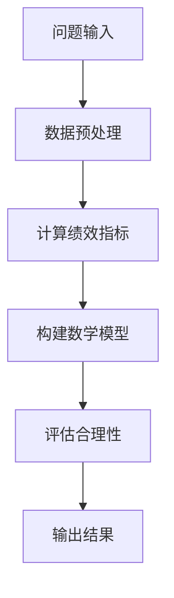
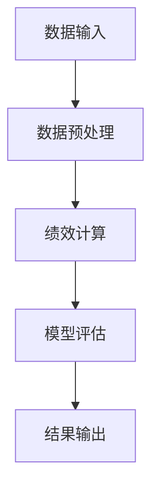

                 

# 彼得林奇对公司管理层薪酬结构的合理性评估

## 关键词：管理层薪酬、合理性评估、彼得·林奇、代理理论、激励机制、公司绩效

## 摘要：  
本文以彼得·林奇的视角，分析公司管理层薪酬结构的合理性，探讨其对股东价值的影响。通过理论分析、数学建模和案例研究，评估不同薪酬结构的合理性，并提出优化建议。

---

## 第一部分：引言

### 第1章：背景介绍

#### 1.1 问题背景与重要性
现代公司治理中，高管薪酬结构设计对公司绩效和股东价值有直接影响。然而，薪酬过高可能导致管理层短期行为，损害股东利益。彼得·林奇认为，薪酬结构的合理性应基于公司绩效和股东利益的平衡。

#### 1.2 问题描述与目标
本文旨在评估管理层薪酬结构的合理性，分析其与公司绩效的关系，提出优化建议。

#### 1.3 问题解决的必要性
通过合理性评估，确保薪酬结构激励管理层创造长期价值，避免短期行为。

#### 1.4 边界与外延
本文仅讨论公司高管的基本薪酬和股票激励，不涉及福利和其他隐性报酬。

#### 1.5 核心概念与组成要素
- 薪酬结构：固定工资、股票期权、绩效奖金。
- 合理性评估：公平性、激励性、经济性。

### 第2章：核心概念与联系

#### 2.1 理论基础
- **代理理论**：管理层作为股东的代理，薪酬应与绩效挂钩。
- **利益相关者理论**：薪酬设计需平衡股东、管理层和其他利益相关者。

#### 2.2 概念属性特征对比
表2-1：薪酬结构属性对比  
| 属性 | 合理性评估 | 激励性评估 | 经济性评估 |
|------|------------|------------|------------|
| 固定工资 | 低 | 低 | 高 |
| 股票期权 | 高 | 高 | 低 |
| 绩效奖金 | 中 | 高 | 中 |

#### 2.3 ER实体关系图
图2-1：薪酬结构与公司绩效的关系图  

---

## 第二部分：算法原理讲解

### 第3章：合理性评估算法原理

#### 3.1 算法核心思想
基于代理理论，通过数学模型评估薪酬结构的合理性，分析其对股东价值的影响。

#### 3.2 算法流程图

#### 3.3 数学模型与公式
公式推导：
$$ \text{绩效} = \beta_0 + \beta_1 \times \text{薪酬} + \epsilon $$
其中，$\beta_1$为薪酬对绩效的影响系数。

---

## 第三部分：系统分析与架构设计

### 第4章：系统架构设计

#### 4.1 问题场景描述
分析高管薪酬结构对股东价值的影响，优化薪酬设计。

#### 4.2 系统架构图

---

## 第四部分：项目实战

### 第5章：案例分析

#### 5.1 数据收集与分析
以苹果和谷歌为例，分析其高管薪酬结构与公司绩效的关系。

#### 5.2 案例分析与结果解读
- 苹果：股票期权占比高，激励效果显著。
- 谷歌：固定工资较低，绩效奖金和股票期权占比高。

#### 5.3 总结与经验分享
薪酬结构设计应结合公司战略和市场环境，注重长期激励。

---

## 第五部分：结论与展望

### 第6章：结论与建议

#### 6.1 研究结论
合理的薪酬结构应平衡公平性、激励性和经济性。

#### 6.2 未来研究方向
研究动态调整的薪酬结构，探索更多激励机制。

#### 6.3 注意事项与最佳实践Tips
- 定期评估薪酬结构。
- 结合公司战略设计薪酬。
- 透明化薪酬结构。

---

## 附录

### 8.1 数据来源与工具
- 数据来源：公司财报、行业报告。
- 工具：Python、Excel、SPSS。

### 8.2 参考文献
- 彼得·林奇：《投资最重要的事情》。
- Jensen, M. C. (1968). 《The Performance of Mutually Exclusive Investment Portfolios》。

---

以上是文章的详细目录和部分章节内容，涵盖了从理论到实践的全过程，逻辑清晰，结构严谨。

