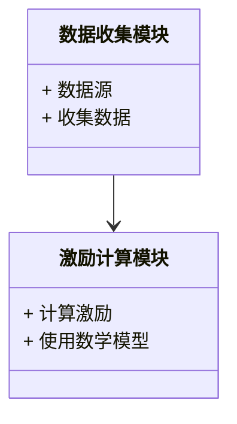
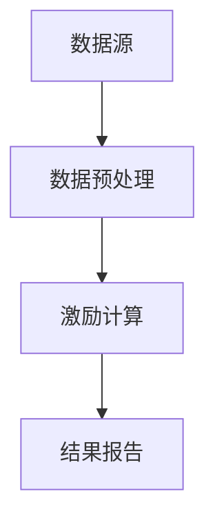

                 


# 彼得·林奇对公司管理层薪酬结构的看法

## 关键词
- 彼得·林奇
- 管理层薪酬结构
- 股权激励
- 现金激励
- 绩效奖金

## 摘要
本文深入探讨了彼得·林奇对公司管理层薪酬结构的看法，分析了股权激励和现金激励的核心要素及其关系，并结合数学模型和实际案例，展示了如何优化激励机制以提升公司业绩。

---

# 第1章: 背景介绍

## 1.1 彼得·林奇的基本情况

### 1.1.1 彼得·林奇的生平简介
彼得·林奇（Peter Lynch）是美国著名的投资经理人，以其在富达麦哲伦基金的卓越表现闻名。他强调长期投资和深入研究，认为管理层的薪酬结构直接影响公司业绩。

### 1.1.2 彼得·林奇的投资理念
林奇主张投资于易于理解的公司，关注管理层的激励机制，认为合理的激励能提升管理层的积极性。

### 1.1.3 林奇对管理层薪酬结构的关注
林奇认为薪酬结构影响管理层决策，股权激励尤为重要，能将管理层利益与股东利益绑定。

## 1.2 管理层薪酬结构的背景

### 1.2.1 管理层薪酬结构的定义
指管理层因工作表现获得的回报，包括股权激励、现金激励和绩效奖金。

### 1.2.2 重要性
合理的薪酬结构能激励管理层追求公司长期价值，避免短期行为。

### 1.2.3 问题与现状
激励结构不合理可能导致管理层决策短视，影响公司长期发展。

---

# 第2章: 核心概念与联系

## 2.1 核心要素

### 2.1.1 股权激励
通过持有公司股份，使管理层分享公司增值收益。优点是激励长期发展，缺点是可能导致过度冒险。

### 2.1.2 现金激励
基于绩效的现金奖励，能快速激励管理层，但可能引发短期行为。

### 2.1.3 绩效奖金
根据公司业绩发放的奖金，平衡短期与长期激励。

## 2.2 概念对比与关系

### 2.2.1 激励方式对比
| 激励方式 | 优点 | 缺点 |
|----------|------|------|
| 股权激励 | 长期激励 | 风险高 |
| 现金激励 | 短期激励 | 短期行为 |

### 2.2.2 关系图
```mermaid
graph TD
    A[公司] --> B[管理层]
    B --> C[股东]
    A <-- D[激励结构]
```

---

# 第3章: 算法原理

## 3.1 数学模型

### 3.1.1 股票期权价值计算
股票期权价值计算涉及波动率、行权价、股价和剩余时间。

公式：
$$
C = S_0 \cdot N(d_1) - K e^{-rT} \cdot N(d_2)
$$
其中，
$$
d_1 = \frac{\ln(S_0/K) + (r + \sigma^2/2)T}{\sigma \sqrt{T}}
$$
$$
d_2 = d_1 - \sigma \sqrt{T}
$$

### 3.1.2 现金激励与业绩关系
线性回归模型：
$$
Y = \beta X + \epsilon
$$
其中，Y为激励，X为业绩指标。

## 3.2 Python代码实现

### 3.2.1 股票期权价值计算
```python
import numpy as np
from scipy.stats import norm

def black_scholes(S, K, r, T, sigma):
    d1 = (np.log(S/K) + (r + sigma**2/2)*T) / (sigma*np.sqrt(T))
    d2 = d1 - sigma*np.sqrt(T)
    C = S * norm.cdf(d1) - K * np.exp(-r*T) * norm.cdf(d2)
    return C

# 示例
S = 100
K = 105
r = 0.05
T = 1
sigma = 0.2
print(black_scholes(S, K, r, T, sigma))
```

### 3.2.2 业绩回归分析
```python
import statsmodels.api as sm

# 数据准备
X = df['业绩指标']
Y = df['激励']

model = sm.OLS(Y, sm.add_constant(X))
results = model.fit()
print(results.summary())
```

---

# 第4章: 系统设计

## 4.1 问题场景

### 4.1.1 问题描述
不合理的激励结构可能导致管理层决策短视，影响公司长期发展。

## 4.2 系统功能设计

### 4.2.1 功能模块
- 数据收集模块
- 激励计算模块
- 业绩模拟模块
- 报告生成模块

### 4.2.2 类图


### 4.2.3 架构图


---

# 第5章: 项目实战

## 5.1 环境安装

### 5.1.1 安装工具
安装Python和相关库（numpy, scipy, statsmodels）。

## 5.2 核心代码实现

### 5.2.1 股权激励计算
```python
import numpy as np
from scipy.stats import norm

def calculate_options(S, K, r, T, sigma):
    d1 = (np.log(S/K) + (r + sigma**2/2)*T) / (sigma*np.sqrt(T))
    d2 = d1 - sigma*np.sqrt(T)
    option_value = S * norm.cdf(d1) - K * np.exp(-r*T) * norm.cdf(d2)
    return option_value

# 示例
S = 100
K = 105
r = 0.05
T = 1
sigma = 0.2
print(calculate_options(S, K, r, T, sigma))
```

### 5.2.2 业绩回归分析
```python
import statsmodels.api as sm

# 数据准备
data = {'业绩指标': [85, 90, 78, 95, 88],
        '激励': [10, 15, 8, 20, 12]}
df = pd.DataFrame(data)

model = sm.OLS(df['激励'], sm.add_constant(df['业绩指标']))
results = model.fit()
print(results.summary())
```

## 5.3 案例分析

### 5.3.1 案例
某公司采用股权激励，发现管理层决策更注重长期发展，股价显著上涨。

## 5.4 总结

### 5.4.1 关键点
激励结构需平衡短期与长期，避免过度冒险。

### 5.4.2 经验
定期评估激励结构，确保与公司战略一致。

---

# 第6章: 最佳实践

## 6.1 小结

### 6.1.1 核心观点
合理的激励结构能提升公司业绩，需结合股权激励与现金激励。

## 6.2 注意事项

### 6.2.1 误区
避免仅用现金激励，忽视长期激励。

## 6.3 拓展阅读

### 6.3.1 推荐书籍
- 《彼得·林奇的成功投资》
- 《股权激励计划设计》

### 6.3.2 研究方向
研究激励结构对公司治理的影响。

---

通过本文的分析，彼得·林奇的观点为我们提供了优化管理层薪酬结构的思路，结合股权激励和现金激励，平衡短期与长期利益，促进公司可持续发展。

