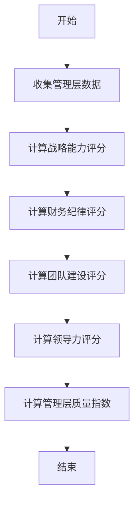
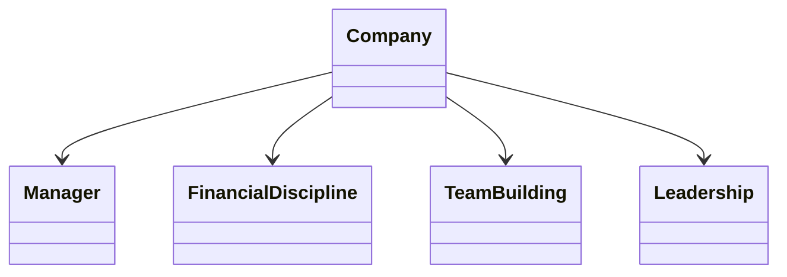
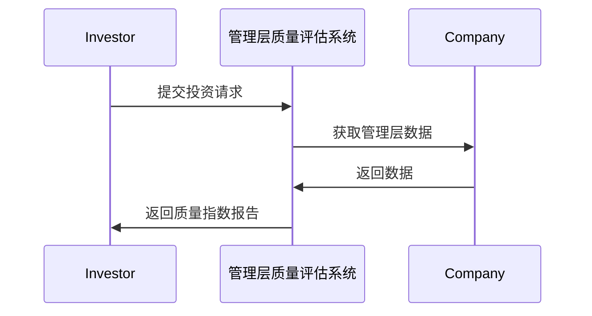

                 


# 彼得林奇对公司管理层质量的评估

> 关键词：彼得林奇，管理层质量，投资评估，战略能力，财务纪律，领导力

> 摘要：本文深入分析了彼得·林奇对公司管理层质量评估的方法及其对投资决策的影响。通过详细阐述核心概念、数学模型、系统架构和实际案例，探讨了如何将管理层质量评估转化为有效的投资策略。文章结构清晰，内容丰富，适合投资者和管理层参考。

## 第一部分：引言

### 第1章：彼得·林奇与管理层质量评估的背景

#### 1.1 彼得·林奇的背景介绍
彼得·林奇是美国著名的投资经理人，以其在富达基金的卓越表现闻名。他强调投资成功的关键在于公司管理层的质量，认为管理层的能力直接影响公司的长期表现。

#### 1.2 管理层质量评估的重要性
管理层质量是投资决策的核心因素，决定了公司的战略执行和财务健康。评估管理层质量有助于投资者识别高潜力公司，避免投资风险。

#### 1.3 为什么管理层质量评估重要
- 管理层决定了公司的战略和执行。
- 高质量的管理层能有效应对市场挑战。
- 财务纪律强的管理层能创造长期价值。

## 第二部分：核心概念与联系

### 第2章：管理层质量评估的核心要素

#### 2.1 核心概念原理
- **战略能力**：管理层制定和执行有效战略的能力。
- **财务纪律**：管理层在财务决策中的纪律性和透明度。
- **团队建设**：管理层吸引和留住人才的能力。
- **领导力**：管理层的愿景和激励团队的能力。

#### 2.2 核心要素对比表格
- 表2.1：战略能力与财务纪律的对比
| 特性 | 战略能力 | 财务纪律 |
|------|----------|----------|
| 重点 | 战略规划 | 财务管理 |
| 标准 | 战略创新性 | 净利润率 |

- 表2.2：团队建设与领导力的对比
| 特性 | 团队建设 | 领导力 |
|------|----------|--------|
| 重点 | 人才管理 | 激励团队 |
| 标准 | 团队稳定性 | 领导风格 |

#### 2.3 ER实体关系图
- 图2.1：管理层-公司-投资者的实体关系图
```mermaid
erd
    Company
    has_many
    [Manager, FinancialDiscipline, TeamBuilding, Leadership]
    Manager
    belongs_to
    Company
    FinancialDiscipline
    belongs_to
    Company
    TeamBuilding
    belongs_to
    Company
    Leadership
    belongs_to
    Company
```

### 第3章：数学模型与算法原理

#### 3.1 管理层质量评估的数学模型
- 公式3.1：管理层质量指数计算公式
$$ \text{MQI} = \frac{S + F + T + L}{4} $$
其中，S为战略能力评分，F为财务纪律评分，T为团队建设评分，L为领导力评分。

- 公式3.2：基于ROE的管理层效率评估
$$ \text{ROE} = \frac{\text{净利润}}{\text{股东权益}} $$

#### 3.2 算法流程图
- 图3.1：管理层质量评估算法的mermaid流程图


## 第三部分：系统分析与架构设计

### 第4章：系统架构设计方案

#### 4.1 问题场景介绍
- 评估管理层质量的系统需求，包括数据采集、处理和分析。

#### 4.2 系统功能设计
- 图4.1：领域模型mermaid类图


#### 4.3 系统架构设计
- 图4.2：系统架构mermaid架构图
```mermaid
context diagram
    actor Investor
    actor Company
    actor Data Source
    system 管理层质量评估系统
    Investor --> 管理层质量评估系统
    Company --> 管理层质量评估系统
    Data Source --> 管理层质量评估系统
```

#### 4.4 系统接口设计
- 接口4.1：数据输入接口，接收公司管理层数据。
- 接口4.2：结果输出接口，返回管理层质量指数。

#### 4.5 系统交互设计
- 图4.3：系统交互mermaid序列图


## 第四部分：项目实战

### 第5章：项目实战与应用

#### 5.1 环境安装
- 安装Python和相关库，如pandas、numpy，用于数据处理和分析。

#### 5.2 核心实现源代码
```python
def calculate_mqi(company_data):
   战略能力评分 S = company_data['战略能力']
    财务纪律评分 F = company_data['财务纪律']
    团队建设评分 T = company_data['团队建设']
    领导力评分 L = company_data['领导力']
    mqi = (S + F + T + L) / 4
    return mqi

def calculate_roe(net_profit, shareholders_equity):
    return net_profit / shareholders_equity
```

#### 5.3 案例分析
- 案例5.1：成功企业的管理层分析，如某公司ROE持续增长，显示财务纪律强。
- 案例5.2：失败企业的管理层分析，如战略失误导致市场份额流失。

## 第五部分：总结与展望

### 第6章：总结与最佳实践

#### 6.1 最佳实践Tips
- 投资者应定期评估管理层质量，关注战略和财务指标。
- 避免仅关注短期业绩，重视长期价值创造。

#### 6.2 项目小结
- 管理层质量评估是投资成功的关键，系统化方法能提高评估效率和准确性。

#### 6.3 注意事项
- 数据质量影响评估结果，需确保数据来源可靠。
- 结合宏观经济因素，全面评估管理层能力。

#### 6.4 拓展阅读
- 推荐书籍：《彼得·林奇的成功投资》。
- 推荐文章：深入探讨管理层治理结构的影响。

---

通过以上结构，文章详细阐述了彼得林奇的管理层质量评估方法，从理论到实践，结合数学模型和系统设计，为投资者提供了实用的指导。

