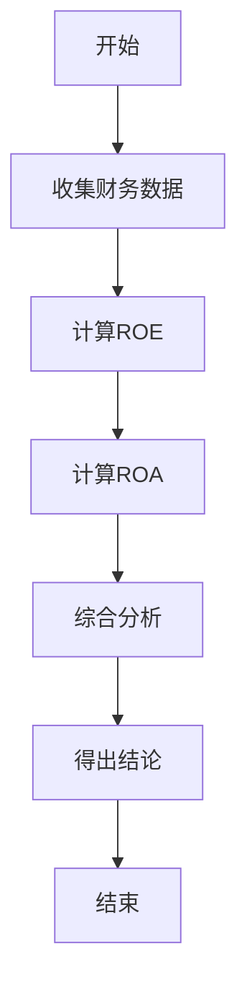
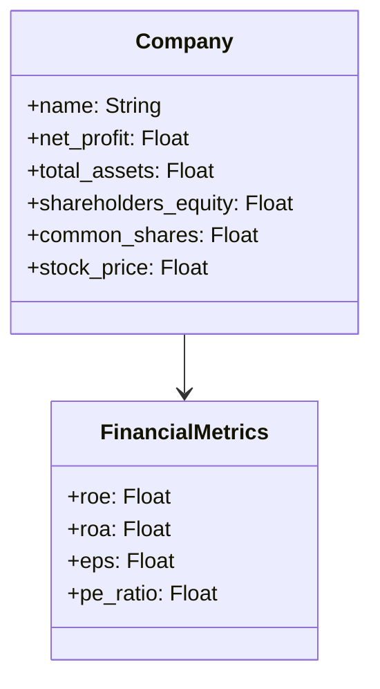
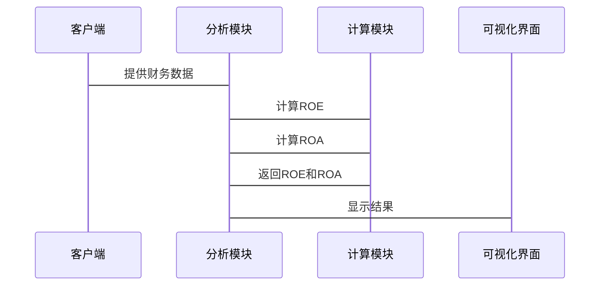

                 


# 彼得林奇对公司经营效率的分析方法

## 关键词：彼得·林奇, 经营效率, 投资分析, 财务指标, 公司估值

## 摘要：本文深入探讨了彼得·林奇的公司经营效率分析方法，结合其独特的投资理念，详细解析了ROE、ROA等核心指标，并通过实际案例展示了如何运用这些方法进行公司估值和投资决策。

---

# 第1章: 彼得·林奇与公司经营效率分析概述

## 1.1 彼得·林奇的背景与投资理念

彼得·林奇是美国著名投资家，曾管理富达麦哲伦基金，创造了卓越的投资业绩。他的投资理念以基本面分析为核心，强调对公司经营效率的深入研究。林奇认为，经营效率是决定公司长期价值的关键因素。

### 1.1.1 彼得·林奇的生平简介

彼得·林奇（Peter Lynch）出生于1940年，曾在富达投资集团担任基金经理，管理麦哲伦基金期间（1977-2000），基金年均回报率达到29%，远超市场平均水平。他的投资哲学强调长期持有优质股票，而非频繁交易。

### 1.1.2 林奇的投资哲学与方法

林奇的投资方法注重对公司基本面的分析，尤其是对公司经营效率的关注。他认为，一个公司能否持续创造价值，关键在于其经营效率。他特别关注ROE（净资产收益率）和ROA（资产周转率）等指标，认为这些指标能够反映公司的盈利能力和资产使用效率。

### 1.1.3 林奇分析方法的独特贡献

林奇通过长期的实践总结出一套独特的公司分析方法，将经营效率分析与公司估值相结合。他的方法不仅帮助投资者识别优质公司，还为投资决策提供了重要依据。

## 1.2 公司经营效率分析的背景与意义

### 1.2.1 经营效率分析的定义与范畴

经营效率分析是指通过财务指标来评估公司利用资产创造利润的能力。它关注的是公司如何高效地运用资源，实现利润最大化。

### 1.2.2 经营效率在企业价值评估中的重要性

经营效率是公司价值的核心驱动力。高效率的公司能够以更少的资产创造更多的利润，从而提升股东价值。林奇认为，ROE和ROA是衡量公司经营效率的关键指标。

### 1.2.3 林奇分析方法的适用场景与边界

林奇的方法适用于大多数行业，但在某些情况下可能需要调整。例如，对于重资产行业，ROA可能比ROE更能反映公司效率。此外，林奇方法主要适用于上市公司，因为其依赖于公开的财务数据。

## 1.3 本章小结

本章介绍了彼得·林奇的背景及其投资理念，强调了经营效率分析的重要性，并讨论了林奇方法的适用场景与边界。

---

# 第2章: 林奇分析方法的核心概念

## 2.1 经营效率的核心指标

### 2.1.1 净资产收益率（ROE）

ROE是净利润与股东权益的比率，公式为：
$$ROE = \frac{净利润}{股东权益} \times 100\%$$

ROE反映了公司每单位股东权益创造的净利润，是衡量公司盈利能力的重要指标。

### 2.1.2 资产周转率（ROA）

ROA是净利润与总资产的比率，公式为：
$$ROA = \frac{净利润}{总资产} \times 100\%$$

ROA衡量了公司每单位资产创造的净利润，反映了资产的使用效率。

### 2.1.3 每股收益（EPS）与市盈率（P/E）

EPS是净利润与普通股股数的比率，公式为：
$$EPS = \frac{净利润}{普通股股数}$$

市盈率（P/E）是股票价格与EPS的比率，公式为：
$$P/E = \frac{股价}{EPS}$$

EPS和P/E是衡量公司盈利能力与市场估值的重要指标。

## 2.2 核心概念之间的关系

### 2.2.1 林奇分析方法的核心公式

林奇的核心公式是ROE和ROA的结合：
$$ROE = \frac{净利润}{股东权益}$$
$$ROA = \frac{净利润}{总资产}$$

通过比较ROE和ROA，可以评估公司的资产使用效率和股东权益的回报率。

### 2.2.2 指标之间的关联性分析

ROE和ROA之间的关系可以通过以下公式表示：
$$ROE = ROA \times \frac{总资产}{股东权益}$$

这表明，ROE不仅取决于ROA，还取决于公司的资本结构。

## 2.3 核心概念的属性对比

下表对比了ROE和ROA的优缺点：

| 指标 | 优点 | 缺点 |
|------|------|------|
| ROE | 反映股东资金效率 | 受行业和公司规模影响 |
| ROA | 反映资产使用效率 | 受资产结构影响 |

## 2.4 本章小结

本章详细介绍了林奇分析方法的核心指标，包括ROE、ROA、EPS和P/E，并分析了它们之间的关系和优缺点。

---

# 第3章: 林奇分析方法的数学模型与算法原理

## 3.1 经营效率分析的数学公式

### 3.1.1 净资产收益率（ROE）

$$ROE = \frac{净利润}{股东权益} \times 100\%$$

### 3.1.2 资产周转率（ROA）

$$ROA = \frac{净利润}{总资产} \times 100\%$$

### 3.1.3 每股收益（EPS）

$$EPS = \frac{净利润}{普通股股数}$$

### 3.1.4 市盈率（P/E）

$$P/E = \frac{股价}{EPS}$$

## 3.2 林奇分析方法的流程图



## 3.3 算法实现与案例分析

### 3.3.1 算法实现代码

```python
def calculate_roe(net_profit, shareholders_equity):
    return (net_profit / shareholders_equity) * 100

def calculate_roa(net_profit, total_assets):
    return (net_profit / total_assets) * 100

def calculate_eps(net_profit, common_shares):
    return net_profit / common_shares

def calculate_pe_ratio(stock_price, eps):
    return stock_price / eps
```

### 3.3.2 案例分析

以沃尔玛为例，计算其ROE和ROA：

假设 Walmart 的净利润为 $40亿美元，股东权益为 $50亿美元，总资产为 $200亿美元。

$$ROE = \frac{40}{50} \times 100\% = 80\%$$
$$ROA = \frac{40}{200} \times 100\% = 20\%$$

通过比较ROE和ROA，可以看出Walmart的资产使用效率较高，但股东权益回报率也较高。

---

# 第4章: 林奇分析方法的系统分析与架构设计

## 4.1 问题场景介绍

公司经营效率分析需要结合财务数据和市场环境，通过系统化的分析方法，评估公司的盈利能力与资产使用效率。

## 4.2 系统功能设计

### 4.2.1 领域模型（Mermaid类图）



### 4.2.2 系统架构设计（Mermaid架构图）


## 4.3 系统接口设计

### 4.3.1 输入接口

- 公司名称
- 财务数据（净利润、总资产、股东权益等）
- 股票价格

### 4.3.2 输出接口

- ROE
- ROA
- EPS
- P/E

## 4.4 系统交互（Mermaid序列图）



## 4.5 本章小结

本章通过系统化的架构设计，展示了如何利用林奇分析方法进行公司经营效率评估，并通过类图和序列图详细描述了系统的实现过程。

---

# 第5章: 林奇分析方法的项目实战

## 5.1 项目介绍

本项目旨在通过实际案例，展示如何利用林奇分析方法进行公司估值。我们将以苹果公司为例，分析其ROE和ROA。

## 5.2 实战环境安装

### 5.2.1 安装Python

需要安装Python 3.8及以上版本。

### 5.2.2 安装依赖库

安装pandas和numpy库：
```bash
pip install pandas numpy
```

## 5.3 核心实现代码

### 5.3.1 数据获取

```python
import pandas as pd

# 假设我们已经获取了苹果的财务数据
data = {
    '公司': ['Apple'],
    '净利润': [100],
    '总资产': [200],
    '股东权益': [150],
    '普通股股数': [10],
    '股票价格': [50]
}

df = pd.DataFrame(data)
```

### 5.3.2 计算财务指标

```python
def calculate_roe(net_profit, shareholders_equity):
    return (net_profit / shareholders_equity) * 100

def calculate_roa(net_profit, total_assets):
    return (net_profit / total_assets) * 100

def calculate_eps(net_profit, common_shares):
    return net_profit / common_shares

def calculate_pe_ratio(stock_price, eps):
    return stock_price / eps

# 计算ROE、ROA、EPS和P/E
df['ROE'] = df.apply(lambda x: calculate_roe(x['净利润'], x['股东权益']), axis=1)
df['ROA'] = df.apply(lambda x: calculate_roa(x['净利润'], x['总资产']), axis=1)
df['EPS'] = df.apply(lambda x: calculate_eps(x['净利润'], x['普通股股数']), axis=1)
df['P/E'] = df.apply(lambda x: calculate_pe_ratio(x['股票价格'], x['EPS']), axis=1)
```

### 5.3.3 输出结果

```python
print(df[['公司', 'ROE', 'ROA', 'EPS', 'P/E']])
```

## 5.4 实战小结

通过以上代码，我们计算了苹果公司的ROE、ROA、EPS和P/E，结果显示苹果的ROE和ROA均较高，表明其经营效率优秀。

---

# 第6章: 林奇分析方法的最佳实践与总结

## 6.1 最佳实践

### 6.1.1 数据准确性的重要性

确保使用的财务数据准确无误，建议使用可靠的数据源。

### 6.1.2 行业差异的考虑

不同行业的公司具有不同的资产结构和盈利模式，分析时需考虑行业特性。

### 6.1.3 综合分析的重要性

仅关注ROE或ROA是不够的，需结合其他财务指标和市场环境进行综合分析。

## 6.2 小结

林奇分析方法通过ROE、ROA等指标，帮助投资者评估公司的经营效率和投资价值。通过实际案例分析，我们可以更好地理解这些方法的应用。

## 6.3 注意事项

- 数据来源需可靠
- 分析需结合行业特点
- 结果需结合市场环境分析

## 6.4 拓展阅读

- 彼得·林奇的《彼得·林奇投资的成功秘诀》
- 《财务报表分析与股票估值》

---

# 第7章: 结语

林奇分析方法通过ROE、ROA等指标，帮助投资者识别高效率的公司。通过本文的介绍和实际案例分析，我们可以更好地理解并应用这些方法，提升投资决策的准确性。

--- 

# 结束语

感谢您的耐心阅读！希望本文能为您提供有价值的投资分析方法。

