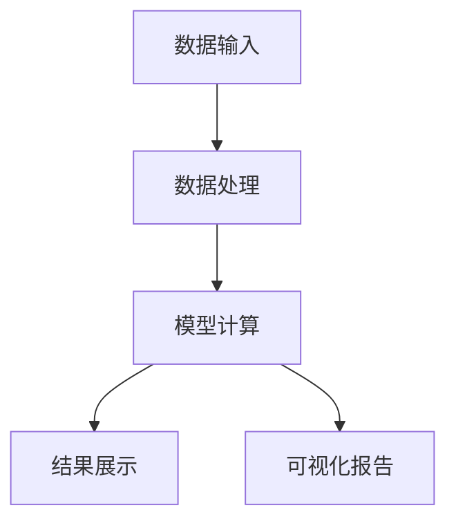

                 


# 彼得林奇对公司自由现金流增长可持续性的分析

## 关键词：彼得林奇，自由现金流，可持续性，投资分析，财务模型

## 摘要：本文深入分析了彼得林奇对公司自由现金流增长可持续性的独特见解，探讨了其分析框架、数学模型及实际应用。通过背景介绍、核心概念、算法原理、系统架构和项目实战，详细阐述了如何评估公司自由现金流的增长潜力，为企业投资决策提供科学依据。

---

# 第一部分：背景介绍

## 第1章：彼得林奇的背景与投资理念

### 1.1 彼得林奇的生平简介
彼得·林奇（Peter Lynch）是美国著名的投资经理，以其在富达投资管理公司的卓越表现而闻名。他强调长期投资和深入研究公司的基本面，尤其是自由现金流（Free Cash Flow，FCF）的增长能力，是其选股的重要标准。

### 1.2 彼得林奇的投资哲学
彼得林奇主张投资于自己理解的公司，关注企业的财务健康和管理层质量。他认为，自由现金流是衡量公司财务健康的核心指标，能够反映企业的盈利能力和资金运作效率。

### 1.3 自由现金流的核心意义
自由现金流是公司在支付所有运营成本和资本支出后的剩余现金流，用于再投资或回报股东。彼得林奇认为，持续的自由现金流增长是公司长期价值增长的基石。

---

# 第二部分：自由现金流增长的可持续性分析

## 第2章：自由现金流增长的核心要素

### 2.1 营业收入增长的驱动因素
营业收入是自由现金流的主要来源。彼得林奇认为，收入增长必须是真实且可持续的，而非依赖于价格操纵或短期促销。

#### 2.1.1 市场需求与产品竞争力
- 公司所处行业的市场需求是否稳定增长？
- 公司产品或服务是否具有竞争力，能否吸引并留住客户？

#### 2.1.2 成本控制与利润率提升
- 公司能否有效控制生产成本和运营成本？
- 利润率的提升是否反映了成本控制和效率优化？

### 2.2 自由现金流增长的财务指标分析
彼得林奇的分析框架中，财务指标是衡量公司现金流增长能力的重要工具。

#### 2.2.1 营业利润率（Operating Margin）
公式：$$\text{营业利润率} = \frac{\text{营业收入} - \text{营业成本}}{\text{营业收入}}$$
- 营业利润率越高，说明公司在扣除运营成本后的利润越强，现金流增长潜力越大。

#### 2.2.2 净利润率（Net Profit Margin）
公式：$$\text{净利润率} = \frac{\text{净利润}}{\text{营业收入}}$$
- 净利润率反映了公司在税后利润方面的表现，是衡量整体盈利能力的重要指标。

#### 2.2.3 资产周转率（Asset Turnover）
公式：$$\text{资产周转率} = \frac{\text{营业收入}}{\text{平均总资产}}$$
- 资产周转率高意味着公司能够更高效地利用资产创造收入。

### 2.3 彼得林奇的自由现金流增长模型
彼得林奇提出了一套基于自由现金流的可持续增长评估模型，包括以下步骤：

#### 2.3.1 计算自由现金流
公式：$$\text{FCF} = \text{营业收入} - \text{现金支出}$$

#### 2.3.2 评估自由现金流的增长率
公式：$$\text{FCF增长} = \frac{\text{本期FCF} - \text{上期FCF}}{\text{上期FCF}} \times 100\%$$

#### 2.3.3 分析增长率的可持续性
- 增长率是否稳定？是否受到行业周期性影响？
- 公司是否需要依赖外部融资来维持增长？

---

## 第3章：自由现金流增长的外部环境分析

### 3.1 行业竞争格局
- 行业是否处于垄断或寡头竞争状态？
- 公司在行业中的地位如何？是否具备竞争优势？

### 3.2 宏观经济环境
- 宏观经济政策是否影响行业？如利率变化、税收政策等。
- 经济周期对行业需求的影响。

### 3.3 市场需求变化
- 市场需求是否饱和？是否存在新兴市场或增长点？
- 客户需求的变化是否会影响公司的产品结构和现金流。

---

# 第三部分：算法原理与数学模型

## 第4章：彼得林奇分析方法的数学模型

### 4.1 自由现金流增长的数学模型
彼得林奇的分析方法可以通过以下数学模型进行建模：

公式：$$\text{可持续增长率} = \frac{\text{FCF}_t}{\text{平均资本支出}} \times \text{资本支出增长率}$$

#### 4.1.1 自由现金流的预测
- 使用历史数据预测未来现金流。
- 结合行业趋势和公司战略调整预测模型。

#### 4.1.2 可持续增长率的计算
公式：$$\text{可持续增长率} = \frac{\text{FCF}_t}{\text{平均资本支出}} \times \text{资本支出增长率}$$
- 其中，FCF_t为第t年的自由现金流，平均资本支出为过去几年的资本支出平均值。

### 4.2 自由现金流增长的算法实现
以下是一个简单的Python代码示例，用于计算自由现金流增长率：

```python
def calculate_fcf_growth(fcf_prev, fcf_current):
    if fcf_prev == 0:
        return "N/A"  # 避免除以零错误
    growth = (fcf_current - fcf_prev) / fcf_prev * 100
    return round(growth, 2)

# 示例数据
fcf_2022 = 100
fcf_2023 = 150

growth = calculate_fcf_growth(fcf_2022, fcf_2023)
print(f"自由现金流增长率为：{growth}%")
```

---

## 第5章：系统分析与架构设计

### 5.1 系统功能设计
- **数据输入模块**：收集公司财务数据，包括营业收入、成本、资本支出等。
- **模型计算模块**：计算自由现金流和增长率。
- **结果展示模块**：生成可视化报告，包括图表和关键指标。

### 5.2 系统架构设计
以下是一个简单的系统架构图：



### 5.3 系统接口设计
- 输入接口：财务数据接口，用于接收公司财务报表数据。
- 输出接口：报告生成接口，用于输出分析结果。

---

## 第6章：项目实战

### 6.1 环境安装
- 安装Python和必要的库，如Pandas、Matplotlib。

### 6.2 核心代码实现
以下是一个完整的Python代码示例，用于分析某公司的自由现金流增长：

```python
import pandas as pd
import matplotlib.pyplot as plt

# 示例数据
data = {
    '年份': [2020, 2021, 2022, 2023],
    '营业收入': [500, 550, 600, 650],
    '现金支出': [200, 220, 240, 260],
    '自由现金流': [300, 330, 360, 390]
}

df = pd.DataFrame(data)

# 计算自由现金流增长率
df['FCF增长率'] = df['自由现金流'].pct_change() * 100

# 绘制图表
plt.figure(figsize=(10, 6))
plt.plot(df['年份'], df['自由现金流'], label='自由现金流')
plt.plot(df['年份'], df['FCF增长率'], label='增长率')
plt.title('自由现金流增长分析')
plt.xlabel('年份')
plt.ylabel('金额/增长率（%）')
plt.legend()
plt.show()
```

---

## 第7章：总结与展望

### 7.1 最佳实践
- 定期更新财务数据，持续监控现金流变化。
- 结合行业动态和宏观经济环境，调整分析模型。

### 7.2 小结
彼得林奇的自由现金流增长分析方法为我们提供了一个科学的投资决策工具。通过深入分析公司的财务健康状况和市场环境，我们可以更准确地评估其增长潜力。

### 7.3 注意事项
- 数据的准确性和及时性对分析结果至关重要。
- 分析结果应结合公司实际业务和市场环境进行综合判断。

### 7.4 拓展阅读
- 《彼得林奇的成功投资》
- 《价值投资实战》

---

通过本文的详细分析，读者可以掌握彼得林奇的自由现金流增长分析方法，并将其应用于实际投资分析中。希望本文能为投资者提供有价值的参考和指导。

