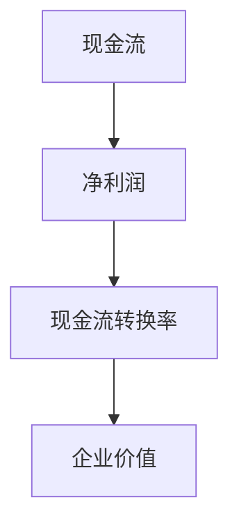
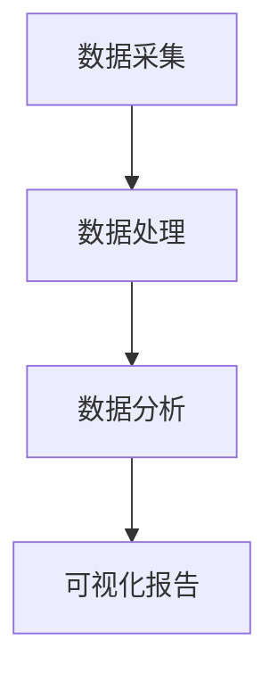

                 


# 彼得林奇对公司自由现金流转换率的分析

## 关键词：
公司自由现金流、现金流转换率、彼得·林奇、投资分析、财务指标

## 摘要：
现金流转换率是衡量企业将净利润转化为现金流能力的重要指标，本文从彼得·林奇的投资视角，深入分析现金流转换率的定义、计算方法、影响因素及其在投资决策中的应用。通过实际案例和数学模型，探讨如何利用现金流转换率评估企业价值，优化投资组合，避免财务风险。本文旨在为投资者和企业管理者提供实用的分析工具和策略建议。

---

# 第一部分: 公司自由现金流转换率的背景与概念

## 第1章: 自由现金流转换率的定义与重要性

### 1.1 自由现金流的定义与计算

#### 1.1.1 什么是自由现金流
自由现金流（Free Cash Flow，FCF）是指企业在扣除所有运营支出和资本支出后剩余的现金流量。它是企业实际可用于偿还债务、支付股息、进行再投资的资金。

- **公式**：
  $$ \text{自由现金流} = \text{营业收入} - \text{运营成本} - \text{资本支出} $$

- **关键点**：
  - 营业收入：企业销售产品或服务获得的收入。
  - 运营成本：与业务运营直接相关的成本，如原材料、工资等。
  - 资本支出：用于购买或维护长期资产的资金。

#### 1.1.2 自由现金流的计算公式
$$ \text{FCF} = \text{EBIT} - \text{利息} - \text{税} - \text{折旧} - \text{资本支出} $$

其中，EBIT（息税折旧前利润）是衡量企业盈利能力的重要指标。

#### 1.1.3 自由现金流与净利润的区别
- **净利润**：基于会计准则计算，包含非现金项目（如折旧、摊销）。
- **自由现金流**：反映企业实际产生的现金流，更贴近企业的真实财务状况。

---

### 1.2 现金流转换率的定义

#### 1.2.1 现金流转换率的计算方法
现金流转换率（Cash Conversion Rate，CCR）是衡量企业将净利润转化为自由现金流能力的指标。

- **公式**：
  $$ \text{CCR} = \frac{\text{自由现金流}}{\text{净利润}} $$

#### 1.2.2 现金流转换率的行业标准
不同行业对现金流转换率的要求不同，例如制造业通常要求较高，而服务业可能要求较低。

#### 1.2.3 现金流转换率与企业价值的关系
高现金流转换率意味着企业能够高效地将利润转化为现金流，通常被视为企业财务健康的重要指标。

---

### 1.3 彼得·林奇对现金流转换率的重视

#### 1.3.1 彼得·林奇的投资理念
彼得·林奇强调基本面分析，认为企业的现金流是评估其长期价值的关键因素。

#### 1.3.2 现金流转换率在彼得·林奇投资体系中的地位
现金流转换率是林奇判断企业盈利能力的重要指标，尤其是在评估企业是否具备持续创造现金流的能力时。

#### 1.3.3 现金流转换率与企业长期价值的关系
高现金流转换率通常意味着企业具备稳定的现金流来源，能够支持其业务扩展和股东回报。

---

## 第2章: 现金流转换率的核心概念与联系

### 2.1 现金流转换率的核心要素

#### 2.1.1 现金流转换率的公式
$$ \text{CCR} = \frac{\text{经营活动现金流净额}}{\text{净利润}} $$

#### 2.1.2 现金流转换率的关键影响因素
- 营业活动现金流
- 净利润
- 非现金项目

#### 2.1.3 现金流转换率的优缺点对比
| 指标 | 优点 | 缺点 |
|------|------|------|
| CCR  | 反映企业将利润转化为现金流的能力 | 不考虑企业规模和行业差异 |

---

### 2.2 现金流转换率与相关指标的对比

#### 2.2.1 净利润与现金流的对比
净利润是会计利润，现金流是实际现金流入流出。

#### 2.2.2 现金流转换率与ROE的对比
ROE（净资产收益率）衡量的是股东权益的回报率，而CCR衡量的是现金流的生成能力。

#### 2.2.3 现金流转换率与股息支付率的对比
股息支付率反映企业分红能力，而CCR反映企业将利润转化为现金流的能力。

---

### 2.3 现金流转换率的ER实体关系图



---

## 第3章: 现金流转换率的计算与影响因素

### 3.1 现金流转换率的计算公式

#### 3.1.1 现金流转换率的数学模型
$$ \text{CCR} = \frac{\text{经营活动现金流净额}}{\text{净利润}} $$

---

### 3.2 现金流转换率的影响因素

#### 3.2.1 营业活动现金流的影响
- **高营业活动现金流**：表明企业经营活动产生的现金流充足。
- **低营业活动现金流**：可能意味着企业盈利质量较差。

#### 3.2.2 净利润的影响
- **高净利润**：可能来自高利润率或成本控制。
- **低净利润**：可能来自行业竞争或成本上升。

#### 3.2.3 非现金项目的影响
- **折旧与摊销**：影响净利润，但不影响现金流。

---

## 第4章: 现金流转换率的分析与应用

### 4.1 现金流转换率的分析方法

#### 4.1.1 历史数据分析法
通过分析企业过去几年的现金流转换率，判断其趋势。

#### 4.1.2 行业比较法
将企业与同行业竞争对手的现金流转换率进行比较，评估其相对表现。

#### 4.1.3 结构分析法
分解现金流转换率的构成因素，分析其变化原因。

---

### 4.2 现金流转换率的行业差异

#### 4.2.1 不同行业的现金流转换率差异
- **制造业**：通常较高，因为需要大量资本支出。
- **服务业**：通常较低，因为资本支出较少。

#### 4.2.2 行业标准与企业个体差异
不同行业对现金流转换率的要求不同，需结合行业特点进行分析。

---

## 第5章: 现金流转换率的系统架构与实战

### 5.1 现金流转换率的系统分析

#### 5.1.1 系统功能设计
- 数据采集：收集企业的财务数据。
- 数据处理：计算现金流转换率。
- 数据分析：生成可视化报告。

#### 5.1.2 系统架构设计


---

### 5.2 现金流转换率的实战应用

#### 5.2.1 环境安装
- 数据库：MySQL
- 工具：Python（Pandas, Matplotlib）

#### 5.2.2 代码实现
```python
import pandas as pd
import matplotlib.pyplot as plt

# 加载数据
data = pd.read_csv('financial_data.csv')

# 计算现金流转换率
data['CCR'] = data['经营活动现金流净额'] / data['净利润']

# 可视化
plt.plot(data['日期'], data['CCR'], 'b-')
plt.title('现金流转换率趋势图')
plt.xlabel('日期')
plt.ylabel('现金流转换率')
plt.show()
```

---

## 第6章: 总结与展望

### 6.1 总结
现金流转换率是衡量企业财务健康的重要指标，彼得·林奇的投资理念强调了其重要性。

### 6.2 展望
未来的研究可以进一步探讨现金流转换率与企业价值的量化关系。

### 6.3 最佳实践
- 定期分析企业的现金流转换率。
- 结合行业特点进行横向比较。
- 关注现金流转换率的趋势变化。

---

通过以上分析，现金流转换率在投资决策中的作用不可忽视。彼得·林奇的投资理念提醒我们，企业必须具备将利润转化为现金流的能力，才能实现长期稳健的发展。

