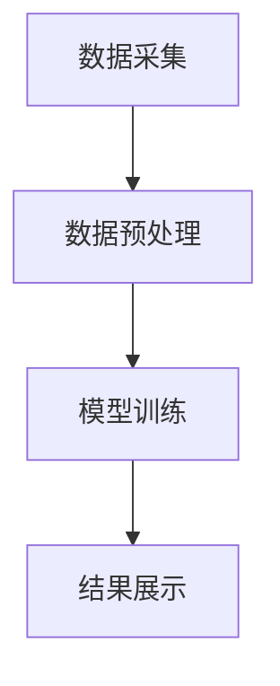
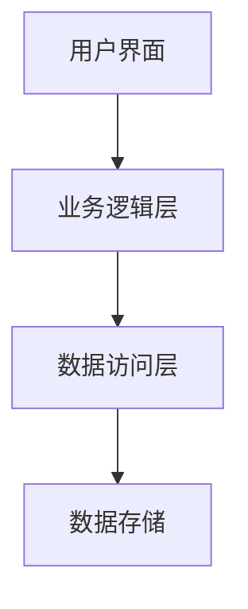
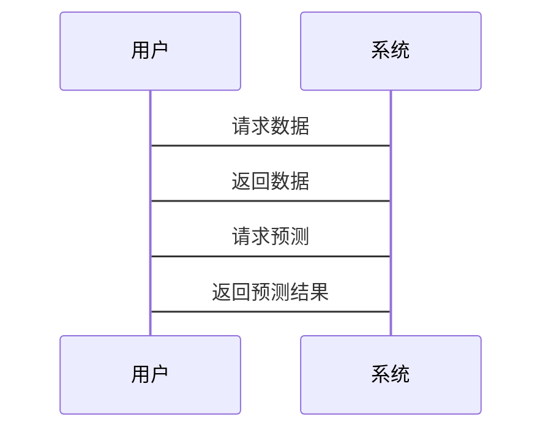

                 


# 彼得林奇对公司营业利润率趋势的分析

## 关键词：营业利润率、彼得·林奇、投资分析、趋势预测、财务指标、行业分析

## 摘要：彼得·林奇作为世界著名投资经理，提出过许多独特的投资理念，其中对公司营业利润率趋势的分析尤为重要。本文从营业利润率的基本概念入手，分析其影响因素，探讨如何通过时间序列分析和回归分析等算法进行趋势预测，并结合实际案例进行系统设计与实现。最后，总结了分析过程中的经验和注意事项，为投资者提供了实用的参考。

---

## 第1章 背景介绍与核心概念

### 1.1 营业利润率的基本概念

#### 1.1.1 营业利润率的定义
营业利润率是衡量公司盈利能力的重要指标，定义为公司一定时期内实现的营业利润与营业收入的比率。其公式为：
$$
\text{营业利润率} = \frac{\text{营业利润}}{\text{营业收入}} \times 100\%
$$

#### 1.1.2 营业利润率的重要性
营业利润率反映了公司在扣除经营成本后的利润能力，是衡量企业核心竞争力的重要指标。

### 1.2 彼得·林奇的投资理念

#### 1.2.1 林奇的投资者背景
彼得·林奇是美国富达投资公司的传奇基金经理，以其对股票市场的深刻理解闻名。

#### 1.2.2 林奇的投资哲学
林奇主张长期投资，关注企业的基本面，尤其是盈利能力。

#### 1.2.3 林奇对营业利润率的关注点
林奇认为，公司营业利润率的变化趋势可以反映企业的经营状况和未来盈利能力。

---

## 第2章 营业利润率的核心概念与分析框架

### 2.1 影响营业利润率的主要因素

#### 2.1.1 收入端的因素
- 营业收入的增长趋势
- 收入结构的优化
- 行业特点对收入的影响

#### 2.1.2 成本端的因素
- 营业成本的控制
- 原材料价格波动
- 生产效率的提升

#### 2.1.3 其他因素
- 管理效率与组织结构
- 税务政策的变化
- 行业竞争格局的影响

### 2.2 营业利润率的行业差异分析

#### 2.2.1 不同行业营业利润率的比较
- 高科技行业与传统制造业的对比
- 服务业与制造业的差异
- 周期性行业与非周期性行业的区别

---

## 第3章 营业利润率的算法原理

### 3.1 时间序列分析

#### 3.1.1 时间序列分析的定义
时间序列分析是一种通过历史数据预测未来趋势的方法。

#### 3.1.2 时间序列分析的步骤
1. 数据收集
2. 数据预处理
3. 模型选择
4. 模型训练
5. 预测与验证

#### 3.1.3 时间序列分析的Python实现
```python
import pandas as pd
import numpy as np
from statsmodels.tsa.arima.model import ARIMA

# 数据预处理
data = pd.read_csv('revenue.csv')
data['date'] = pd.to_datetime(data['date'])
data.set_index('date', inplace=True)
data = data['revenue'].resample('Q').mean()

# 模型训练
model = ARIMA(data, order=(5,1,0))
model_fit = model.fit()

# 预测
forecast = model_fit.forecast(steps=5)
print(forecast)
```

### 3.2 回归分析

#### 3.2.1 回归分析的定义
回归分析是一种统计学方法，用于研究变量之间的关系。

#### 3.2.2 回归分析的步骤
1. 确定自变量和因变量
2. 数据收集与预处理
3. 模型选择
4. 模型训练
5. 模型验证
6. 预测与解释

#### 3.2.3 回归分析的Python实现
```python
import statsmodels.api as sm

# 数据预处理
X = data[['revenue', 'cost']]
y = data['profit']

# 模型训练
model = sm.OLS(y, X)
results = model.fit()

# 输出结果
print(results.summary())
```

### 3.3 数学模型与公式

#### 3.3.1 时间序列模型
时间序列模型的通用形式为：
$$
y_t = \beta_0 + \beta_1 y_{t-1} + \epsilon_t
$$

#### 3.3.2 回归模型
回归模型的通用形式为：
$$
y = \beta_0 + \beta_1 x_1 + \beta_2 x_2 + \ldots + \beta_n x_n + \epsilon
$$

---

## 第4章 系统分析与架构设计

### 4.1 系统功能设计

#### 4.1.1 功能模块
- 数据采集模块
- 数据预处理模块
- 模型训练模块
- 结果展示模块

#### 4.1.2 系统架构图


### 4.2 系统架构设计

#### 4.2.1 系统架构图


#### 4.2.2 接口设计
- 数据接口：`GET /api/data`
- 模型接口：`POST /api/model`

#### 4.2.3 交互流程图


---

## 第5章 项目实战

### 5.1 环境安装

#### 5.1.1 安装Python
```bash
python --version
pip install jupyterlab
```

#### 5.1.2 安装依赖库
```bash
pip install pandas numpy statsmodels
```

### 5.2 核心实现

#### 5.2.1 数据收集
```python
import pandas as pd

data = pd.read_csv('revenue.csv')
```

#### 5.2.2 数据预处理
```python
data['date'] = pd.to_datetime(data['date'])
data.set_index('date', inplace=True)
```

#### 5.2.3 模型实现
```python
from statsmodels.tsa.arima.model import ARIMA

model = ARIMA(data, order=(5,1,0))
model_fit = model.fit()
forecast = model_fit.forecast(steps=5)
```

### 5.3 实际案例分析

#### 5.3.1 案例选择
选择一个制造业公司作为案例，分析其营业利润率的趋势。

#### 5.3.2 数据分析与结果展示
```python
plt.plot(data.index, data.values)
plt.title('营业利润率趋势图')
plt.xlabel('时间')
plt.ylabel('营业利润率')
plt.show()
```

---

## 第6章 最佳实践与小结

### 6.1 经验总结

#### 6.1.1 数据的重要性
高质量的数据是分析的基础。

#### 6.1.2 模型的选择
选择合适的模型可以提高预测的准确性。

#### 6.1.3 结果的验证
验证结果的真实性和可靠性。

### 6.2 注意事项

#### 6.2.1 数据的完整性
确保数据的完整性和准确性。

#### 6.2.2 模型的适用性
选择适合具体问题的模型。

#### 6.2.3 结果的解释
正确解释模型结果，避免误用。

### 6.3 拓展阅读

#### 6.3.1 经典书籍
- 《彼得·林奇的投资哲学》
- 《时间序列分析》

#### 6.3.2 网络资源
- statsmodels官方文档
- ARIMA模型教程

---

## 结语

通过本文的分析，读者可以深入理解彼得·林奇对营业利润率趋势的分析方法，并掌握如何利用时间序列分析和回归分析等算法进行预测。希望本文能为投资者和分析师提供有价值的参考。

