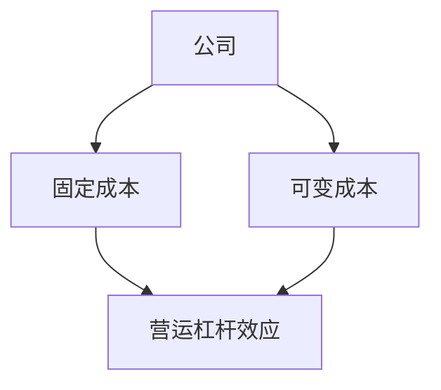
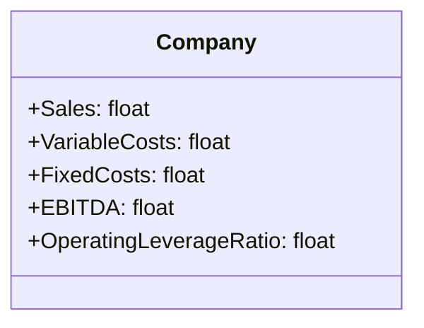

                 


# 彼得林奇对公司营运杠杆效应的动态分析

## 关键词：
- 营运杠杆效应
- 彼得林奇
- 财务分析
- 投资策略
- 动态分析

## 摘要：
本文深入探讨了彼得·林奇对公司营运杠杆效应的动态分析方法。通过详细解析营运杠杆的核心概念、数学模型和实际应用，结合经典案例分析，揭示了如何利用营运杠杆效应进行投资决策和风险管理。文章内容涵盖背景介绍、算法原理、系统架构设计以及项目实战，旨在帮助读者全面理解营运杠杆效应的动态变化及其在投资策略中的重要性。

---

# 第一部分: 营运杠杆效应的背景与概念

## 第1章: 营运杠杆效应的定义与背景

### 1.1 营运杠杆效应的定义

#### 1.1.1 营运杠杆效应的基本概念
营运杠杆效应是指公司通过固定成本与可变成本的比例变化，利用销售额的增长带来收益的非线性增长的现象。简单来说，当公司销售额增加时，由于固定成本不变，而可变成本随销售额增长，杠杆效应会放大收益的增长幅度。

#### 1.1.2 营运杠杆与财务杠杆的区别
- **营运杠杆**：影响收益的波动性，主要由固定成本和可变成本的结构决定。
- **财务杠杆**：影响净利润的波动性，主要由债务融资成本决定。
- 两者共同作用，决定了公司的整体杠杆效应。

#### 1.1.3 营运杠杆在企业经营中的作用
- 放大收益增长：当销售额增加时，营运杠杆效应可以显著放大收益。
- 增加风险：营运杠杆效应也会放大收益的波动性，增加企业的经营风险。

### 1.2 营运杠杆效应的分类

#### 1.2.1 固定成本与可变成本对杠杆的影响
- 固定成本：如租金、工资等，不随销售额变化。
- 可变成本：如原材料、销售佣金等，随销售额变化。
- 营运杠杆效应的大小取决于固定成本与可变成本的比例。

#### 1.2.2 不同行业中的杠杆效应差异
- 高固定成本行业（如制造业）：营运杠杆效应显著。
- 低固定成本行业（如服务业）：营运杠杆效应较小。

#### 1.2.3 营运杠杆效应的边界与外延
- 边界：当销售额达到一定水平后，营运杠杆效应可能减弱。
- 外延：营运杠杆效应与企业规模、行业特性密切相关。

### 1.3 营运杠杆效应的ER实体关系图


---

## 第2章: 营运杠杆效应的核心概念与联系

### 2.1 营运杠杆效应的原理

#### 2.1.1 营运杠杆的数学模型
- **EBITDA计算公式**：
$$ EBITDA = (Sales - Variable\ Costs) \times (1 - Tax\ Rate) $$

- **营运杠杆比率**：
$$ Operating\ Leverage\ Ratio = \frac{EBITDA}{Sales} $$

#### 2.1.2 营运杠杆与收益的关系
- 收益与销售额的关系是非线性的，营运杠杆效应放大了收益的增长。

#### 2.1.3 营运杠杆与风险的内在联系
- 营运杠杆效应越大，收益波动性越大，风险也越高。

### 2.2 核心概念的属性特征对比

#### 2.2.1 营运杠杆与财务杠杆的对比分析
| 属性       | 营运杠杆             | 财务杠杆             |
|------------|----------------------|----------------------|
| 影响因素     | 固定成本与可变成本   | 债务与利息           |
| 影响对象     | 收益                 | 净利润               |
| 风险         | 经营风险             | 信用风险             |

#### 2.2.2 营运杠杆与投资杠杆的对比分析
- 投资杠杆：通过杠杆融资进行投资，放大收益。
- 营运杠杆：通过固定成本与可变成本结构放大收益。

#### 2.2.3 营运杠杆与经营杠杆的对比分析
- 经营杠杆：类似营运杠杆，但更强调企业的运营效率。

---

# 第二部分: 营运杠杆效应的算法原理与数学模型

## 第3章: 营运杠杆效应的算法原理

### 3.1 营运杠杆效应的分析步骤

#### 3.1.1 数据收集与预处理
- 收集公司历史销售数据、成本数据、税后利润等。
- 清洗数据，处理缺失值和异常值。

#### 3.1.2 营运杠杆效应的计算
- 计算EBITDA：
$$ EBITDA = Sales - Variable\ Costs - Fixed\ Costs $$
- 计算营运杠杆比率：
$$ Operating\ Leverage\ Ratio = \frac{EBITDA}{Sales} $$

#### 3.1.3 营运杠杆效应的可视化
- 使用折线图或柱状图展示EBITDA与销售额的关系。
- 使用散点图展示营运杠杆比率与行业平均水平的对比。

### 3.2 营运杠杆效应的数学模型

#### 3.2.1 营运杠杆效应的公式推导
- 假设固定成本为F，可变成本率为VC，销售为S：
$$ EBITDA = S - F - VC \times S $$
- 营运杠杆比率：
$$ Operating\ Leverage\ Ratio = \frac{S - F - VC \times S}{S} $$

#### 3.2.2 营运杠杆效应的动态分析模型
- 动态模型考虑了时间因素，分析营运杠杆效应在不同销售周期的变化。

### 3.3 算法实现

#### Python代码示例
```python
def calculate_operating_leverage(sales, variable_cost, fixed_cost):
    EBITDA = sales - variable_cost * sales - fixed_cost
    operating_leverage_ratio = EBITDA / sales
    return operating_leverage_ratio

# 示例计算
sales = 1000
variable_cost = 0.6
fixed_cost = 200
result = calculate_operating_leverage(sales, variable_cost, fixed_cost)
print(f"营运杠杆比率: {result}")
```

---

## 第4章: 营运杠杆效应的数学模型与公式

### 4.1 营运杠杆效应的数学表达

#### 4.1.1 EBITDA与营运杠杆的关系
$$ EBITDA = (Sales - Variable\ Costs) \times (1 - Tax\ Rate) $$

#### 4.1.2 营运杠杆比率的计算公式
$$ Operating\ Leverage\ Ratio = \frac{EBITDA}{Sales} $$

#### 4.1.3 营运杠杆与风险的关系
- 高营运杠杆意味着高收益波动，风险更大。

---

# 第三部分: 系统分析与架构设计

## 第5章: 系统分析与架构设计方案

### 5.1 问题场景介绍
- 需求：分析公司营运杠杆效应，评估风险。
- 场景：基于历史财务数据，预测未来收益波动。

### 5.2 系统功能设计

#### 5.2.1 领域模型设计


#### 5.2.2 系统架构设计
```mermaid
graph TD
    Client --> API Gateway
    API Gateway --> Service Layer
    Service Layer --> Database
    Database --> Company
```

---

# 第四部分: 项目实战

## 第6章: 项目实战

### 6.1 环境安装与工具配置

#### 6.1.1 Python安装
- 安装Python 3.8及以上版本。
- 安装Pandas、NumPy、Matplotlib库。

### 6.2 核心代码实现

#### 6.2.1 数据分析代码
```python
import pandas as pd
import matplotlib.pyplot as plt

# 数据加载
data = pd.read_csv('financial_data.csv')

# 计算营运杠杆比率
data['Operating Leverage Ratio'] = (data['EBITDA'] / data['Sales'])

# 可视化
plt.plot(data['Year'], data['Operating Leverage Ratio'])
plt.xlabel('Year')
plt.ylabel('Operating Leverage Ratio')
plt.title('动态分析')
plt.show()
```

#### 6.2.2 结果分析
- 图表展示营运杠杆比率的变化趋势。
- 对比行业平均水平，评估公司营运杠杆效应。

### 6.3 案例分析

#### 6.3.1 案例介绍
- 公司：假设为制造业公司。
- 数据：过去5年的销售、成本数据。

#### 6.3.2 分析步骤
1. 计算每年的EBITDA和营运杠杆比率。
2. 绘制趋势图。
3. 对比行业平均值，评估公司营运杠杆效应。

---

## 第五部分: 总结与最佳实践

## 第7章: 总结与最佳实践

### 7.1 投资建议
- 高营运杠杆公司适合销售额增长周期。
- 低营运杠杆公司适合稳定增长。

### 7.2 注意事项
- 营运杠杆效应与行业特性密切相关。
- 结合财务杠杆分析整体风险。

### 7.3 拓展阅读
- 彼得林奇的《股票投资策略》。
- 《财务报表分析》。

---

通过以上分析，我们全面了解了彼得林奇对公司营运杠杆效应的动态分析方法，结合实际案例和代码实现，帮助读者掌握这一重要的财务分析工具。

