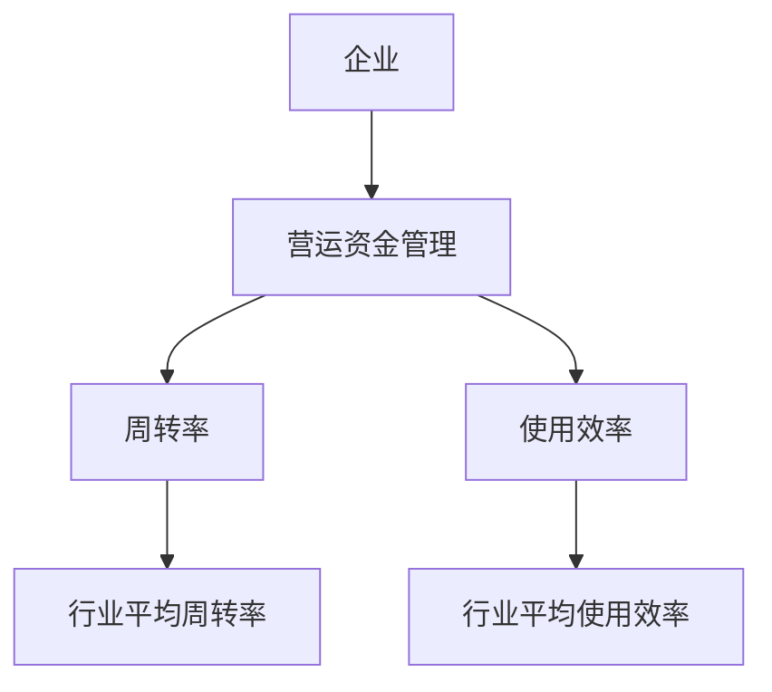
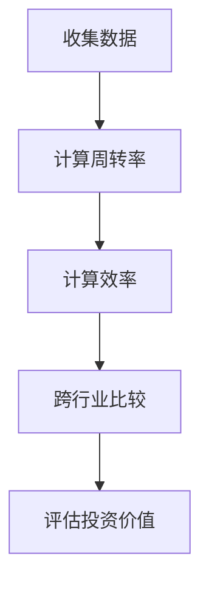
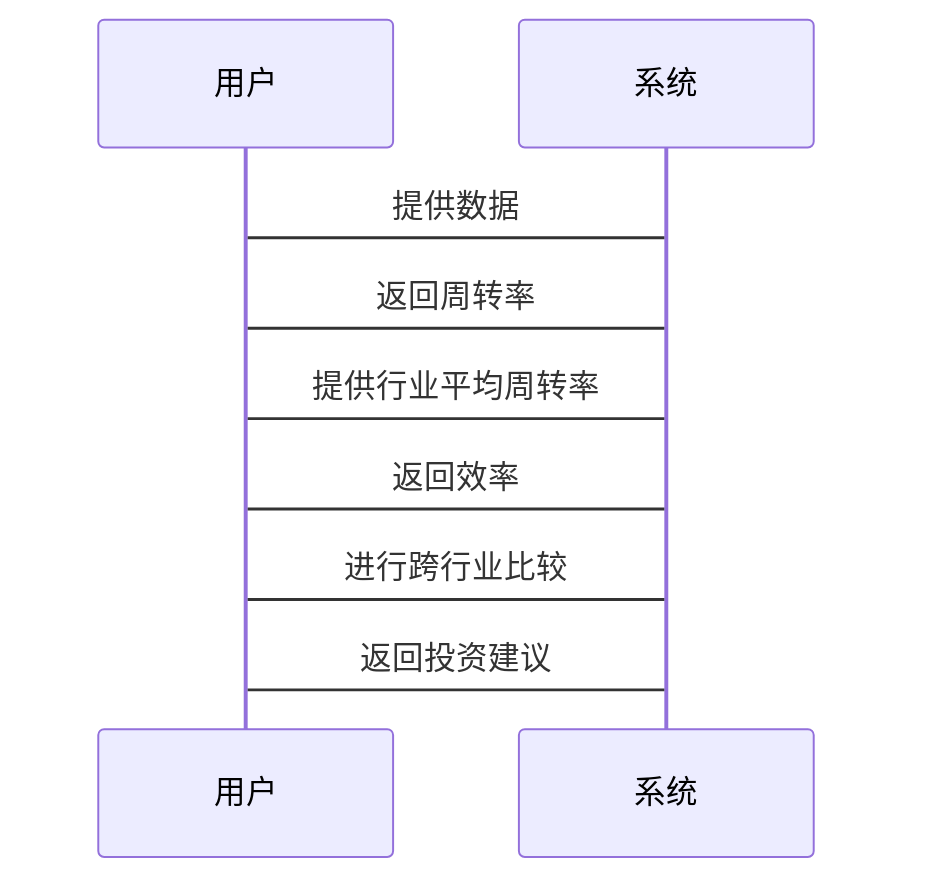

                 


# 彼得林奇对公司营运资金管理效率的跨行业比较

> 关键词：彼得林奇，公司营运资金管理，效率分析，跨行业比较，投资策略，行业特性

> 摘要：本文将探讨彼得林奇如何通过分析公司营运资金管理效率来进行跨行业的投资比较，并深入分析其方法在不同行业中的适用性和有效性。我们从核心概念、算法原理、系统架构等多个维度展开分析，结合实际案例和最佳实践，为读者提供清晰的思路和实用的建议。

---

## # 第一部分: 背景介绍

## # 第1章: 背景与问题提出

### ## 1.1 公司营运资金管理效率的定义
#### ### 1.1.1 营运资金管理效率的核心概念
公司营运资金管理效率是指企业在一定时间内，将营运资金投入生产和收回的效率。彼得林奇认为，高效率的营运资金管理是企业盈利的关键因素之一。

#### ### 1.1.2 营运资金管理效率的重要性
营运资金管理效率直接影响企业的流动性和 profitability，是衡量企业运营能力的重要指标。

#### ### 1.1.3 营运资金管理效率的边界与外延
营运资金管理效率不仅包括资金的周转速度，还涉及资金的使用效率和回收能力。

### ## 1.2 彼得林奇的投资策略
#### ### 1.2.1 彼得林奇的投资理念
彼得林奇强调长期投资和价值投资，注重分析企业的基本面和管理效率。

#### ### 1.2.2 彼得林奇对公司营运资金管理的关注点
彼得林奇关注企业的资金周转率和资金使用效率，认为这些指标能够反映企业的运营能力和管理水平。

#### ### 1.2.3 彼得林奇分析方法的特点
彼得林奇的分析方法注重数据的可比性和行业的可比性，通过跨行业比较找出具有投资价值的企业。

### ## 1.3 跨行业比较的意义
#### ### 1.3.1 跨行业比较的定义
跨行业比较是指在不同行业中，对比企业的营运资金管理效率，以寻找具有竞争优势的企业。

#### ### 1.3.2 跨行业比较的必要性
通过跨行业比较，可以发现不同行业中的优秀企业，从而为投资决策提供依据。

#### ### 1.3.3 跨行业比较的应用场景
跨行业比较适用于多个行业，尤其是在企业之间的规模和商业模式差异较大的情况下。

---

## # 第2章: 营运资金管理效率的核心概念与联系

### ## 2.1 核心概念原理
#### ### 2.1.1 营运资金管理效率的构成要素
营运资金管理效率包括资金周转率、资金使用效率、资金回收能力等。

#### ### 2.1.2 彼得林奇分析模型的原理
彼得林奇分析模型通过对企业营运资金的周转率和使用效率进行分析，评估企业的管理能力。

#### ### 2.1.3 跨行业比较的逻辑框架
跨行业比较需要考虑不同行业的特点，如行业竞争结构、市场规模、业务模式等。

### ## 2.2 核心概念对比分析
#### ### 2.2.1 行业特性对营运资金管理效率的影响
不同行业的营运资金管理效率受到行业特性的影响，例如零售业和制造业的资金周转速度差异较大。

#### ### 2.2.2 不同行业营运资金管理效率的对比表格
通过对比不同行业的营运资金周转率和使用效率，可以找到具有竞争优势的企业。

#### ### 2.2.3 ER实体关系图架构的 mermaid 流程图


---

## # 第3章: 营运资金管理效率的数学模型与公式

### ## 3.1 营运资金周转率的计算公式
#### ### 3.1.1 营运资金周转率的定义
营运资金周转率是企业在一定时间内，营运资金的周转次数。

#### ### 3.1.2 营运资金周转率的计算公式
$$周转率 = \frac{营业收入}{平均营运资金}$$

### ## 3.2 营运资金管理效率的评价指标
#### ### 3.2.1 营运资金管理效率的指标体系
营运资金管理效率包括周转率、使用效率、回收能力等指标。

#### ### 3.2.2 指标的数学表达式
$$效率 = \frac{周转率}{行业平均周转率}$$

### ## 3.3 彼得林奇分析模型的数学表达
#### ### 3.3.1 分析模型的构建
彼得林奇分析模型通过对企业营运资金周转率和行业平均周转率的对比，评估企业的管理效率。

#### ### 3.3.2 模型的数学公式
$$投资价值 = f(效率, 行业特性, 公司基本面)$$

---

## # 第4章: 算法原理与实现

### ## 4.1 算法原理
#### ### 4.1.1 彼得林奇分析模型的算法步骤
1. 收集企业营运资金周转率和行业平均周转率。
2. 计算营运资金管理效率。
3. 对比不同行业的效率，找出具有竞争优势的企业。

#### ### 4.1.2 算法的 mermaid 流程图


### ## 4.2 算法实现
#### ### 4.2.1 算法的 Python 源代码
```python
import pandas as pd

def calculate_turnover_ratio(revenue, average_operating_assets):
    return revenue / average_operating_assets

def calculate_efficiency(turnover_ratio, industry_avg_turnover_ratio):
    return turnover_ratio / industry_avg_turnover_ratio

# 示例数据
data = {
    '公司': ['A', 'B', 'C'],
    '营业收入': [100, 150, 200],
    '平均营运资金': [50, 75, 100],
    '行业平均周转率': [2, 2.5, 3]
}

df = pd.DataFrame(data)

# 计算周转率
df['周转率'] = df.apply(lambda x: calculate_turnover_ratio(x['营业收入'], x['平均营运资金']), axis=1)
# 计算效率
df['效率'] = df.apply(lambda x: calculate_efficiency(x['周转率'], x['行业平均周转率']), axis=1)

print(df)
```

#### ### 4.2.2 代码的功能与实现细节
代码实现彼得林奇分析模型，计算企业营运资金周转率和效率，并进行跨行业比较。

---

## # 第5章: 系统分析与架构设计

### ## 5.1 系统分析
#### ### 5.1.1 问题场景介绍
通过系统分析，我们可以更好地理解彼得林奇分析模型的实现过程。

#### ### 5.1.2 系统功能设计
系统功能包括数据收集、处理、分析和可视化。

#### ### 5.1.3 系统架构设计
系统架构包括数据层、业务逻辑层和用户界面层。

#### ### 5.1.4 系统接口设计
系统接口包括数据输入接口、计算接口和结果输出接口。

#### ### 5.1.5 系统交互 mermaid 序列图


---

## # 第6章: 项目实战

### ## 6.1 项目介绍
#### ### 6.1.1 项目背景
通过实际案例分析，我们可以更好地理解彼得林奇分析模型的应用。

#### ### 6.1.2 项目目标
实现彼得林奇分析模型，进行跨行业比较，找出具有投资价值的企业。

### ## 6.2 核心实现
#### ### 6.2.1 数据收集
收集不同行业的企业营运资金周转率和行业平均周转率。

#### ### 6.2.2 数据处理
对数据进行清洗和预处理，确保数据的准确性和完整性。

#### ### 6.2.3 数据分析
计算企业的营运资金周转率和效率，进行跨行业比较。

#### ### 6.2.4 数据可视化
通过图表展示分析结果，帮助读者更好地理解数据。

### ## 6.3 实际案例分析
#### ### 6.3.1 案例介绍
以零售业和制造业为例，进行营运资金管理效率的跨行业比较。

#### ### 6.3.2 分析过程
1. 收集数据
2. 计算周转率
3. 计算效率
4. 进行跨行业比较
5. 得出结论

### ## 6.4 项目小结
通过实际案例分析，我们可以看到彼得林奇分析模型的有效性和实用性。

---

## # 第7章: 最佳实践与小结

### ## 7.1 最佳实践
#### ### 7.1.1 数据处理技巧
确保数据的准确性和完整性，避免数据偏差。

#### ### 7.1.2 模型优化建议
根据实际情况优化模型，提高分析的准确性和效率。

### ## 7.2 投资建议
基于分析结果，给出具有投资价值的企业和行业建议。

### ## 7.3 未来研究方向
进一步研究不同行业和不同规模企业的营运资金管理效率，探索更多投资机会。

---

## # 第8章: 总结与展望

### ## 8.1 总结
彼得林奇分析模型通过对企业营运资金管理效率的分析，进行跨行业比较，为投资决策提供依据。

### ## 8.2 展望
未来，我们可以进一步研究不同行业和不同规模企业的营运资金管理效率，探索更多投资机会。

---

## # 附录

### ## 附录A: 相关术语解释
解释文中涉及的专业术语。

### ## 附录B: 数据来源与处理
详细说明数据的来源和处理过程。

### ## 附录C: 代码实现细节
提供完整的代码实现细节和注释。

---

## # 参考文献

列出文中引用的相关书籍和文献资料。

---

通过以上目录结构，我们可以系统地分析彼得林奇对公司营运资金管理效率的跨行业比较，从理论到实践，从算法到实现，全面探讨其方法和应用。

