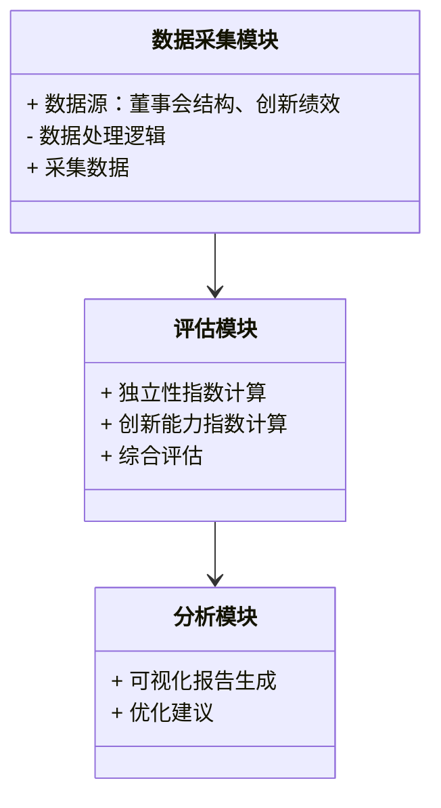
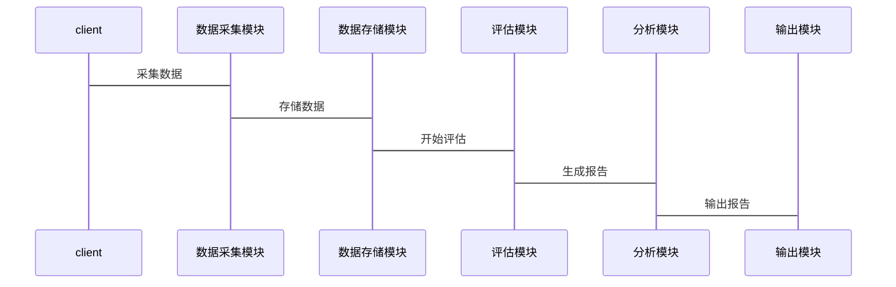

                 


# 彼得林奇对公司董事会独立性与创新能力关系的研究

> 关键词：公司治理，董事会独立性，创新能力，彼得林奇，企业绩效

> 摘要：本文基于彼得林奇的研究，系统性地探讨了公司董事会独立性与创新能力之间的关系。通过理论分析、数学建模、系统设计和项目实战，本文揭示了独立性与创新能力对企业发展的重要影响，并提出了优化公司治理结构的建议。

---

# 第一部分: 背景介绍

## 第1章: 独立性与创新能力的背景与问题描述

### 1.1 问题背景

#### 1.1.1 独立性的定义与属性
- 独立性：指董事会成员在决策过程中不受外部干扰，能够基于公司整体利益做出客观判断。
- 属性：独立性通常体现在董事会成员的决策不受控股股东、管理层或其他外部利益相关者的影响。

#### 1.1.2 创新能力的定义与属性
- 创新能力：指董事会在战略制定、决策过程中能够提出创新性解决方案的能力。
- 属性：包括战略眼光、创新思维、资源整合能力等。

#### 1.1.3 独立性与创新能力的边界与外延
- 独立性：董事会独立性不仅包括形式上的独立（如独立董事比例），还包括实质上的独立（如决策过程不受外部干预）。
- 创新能力：创新能力不仅体现在战略层面，还包括对新兴技术和市场的敏感性。

### 1.2 问题描述

#### 1.2.1 独立性与创新能力的关系
- 独立性是创新能力的基础：只有在独立的决策环境下，董事会才能摆脱短期利益的束缚，制定长期创新战略。
- 创新能力是独立性的重要表现：创新能力强的董事会能够更好地推动公司技术创新和管理创新。

#### 1.2.2 独立性与创新能力的核心要素
- 独立性：独立董事比例、董事会结构、决策透明度。
- 创新能力：创新战略、研发投入、创新文化。

#### 1.2.3 独立性与创新能力的领域模型
- 领域模型：将独立性与创新能力分解为多个维度，构建数学模型进行量化分析。

### 1.3 问题解决

#### 1.3.1 独立性与创新能力的解决思路
- 通过构建数学模型量化独立性和创新性的关系。
- 利用系统设计和项目实战验证模型的有效性。

#### 1.3.2 独立性与创新能力的解决方法
- 数据采集与分析：收集公司董事会结构、创新绩效等数据。
- 数学建模：构建独立性与创新能力的评估模型。
- 实证分析：通过案例分析验证模型的可行性。

#### 1.3.3 独立性与创新能力的解决框架
- 数据采集 → 数学建模 → 实证分析 → 优化建议

### 1.4 本章小结

#### 1.4.1 核心概念总结
- 独立性是董事会决策的基石，创新能力是董事会价值的体现。

#### 1.4.2 问题解决框架
- 通过量化分析，构建独立性与创新能力的评估体系。

#### 1.4.3 研究意义
- 揭示独立性与创新能力的内在联系，为优化公司治理提供理论依据。

---

# 第二部分: 核心概念与联系

## 第2章: 独立性与创新能力的核心概念

### 2.1 独立性与创新能力的定义与属性

#### 2.1.1 独立性的定义与属性
- 独立性：董事会成员在决策过程中不受外部利益相关者的影响。
- 属性：独立性体现在决策的客观性和透明度。

#### 2.1.2 创新能力的定义与属性
- 创新能力：董事会在战略制定和决策过程中提出创新解决方案的能力。
- 属性：创新能力强的董事会能够推动公司技术创新和管理创新。

#### 2.1.3 独立性与创新能力的对比分析
- 对比表格：展示独立性和创新能力在定义、属性、影响等方面的异同。

### 2.2 独立性与创新能力的关系

#### 2.2.1 独立性与创新能力的相互作用
- 独立性是创新能力的基础：独立的董事会能够制定长期创新战略。
- 创新能力是独立性的体现：创新能力强的董事会能够推动公司创新。

#### 2.2.2 独立性与创新能力的协同效应
- 协同效应：独立性和创新能力共同作用，提升公司整体绩效。

#### 2.2.3 独立性与创新能力的权衡与优化
- 权衡：在实际操作中，需要在独立性和创新能力之间找到平衡点。
- 优化：通过优化董事会结构和决策流程，提升独立性和创新能力。

### 2.3 独立性与创新能力的ER实体关系图

```mermaid
er
actor 独立性与创新能力
```

---

# 第三部分: 算法原理与数学模型

## 第3章: 独立性与创新能力的数学模型与公式

### 3.1 独立性与创新能力的数学模型

#### 3.1.1 独立性与创新能力的量化方法
- 独立性量化：通过独立董事比例、决策透明度等指标量化独立性。
- 创新能力量化：通过研发投入、创新专利数量等指标量化创新能力。

#### 3.1.2 独立性与创新能力的数学表达式
- 独立性指数：$$I = \frac{\text{独立董事比例}}{\text{董事会总人数}}$$
- 创新能力指数：$$C = \frac{\text{研发投入占比} + \text{创新专利数量}}{2}$$

#### 3.1.3 独立性与创新能力的数学模型构建
- 综合评估模型：$$S = \alpha I + \beta C$$
  其中，$$\alpha + \beta = 1$$，权重系数 $$\alpha, \beta$$ 根据具体公司调整。

### 3.2 独立性与创新能力的公式推导

#### 3.2.1 独立性与创新能力的公式推导过程
- 独立性与创新能力的综合评估公式：$$S = \alpha I + \beta C$$
- 权重系数的确定：通过层次分析法（AHP）确定 $$\alpha$$ 和 $$\beta$$。

#### 3.2.2 独立性与创新能力的公式验证
- 通过实证分析验证公式 $$S$$ 的有效性，例如：
  - 收集多家公司数据，计算 $$S$$ 值。
  - 对比 $$S$$ 值与公司绩效数据，验证公式的有效性。

---

# 第四部分: 系统分析与架构设计

## 第4章: 独立性与创新能力的系统分析与架构设计

### 4.1 独立性与创新能力的系统功能设计

#### 4.1.1 问题场景介绍
- 系统目标：构建一个能够评估公司董事会独立性和创新能力的系统。
- 问题场景：如何通过系统设计量化独立性和创新能力，并评估其对绩效的影响。

#### 4.1.2 系统功能设计
- 数据采集模块：采集公司董事会结构、创新绩效等数据。
- 评估模块：根据数学模型计算独立性和创新能力指数。
- 分析模块：生成可视化报告，提供优化建议。

#### 4.1.3 系统功能设计的类图


### 4.2 独立性与创新能力的系统架构设计

#### 4.2.1 系统架构设计
- 分层架构：数据采集层、评估层、分析层。
- 模块化设计：每个模块独立开发，便于维护和扩展。

#### 4.2.2 系统架构设计的架构图


### 4.3 独立性与创新能力的系统接口设计

#### 4.3.1 系统接口设计
- 数据采集接口：与公司数据库对接。
- 评估接口：调用数学模型进行计算。
- 分析接口：生成报告并提供优化建议。

#### 4.3.2 系统交互序列图


---

# 第五部分: 项目实战

## 第5章: 独立性与创新能力的项目实战

### 5.1 环境安装与数据采集

#### 5.1.1 环境安装
- 安装Python、Pandas、Matplotlib等工具。
- 数据采集工具：使用Python脚本采集公司董事会结构和创新绩效数据。

#### 5.1.2 数据采集代码实现
```python
import pandas as pd
import requests

# 数据采集函数
def collect_data(company_list):
    data = []
    for company in company_list:
        response = requests.get(f"https://api.example.com/{company}")
        data.append(response.json())
    return pd.DataFrame(data)

# 示例数据
companies = ["公司A", "公司B", "公司C"]
df = collect_data(companies)
print(df)
```

### 5.2 系统核心实现与代码分析

#### 5.2.1 独立性与创新能力评估模块实现
```python
def calculate_I(director_ratio, total_board):
    return director_ratio / total_board

def calculate_C(research_ratio, patent_count):
    return (research_ratio + patent_count) / 2

def calculate_S(alpha, beta, I, C):
    return alpha * I + beta * C
```

#### 5.2.2 算法实现与代码分析
- 独立性指数计算：通过独立董事比例和董事会总人数计算独立性指数。
- 创新能力指数计算：通过研发投入占比和创新专利数量计算创新能力指数。
- 综合评估指数计算：根据权重系数 $$\alpha$$ 和 $$\beta$$ 计算综合评估指数 $$S$$。

### 5.3 案例分析与结果解读

#### 5.3.1 案例分析
- 案例公司：假设一家公司独立董事比例为40%，董事会总人数为10人，研发投入占比为15%，创新专利数量为20。
- 计算独立性指数 $$I = 0.4 / 1 = 0.4$$
- 计算创新能力指数 $$C = (0.15 + 20) / 2 = 10.15$$
- 设定权重系数 $$\alpha = 0.6$$，$$\beta = 0.4$$
- 综合评估指数 $$S = 0.6 \times 0.4 + 0.4 \times 10.15 = 4.26$$
- 结果解读：综合评估指数较高，表明该公司董事会独立性和创新能力较强。

### 5.4 项目小结

#### 5.4.1 项目总结
- 通过项目实战验证了数学模型的有效性。
- 系统设计能够高效评估公司董事会独立性和创新能力。

#### 5.4.2 实施建议
- 建议企业在实际应用中根据自身特点调整权重系数。
- 定期评估董事会独立性和创新能力，优化公司治理结构。

---

# 第六部分: 结论与建议

## 第6章: 结论与建议

### 6.1 研究结论

#### 6.1.1 研究发现
- 独立性是创新能力的基础，创新能力是独立性的体现。
- 通过量化分析可以有效评估董事会独立性和创新能力。

#### 6.1.2 研究意义
- 为优化公司治理结构提供理论依据和实践指导。

### 6.2 实践建议

#### 6.2.1 优化建议
- 提高独立董事比例，增强董事会独立性。
- 加大研发投入，提升创新能力。

#### 6.2.2 管理建议
- 定期评估董事会独立性和创新能力，及时调整决策策略。
- 建立激励机制，鼓励创新。

### 6.3 研究局限性

#### 6.3.1 数据限制
- 数据采集范围有限，可能影响结果的普适性。

#### 6.3.2 模型假设
- 模型假设可能与实际情况存在偏差。

### 6.4 未来研究方向

#### 6.4.1 理论研究
- 进一步完善数学模型，提高评估精度。

#### 6.4.2 实证研究
- 扩大样本量，验证模型的普适性。

---

# 第七部分: 附录

## 第7章: 附录

### 7.1 数据来源与工具介绍

#### 7.1.1 数据来源
- 数据采集来源：公司公开报告、政府数据库等。
- 数据处理工具：Python、Pandas、Matplotlib等。

#### 7.1.2 工具安装与使用
- 工具安装：通过pip安装Python库。
- 工具使用：参考GitHub上的开源项目。

### 7.2 参考文献与拓展阅读

#### 7.2.1 参考文献
- 彼得林奇的经典著作。
- 相关学术论文。

#### 7.2.2 拓展阅读
- 公司治理领域的最新研究。
- 创新管理的前沿理论。

---

以上是文章的完整目录和部分正文内容。希望对您有所帮助！

