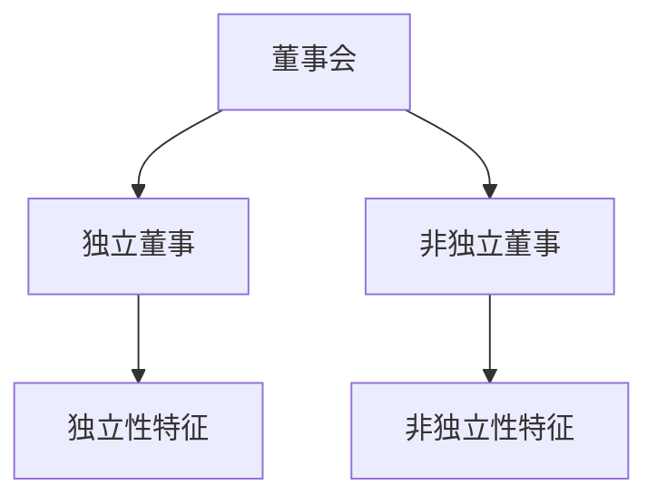

                 

<think>
好的，我将按照您的要求逐步分析和撰写《彼得林奇对公司董事会独立性的评估》的技术博客文章。让我们从背景和核心概念开始。

---

# 彼得林奇对公司董事会独立性的评估

> 关键词：彼得林奇、董事会独立性、公司治理、投资决策、独立董事、治理效率

> 摘要：  
本文深入探讨了彼得·林奇对董事会独立性的评估方法，分析了董事会独立性在公司治理中的重要性及其对投资决策的影响。通过详细阐述核心概念、评估标准和数学模型，本文为投资者和公司治理者提供了实用的评估工具和方法。

---

## 第一部分: 背景介绍与核心概念

### 第1章: 董事会独立性概述

#### 1.1 董事会独立性的定义与背景

##### 1.1.1 董事会独立性的基本概念  
董事会独立性是指董事会成员在决策过程中不受公司内部利益或其他外部因素的不当影响，能够独立履行职责的能力。这种独立性是公司治理健康运行的基础，能够确保董事会的决策更加公正、透明和高效。

##### 1.1.2 独立性在公司治理中的重要性  
独立的董事会能够有效监督管理层，防止利益冲突和权力滥用，从而保护股东和其他利益相关者的权益。对于投资者而言，董事会独立性是评估公司治理质量的重要指标，也是投资决策的关键因素之一。

##### 1.1.3 彼得·林奇对董事会独立性的关注点  
彼得·林奇作为著名投资专家，强调董事会独立性对投资价值的影响。他认为，独立的董事会能够更好地监督管理层，降低公司经营风险，从而为股东创造更大的价值。

---

#### 1.2 董事会独立性的核心要素

##### 1.2.1 董事会的结构与功能  
董事会是公司的最高决策机构，负责制定公司战略、监督高管行为并确保公司合规运营。其结构和功能直接影响董事会的独立性。

##### 1.2.2 独立董事的定义与角色  
独立董事是指不在公司内部任职的董事，他们通常具备丰富的行业经验，能够为董事会提供独立的见解和建议。独立董事在董事会中扮演着关键的监督和制衡角色。

##### 1.2.3 独立性与公司治理效率的关系  
独立性是公司治理效率的重要保障。独立的董事会能够提高决策质量，优化公司运营，从而提升公司整体效率和竞争力。

---

#### 1.3 独立性评估的背景与意义

##### 1.3.1 公司治理中的独立性问题  
在实际公司治理中，董事会独立性问题较为普遍。一些公司董事会存在内部人控制、利益输送等问题，影响了董事会的独立性和决策效率。

##### 1.3.2 彼得·林奇的投资视角与董事会独立性  
林奇认为，董事会独立性是衡量公司治理健康的重要标准。他通过分析董事会的独立性，筛选出具有长期投资价值的公司。

##### 1.3.3 独立性评估的现实意义  
独立性评估不仅有助于优化公司治理，还能为投资者提供重要的决策依据，降低投资风险。

---

### 第2章: 董事会独立性的核心概念与联系

#### 2.1 核心概念原理

##### 2.1.1 董事会独立性的核心要素  
- 董事会成员的独立性：独立董事的比例和背景。
- 决策过程的独立性：董事会在决策中是否受到内部或外部因素的干扰。
- 监督机制的独立性：董事会是否具备独立的监督能力和制衡机制。

##### 2.1.2 独立董事的独立性特征  
- 独立董事的独立性主要体现在其决策不受公司内部利益的影响。
- 独立董事的专业背景和经验能够为董事会提供独立的见解。

##### 2.1.3 董事会结构与独立性的关系  
董事会的结构直接影响其独立性。合理的董事会结构能够保证独立董事的比例和质量，从而提升董事会的独立性。

---

#### 2.2 核心概念对比表格

##### 表2-1: 独立董事与非独立董事的特征对比

| 特征               | 独立董事                  | 非独立董事                |
|--------------------|---------------------------|---------------------------|
| 聘任方式           | 由股东选举，不受公司内部影响 | 由公司内部提名，可能存在利益关联 |
| 职责重点           | 监督和制衡管理层           | 支持和协助管理层           |
| 独立性要求         | 高                        | 较低                       |
| 专业背景           | 通常具备丰富的行业经验    | 可能与公司存在利益关系     |

---

#### 2.3 ER实体关系图

##### 图2-1: 董事会独立性评估的ER关系图

---

## 第3章: 彼得·林奇的董事会独立性评估方法

### 3.1 评估方法概述

#### 3.1.1 定性评估方法  
定性评估主要通过分析董事会的结构、独立董事的比例以及董事会的决策过程来评估其独立性。

#### 3.1.2 定量评估方法  
定量评估通过量化指标，如独立董事比例、独立董事的专业背景评分等，来评估董事会独立性。

#### 3.1.3 综合评估模型  
综合评估模型结合定性和定量方法，通过加权计算得出董事会独立性的综合指数。

---

### 3.2 独立性评估的核心指标

#### 3.2.1 独立董事比例  
独立董事比例是衡量董事会独立性的重要指标。一般来说，独立董事比例越高，董事会的独立性越强。

#### 3.2.2 独立董事的专业背景  
独立董事的专业背景和经验能够提升董事会的独立性和决策质量。

#### 3.2.3 独立董事的决策参与度  
独立董事在决策过程中的参与度越高，董事会的独立性越强。

---

### 3.3 评估标准与流程

#### 3.3.1 评估流程的步骤  
1. 收集董事会成员信息。
2. 分析独立董事的比例和背景。
3. 评估董事会的决策过程和监督机制。
4. 综合评估得出独立性指数。

#### 3.3.2 评估标准的制定  
评估标准应根据公司规模、行业特点和治理环境等因素制定。

#### 3.3.3 评估结果的分析  
评估结果应结合公司实际情况进行分析，找出改进的方向。

---

## 第4章: 数学模型与公式

### 4.1 独立性指数计算公式

独立性指数的计算公式如下：

$$独立性指数 = 独立董事比例 \times 专业背景评分 \times 参与度评分$$

其中，独立董事比例的取值范围是0到1，专业背景评分和参与度评分的取值范围是1到5分。

---

### 4.2 独立性评估的权重分配

权重分配模型如下：

$$权重分配 = 独立董事比例 \times 0.5 + 专业背景评分 \times 0.3 + 参与度评分 \times 0.2$$

---

通过以上分析，我们详细探讨了彼得·林奇对董事会独立性的评估方法，从核心概念到评估标准，再到数学模型，为投资者和公司治理者提供了全面的参考。后续章节将结合实际案例，进一步深入分析董事会独立性评估的系统架构和实战应用。

