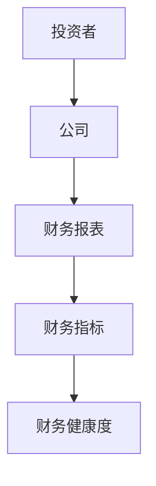
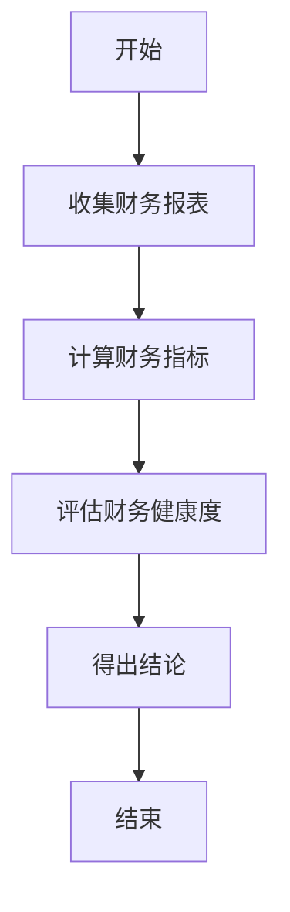
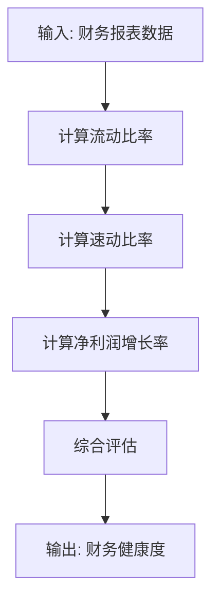
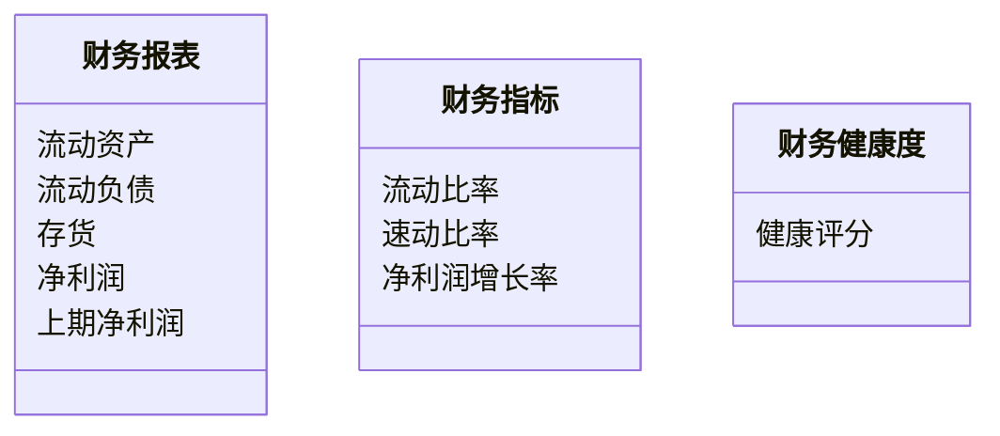
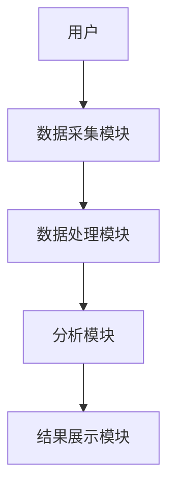

                 


# 彼得林奇对公司财务健康度的分析

> 关键词：彼得·林奇，财务健康度，公司分析，投资策略，算法原理

> 摘要：本文深入探讨了彼得·林奇对公司财务健康度的分析方法，结合其投资理念，详细讲解了财务健康度的核心概念、算法原理、系统架构设计以及实际案例分析，帮助读者全面理解并掌握这一分析方法。

---

## 第1章: 彼得·林奇与财务健康度分析概述

### 1.1 彼得·林奇的生平与投资理念

#### 1.1.1 彼得·林奇的生平简介
彼得·林奇（Peter Lynch）是美国著名的投资专家，被誉为“基金教父”。他从1971年到1990年担任富达麦哲伦基金的经理，创造了年均29%的惊人回报率。林奇的成功不仅在于其卓越的投资业绩，更在于他对公司基本面的深刻理解和对财务数据的敏锐洞察。

#### 1.1.2 彼得·林奇的投资哲学
林奇强调，投资成功的关键在于对公司的深入了解。他主张投资者应关注公司的财务报表，尤其是收入、利润、负债等关键指标，以评估公司的财务健康状况和未来盈利能力。

#### 1.1.3 财务健康度分析在投资中的重要性
财务健康度分析是林奇投资策略的核心部分。他认为，只有通过深入分析公司的财务报表，才能准确判断公司的经营状况，预测其未来的发展趋势。

---

### 1.2 财务健康度分析的核心概念

#### 1.2.1 财务健康度的定义与内涵
财务健康度是指公司在一定时期内，通过合理运用资产、控制成本、优化负债等方式，实现稳健经营和持续发展的能力。它是衡量公司财务状况健康与否的重要指标。

#### 1.2.2 财务健康度分析的必要性
通过财务健康度分析，投资者可以评估公司的偿债能力、盈利能力、运营效率和成长潜力，从而做出更加明智的投资决策。

#### 1.2.3 彼得·林奇分析方法的独特性
林奇的分析方法注重对公司基本面的深入挖掘，尤其是对财务数据的量化分析。他提出了许多独特的财务指标和分析方法，帮助投资者更准确地评估公司的财务状况。

---

### 1.3 本书的结构与目标

#### 1.3.1 本书的核心目标
本书旨在通过系统介绍彼得·林奇的财务健康度分析方法，帮助读者掌握这一分析工具，并能够在实际投资中灵活运用。

#### 1.3.2 本书的章节安排
- 第1章：彼得·林奇与财务健康度分析概述
- 第2章：财务健康度分析的背景与问题背景
- 第3章：彼得·林奇财务健康度分析的核心概念与联系
- 第4章：财务健康度分析的算法原理
- 第5章：系统分析与架构设计方案
- 第6章：项目实战与案例分析
- 第7章：最佳实践、小结与注意事项

#### 1.3.3 本书的适用读者
本书适合所有对投资分析、财务管理和公司分析感兴趣的人群，尤其是那些希望深入理解彼得·林奇投资理念的投资者和金融从业者。

---

## 第2章: 财务健康度分析的背景与问题背景

### 2.1 财务健康度分析的背景介绍

#### 2.1.1 财务健康度的定义
财务健康度是衡量公司财务状况健康程度的重要指标，通常通过分析公司的财务报表（如资产负债表、利润表和现金流量表）来评估。

#### 2.1.2 财务健康度分析的必要性
在复杂的经济环境中，公司财务健康度分析能够帮助投资者识别潜在风险，优化投资决策。

#### 2.1.3 财务健康度分析的边界与外延
财务健康度分析不仅关注公司当前的财务状况，还注重其未来的发展潜力。分析范围包括资产、负债、收入、利润等多个方面。

---

### 2.2 财务健康度分析的核心要素

#### 2.2.1 财务报表的基本构成
- 资产负债表：反映公司资产、负债和所有者权益的状况。
- 利润表：展示公司在一定时期内的收入和利润情况。
- 现金流量表：记录公司现金流入和流出的情况。

#### 2.2.2 财务健康度的核心指标
- 流动比率：流动资产/流动负债，衡量公司的短期偿债能力。
- 速动比率：（流动资产 - 存货）/流动负债，进一步评估公司的短期财务健康状况。
- 净利润增长率：净利润/上期净利润，反映公司的盈利能力。

#### 2.2.3 财务健康度分析的逻辑框架
- 收集数据：获取公司的财务报表。
- 计算指标：根据财务报表计算各项财务指标。
- 综合评估：结合指标分析公司的财务健康状况。

---

## 第3章: 彼得·林奇财务健康度分析的核心概念与联系

### 3.1 核心概念的原理与特征

#### 3.1.1 财务健康度分析的核心原理
林奇的财务健康度分析基于对公司基本面的深入研究，通过量化分析财务指标，评估公司的财务状况。

#### 3.1.2 财务健康度分析的关键特征
- 客观性：基于财务数据的定量分析。
- 系统性：综合考虑多个财务指标。
- 可比性：适用于不同行业的公司。

---

### 3.2 核心概念的属性特征对比

#### 3.2.1 财务指标的属性对比
| 指标名称   | 定义                                   | 关键作用                   |
|------------|--------------------------------------|---------------------------|
| 流动比率    | 流动资产/流动负债                    | 评估短期偿债能力           |
| 速动比率    | （流动资产 - 存货）/流动负债        | 更精确地评估短期财务健康   |
| 净利润增长率 | 净利润/上期净利润                   | 反映公司盈利能力的变化     |

#### 3.2.2 财务健康度的特征对比
| 特征        | 描述                                   |
|-------------|--------------------------------------|
| 客观性       | 基于财务数据的定量分析               |
| 可比性       | 可用于不同行业和规模的公司比较       |
| 系统性       | 综合考虑多个财务指标                 |

---

### 3.3 实体关系图与流程图

#### 3.3.1 财务健康度分析的实体关系图


#### 3.3.2 财务健康度分析的流程图


---

## 第4章: 财务健康度分析的算法原理

### 4.1 算法原理概述

#### 4.1.1 财务健康度分析的算法框架


#### 4.1.2 财务健康度分析的数学模型
- 流动比率（Liquidity Ratio）：$L = \frac{\text{流动资产}}{\text{流动负债}}$
- 速动比率（Acid-Test Ratio）：$A = \frac{\text{流动资产} - \text{存货}}{\text{流动负债}}$
- 净利润增长率（Net Profit Growth）：$G = \frac{\text{净利润}}{\text{上期净利润}}$

#### 4.1.3 财务健康度分析的流程步骤
1. 收集公司财务报表数据。
2. 计算各项财务指标。
3. 综合评估公司的财务健康度。

---

### 4.2 算法实现与代码

#### 4.2.1 算法实现的代码框架
```python
def calculate_financial_health(finance_data):
    # 计算流动比率
    current_ratio = finance_data['流动资产'] / finance_data['流动负债']
    # 计算速动比率
    quick_ratio = (finance_data['流动资产'] - finance_data['存货']) / finance_data['流动负债']
    # 计算净利润增长率
    net_profit_growth = finance_data['净利润'] / finance_data['上期净利润']
    # 综合评估
    health_score = (current_ratio + quick_ratio + net_profit_growth) / 3
    return health_score
```

---

## 第5章: 系统分析与架构设计方案

### 5.1 问题场景介绍
本章将从系统架构的角度，分析如何实现彼得·林奇的财务健康度分析方法，并设计一个基于该方法的系统架构。

### 5.2 系统功能设计

#### 5.2.1 领域模型


#### 5.2.2 系统架构


---

## 第6章: 项目实战与案例分析

### 6.1 环境安装
本节将指导读者如何搭建环境，包括安装必要的Python库（如pandas、numpy）。

### 6.2 系统核心实现源代码
```python
import pandas as pd

def calculate_financial_health(finance_data):
    current_ratio = finance_data['流动资产'] / finance_data['流动负债']
    quick_ratio = (finance_data['流动资产'] - finance_data['存货']) / finance_data['流动负债']
    net_profit_growth = finance_data['净利润'] / finance_data['上期净利润']
    health_score = (current_ratio + quick_ratio + net_profit_growth) / 3
    return health_score

# 示例数据
data = {
    '流动资产': 1000000,
    '流动负债': 500000,
    '存货': 200000,
    '净利润': 100000,
    '上期净利润': 80000
}
finance_data = pd.DataFrame(data, index=[0])

health_score = calculate_financial_health(finance_data)
print(f"财务健康度评分为: {health_score}")
```

---

## 第7章: 最佳实践、小结与注意事项

### 7.1 最佳实践 tips
- 定期更新财务数据，确保分析结果的准确性。
- 综合考虑多个财务指标，避免单一指标误导。
- 结合行业特点，调整分析方法。

### 7.2 小结
通过本章的学习，读者应能够掌握彼得·林奇的财务健康度分析方法，并能够将其应用于实际投资分析中。

### 7.3 注意事项
- 数据的准确性和完整性是分析的基础。
- 分析结果仅供参考，需结合其他因素进行综合判断。
- 避免过度依赖单一分析方法。

### 7.4 拓展阅读
推荐读者阅读彼得·林奇的《彼得·林奇的投资哲学》和《股市稳赚》等书籍，以深入理解其投资理念。

---

## 附录: 总结与展望

### 附录1: 总结
彼得·林奇的财务健康度分析方法为投资者提供了一种科学的财务评估工具。通过量化分析财务指标，投资者可以更好地评估公司的财务状况，做出更加明智的投资决策。

### 附录2: 展望
未来，随着人工智能和大数据技术的发展，财务健康度分析将更加智能化和自动化。投资者可以通过更加精准的算法和工具，进一步提升分析的效率和准确性。

---

以上为《彼得林奇对公司财务健康度的分析》一书的完整目录大纲和文章内容，涵盖了从基础概念到实际应用的各个方面，帮助读者全面理解和掌握彼得·林奇的财务健康度分析方法。

