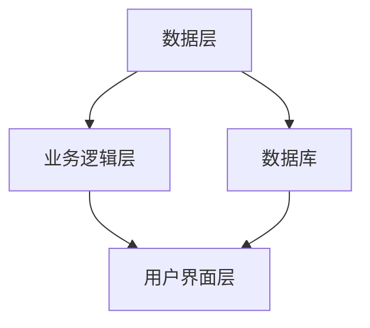
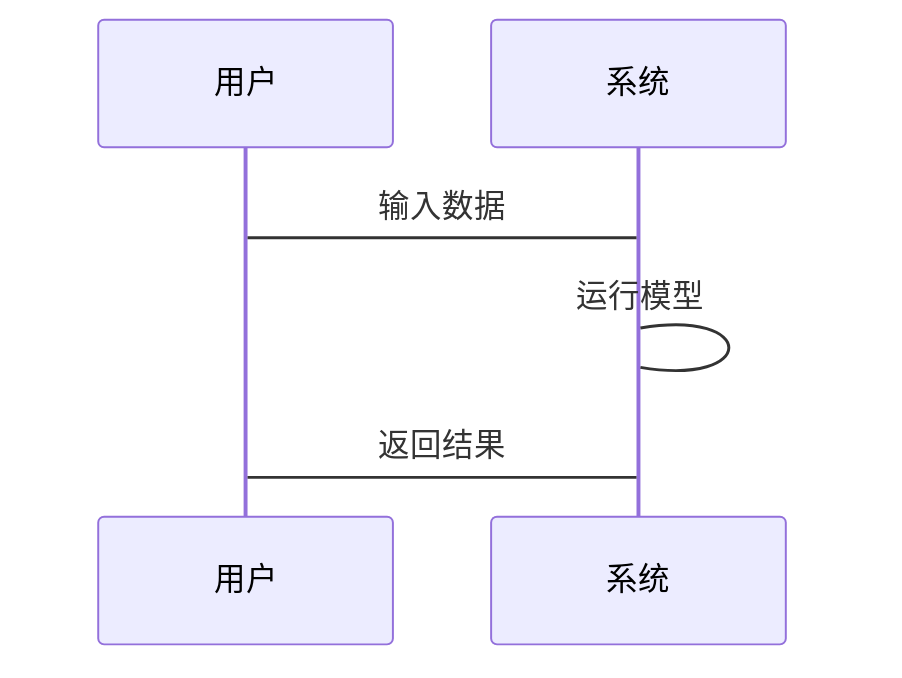

                 


# 彼得林奇对公司财务弹性的多情景压力测试方法

---

## 关键词：  
彼得林奇、财务弹性、多情景压力测试、风险管理、蒙特卡洛模拟、公司财务

---

## 摘要：  
本文深入探讨了彼得林奇提出的多情景压力测试方法，重点分析其在公司财务弹性评估中的应用。通过系统化的理论阐述、数学模型建立和实际案例分析，本文详细解析了如何通过多情景压力测试方法评估公司在不同经济环境下的财务弹性，帮助企业在复杂多变的市场中提前识别和应对潜在风险。文章结构清晰，内容丰富，适合风险管理、财务分析和投资领域的专业人士阅读。

---

## 第一部分：财务弹性与压力测试概述

### 第1章：财务弹性与压力测试的基本概念

#### 1.1 财务弹性的定义与特征

##### 1.1.1 财务弹性的定义
财务弹性是指公司在面对外部环境变化时，能够调整其财务结构和运营策略，以维持或恢复财务健康的能力。这种弹性不仅体现在公司应对短期波动的能力上，还体现在其长期发展的灵活性上。

##### 1.1.2 财务弹性的关键特征
财务弹性具有以下关键特征：
- **适应性**：公司能够根据外部环境的变化调整财务策略。
- **抗风险性**：公司在面临危机时能够保持财务稳定。
- **恢复性**：公司在遭受冲击后能够迅速恢复财务健康。

##### 1.1.3 财务弹性在企业风险管理中的作用
财务弹性是企业风险管理的核心内容之一。通过评估财务弹性，企业可以识别潜在风险，制定应对策略，并在危机发生时快速响应，降低损失。

---

#### 1.2 多情景压力测试的定义与目的

##### 1.2.1 多情景压力测试的定义
多情景压力测试是一种通过模拟多种可能的经济情景，评估公司在不同环境下的财务表现的方法。它不仅考虑单一风险因素，还综合考虑多种风险因素的相互作用。

##### 1.2.2 多情景压力测试的目的
多情景压力测试的主要目的是：
- **识别潜在风险**：通过模拟极端情景，发现公司财务中的潜在问题。
- **评估应对能力**：检验公司在不同环境下的财务弹性。
- **制定应对策略**：基于测试结果，制定有效的风险管理措施。

##### 1.2.3 多情景压力测试与传统压力测试的区别
传统的压力测试通常只考虑单一风险因素，而多情景压力测试则综合考虑多种风险因素，模拟更为复杂和真实的经济环境。

---

### 第2章：财务弹性与压力测试的理论基础

#### 2.1 财务弹性的理论模型

##### 2.1.1 财务弹性理论的提出
财务弹性理论是由彼得林奇在其投资分析中提出的，旨在帮助投资者评估公司的财务健康状况。

##### 2.1.2 财务弹性理论的核心假设
- 公司的财务状况会受到外部经济环境的影响。
- 公司可以通过调整财务结构和运营策略来应对环境变化。

##### 2.1.3 财务弹性理论的数学表达
财务弹性可以通过以下公式进行衡量：
$$
\text{财务弹性} = \frac{\text{收入变化}}{\text{净利润变化}}
$$

---

#### 2.2 多情景压力测试的理论框架

##### 2.2.1 多情景压力测试的理论基础
多情景压力测试基于概率论和统计学原理，通过模拟多种经济情景来评估公司的财务风险。

##### 2.2.2 多情景压力测试的核心假设
- 经济环境的变化是随机的且可以被模拟。
- 公司的财务表现可以通过数学模型进行预测。

##### 2.2.3 多情景压力测试的数学模型
多情景压力测试常用的数学模型包括：
1. 蒙特卡洛模拟模型
2. 情景分析模型
3. 风险度量模型

---

### 第3章：多情景压力测试方法的数学模型

#### 3.1 压力测试的基本数学模型

##### 3.1.1 线性回归模型
线性回归模型用于分析变量之间的线性关系：
$$
y = \beta_0 + \beta_1 x + \epsilon
$$

##### 3.1.2 非线性回归模型
非线性回归模型用于分析变量之间的非线性关系：
$$
y = f(x, \beta) + \epsilon
$$

##### 3.1.3 时间序列分析模型
时间序列分析模型用于分析数据随时间的变化趋势。

---

#### 3.2 多情景压力测试的数学模型

##### 3.2.1 蒙特卡洛模拟模型
蒙特卡洛模拟通过随机抽样来模拟多种经济情景，计算公司财务表现的概率分布。

##### 3.2.2 情景分析模型
情景分析模型通过设定不同的经济情景，评估公司财务表现的变化。

##### 3.2.3 风险度量模型
风险度量模型用于量化公司在不同情景下的财务风险，常用的指标包括VaR（在险价值）和CVaR（条件在险价值）。

---

## 第4章：多情景压力测试的系统架构设计

### 4.1 系统功能设计

#### 4.1.1 数据输入模块
数据输入模块负责接收和处理输入的经济数据和公司财务数据。

#### 4.1.2 模型计算模块
模型计算模块基于输入数据，运行多情景压力测试模型，生成测试结果。

#### 4.1.3 结果展示模块
结果展示模块以图表和报告的形式，直观展示测试结果，帮助用户理解和分析。

---

### 4.2 系统架构图

#### 4.2.1 系统架构图的描述
系统采用分层架构，包括数据层、业务逻辑层和用户界面层。

#### 4.2.2 系统架构图的实现


---

### 4.3 系统接口设计

#### 4.3.1 输入接口
输入接口负责接收外部数据，如经济指标和公司财务数据。

#### 4.3.2 输出接口
输出接口负责将测试结果传递给用户界面或外部系统。

---

### 4.4 系统交互流程

#### 4.4.1 交互流程描述
用户输入数据，系统运行模型，生成结果并反馈给用户。

#### 4.4.2 交互流程图


---

## 第5章：项目实战

### 5.1 环境安装与配置

#### 5.1.1 开发环境的安装
安装Python、Jupyter Notebook和相关库（如numpy、pandas、scipy）。

#### 5.1.2 数据库的配置
配置MySQL或MongoDB数据库，用于存储经济数据和公司财务数据。

#### 5.1.3 开发工具的安装
安装PyCharm或Jupyter Notebook作为开发工具。

---

### 5.2 核心代码实现

#### 5.2.1 数据处理代码
```python
import numpy as np
import pandas as pd

# 读取数据
data = pd.read_csv('economic_data.csv')

# 数据预处理
data = data.dropna()
```

#### 5.2.2 模型计算代码
```python
from scipy.stats import norm

# 蒙特卡洛模拟
np.random.seed(123)
simulations = 1000
results = []
for _ in range(simulations):
    # 随机生成经济情景
    scenario = np.random.normal(loc=0, scale=1, size=len(data))
    # 计算财务表现
    profit = data['revenue'] * (1 + scenario)
    results.append(profit.mean())
```

#### 5.2.3 结果展示代码
```python
import matplotlib.pyplot as plt

# 绘制结果图表
plt.hist(results, bins=50, edgecolor='black')
plt.xlabel('Profit')
plt.ylabel('Frequency')
plt.title('Monte Carlo Simulation Results')
plt.show()
```

---

### 5.3 实际案例分析

#### 5.3.1 案例背景
假设我们有一家制造业公司，需要评估其在不同经济情景下的财务弹性。

#### 5.3.2 数据分析与建模
使用蒙特卡洛模拟生成1000种经济情景，计算公司在每种情景下的净利润。

#### 5.3.3 结果解读
分析结果分布，发现公司在极端情景下的净利润为负，需采取措施降低风险。

---

### 5.4 项目小结

#### 5.4.1 核心代码功能总结
- 数据处理：清洗和预处理数据。
- 模型计算：生成多种经济情景，计算公司财务表现。
- 结果展示：可视化结果，帮助用户理解。

#### 5.4.2 项目实现的关键点
- 数据的准确性和完整性。
- 模型的合理性和适用性。
- 结果的可解释性和实用性。

---

## 第6章：总结与最佳实践

### 6.1 总结

#### 6.1.1 本书的核心内容回顾
通过多情景压力测试方法，评估公司在不同经济环境下的财务弹性，帮助企业在复杂环境中制定有效的风险管理策略。

#### 6.1.2 多情景压力测试方法的应用总结
多情景压力测试是一种有效的风险管理工具，能够帮助公司提前识别和应对潜在风险。

---

### 6.2 最佳实践 tips

#### 6.2.1 实际应用中的注意事项
- 确保数据的准确性和完整性。
- 合理选择经济情景和模型参数。
- 定期更新模型和数据。

#### 6.2.2 模型优化的建议
- 引入机器学习算法，提高模型的预测精度。
- 结合实际业务需求，优化模型结构。

#### 6.2.3 拓展阅读推荐
- 《投资学》（作者：约翰·C·弗伦奇）
- 《风险管理与金融创新》（作者：理查德·阿瑟·罗尔）

---

### 6.3 小结

#### 6.3.1 本书的主要收获
通过学习彼得林奇的多情景压力测试方法，读者能够掌握一种有效的财务风险管理工具，提升公司在复杂环境下的应对能力。

#### 6.3.2 未来研究方向展望
未来可以进一步研究多情景压力测试在不同行业中的应用，探索更先进的算法和模型。

---

**本文通过系统化的理论分析、数学模型建立和实际案例分析，全面阐述了彼得林奇的多情景压力测试方法在公司财务弹性评估中的应用。希望读者能够通过本文，掌握这一重要的风险管理工具，并在实际工作中灵活运用。**

