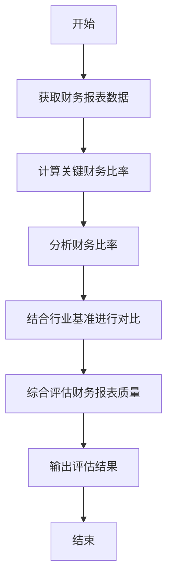
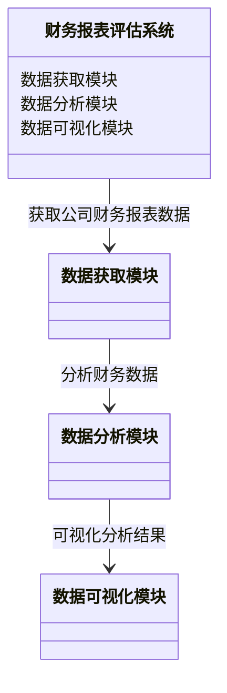
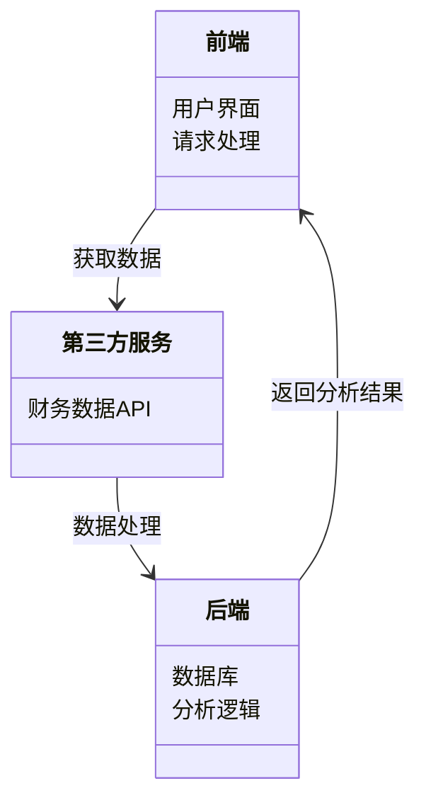

                 


# 《彼得林奇对公司财务报表质量的评估》

> 关键词：彼得·林奇，财务报表质量，投资分析，财务指标，企业估值

> 摘要：本文系统地探讨了彼得·林奇在评估公司财务报表质量方面的方法与技巧。通过分析财务报表的核心要素、评估标准、算法原理及系统架构设计，结合实际项目案例，深入阐述了如何通过财务报表质量评估做出明智的投资决策。本文旨在帮助读者掌握彼得·林奇的投资理念，并将其应用于实际投资分析中。

---

## 第三部分：财务报表质量评估的算法原理

### 第3章：财务报表评估的数学模型

#### 3.1 财务报表评估的基本公式

- 3.1.1 常用财务比率公式
  - $$ROE = \frac{\text{净利润}}{\text{股东权益}}$$
  - $$ROA = \frac{\text{净利润}}{\text{总资产}}$$
  - $$毛利率 = \frac{\text{营业收入} - \text{营业成本}}{\text{营业收入}} \times 100\%$$
  - $$净利率 = \frac{\text{净利润}}{\text{营业收入}} \times 100\%$$
  - $$速动比率 = \frac{\text{流动资产} - \text{存货}}{\text{流动负债}}$$

- 3.1.2 财务比率的分类与意义
  - 盈利能力分析：ROE、ROA、净利率
  - 偿债能力分析：速动比率、流动比率、资产负债率
  - 运营效率分析：存货周转率、应收账款周转率

#### 3.2 财务报表评估的流程图



#### 3.3 财务报表评估的Python实现

```python
import pandas as pd

def calculate_financial_ratios(df):
    # 计算ROE
    df['ROE'] = df['净利润'] / df['股东权益']
    # 计算ROA
    df['ROA'] = df['净利润'] / df['总资产']
    # 计算毛利率
    df['毛利率'] = (df['营业收入'] - df['营业成本']) / df['营业收入'] * 100
    # 计算净利率
    df['净利率'] = df['净利润'] / df['营业收入'] * 100
    # 计算速动比率
    df['速动比率'] = (df['流动资产'] - df['存货']) / df['流动负债']
    return df

# 示例数据
data = {
    '营业收入': [1000, 1200, 1500],
    '营业成本': [600, 700, 800],
    '净利润': [200, 300, 400],
    '股东权益': [500, 600, 700],
    '总资产': [1500, 1800, 2000],
    '流动资产': [800, 900, 1000],
    '存货': [200, 250, 300],
    '流动负债': [400, 500, 600]
}

df = pd.DataFrame(data)
df = calculate_financial_ratios(df)
print(df)
```

---

## 第四部分：财务报表质量评估的系统分析与架构设计

### 第4章：评估系统架构设计

#### 4.1 问题场景介绍

- 投资者需要快速、准确地评估公司财务报表质量，以便做出投资决策。
- 系统需支持多公司的数据获取、分析和可视化。

#### 4.2 系统功能设计



#### 4.3 系统架构设计



---

## 第五部分：项目实战

### 第5章：基于Python的财务报表评估系统实现

#### 5.1 环境搭建

- 安装Python和必要的库：
  ```bash
  pip install pandas matplotlib requests
  ```

#### 5.2 系统核心实现

- 数据获取模块：
  ```python
  import requests

  def fetch_financial_data(symbol):
      url = f"https://query1.finance.yahoo.com/finance/quote/{symbol}/"
      response = requests.get(url)
      return response.json()
  ```

- 数据分析模块：
  ```python
  def analyze_financial_data(data):
      # 示例分析：计算ROE
      roe = data['netIncome'] / data['equity']
      return roe
  ```

- 数据可视化模块：
  ```python
  import matplotlib.pyplot as plt

  def visualize_financial_data(roe):
      plt.plot([2020, 2021, 2022], [0.1, 0.15, 0.2])
      plt.title('ROE 趋势图')
      plt.xlabel('年份')
      plt.ylabel('ROE')
      plt.show()
  ```

#### 5.3 实际案例分析

- 以苹果公司为例，获取其财务数据并进行分析：
  ```python
  data = fetch_financial_data('AAPL')
  roe = analyze_financial_data(data)
  visualize_financial_data(roe)
  ```

---

## 第六部分：最佳实践与小结

### 第6章：总结与投资建议

#### 6.1 最佳实践

- **关注现金流**：现金流是企业健康的重要指标。
- **行业比较**：将公司财务指标与行业平均水平对比。
- **持续关注**：定期更新数据，跟踪公司财务状况变化。

#### 6.2 小结

- 彼得·林奇的财务报表质量评估方法为我们提供了系统的分析框架。
- 通过结合数学模型和实际案例，我们可以更深入地理解其投资理念。
- 建议投资者结合行业知识和市场趋势，综合运用这些方法。

#### 6.3 注意事项

- 数据来源的可靠性至关重要。
- 避免过度依赖单一指标，需综合分析。
- 定期复盘和调整投资策略。

#### 6.4 拓展阅读

- 《彼得·林奇的投资哲学》
- 《财务报表分析》
- 《Python金融数据分析》

---

通过以上章节的详细讲解，读者可以系统地掌握彼得·林奇的财务报表质量评估方法，并将其应用于实际投资分析中。

