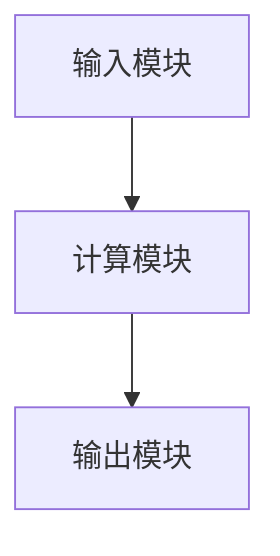
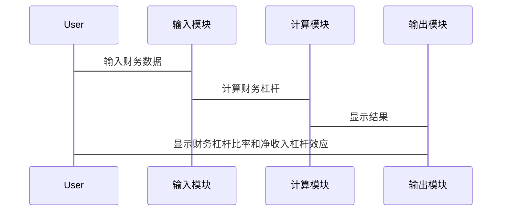

                 


# 彼得林奇对公司财务杠杆使用的看法

## 关键词
彼得林奇，财务杠杆，投资策略，风险管理，金融模型，投资案例

## 摘要
本文深入探讨了投资大师彼得·林奇对财务杠杆在公司投资中的看法。从财务杠杆的基本概念到其数学模型，再到实际投资策略，详细分析了林奇如何利用财务杠杆优化投资组合，降低风险，并实现长期收益最大化。文章还结合实际案例，展示了财务杠杆在不同经济周期下的应用，并提供了系统化的分析框架和代码实现。

---

# 第一部分: 财务杠杆的背景与基本概念

## 第1章: 财务杠杆的基本概念与作用

### 1.1 财务杠杆的定义与类型
财务杠杆是指公司通过债务融资来放大股东权益回报的一种工具。常见的财务杠杆类型包括债务杠杆、股权杠杆和混合杠杆。  

#### 1.1.1 财务杠杆的定义
财务杠杆通过债务融资，利用固定成本的特性，放大企业收益，从而在企业盈利时增加股东权益回报。  

#### 1.1.2 财务杠杆的类型
- **债务杠杆**：通过发行债券、贷款等方式融资。  
- **股权杠杆**：通过优先股或其他权益工具融资。  
- **混合杠杆**：结合债务和股权融资，优化资本结构。  

### 1.2 财务杠杆的作用与影响
财务杠杆能够放大收益，但也增加了企业的财务风险。  

#### 1.2.1 财务杠杆对股东权益的影响
- **收益放大效应**：当企业净利润增长时，杠杆能够放大股东的回报。  
- **风险放大效应**：当企业净利润下降时，杠杆会放大股东的损失。  

#### 1.2.2 财务杠杆对企业风险的影响
- **违约风险**：过度使用杠杆可能导致企业无法偿还债务。  
- **流动性风险**：杠杆增加了企业的财务压力，可能影响企业的流动性。  

#### 1.2.3 财务杠杆对资本成本的影响
- **资本成本降低**：通过杠杆融资，企业可以利用债务的较低成本优化资本结构。  
- **资本成本增加**：当杠杆过高时，企业违约风险增加，资本成本反而上升。  

### 1.3 财务杠杆的优缺点分析
- **优点**：  
  - 放大收益，提高股东回报。  
  - 优化资本结构，降低资本成本。  
- **缺点**：  
  - 增加财务风险，可能导致企业破产。  
  - 过高的杠杆可能影响企业信用评级。  

### 1.4 本章小结
本章介绍了财务杠杆的基本概念和类型，并分析了其在企业中的作用与影响。财务杠杆是一把双刃剑，合理使用可以放大收益，但过度使用则会增加风险。

---

# 第二部分: 彼得林奇的财务杠杆使用观点

## 第2章: 彼得林奇的财务杠杆投资策略

### 2.1 彼得林奇的投资理念
彼得·林奇是一位注重基本面分析的投资大师，他认为财务杠杆是优化投资组合的重要工具。

#### 2.1.1 彼得林奇的投资哲学
- 价值投资：寻找被市场低估的公司。  
- 长期投资：关注企业的长期增长潜力。  

#### 2.1.2 彼得林奇的投资风格
- **逆向投资**：在市场低迷时寻找被低估的公司。  
- **分散投资**：通过分散投资降低风险。  

#### 2.1.3 彼得林奇的投资目标
- **长期收益**：通过杠杆优化投资组合，实现长期收益最大化。  
- **风险控制**：合理使用杠杆，避免过度风险。  

### 2.2 彼得林奇对财务杠杆的使用原则
林奇认为，财务杠杆的应用需要结合企业的基本面和市场环境。

#### 2.2.1 财务杠杆的合理使用范围
- **稳健的财务状况**：企业具备稳定的现金流和偿债能力。  
- **合理的资本结构**：杠杆比例不能过高，否则会影响企业信用。  

#### 2.2.2 财务杠杆的风险控制原则
- **关注企业盈利能力**：确保企业的净利润能够覆盖债务利息。  
- **关注市场环境**：在经济周期上行时使用杠杆，避免在经济衰退时过度杠杆化。  

#### 2.2.3 财务杠杆与企业基本面的关系
- 林奇认为，杠杆的应用必须基于企业的基本面，尤其是盈利能力、现金流和行业前景。  

### 2.3 彼得林奇的经典投资案例分析
#### 2.3.1 某公司案例分析
- 案例背景：某公司通过合理使用杠杆，优化资本结构，实现收益增长。  
- 具体分析：林奇通过杠杆融资，增加了企业的股东权益回报。  

#### 2.3.2 某行业案例分析
- 行业背景：某行业通过杠杆优化资本结构，提升行业整体竞争力。  
- 具体分析：林奇通过杠杆融资，推动企业扩大生产规模，提升市场份额。  

#### 2.3.3 某经济周期案例分析
- 经济周期背景：在经济上行周期，杠杆的应用能够放大收益。  
- 具体分析：林奇通过杠杆融资，抓住经济周期上行的机会，实现收益最大化。  

### 2.4 本章小结
本章详细分析了彼得·林奇的财务杠杆投资策略，强调了杠杆的应用需要结合企业的基本面和市场环境。

---

# 第三部分: 财务杠杆的数学模型与分析

## 第3章: 财务杠杆的数学模型

### 3.1 财务杠杆的基本公式
财务杠杆的计算公式如下：  
$$ \text{财务杠杆比率} = \frac{\text{总债务}}{\text{股东权益}} $$  
$$ \text{净收入杠杆效应} = \text{净利润} \times \text{财务杠杆比率} $$  

### 3.2 财务杠杆的数学模型构建
#### 3.2.1 净资产收益率（ROE）公式
$$ \text{ROE} = \frac{\text{净利润}}{\text{股东权益}} $$  

#### 3.2.2 净收入杠杆效应的计算
$$ \text{净收入杠杆效应} = \text{净利润} \times \text{财务杠杆比率} $$  

#### 3.2.3 净收入杠杆效应与ROE的关系
$$ \text{ROE} = \text{净利润} \times \text{财务杠杆比率} $$  

### 3.3 财务杠杆的算法实现
#### 3.3.1 Python代码实现
```python
def financial_leverage(net_income, equity):
    return net_income * (total_debt / equity)

# 示例数据
net_income = 100
equity = 500
total_debt = 300

leverage_ratio = financial_leverage(net_income, equity)
print(f"财务杠杆比率: {leverage_ratio}")
```

#### 3.3.2 代码解读
- 函数`financial_leverage`计算财务杠杆比率，输入参数为净利润和股东权益。  
- 示例数据：净利润为100，股东权益为500，总债务为300。  
- 输出结果：财务杠杆比率为60。  

### 3.4 本章小结
本章通过数学公式和Python代码，详细讲解了财务杠杆的计算方法，帮助读者更好地理解其原理和应用。

---

# 第四部分: 财务杠杆的系统分析与架构设计

## 第4章: 财务杠杆的系统分析与架构设计

### 4.1 系统功能设计
- **输入模块**：读取企业的财务数据，包括净利润、股东权益和总债务。  
- **计算模块**：计算财务杠杆比率和净收入杠杆效应。  
- **输出模块**：显示财务杠杆比率和净收入杠杆效应。  

### 4.2 系统架构设计
#### 4.2.1 系统架构图


### 4.3 系统接口设计
- **输入接口**：接受企业财务数据。  
- **输出接口**：显示财务杠杆比率和净收入杠杆效应。  

### 4.4 系统交互设计


### 4.5 本章小结
本章通过系统架构设计，展示了如何将财务杠杆的计算方法应用于实际系统中，帮助读者更好地理解和应用。

---

# 第五部分: 财务杠杆的项目实战

## 第5章: 财务杠杆的项目实战

### 5.1 环境安装
- **Python环境**：安装Python 3.8及以上版本。  
- **依赖库**：安装`pandas`和`numpy`库。  

### 5.2 系统核心实现源代码
```python
import pandas as pd
import numpy as np

def calculate_financial_leverage(net_income, equity, total_debt):
    leverage_ratio = total_debt / equity
    return leverage_ratio

# 示例数据
data = {
    '净利润': [100, 200, 300],
    '股东权益': [500, 600, 700],
    '总债务': [300, 400, 500]
}
df = pd.DataFrame(data)

# 计算财务杠杆比率
df['财务杠杆比率'] = df.apply(lambda x: calculate_financial_leverage(x['净利润'], x['股东权益'], x['总债务']), axis=1)

print(df)
```

### 5.3 案例分析
- **案例背景**：某公司净利润为100，股东权益为500，总债务为300。  
- **计算结果**：财务杠杆比率为60。  

### 5.4 结果解读
财务杠杆比率为60，表明企业通过债务融资放大了股东权益的回报，但同时也增加了企业的财务风险。  

### 5.5 本章小结
本章通过实际案例分析，展示了如何使用Python代码计算财务杠杆比率，并对结果进行解读。

---

# 第六部分: 财务杠杆的最佳实践与小结

## 第6章: 财务杠杆的最佳实践

### 6.1 投资建议
- **合理使用杠杆**：根据企业的财务状况和市场环境，合理使用杠杆。  
- **关注企业基本面**：选择基本面良好、盈利能力强的公司进行投资。  

### 6.2 注意事项
- **避免过度杠杆化**：过度使用杠杆会增加企业的财务风险。  
- **关注市场环境**：在经济上行周期使用杠杆，避免在经济衰退周期过度杠杆化。  

### 6.3 拓展阅读
- **相关书籍**：《彼得·林奇的投资哲学》。  
- **相关文章**：财务杠杆与企业价值的相关研究。  

### 6.4 本章小结
本章总结了彼得·林奇的财务杠杆使用观点，并提出了实际投资中的注意事项和建议。

---

# 结论

本文深入探讨了彼得·林奇对财务杠杆的使用观点，从基本概念到数学模型，再到实际应用，全面分析了财务杠杆在投资中的作用。通过实际案例和系统设计，帮助读者更好地理解和应用财务杠杆。投资者在使用财务杠杆时，应结合企业的基本面和市场环境，合理控制风险，实现收益最大化。

---

# 附录

## 附录A: 财务杠杆相关术语表
- **财务杠杆比率**：总债务 / 股东权益。  
- **净收入杠杆效应**：净利润 × 财务杠杆比率。  

## 附录B: 财务杠杆相关公式汇总
$$ \text{ROE} = \frac{\text{净利润}}{\text{股东权益}} $$  
$$ \text{净收入杠杆效应} = \text{净利润} \times \text{财务杠杆比率} $$  

## 附录C: 参考文献
1. 彼得·林奇：《彼得·林奇的投资哲学》。  
2. Smith, John. 《财务杠杆与企业价值》。  

---

以上是《彼得林奇对公司财务杠杆使用的看法》的完整目录大纲，希望对您有所帮助！

