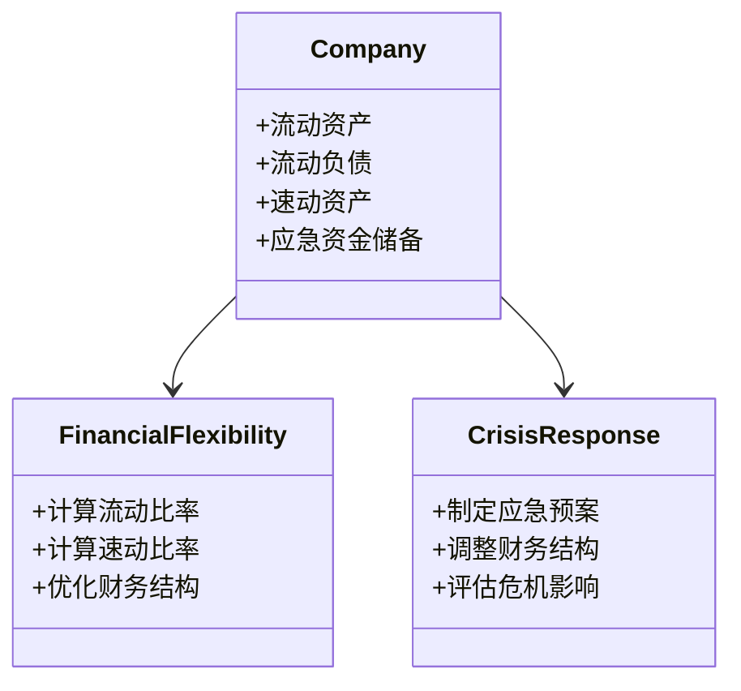
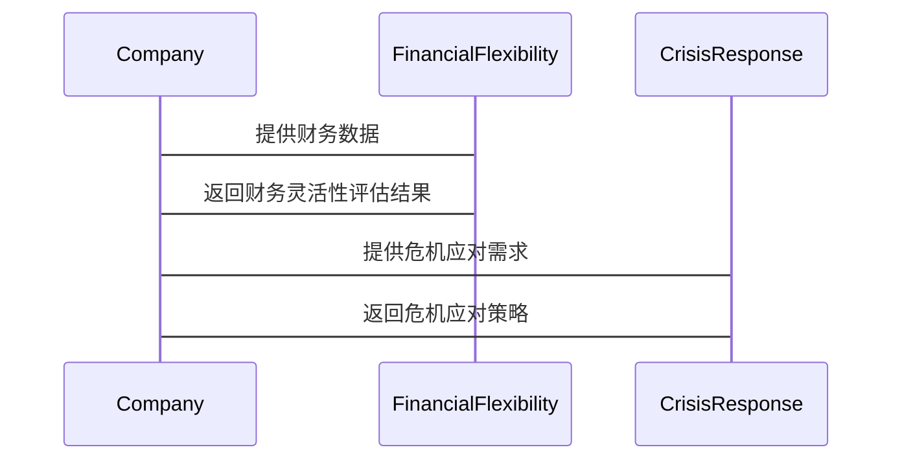

                 


# 彼得林奇对公司财务灵活性与危机应对能力的案例研究

> 关键词：财务灵活性，危机应对能力，彼得·林奇，公司财务，风险管理

> 摘要：本文通过分析彼得·林奇在管理公司财务灵活性和危机应对能力方面的经验，结合实际案例，探讨了财务灵活性与危机应对能力的核心概念、数学模型、系统架构设计和实际应用。文章从理论到实践，详细阐述了如何通过优化财务结构和制定有效的危机应对策略来提升公司的整体抗风险能力。

---

## 第一部分: 背景介绍与核心概念

### 第1章: 财务灵活性与危机应对能力的背景介绍

#### 1.1 财务灵活性的定义与重要性

财务灵活性是指企业在面对市场变化、经济波动或其他不确定性时，能够迅速调整其财务结构和资源分配，以维持或提升其财务健康状况的能力。它强调企业在资金流动、资产配置和负债管理方面的灵活性。

**1.1.1 财务灵活性的定义**

财务灵活性可以通过以下公式衡量：
$$
\text{财务灵活性} = \frac{\text{流动资产}}{\text{流动负债}}
$$

流动资产包括现金、应收账款和存货等，而流动负债则包括应付账款、短期贷款等。高财务灵活性意味着企业能够快速应对短期资金需求，降低财务风险。

**1.1.2 财务灵活性的重要性**

财务灵活性的重要性体现在以下几个方面：
1. **应对短期资金需求**：企业可能面临突发的资金短缺，财务灵活性高的企业能够迅速调整资产结构，确保资金链的稳定。
2. **降低财务风险**：通过优化财务结构，企业可以降低负债率，避免因债务过高导致的财务危机。
3. **提升市场竞争力**：财务灵活性强的企业能够更快地响应市场变化，抓住发展机遇。

**1.1.3 财务灵活性的边界与外延**

财务灵活性的边界在于企业的短期偿债能力，而其外延则涉及长期财务规划和战略管理。企业需要在短期和长期之间找到平衡，避免因过度追求短期灵活性而忽视长期发展目标。

---

#### 1.2 危机应对能力的定义与特点

危机应对能力是指企业在面对突发事件（如经济危机、市场波动等）时，能够迅速采取有效措施，最大限度地减少损失并恢复正常的经营能力。它强调企业在危机中的反应速度、决策能力和资源调配能力。

**1.2.1 危机应对能力的定义**

危机应对能力可以通过以下公式衡量：
$$
\text{危机应对能力} = \frac{\text{应急资金储备}}{\text{潜在危机损失}}
$$

应急资金储备包括企业的现金储备、备用流动性资产等，而潜在危机损失则包括因危机可能导致的收入下降、资产减值等。

**1.2.2 危机应对能力的特点**

危机应对能力的特点包括：
1. **突发性**：危机通常具有突发性和不可预测性，企业需要具备快速反应的能力。
2. **复杂性**：危机可能涉及多方面的因素，企业需要综合考虑各种应对措施。
3. **资源依赖性**：企业需要有足够的资金和资源支持危机应对措施。

**1.2.3 危机应对能力与财务灵活性的关系**

危机应对能力与财务灵活性密切相关。财务灵活性强的企业通常具有更强的危机应对能力，因为它们能够快速调整财务结构，确保在危机发生时有足够的资金支持。

---

#### 1.3 财务灵活性与危机应对能力的核心要素

**1.3.1 财务资源的流动性**

财务资源的流动性是指企业资产的变现能力。流动性强的资产（如现金、应收账款）能够快速转化为资金，支持企业的日常运营和危机应对。

**1.3.2 财务结构的合理性**

财务结构的合理性是指企业在资产、负债和所有者权益之间的比例是否合理。合理的财务结构能够降低企业的财务风险，提高其财务灵活性。

**1.3.3 危机应对的策略性**

危机应对的策略性是指企业在危机发生前制定的应对计划和策略。这包括制定应急资金储备、建立危机管理团队、制定危机应急预案等。

---

### 第2章: 财务灵活性与危机应对能力的核心概念与联系

#### 2.1 核心概念原理

财务灵活性和危机应对能力的核心概念原理如下：
1. **财务灵活性的原理**：通过优化流动资产和流动负债的比例，提高企业的短期偿债能力。
2. **危机应对能力的原理**：通过制定应急计划和储备资金，降低危机对企业财务状况的影响。

#### 2.2 核心概念属性特征对比表

| 属性       | 财务灵活性          | 危机应对能力      |
|------------|--------------------|-------------------|
| 定义       | 公司财务资源的流动性与调整能力 | 公司应对危机的策略与能力 |
| 核心要素   | 流动资产、负债结构、现金流 | 应急资金、危机管理团队、危机预案 |
| 重要性     | 保障公司运营稳定性 | 降低危机对公司的影响 |

#### 2.3 ER实体关系图

```mermaid
erd
  Company -- 财务灵活性: 具有财务灵活性
  Company -- 危机应对能力: 具有危机应对能力
  FinancialFlexibility -- CrisisResponse: 相互作用
```

---

## 第二部分: 财务灵活性与危机应对能力的数学模型与算法

### 第3章: 财务灵活性的数学模型

#### 3.1 财务灵活性的衡量指标

**3.1.1 流动比率**

流动比率是衡量企业短期偿债能力的重要指标，公式如下：
$$
\text{流动比率} = \frac{\text{流动资产}}{\text{流动负债}}
$$

**3.1.2 速动比率**

速动比率是流动比率的进一步优化，公式如下：
$$
\text{速动比率} = \frac{\text{速动资产}}{\text{流动负债}}
$$

速动资产包括现金、应收账款和存货等。

**3.1.3 现金比率**

现金比率是衡量企业短期偿债能力的最严格指标，公式如下：
$$
\text{现金比率} = \frac{\text{现金及现金等价物}}{\text{流动负债}}
$$

---

#### 3.2 财务灵活性的优化模型

**3.2.1 线性规划模型**

线性规划模型用于优化企业的财务结构，公式如下：
$$
\text{最大化} \quad Z = \text{流动资产} - \text{流动负债}
$$
约束条件：
$$
\text{流动资产} + \text{非流动资产} = \text{总资产}
$$
$$
\text{流动负债} + \text{非流动负债} = \text{总负债}
$$

---

### 第4章: 危机应对能力的数学模型

#### 4.1 危机应对能力的衡量指标

**4.1.1 应急资金储备**

应急资金储备是企业在危机发生时的财务支持，公式如下：
$$
\text{应急资金储备} = \text{流动资产} - \text{日常运营资金需求}
$$

---

## 第三部分: 系统分析与架构设计方案

### 第5章: 系统分析与架构设计方案

#### 5.1 问题场景介绍

在实际的企业管理中，财务灵活性和危机应对能力是企业生存和发展的关键因素。本文通过分析彼得·林奇的管理经验，结合实际案例，探讨如何通过优化财务结构和制定有效的危机应对策略来提升企业的整体抗风险能力。

---

#### 5.2 系统功能设计（领域模型）



---

#### 5.3 系统架构设计


---

#### 5.4 系统接口设计

- **输入接口**：财务数据（流动资产、流动负债、速动资产等）。
- **输出接口**：财务灵活性报告、危机应对能力评估报告。

---

#### 5.5 系统交互流程



---

## 第四部分: 项目实战

### 第6章: 项目实战

#### 6.1 环境安装

- **工具安装**：安装Python、Jupyter Notebook、Mermaid工具。
- **数据准备**：收集企业的财务数据，包括流动资产、流动负债、速动资产等。

---

#### 6.2 系统核心实现源代码

```python
# 财务灵活性计算代码
def calculate_financial_flexibility(current_assets, current_liabilities):
    return current_assets / current_liabilities

# 危机应对能力计算代码
def calculate_crisis_response_ability(reserve_fund, potential_loss):
    return reserve_fund / potential_loss
```

---

#### 6.3 代码应用解读与分析

- **财务灵活性计算**：通过输入企业的流动资产和流动负债，计算流动比率，评估企业的财务灵活性。
- **危机应对能力计算**：通过输入企业的应急资金储备和潜在危机损失，计算危机应对能力，制定有效的危机应对策略。

---

#### 6.4 案例分析

**案例分析：某公司财务灵活性与危机应对能力提升**

某公司面临市场波动，财务灵活性较低，危机应对能力不足。通过优化财务结构，增加流动资产，降低流动负债，公司成功提高了财务灵活性，并制定了有效的危机应对计划，有效降低了危机对公司财务状况的影响。

---

## 第五部分: 最佳实践与总结

### 第7章: 最佳实践与总结

#### 7.1 最佳实践

- **定期评估财务结构**：企业应定期评估其财务结构，确保财务灵活性和危机应对能力的合理性。
- **制定应急计划**：企业应制定应急计划，确保在危机发生时能够迅速反应。
- **优化资产配置**：企业应优化资产配置，提高流动资产的比例，增强财务灵活性。

#### 7.2 小结

本文通过分析彼得·林奇的管理经验，结合实际案例，详细阐述了财务灵活性与危机应对能力的核心概念、数学模型和系统架构设计。通过优化财务结构和制定有效的危机应对策略，企业可以显著提升其整体抗风险能力。

---

#### 7.3 注意事项

- **数据准确性**：企业在计算财务灵活性和危机应对能力时，需确保数据的准确性。
- **模型适用性**：企业在应用数学模型时，需根据自身实际情况进行调整，确保模型的适用性。
- **持续优化**：企业应持续优化财务结构和危机应对策略，确保其财务灵活性和危机应对能力的不断提升。

---

#### 7.4 拓展阅读

- 《彼得·林奇的投资哲学》
- 《企业风险管理》
- 《财务报表分析》

---

## 附录: 参考文献

1. 彼得·林奇. 《彼得·林奇的投资哲学》
2. 约翰·C·哈威. 《企业风险管理》
3. 罗伯特·S·克莱因. 《财务报表分析》

---

通过以上分析和案例研究，我们可以看到，财务灵活性与危机应对能力是企业生存和发展的关键因素。通过优化财务结构和制定有效的危机应对策略，企业可以显著提升其整体抗风险能力，确保在复杂多变的市场环境中立于不败之地。

