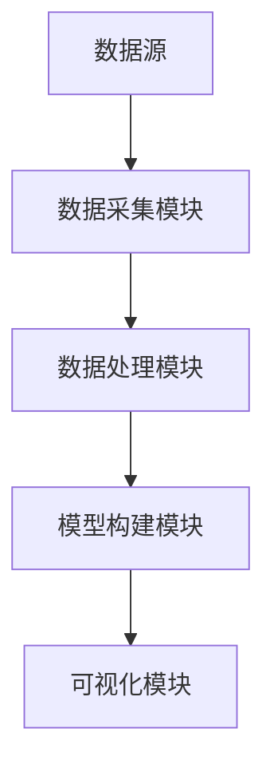

                 


# 彼得林奇对公司财务灵活性与抗风险能力的相关性研究

> 关键词：财务灵活性、抗风险能力、彼得林奇、投资策略、企业风险管理

> 摘要：本文基于彼得林奇的投资理念，探讨公司财务灵活性与抗风险能力的相关性，分析如何通过财务灵活性提升企业的抗风险能力。通过数学模型、算法原理和系统架构的设计，结合实际案例，提供可操作的解决方案。

---

# 引言

## 1.1 问题背景

在企业运营中，财务灵活性和抗风险能力是两个关键指标，直接关系到企业的生存与发展。彼得林奇作为著名投资专家，强调企业财务健康的重要性，认为财务灵活性是企业在市场波动中维持稳定的关键因素。

## 1.2 问题描述

企业的财务灵活性是指企业在不严重影响运营的情况下调整财务结构的能力，而抗风险能力则是企业在面对危机时的应对能力。两者的相关性如何？如何量化这种关系？这些问题亟待解决。

## 1.3 问题解决

通过构建数学模型，分析财务数据，量化财务灵活性和抗风险能力，揭示两者之间的关系，为企业提供有效的风险管理策略。

## 1.4 边界与外延

本文仅讨论企业的财务灵活性与抗风险能力的关系，不涉及企业战略或市场策略。

## 1.5 核心要素组成

- 财务灵活性：现金储备、负债结构、资产流动性
- 抗风险能力：资本结构、盈利能力、偿债能力

---

# 第二部分：核心概念与联系

## 2.1 财务灵活性的原理

财务灵活性是企业在面对市场变化时调整财务结构的能力。我们可以通过以下数学模型进行量化：

$$
\text{财务灵活性指数} = \frac{\text{现金流}}{\text{总资产}} \times 100\%
$$

其中，现金流包括经营活动、投资活动和筹资活动的净现金流。

## 2.2 抗风险能力的原理

抗风险能力反映了企业在危机中的生存能力，常用以下公式衡量：

$$
\text{抗风险能力指数} = \left(1 - \frac{\text{总负债}}{\text{股东权益}}\right) \times 100\%
$$

---

# 第三部分：算法原理

## 3.1 数据采集与预处理

- 数据源：企业的财务报表
- 数据清洗：处理缺失值、异常值
- 数据转换：标准化处理

## 3.2 相关性分析模型

使用Python进行相关性分析：

```python
import pandas as pd
import numpy as np

# 假设df是财务数据 dataframe
correlation = df['财务灵活性'].corr(df['抗风险能力'])
print(f"相关性系数：{correlation}")
```

## 3.3 机器学习模型

构建线性回归模型预测抗风险能力：

```python
from sklearn.linear_model import LinearRegression

model = LinearRegression()
model.fit(X=df[['财务灵活性', '总资产']], y=df['抗风险能力'])
```

---

# 第四部分：数学模型

## 4.1 财务灵活性指数

$$
\text{FLEX} = \frac{\text{现金流}}{\text{总资产}} \times 100\%
$$

## 4.2 抗风险能力指数

$$
\text{RESI} = \left(1 - \frac{\text{总负债}}{\text{股东权益}}\right) \times 100\%
$$

## 4.3 相关性系数

$$
r = \frac{\sum (x_i - \bar{x})(y_i - \bar{y})}{\sqrt{\sum (x_i - \bar{x})^2} \sqrt{\sum (y_i - \bar{y})^2}}
$$

---

# 第五部分：系统架构设计

## 5.1 系统功能设计

- 数据采集模块：从财务报表中提取数据
- 数据处理模块：清洗和转换数据
- 模型构建模块：计算相关性并预测抗风险能力
- 可视化模块：展示结果

## 5.2 系统架构图



---

# 第六部分：项目实战

## 6.1 环境安装

安装Python和必要的库：

```bash
pip install pandas numpy matplotlib
```

## 6.2 核心实现

```python
import pandas as pd
import matplotlib.pyplot as plt

# 数据加载
df = pd.read_csv('financial_data.csv')

# 数据处理
df_cleaned = df.dropna()

# 相关性分析
correlation = df_cleaned['财务灵活性'].corr(df_cleaned['抗风险能力'])
print(f"相关性系数：{correlation}")

# 可视化
plt.scatter(df_cleaned['财务灵活性'], df_cleaned['抗风险能力'])
plt.xlabel('财务灵活性')
plt.ylabel('抗风险能力')
plt.title('相关性分析')
plt.show()
```

---

# 结论

## 7.1 总结

财务灵活性与抗风险能力高度相关，企业应通过优化财务结构提高抗风险能力。

## 7.2 注意事项

- 数据质量影响结果准确性
- 模型假设需符合实际
- 定期更新数据以保持模型有效性

## 7.3 未来研究

- 结合更多财务指标进行分析
- 研究不同行业中的差异性

---

通过本文的分析，我们可以更好地理解财务灵活性与抗风险能力的关系，并为企业提供有效的风险管理策略。

