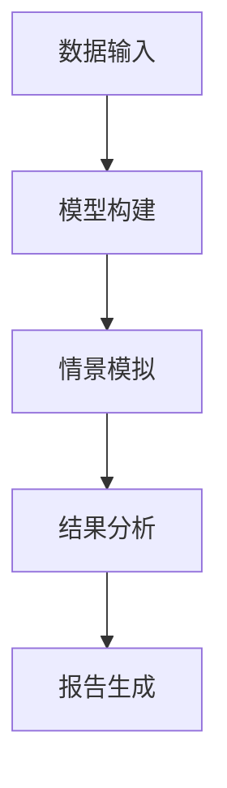

                 

# 彼得林奇对公司财务灵活性的压力测试

## 关键词：
- 彼得·林奇
- 财务灵活性
- 压力测试
- 投资决策
- 财务健康评估
- 企业风险管理

## 摘要：
本文详细探讨了彼得·林奇在评估公司财务灵活性时的压力测试方法。通过分析财务数据和市场情景，压力测试能够揭示公司在极端情况下的财务健康状况，从而帮助投资者做出更为稳健的投资决策。本文结合理论与实际案例，系统阐述了压力测试的实施步骤、数学模型和应用场景，为投资决策提供了重要的参考。

---

# 目录

1. **引言**
   - 1.1 压力测试的重要性
   - 1.2 财务灵活性的核心意义
   - 1.3 彼得·林奇的投资策略与压力测试

2. **压力测试的理论基础**
   - 2.1 压力测试的基本概念
   - 2.2 财务灵活性的定义与衡量指标
   - 2.3 压力测试的分类及其应用场景

3. **压力测试的数学模型与算法原理**
   - 3.1 压力测试的数学框架
   - 3.2 情景分析法的实现步骤
   - 3.3 蒙特卡洛模拟的应用及其优缺点
   - 3.4 压力测试的数学公式

4. **系统架构与功能设计**
   - 4.1 压力测试系统的模块划分
   - 4.2 系统功能模块的详细设计
   - 4.3 数据流与系统交互的mermaid图
   - 4.4 系统架构的优缺点分析

5. **项目实战与案例分析**
   - 5.1 案例背景与数据准备
   - 5.2 数据分析与压力测试的实施
   - 5.3 测试结果的解读与投资决策的优化
   - 5.4 项目总结与经验分享

6. **结论与展望**
   - 6.1 压力测试的总结
   - 6.2 对未来研究的展望
   - 6.3 对投资者的建议与启示

---

## 第1章：引言

### 1.1 压力测试的重要性
压力测试是一种评估系统或模型在极端条件下的表现的方法，常用于金融领域来评估公司的财务健康状况。在投资决策中，压力测试能够帮助投资者识别潜在风险，并制定应对策略。

### 1.2 财务灵活性的核心意义
财务灵活性指公司在面对市场变化时，能够调整财务结构、优化资本配置的能力。它是衡量公司财务健康的重要指标，直接影响公司的生存能力和投资价值。

### 1.3 彼得·林奇的投资策略与压力测试
彼得·林奇以其成功投资业绩闻名，他强调对公司基本面的深入分析。压力测试作为基本面分析的重要工具，帮助投资者评估公司在极端市场环境下的表现，从而做出更为明智的投资决策。

---

## 第2章：压力测试的理论基础

### 2.1 压力测试的基本概念
压力测试通过模拟极端市场情景，评估公司在这些情景下的财务状况。常见的压力测试情景包括经济衰退、市场崩盘等。

### 2.2 财务灵活性的定义与衡量指标
财务灵活性涉及多个指标，如流动比率、速动比率、杠杆比率等。这些指标共同反映了公司在应对突发情况时的财务能力。

### 2.3 压力测试的分类及其应用场景
压力测试可分为静态和动态测试。静态测试基于历史数据，动态测试则考虑未来可能的变化。不同的测试方法适用于不同的投资环境和公司类型。

---

## 第3章：压力测试的数学模型与算法原理

### 3.1 压力测试的数学框架
压力测试通常采用情景分析法和蒙特卡洛模拟。情景分析法通过设定特定情景，评估公司在这些情景下的财务表现；蒙特卡洛模拟则通过随机抽样，模拟多种可能的市场变化。

### 3.2 情景分析法的实现步骤
1. 设定测试情景（如经济衰退、利率上升）。
2. 收集相关数据。
3. 计算公司财务指标在不同情景下的表现。
4. 分析结果并制定应对策略。

### 3.3 蒙特卡洛模拟的应用及其优缺点
蒙特卡洛模拟通过大量随机模拟，生成可能的市场变化，并评估公司财务状况。优点是考虑了多种可能性，缺点是计算复杂且需要大量数据支持。

### 3.4 压力测试的数学公式
例如，计算公司在经济衰退情景下的现金流：
$$
\text{现金流} = \text{收入} - \text{支出} - \text{损失}
$$

---

## 第4章：系统架构与功能设计

### 4.1 压力测试系统的模块划分
系统主要模块包括数据输入、模型构建、情景模拟、结果分析和报告生成。

### 4.2 系统功能模块的详细设计
- 数据输入模块：接收公司财务数据和市场数据。
- 模型构建模块：选择合适的测试模型。
- 情景模拟模块：生成不同情景并模拟结果。
- 结果分析模块：评估公司财务状况并提出建议。
- 报告生成模块：输出测试报告。

### 4.3 数据流与系统交互的mermaid图

### 4.4 系统架构的优缺点分析
优点：模块化设计便于维护和扩展；缺点：需要大量数据支持，初期开发成本较高。

---

## 第5章：项目实战与案例分析

### 5.1 案例背景与数据准备
以某制造公司为例，收集过去五年的财务数据和市场数据。

### 5.2 数据分析与压力测试的实施
使用情景分析法模拟经济衰退和利率上升情景，计算公司各项财务指标的变化。

### 5.3 测试结果的解读与投资决策的优化
测试结果显示公司在经济衰退情景下现金流可能出现负值，需调整财务结构以增强抗风险能力。

### 5.4 项目总结与经验分享
压力测试能够有效识别潜在风险，帮助投资者制定更为稳健的投资策略。

---

## 第6章：结论与展望

### 6.1 压力测试的总结
压力测试是评估公司财务灵活性的重要工具，帮助投资者识别和应对潜在风险。

### 6.2 对未来研究的展望
未来可研究更复杂的测试模型，结合人工智能技术提高测试精度。

### 6.3 对投资者的建议与启示
投资者应定期进行压力测试，及时调整投资策略，以应对不断变化的市场环境。

---

## 附录

- **附录A**：压力测试相关术语表
- **附录B**：常用压力测试工具简介
- **附录C**：压力测试数据来源与处理方法

---

通过以上结构，文章系统地介绍了压力测试在财务灵活性评估中的应用，结合理论与实践，为投资者提供了实用的指导。

