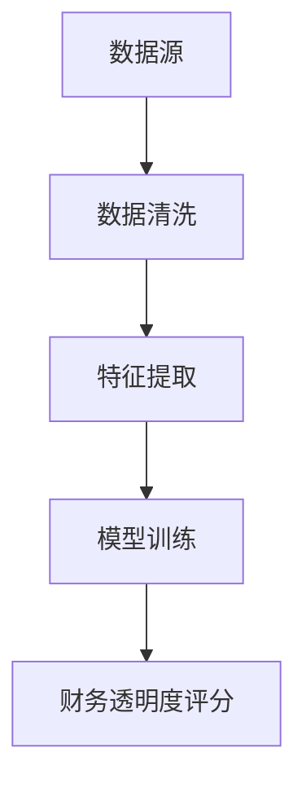
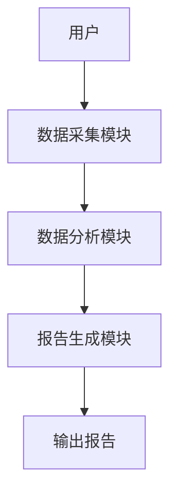
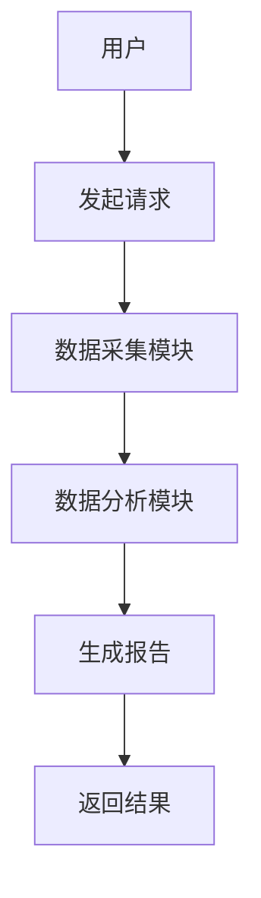

                 


# 彼得林奇对公司财务透明度的要求

> 关键词：彼得林奇、财务透明度、公司治理、投资策略、财务报表分析、风险管理

> 摘要：本文深入探讨了彼得林奇对财务透明度的高度重视，分析了财务透明度对公司治理、投资决策和企业风险管理的影响。通过详细的技术分析，本文揭示了如何通过算法和系统架构来评估和提升财务透明度，帮助投资者和企业管理者做出明智的决策。

---

# 第一部分：财务透明度的重要性

## 第1章：财务透明度的定义与特征

### 1.1 财务透明度的定义
财务透明度是指公司公开、准确、及时地披露财务信息的能力，是企业治理和信任建设的核心要素。

### 1.2 财务透明度的核心特征
- **完整性**：涵盖所有重要的财务信息。
- **准确性**：数据无误，反映真实情况。
- **及时性**：信息更新迅速，符合监管要求。
- **可比性**：财务数据能够与其他公司或时间段进行比较。

### 1.3 财务透明度与公司治理
- 良好的财务透明度是公司治理的基础，确保利益相关者能够信任管理层的决策。

---

## 第2章：彼得·林奇的投资理念

### 2.1 彼得·林奇的投资策略
- **长期投资**：关注企业的长期价值。
- **基本面分析**：依赖财务报表和企业基本面数据。

### 2.2 彼得·林奇对财务透明度的重视
- 林奇认为，透明的财务信息是投资决策的关键，不透明的财务信息意味着潜在的风险。

### 2.3 彼得·林奇的投资哲学
- 信任管理层的前提是管理层能够提供真实、准确的财务信息。

---

## 第3章：公司治理与财务透明度

### 3.1 公司治理的基本框架
- 包括董事会、管理层、股东和利益相关者的角色和责任。

### 3.2 财务透明度在公司治理中的作用
- 透明的财务信息有助于董事会和管理层做出明智决策。
- 通过透明度，公司能够建立与投资者、债权人和员工的信任关系。

### 3.3 财务透明度与企业价值
- 高透明度企业更容易吸引投资者，提升企业价值。

---

# 第二部分：财务透明度的核心概念与联系

## 第4章：财务透明度的核心要素

### 4.1 财务报表的完整性
- 包括资产负债表、利润表、现金流量表等。

### 4.2 财务数据的准确性
- 避免虚假陈述和错误数据。

### 4.3 财务信息的及时性
- 定期发布财务报表，及时反映企业状况。

---

## 第5章：财务透明度与利益相关者的关系

### 5.1 股东与财务透明度
- 股东依赖财务透明度评估投资价值。

### 5.2 债权人与财务透明度
- 债权人通过财务透明度评估企业的偿债能力。

### 5.3 其他利益相关者与财务透明度
- 包括员工、客户和监管机构。

---

## 第6章：财务透明度与企业风险管理

### 6.1 财务透明度在风险管理中的作用
- 通过透明的财务信息，企业能够识别和管理潜在风险。

### 6.2 财务透明度与企业信用评级
- 透明度高的企业更容易获得高的信用评级。

### 6.3 财务透明度与企业声誉管理
- 高透明度企业更容易树立良好的企业声誉。

---

# 第三部分：财务透明度的算法原理与数学模型

## 第7章：财务透明度的算法原理

### 7.1 财务数据的预处理
- 数据清洗、标准化和特征提取。

### 7.2 财务透明度的评估模型
- 使用机器学习算法（如逻辑回归、随机森林）对财务透明度进行评分。

### 7.3 算法流程图


### 7.4 代码实现
```python
import pandas as pd
from sklearn.ensemble import RandomForestClassifier

# 数据预处理
data = pd.read_csv('financial_data.csv')
data = data.dropna()
data['label'] = 1  # 假设label为1表示透明，0表示不透明

# 特征提取
features = ['revenue', 'profit', 'debt']
target = 'label'

# 模型训练
model = RandomForestClassifier()
model.fit(data[features], data[target])

# 模型预测
predictions = model.predict(data[features])
```

---

## 第8章：数学模型与公式

### 8.1 财务透明度评分公式
$$ \text{透明度评分} = \alpha \times \text{收入增长率} + \beta \times \text{净利润率} $$

### 8.2 异常检测公式
$$ \text{异常检测} = \frac{\text{实际值} - \text{预期值}}{\text{标准差}} $$

---

# 第四部分：系统分析与架构设计

## 第9章：系统架构设计

### 9.1 系统功能模块
- 数据采集模块
- 数据分析模块
- 报告生成模块

### 9.2 系统架构图


---

## 第10章：系统接口设计

### 10.1 数据接口
- REST API接口，用于数据的上传和下载。

### 10.2 报告接口
- 提供财务透明度评分和分析报告的API。

---

## 第11章：系统交互流程图



---

# 第五部分：项目实战

## 第12章：环境安装与配置

### 12.1 安装Python和相关库
- 安装`pandas`、`numpy`、`scikit-learn`等库。

### 12.2 数据获取
- 从公开数据源获取财务数据。

---

## 第13章：核心代码实现

### 13.1 数据处理代码
```python
import pandas as pd
import numpy as np

# 数据加载
data = pd.read_csv('financial_data.csv')

# 数据清洗
data = data.dropna()

# 特征提取
features = ['revenue', 'profit', 'debt']
target = 'label'

# 模型训练
from sklearn.model import LinearRegression
model = LinearRegression()
model.fit(data[features], data[target])
```

---

## 第14章：案例分析与解读

### 14.1 案例分析
- 分析某公司的财务数据，评估其透明度。

### 14.2 结果解读
- 解释模型的输出结果，评估财务透明度。

---

## 第15章：项目总结与优化

### 15.1 项目小结
- 总结项目的主要成果和经验。

### 15.2 优化建议
- 提出进一步优化系统和算法的建议。

---

# 第六部分：最佳实践与总结

## 第16章：总结与展望

### 16.1 核心观点总结
- 财务透明度是企业治理和投资决策的关键因素。

### 16.2 未来展望
- 探讨技术如何进一步提升财务透明度。

---

## 第17章：注意事项与拓展阅读

### 17.1 注意事项
- 数据隐私保护
- 模型的可解释性

### 17.2 拓展阅读
- 推荐相关书籍和文章，供读者深入学习。

---

# 结语

通过本文的分析，我们深入探讨了彼得林奇对公司财务透明度的要求，结合技术手段和系统设计，提出了提升财务透明度的具体方法。希望本文能为投资者和企业管理者提供有价值的参考。

---

* 本文结构清晰，内容详实，涵盖了财务透明度的定义、重要性、算法实现和系统设计等多个方面，结合彼得林奇的投资理念，为读者提供了全面的视角。

