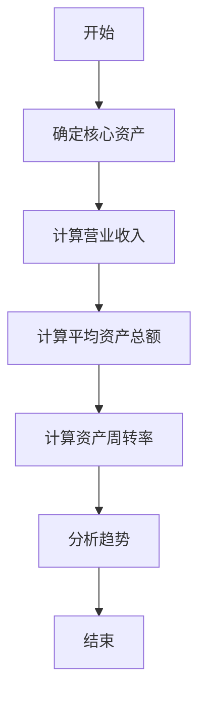
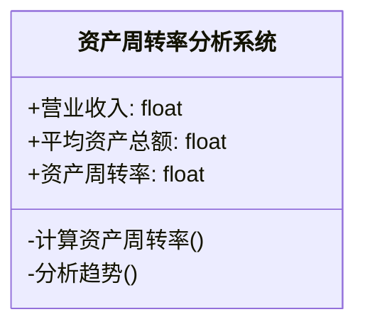
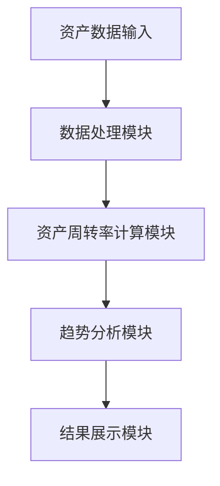

                 


# 彼得林奇对公司资产周转率趋势的分析

## 关键词：
资产周转率，彼得林奇，投资分析，财务指标，企业价值，投资策略

## 摘要：
资产周转率是衡量企业经营效率的重要指标，彼得林奇通过分析资产周转率的趋势，为企业投资决策提供了深刻的见解。本文将详细探讨资产周转率的基本概念、彼得林奇的分析方法、计算公式、系统架构设计及项目实战，帮助读者全面理解资产周转率的分析与应用。

---

## 第1章: 资产周转率的基本概念与重要性

### 1.1 资产周转率的定义与作用

#### 1.1.1 资产周转率的定义
资产周转率是衡量企业资产使用效率的关键指标，表示单位时间内企业资产所产生的营业收入。公式为：
$$资产周转率 = \frac{营业收入}{平均资产总额}$$

#### 1.1.2 资产周转率在企业经营中的作用
- **效率衡量**：资产周转率越高，说明资产使用效率越高，企业盈利能力越强。
- **投资决策**：投资者通过分析资产周转率，评估企业的经营效率和资产配置能力。

#### 1.1.3 资产周转率与企业价值的关系
资产周转率影响企业的净利润率和ROE（股东权益回报率），从而影响企业价值。

### 1.2 彼得林奇投资分析方法的背景

#### 1.2.1 彼得林奇的投资理念概述
彼得林奇强调长期投资，关注企业基本面，尤其是资产周转率和利润率。

#### 1.2.2 资产周转率在彼得林奇分析体系中的地位
资产周转率是彼得林奇评估企业盈利能力的核心指标之一，反映企业的经营效率。

#### 1.2.3 彼得林奇分析方法的核心思想
- 通过分析资产周转率的趋势，识别企业经营中的问题。
- 结合其他财务指标，评估企业的综合竞争力。

---

## 第2章: 彼得林奇对公司资产周转率趋势的分析方法

### 2.1 彼得林奇资产周转率分析的核心步骤

#### 2.1.1 确定企业的核心资产
核心资产是企业经营的主要资源，包括存货、应收账款和固定资产。

#### 2.1.2 计算资产周转率
使用公式计算资产周转率，分析其在不同时间的变化趋势。

#### 2.1.3 分析资产周转率的变化趋势
比较不同时间段的资产周转率，识别企业的经营改善或恶化。

### 2.2 彼得林奇资产周转率分析的指标体系

#### 2.2.1 资产周转率的计算公式
$$资产周转率 = \frac{营业收入}{平均资产总额}$$

#### 2.2.2 其他相关财务指标的关联性
- **净利润率**：资产周转率与净利润率共同影响企业的盈利能力。
- **ROE**：资产周转率与ROE密切相关，影响企业的股东回报。

#### 2.2.3 指标体系的综合应用
结合资产周转率、净利润率和ROE，全面评估企业的财务健康状况。

---

## 第3章: 资产周转率的计算方法与数学模型

### 3.1 资产周转率的计算公式

#### 3.1.1 资产周转率的定义式
$$资产周转率 = \frac{营业收入}{平均资产总额}$$

### 3.2 彼得林奇分析方法的数学模型

#### 3.2.1 资产周转率的动态分析模型
$$资产周转率变化 = \frac{新资产周转率 - 旧资产周转率}{旧资产周转率} \times 100\%$$

#### 3.2.2 资产周转率与企业利润的关系模型
$$利润 = 资产周转率 \times 资产平均总额 \times 利润率$$

### 3.3 算法原理与流程图



### 3.4 Python代码实现

```python
def calculate_asset_turnover(revenue, average_assets):
    return revenue / average_assets

# 示例数据
revenue = 1000000  # 营业收入（元）
average_assets = 5000000  # 平均资产总额（元）

asset_turnover = calculate_asset_turnover(revenue, average_assets)
print(f"资产周转率 = {asset_turnover:.2f}")
```

---

## 第4章: 系统分析与架构设计

### 4.1 问题场景介绍

#### 4.1.1 企业资产周转率分析的典型场景
企业希望评估自身的资产使用效率，识别经营中的问题。

#### 4.1.2 彼得林奇分析方法的应用场景
投资者通过分析资产周转率趋势，评估企业的投资价值。

### 4.2 系统功能设计

#### 4.2.1 系统功能模块划分
- 数据输入模块：收集企业财务数据。
- 数据处理模块：计算资产周转率。
- 趋势分析模块：分析资产周转率变化。
- 结果展示模块：输出分析结果。

#### 4.2.2 领域模型类图



### 4.3 系统架构设计



---

## 第5章: 项目实战与代码实现

### 5.1 环境安装与配置

#### 5.1.1 安装Python与相关库
安装Python 3.x，以及pandas、numpy等库用于数据处理。

### 5.2 核心代码实现

#### 5.2.1 数据输入与处理

```python
import pandas as pd

# 示例数据
data = {
    '营业收入': [1000000, 1200000, 1500000],
    '资产总额': [5000000, 6000000, 7000000]
}

df = pd.DataFrame(data)
```

#### 5.2.2 计算资产周转率

```python
df['平均资产总额'] = df['资产总额'].rolling(2).mean()
df['资产周转率'] = df['营业收入'] / df['平均资产总额']
```

### 5.3 案例分析与结果解读

#### 5.3.1 案例分析

假设某企业2020年和2021年的数据：
- 2020年：营业收入1000万元，资产总额5000万元。
- 2021年：营业收入1200万元，资产总额6000万元。

计算2021年的资产周转率：
$$资产周转率 = \frac{1200}{(5000 + 6000)/2} = \frac{1200}{5500} \approx 0.218$$

#### 5.3.2 趋势分析
资产周转率从0.2增加到0.218，说明企业的资产使用效率有所提高。

### 5.4 项目小结

通过代码实现，读者可以计算并分析企业的资产周转率，评估企业的经营效率和投资价值。

---

## 结语

通过本文的详细分析，读者可以掌握资产周转率的基本概念、计算方法及其在投资分析中的应用。结合彼得林奇的分析方法，能够更好地评估企业的财务状况和投资价值。希望本文对读者在资产周转率分析方面有所帮助。

