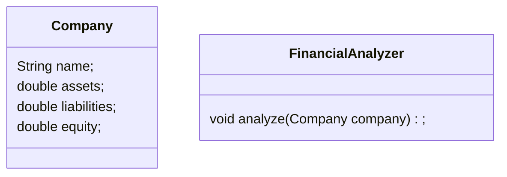
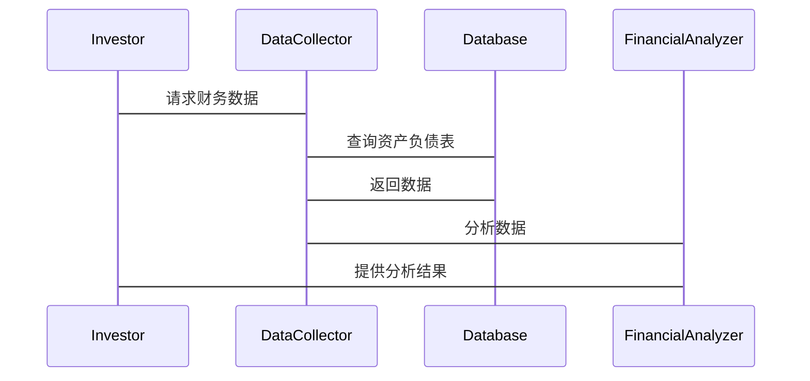

                 


# 彼得林奇对公司资产负债表的解读技巧

## 关键词：
彼得·林奇、资产负债表、投资分析、财务健康、资产评估、风险管理

## 摘要：
本文深入探讨了彼得·林奇对上市公司资产负债表的解读技巧，结合理论与实际案例，详细分析了如何通过资产负债表评估公司财务健康状况，识别投资机会与风险。文章从基础概念入手，逐步深入，涵盖资产、负债、所有者权益的核心分析方法，并通过具体案例展示了彼得·林奇的投资理念在实践中的应用。

---

## 第一部分: 背景介绍与核心概念

### 第1章: 资产负债表的基本概念

#### 1.1 资产负债表的定义与结构
##### 1.1.1 资产负债表的定义
资产负债表是反映公司在某一特定时点的财务状况的重要报表，展示了公司拥有的资产、承担的负债以及所有者权益之间的平衡关系。其基本公式为：
$$ 资产 = 负债 + 所有者权益 $$

##### 1.1.2 资产负债表的基本结构
- 资产：分为流动资产（现金、应收账款、存货等）和非流动资产（固定资产、无形资产等）。
- 负债：分为流动负债（短期借款、应付账款等）和非流动负债（长期借款、债券等）。
- 所有者权益：包括股本、资本公积、盈余公积等。

##### 1.1.3 资产负债表的重要性与作用
- 评估公司财务健康状况。
- 分析公司的偿债能力。
- 为投资决策提供重要依据。

#### 1.2 彼得·林奇的背景与投资理念
##### 1.2.1 彼得·林奇的生平简介
彼得·林奇（Peter Lynch）是美国著名投资经理人，曾管理富达麦哲伦基金，创造了辉煌的投资业绩。他的投资理念以基本面分析为核心，尤其是对公司财务报表的深入研究。

##### 1.2.2 彼得·林奇的投资哲学
- 重视公司基本面，尤其是资产负债表和损益表。
- 偏好财务健康、成长稳定的公司。
- 避免投资复杂业务模式的公司。

##### 1.2.3 彼得·林奇对资产负债表的重视
彼得·林奇认为，资产负债表是评估公司财务健康状况的核心工具，通过分析资产负债表，可以识别公司的财务风险和成长潜力。

---

### 第2章: 资产负债表的核心要素

#### 2.1 资产的分类与特征
##### 2.1.1 流动资产与非流动资产
- 流动资产：易于变现，包括现金、应收账款、存货等。
- 非流动资产：长期投资，包括固定资产、无形资产等。

##### 2.1.2 资产的计价方法
- 历史成本法：按购买时的实际成本计价。
- 公允价值法：按当前市场价值计价。

##### 2.1.3 资产质量的评估标准
- 流动资产的周转能力。
- 固定资产的折旧情况。

#### 2.2 负债的分类与特征
##### 2.2.1 流动负债与非流动负债
- 流动负债：短期债务，包括应付账款、短期借款等。
- 非流动负债：长期债务，包括长期借款、债券等。

##### 2.2.2 负债的偿付顺序与风险
- 流动负债优先偿付。
- 非流动负债风险较低。

##### 2.2.3 负债对财务健康的影响
- 过高的流动负债可能影响短期偿债能力。

#### 2.3 所有者权益的构成与意义
##### 2.3.1 所有者权益的基本定义
- 所有者权益是公司资产减去负债后的剩余部分。

##### 2.3.2 所有者权益的来源与变化
- 来源：股本、资本公积、盈余公积等。
- 变化：受公司盈利和分红政策影响。

##### 2.3.3 所有者权益对投资决策的影响
- 所有者权益稳定表明公司财务健康。

---

## 第二部分: 资产负债表的分析技巧

### 第3章: 资产分析的技巧与方法

#### 3.1 流动资产的分析重点
##### 3.1.1 现金及现金等价物的评估
- 现金持有量是否合理。
- 现金流量是否健康。

##### 3.1.2 存货的管理与风险
- 存货周转率计算：
$$ 存货周转率 = 营业成本 / 平均存货 $$

- 存货周转率低可能表明管理不善。

##### 3.1.3 应收账款的质量分析
- 应收账款回收周期：
$$ 应收账款回收周期 = 应收账款 / 日常营业收入 $$

- 应收账款坏账风险。

#### 3.2 非流动资产的评估要点
##### 3.2.1 固定资产的折旧与减值
- 固定资产折旧方法：
$$ 年限平均法 = (原值 - 预计净残值) / 使用年限 $$

- 固定资产减值测试。

##### 3.2.2 无形资产的评估与风险
- 无形资产的 amortization。
- 无形资产减值风险。

##### 3.2.3 其他资产的分类与管理
- 其他资产的分类与管理。

---

### 第4章: 负债分析的技巧与方法

#### 4.1 流动负债的管理策略
##### 4.1.1 短期借款的偿付压力
- 短期借款偿还能力：
$$ 短期偿债能力 = (流动资产 - 存货) / 流动负债 $$

##### 4.1.2 应付账款的管理效率
- 应付账款周转天数：
$$ 应付账款周转天数 = 应付账款 / 日常营业收入 $$

##### 4.1.3 其他流动负债的分析
- 其他流动负债的影响。

#### 4.2 非流动负债的风险评估
##### 4.2.1 长期借款的利率与期限
- 长期借款利率风险。

##### 4.2.2 公司债券的信用评级
- 公司债券信用评级影响。

##### 4.2.3 或有负债的潜在风险
- 或有负债的潜在影响。

---

### 第5章: 所有者权益的深入分析

#### 5.1 所有者权益的变化趋势
##### 5.1.1 净利润对所有者权益的影响
- 净利润计算：
$$ 净利润 = 收入 - 费用 $$

##### 5.1.2 留存收益的积累
- 留存收益的积累对所有者权益的影响。

#### 5.2 所有者权益的结构优化
##### 5.2.1 股本结构的合理性
- 股本结构合理性分析。

##### 5.2.2 资本公积的管理
- 资本公积的管理与使用。

#### 5.3 所有者权益对投资决策的指导意义
##### 5.3.1 所有者权益的增长潜力
- 所有者权益增长潜力评估。

##### 5.3.2 所有者权益波动风险
- 所有者权益波动风险分析。

---

## 第三部分: 资产负债表分析的实战应用

### 第6章: 彼得·林奇的经典案例分析

#### 6.1 苹果公司的资产负债表分析
##### 6.1.1 苹果公司的财务健康状况
- 苹果公司现金储备充足，流动负债占比低。

##### 6.1.2 苹果公司的资产结构
- 高质量的流动资产和稳定的非流动资产。

#### 6.2 微软公司的负债管理策略
##### 6.2.1 微软公司的债务结构
- 长期负债占比高，短期偿债压力小。

##### 6.2.2 微软公司的信用评级
- 高信用评级支持低成本融资。

---

## 第四部分: 资产负债表分析的系统架构

### 第7章: 系统分析与架构设计方案

#### 7.1 问题场景介绍
##### 7.1.1 财务分析的需求背景
- 投资者需要快速获取公司财务数据。

##### 7.1.2 系统功能目标
- 实现对公司资产负债表的自动化分析。

#### 7.2 系统功能设计
##### 7.2.1 领域模型 mermaid 类图


##### 7.2.2 系统架构设计 mermaid 架构图


##### 7.2.3 系统接口设计
- 数据接口：从数据库获取资产负债表数据。
- 分析接口：调用分析算法。

##### 7.2.4 系统交互 mermaid 序列图


---

## 第五部分: 项目实战与总结

### 第8章: 项目实战

#### 8.1 环境安装与数据准备
##### 8.1.1 安装 Python 和相关库
- 安装 Pandas 和 Matplotlib。

##### 8.1.2 数据来源
- 从 Yahoo Finance 获取公司财务数据。

#### 8.2 核心实现源代码
##### 8.2.1 数据获取与清洗
```python
import pandas as pd

# 获取苹果公司资产负债表数据
def get_financial_data(ticker):
    # 数据获取逻辑
    pass

data = get_financial_data("AAPL")
```

##### 8.2.2 资产负债表分析算法
```python
def analyze_balance_sheet(data):
    # 分析逻辑
    pass

result = analyze_balance_sheet(data)
```

##### 8.2.3 结果可视化
```python
import matplotlib.pyplot as plt

plt.plot(result['years'], result['asset_growth'], label='资产增长率')
plt.show()
```

#### 8.3 案例分析与结果解读
##### 8.3.1 案例选择
- 选择苹果公司进行分析。

##### 8.3.2 分析结果解读
- 苹果公司资产增长稳健，负债率低。

#### 8.4 项目小结
- 项目实现了对苹果公司资产负债表的自动化分析。
- 分析结果验证了彼得·林奇的投资理念。

### 第9章: 总结与展望

#### 9.1 总结
- 彼得·林奇通过深入分析资产负债表，识别出优质投资标的。
- 资产负债表分析是投资决策的核心工具。

#### 9.2 展望
- 结合人工智能技术，提升资产负债表分析的效率和准确性。
- 进一步研究其他财务报表（如利润表、现金流量表）的分析方法。

---

## 参考文献
1. 彼得·林奇. 《彼得·林奇的成功投资策略》
2. 葛拉罕姆. 《证券分析》
3. 张五. 《财务报表分析实务》

---

通过本文的系统讲解，读者可以全面掌握彼得·林奇对资产负债表的解读技巧，并在实际投资中灵活运用这些方法。希望本文能为投资者提供有价值的参考，帮助他们在复杂多变的市场中做出明智的投资决策。

