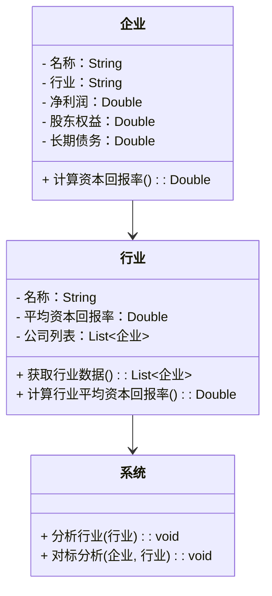

                 


# 彼得林奇对公司资本回报率的行业对标分析

> 关键词：彼得·林奇，资本回报率，行业分析，投资策略，企业估值

> 摘要：本文通过分析彼得·林奇的投资理念，重点探讨如何利用资本回报率对企业进行行业对标分析。文章从资本回报率的基本概念出发，结合具体的行业案例，详细讲解了如何计算和应用资本回报率，以及如何通过行业对标分析来评估企业的投资价值。

---

# 第一部分: 背景与核心概念

## 第1章: 资本回报率的基本概念

### 1.1 资本回报率的定义与计算方法

#### 1.1.1 资本回报率的定义
资本回报率（Return on Capital Employed，简称ROCE）是衡量企业投资回报能力的重要指标。它反映了每单位资本所创造的收益，帮助投资者评估企业的经营效率和盈利能力。

资本回报率的计算公式如下：
$$
ROCE = \frac{\text{净利润}}{\text{股东权益 + 长期债务}} \times 100\%
$$

ROCE的值越高，说明企业的资本利用效率越高，投资回报能力越强。

#### 1.1.2 资本回报率的计算公式
资本回报率的计算需要结合企业的财务报表数据，具体包括净利润、股东权益和长期债务。以下是公式中的关键变量及其定义：

| 变量 | 定义 |
|------|------|
| 净利润 | 指企业在一定会计期间的经营成果，即利润 |
| 股东权益 | 指企业在扣除负债后归属于股东的部分 |
| 长期债务 | 指企业需要在一年以上偿还的债务 |

#### 1.1.3 资本回报率的重要性
资本回报率是投资者评估企业投资价值的重要指标。它可以帮助投资者识别哪些行业和企业在资本使用上更为高效，从而做出更明智的投资决策。

---

### 1.2 彼得·林奇的投资理念

#### 1.2.1 彼得·林奇的简介
彼得·林奇（Peter Lynch）是美国著名的职业基金经理人，曾管理富达麦哲伦基金，创造了年均29%的复合回报率。他以其独特的投资理念和对市场的深刻理解而闻名。

#### 1.2.2 林奇的投资策略
林奇的投资策略强调长期价值投资，注重对企业基本面的分析。他认为，投资者应该选择那些具有持续增长潜力、资本回报率高且估值合理的企业进行投资。

#### 1.2.3 林奇对资本回报率的重视
林奇在其投资策略中，非常重视资本回报率的分析。他认为，资本回报率高的企业通常具有更强的盈利能力和发展潜力，能够在行业中保持竞争优势。

---

## 第2章: 行业分析与对标方法

### 2.1 行业分析的基本步骤

#### 2.1.1 确定行业范围
行业分析的第一步是确定分析的行业范围。这需要根据企业的业务性质、市场定位以及投资目标来选择合适的行业。

#### 2.1.2 收集行业数据
收集行业数据是行业分析的关键步骤。数据来源包括行业报告、财务报表、市场调研等。以下是一个典型的行业数据收集流程：

1. **确定数据来源**：如公司财报、行业报告、政府统计数据等。
2. **数据清洗与整理**：对收集到的数据进行清洗和整理，确保数据的准确性和完整性。
3. **数据存储**：将数据存储到数据库中，以便后续分析。

#### 2.1.3 分析行业趋势
行业趋势分析是了解行业发展方向的重要步骤。这包括分析行业的增长率、市场结构、竞争格局以及政策环境等因素。

---

### 2.2 对标分析的实施方法

#### 2.2.1 确定对标公司
确定对标公司是行业对标分析的第一步。通常选择行业内具有代表性的公司作为对标对象。以下是选择对标公司的关键因素：

- **行业地位**：选择行业内领先的公司。
- **财务状况**：选择财务健康、资本回报率高的公司。
- **业务模式**：选择与目标企业业务模式相似的公司。

#### 2.2.2 计算对标公司的资本回报率
计算对标公司的资本回报率是行业对标分析的核心步骤。以下是计算过程：

1. **收集数据**：获取对标公司的财务报表数据。
2. **计算ROCE**：使用ROCE公式计算对标公司的资本回报率。
3. **分析结果**：比较不同公司的ROCE，找出行业平均水平和标杆值。

#### 2.2.3 对比分析与总结
对比分析是行业对标分析的关键步骤。通过将目标企业的资本回报率与行业平均水平和标杆公司进行对比，可以识别企业的优势和劣势，制定相应的优化策略。

---

# 第二部分: 行业深度分析

## 第3章: 科技行业的资本回报率分析

### 3.1 科技行业的特点

#### 3.1.1 高研发投入
科技行业通常需要大量的研发支出，以保持技术领先和产品创新。

#### 3.1.2 快速技术创新
科技行业具有快速的技术更新和产品迭代的特点，这使得企业的竞争优势往往只能维持较短时间。

#### 3.1.3 资本密集型
科技行业的研发和生产需要大量的资本投入，尤其是半导体、人工智能等领域。

### 3.2 科技行业标杆公司的分析

#### 3.2.1 苹果公司
苹果公司（Apple Inc.）是科技行业的标杆企业之一。以下是苹果公司资本回报率的分析：

1. **计算ROCE**：假设2022年苹果公司的净利润为998亿美元，股东权益和长期债务合计为1533亿美元。
   $$
   ROCE = \frac{998}{1533} \times 100\% = 65.23\%
   $$

2. **对比分析**：苹果公司的ROCE远高于行业平均水平，显示出其高效的资本利用能力。

---

## 第4章: 金融行业的资本回报率分析

### 4.1 金融行业的特点

#### 4.1.1 资产负债表复杂
金融行业的资产负债表通常较为复杂，涉及大量的金融资产和负债。

#### 4.1.2 高杠杆风险
金融行业往往通过高杠杆（即负债比例高）来放大收益，但也带来了较高的风险。

#### 4.1.3 监管严格
金融行业受到严格的监管，企业需要遵守相关的法律法规，确保金融体系的稳定。

### 4.2 金融行业标杆公司的分析

#### 4.2.1 花旗银行
花旗银行（Citi Bank）是金融行业的代表企业之一。以下是花旗银行资本回报率的分析：

1. **计算ROCE**：假设2022年花旗银行的净利润为181亿美元，股东权益和长期债务合计为2345亿美元。
   $$
   ROCE = \frac{181}{2345} \times 100\% = 7.73\%
   $$

2. **对比分析**：花旗银行的ROCE低于行业平均水平，显示出其资本利用效率较低，可能存在优化空间。

---

# 第三部分: 系统分析与架构设计

## 第5章: 系统分析与架构设计

### 5.1 问题场景介绍
本部分将从系统分析的角度，探讨如何构建一个基于资本回报率的行业对标分析系统。该系统将帮助企业投资者快速分析不同行业的资本回报率，评估企业的投资价值。

### 5.2 系统功能设计

#### 5.2.1 领域模型设计
以下是领域模型的Mermaid类图：



### 5.3 系统架构设计

以下是系统架构的Mermaid图：

```mermaid
architectural
    客户端 <--[通过API请求]-> 中间件
    中间件 <-> 数据库
    中间件 <--[处理请求]-> 业务逻辑层
    业务逻辑层 <--[调用]-> 行为层
```

---

## 第6章: 系统实现与项目实战

### 6.1 环境安装
为了实现本系统的功能，需要安装以下工具和库：

1. **编程语言**：Python 3.8+
2. **数据处理库**：Pandas、NumPy
3. **可视化库**：Matplotlib、Seaborn
4. **Mermaid工具**：用于绘制类图和架构图
5. **数据库**：MySQL或MongoDB

### 6.2 核心实现源代码

#### 6.2.1 数据处理模块
以下是数据处理模块的Python代码：

```python
import pandas as pd
import numpy as np

def calculate_roce(net_profit, equity, long_debt):
    return (net_profit / (equity + long_debt)) * 100

# 示例数据
data = {
    '公司': ['苹果', '花旗银行', '谷歌'],
    '净利润': [998, 181, 340],
    '股东权益': [1000, 2000, 800],
    '长期债务': [500, 1500, 400]
}

df = pd.DataFrame(data)

# 计算ROCE
df['ROCE'] = df.apply(lambda x: calculate_roce(x['净利润'], x['股东权益'], x['长期债务']), axis=1)

print(df)
```

#### 6.2.2 可视化模块
以下是可视化模块的Python代码：

```python
import matplotlib.pyplot as plt
import seaborn as sns

# 绘制行业对标分析图
plt.figure(figsize=(10, 6))
ax = sns.barplot(x='公司', y='ROCE', data=df)
plt.title('行业对标资本回报率分析')
plt.xlabel('公司名称')
plt.ylabel('资本回报率(%)')
plt.xticks(rotation=45)
plt.show()
```

---

## 第7章: 总结与拓展阅读

### 7.1 总结
通过本文的分析，我们可以看出，资本回报率是评估企业投资价值的重要指标。彼得·林奇的投资理念为我们提供了宝贵的指导，帮助我们在实际投资中更好地应用资本回报率进行行业对标分析。

### 7.2 小结
本文从资本回报率的基本概念出发，结合具体行业的分析，详细讲解了如何利用资本回报率对企业进行投资价值评估。同时，我们还通过系统设计和项目实战，展示了如何将资本回报率的分析方法应用于实际投资中。

### 7.3 注意事项
在实际应用中，投资者需要注意以下几点：
1. **数据的准确性**：确保使用的财务数据准确无误。
2. **行业特性的考虑**：不同行业的资本回报率计算方法可能有所不同。
3. **动态调整**：资本回报率是一个动态指标，需要定期更新和调整。

### 7.4 拓展阅读
为了进一步深入学习资本回报率的行业分析方法，建议读者阅读以下书籍和资料：
- 《彼得·林奇的投资智慧》
- 《资本回报率：财务分析实战手册》
- 《行业分析与投资策略》

---

通过本文的系统分析和实战案例，相信读者已经掌握了如何利用资本回报率进行行业对标分析，并能够在实际投资中灵活运用这些方法，做出更明智的投资决策。

