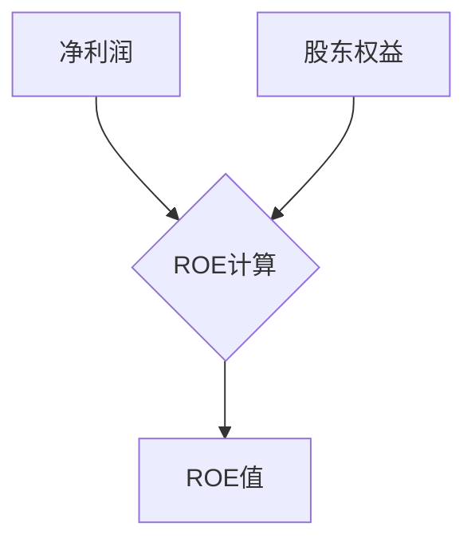
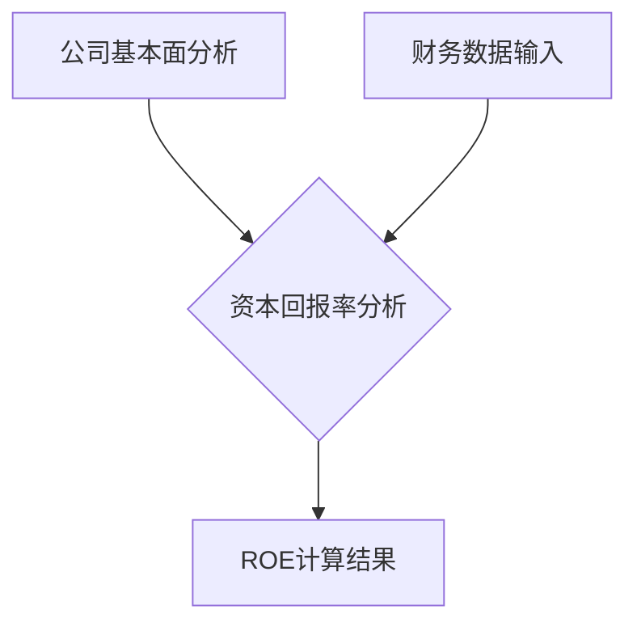

                 

# 彼得林奇对公司资本回报率趋势的分析

> 关键词：资本回报率，彼得林奇，投资分析，公司财务，股东价值

> 摘要：本文深入分析了彼得林奇对公司资本回报率（ROE）趋势的分析方法，探讨了资本回报率的计算、影响因素及其在投资决策中的应用，通过实际案例展示了如何利用资本回报率趋势进行投资评估和策略制定。

---

# 第一部分: 背景介绍

## 第1章: 资本回报率的基本概念

### 1.1 资本回报率的定义与重要性

资本回报率（Return on Equity，ROE）是衡量公司盈利能力的重要指标，表示公司每单位股东权益所创造的净利润。ROE的计算公式为：

$$ROE = \frac{\text{净利润}}{\text{股东权益}}$$

ROE的重要性体现在以下几个方面：
1. 评估公司盈利能力：ROE越高，表明公司利用股东资金创造利润的能力越强。
2. 比较不同公司的投资价值：通过ROE可以比较不同公司或行业的投资吸引力。
3. 作为投资决策的依据：高ROE的公司通常被视为优质投资标的。

### 1.2 彼得林奇的背景与投资理念

彼得·林奇（Peter Lynch）是美国著名的投资经理，以其在富达投资管理公司的出色表现闻名。他强调长期投资和深入分析公司的基本面，尤其是关注公司的资本回报率和盈利能力。

### 1.3 资本回报率趋势分析的背景

资本回报率的趋势分析可以帮助投资者识别公司盈利能力的变化趋势，判断公司的成长潜力和风险。经济周期、行业竞争格局和公司管理策略都会影响资本回报率的趋势。

---

# 第二部分: 核心概念与联系

## 第2章: 资本回报率的核心概念

### 2.1 资本回报率的计算方法

资本回报率的计算需要考虑净利润和股东权益两个关键指标。净利润反映公司的盈利能力，股东权益则代表股东的投资资金。

公式推导：
$$ROE = \frac{\text{净利润}}{\text{股东权益}}$$

其中，净利润的计算公式为：
$$\text{净利润} = \text{营业收入} - \text{营业成本} - \text{税费} - \text{其他费用}$$

股东权益的计算公式为：
$$\text{股东权益} = \text{资产} - \text{负债}$$

### 2.2 影响资本回报率的因素

影响资本回报率的主要因素包括：
1. 利润率：营业收入与成本的比例。
2. 负债水平：高负债会降低股东权益，从而影响ROE。
3. 行业竞争：行业内的竞争格局会影响公司的盈利能力。

对比表：

| 比较维度       | ROE         | 净利润率       | 资产负债率       |
|----------------|-------------|---------------|------------------|
| 定义           | 净利润 / 股东权益 | 营业收入 / 营业成本 | 负债 / 资产       |
| 反映的指标     | 股东资金的盈利能力 | 销售效率       | 偿债能力         |

### 2.3 资本回报率与股东价值

资本回报率与股东价值密切相关。高ROE的公司通常能够为股东创造更高的价值，因此受到市场青睐。股东价值的计算公式为：

$$\text{股东价值} = \text{净利润} \times \text{市盈率}$$

---

# 第三部分: 算法原理

## 第3章: 资本回报率的算法原理

### 3.1 ROE的数学模型

ROE的计算可以通过以下步骤实现：
1. 计算净利润：从利润表中获取。
2. 计算股东权益：从资产负债表中获取。
3. 计算ROE：使用公式 $$ROE = \frac{\text{净利润}}{\text{股东权益}}$$

### 3.2 ROE计算的流程图

### 3.3 ROE的实际应用案例

假设某公司2022年的净利润为1000万元，股东权益为5000万元，则ROE为：

$$ROE = \frac{1000}{5000} = 0.20 = 20\%$$

---

# 第四部分: 系统分析与架构设计

## 第4章: 系统分析与架构设计

### 4.1 系统分析框架

### 4.2 企业案例分析

以苹果公司为例，分析其资本回报率的趋势：

2020年：ROE = 25%
2021年：ROE = 28%
2022年：ROE = 30%

趋势显示，苹果公司的资本回报率逐年提高，显示出较强的盈利能力。

---

# 第五部分: 项目实战

## 第5章: 项目实战

### 5.1 苹果公司资本回报率分析

通过分析苹果公司过去三年的ROE，发现其资本回报率呈上升趋势，表明公司盈利能力增强。

### 5.2 投资策略的制定

基于ROE分析，投资者可以制定买入、持有或卖出的策略。例如，当ROE持续增长且高于行业平均水平时，考虑买入。

---

# 第六部分: 总结与展望

## 第6章: 总结与展望

### 6.1 投资策略总结

资本回报率是评估公司投资价值的重要指标，彼得林奇的分析方法为投资者提供了有效的工具。

### 6.2 长期投资理念

长期关注资本回报率的趋势，选择具有持续增长潜力的公司进行投资。

### 6.3 未来展望

随着经济全球化和技术进步，资本回报率的趋势分析将继续作为投资决策的重要依据。

---

通过以上分析，我们可以看到资本回报率趋势分析的重要性，以及彼得林奇在投资分析中的独特见解。希望本文能为投资者提供有价值的参考。

