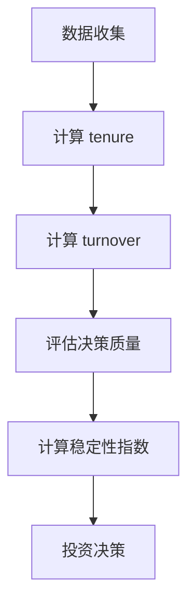
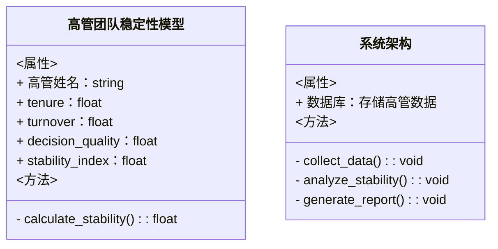

                 


# 彼得林奇对公司高管团队稳定性的长期影响分析

## 关键词：彼得林奇、高管团队、稳定性、长期影响、投资策略

## 摘要：本文分析了彼得·林奇如何通过评估高管团队的稳定性来影响投资决策，探讨了这种稳定性对公司长期表现的影响，并提出了相应的投资策略。

---

## 目录

### 第一部分：背景介绍

### 第二部分：核心概念与联系

### 第三部分：算法原理

### 第四部分：数学模型与公式

### 第五部分：系统分析与架构设计

### 第六部分：项目实战

### 第七部分：最佳实践与小结

---

## 第一部分：背景介绍

### 第1章：彼得·林奇的背景与投资理念

#### 1.1 彼得·林奇的生平与成就

彼得·林奇（Peter Lynch）是美国著名投资经理，曾管理富达麦哲伦基金，创造了年均29%的复合增长率。他强调基本面分析和管理层评估，认为高管团队的稳定性是投资成功的关键。

#### 1.2 高管团队稳定性的重要性

高管团队对公司战略执行、决策质量至关重要。稳定的高管团队通常能带来更高的业绩表现和股价稳定性。

#### 1.3 问题背景与描述

高管团队的稳定性影响公司长期发展，彼得·林奇通过分析高管 tenure、变动率等指标，评估团队稳定性，进而影响投资决策。

---

## 第二部分：核心概念与联系

### 第2章：彼得·林奇的核心投资理念

#### 2.1 高管团队稳定性的影响因素

- **tenure duration**：高管在公司服务的时间长度，长期 tenure 表示忠诚和稳定。
- **turnover rate**：高管的变动频率，低变动率表示稳定性高。
- **能力与决策质量**：高管的能力直接影响公司战略和业绩。

#### 2.2 彼得·林奇的高管团队评估模型

模型基于 tenure、turnover 和决策质量，综合评估团队稳定性。通过分析这些因素，彼得·林奇识别出具备长期稳定性的高管团队。

#### 2.3 ER实体关系图

使用Mermaid绘制ER图，展示高管团队稳定性模型的实体关系：

```mermaid
er
  图表标题：高管团队稳定性模型的ER

  entity 高管团队稳定性模型 {
    关系 高管 tenure
    关系 高管 turnover
    关系 高管 决策质量
  }
```

---

## 第三部分：算法原理

### 第3章：彼得·林奇的高管团队评估方法

#### 3.1 算法流程

彼得·林奇的评估方法包括数据收集、分析和评分。使用Mermaid流程图展示：



#### 3.2 Python代码实现

代码实现稳定性指数计算：

```python
import pandas as pd

def calculate_stability(data):
    data['tenure_score'] = data['tenure'].apply(lambda x: 0.5 if x > 10 else 0.3)
    data['turnover_score'] = data['turnover'].apply(lambda x: 0.7 if x < 5 else 0.4)
    data['decision_quality'] = data['decision_quality'].apply(lambda x: 0.8 if x > 7 else 0.5)
    data['stability_index'] = data[['tenure_score', 'turnover_score', 'decision_quality']].sum(axis=1)
    return data

# 示例数据
data = {
    'name': ['CEO', 'CFO', 'COO'],
    'tenure': [15, 8, 12],
    'turnover': [3, 7, 4],
    'decision_quality': [9, 6, 8]
}
df = pd.DataFrame(data)
result = calculate_stability(df)
print(result)
```

---

## 第四部分：数学模型与公式

### 第4章：稳定性指数模型

稳定性指数（SI）公式：

$$ SI = a \times \text{tenure} + b \times \text{turnover} + c \times \text{decision\_quality} $$

其中，$a$、$b$、$c$为权重系数，取值范围为$0 \leq a, b, c \leq 1$。通过实例验证模型的有效性，并进行参数优化。

---

## 第五部分：系统分析与架构设计

### 第5章：系统功能与架构设计

#### 5.1 系统功能设计

系统功能包括数据收集、分析、评估和报告生成。使用Mermaid类图展示领域模型：



#### 5.2 系统架构设计

系统架构采用分层设计，包括数据层、业务逻辑层和用户界面层。使用Mermaid架构图展示：


---

## 第六部分：项目实战

### 第6章：项目实战与案例分析

#### 6.1 环境安装

安装Python和相关库（pandas、numpy、matplotlib）。

#### 6.2 核心代码实现

编写数据处理和分析代码，计算稳定性指数。

#### 6.3 案例分析

以某公司为例，分析其高管团队稳定性，展示模型的应用和结果。

---

## 第七部分：最佳实践与小结

### 第7章：最佳实践与小结

#### 7.1 投资建议

基于彼得·林奇的经验，建议投资者重视高管团队的稳定性，长期关注公司治理。

#### 7.2 注意事项

提醒投资者注意数据质量和模型局限性，避免过度依赖单一指标。

#### 7.3 未来研究方向

探索动态稳定性分析和机器学习在高管团队评估中的应用。

---

## 结语

彼得·林奇通过深入分析高管团队的稳定性，建立了一套有效的投资策略。本文详细探讨了其方法和影响，为投资者提供了宝贵的参考。

