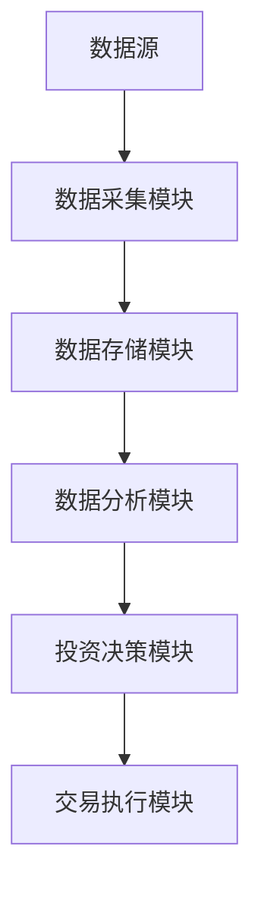

                 


# 彼得林奇对小盘股的态度

## 关键词：彼得·林奇，小盘股，投资策略，风险管理，价值投资

## 摘要：  
彼得·林奇是全球著名基金经理，以其在小盘股投资上的卓越成就闻名。本文将深入分析彼得·林奇对小盘股的态度，探讨他的投资哲学、选股标准、风险管理策略，并结合技术分析方法，提供系统化的投资框架。通过背景介绍、算法解析、系统架构设计和项目实战，本文旨在为投资者提供实用的策略和工具，帮助他们在小盘股投资中取得成功。

---

## 第一章：彼得·林奇的背景与投资哲学  
### 1.1 彼得·林奇的生平简介  
彼得·林奇是美国著名基金经理，曾管理富达麦哲伦基金（Fidelity Magellan Fund），创造了年化13.7%的平均回报率。他的投资哲学以基本面分析和长期价值投资为核心。  

### 1.2 小盘股的投资哲学  
林奇认为小盘股具有更大的成长潜力，因其市值较小，具备更高的增长空间。他强调通过深入研究公司基本面，寻找那些被市场低估的优质企业。  

### 1.3 投资策略的核心理念  
- **价值投资**：寻找市场价格低于内在价值的股票。  
- **分散投资**：通过投资多只股票降低风险。  
- **长期持有**：避免频繁交易，减少成本。  

---

## 第二章：小盘股的定义与特点  
### 2.1 小盘股的定义  
小盘股通常指市值在50亿至200亿美元之间的公司股票。这类股票流动性较低，但增长潜力较大。  

### 2.2 小盘股的特点  
| 特点 | 描述 |
|------|------|
| 市值小 | 易受市场波动影响，但成长空间大。 |
| 流动性低 | 交易量小，买卖价差较大。 |
| 成长性高 | 适合初创期或快速扩张的公司。 |

### 2.3 小盘股的投资优势  
- **潜在高回报**：小盘股的成长性较高，可能带来超额收益。  
- **分散风险**：通过投资不同行业的小盘股降低整体风险。  

---

## 第三章：彼得·林奇的投资策略  
### 3.1 基本面分析  
林奇通过分析财务报表，评估公司的盈利能力、成长性和财务健康状况。  

#### 3.1.1 财务指标分析  
关键指标包括：  
- **市盈率（P/E）**：衡量股票价格与每股收益的比例。  
- **市净率（P/B）**：衡量股票价格与每股净资产的比例。  
- **ROE（净资产收益率）**：衡量公司盈利能力。  

### 3.2 选股标准  
林奇的选股标准包括：  
- 公司具有持续的盈利能力。  
- 行业地位稳固，竞争优势明显。  
- 财务健康，无重大财务风险。  

### 3.3 投资组合管理  
林奇通过分散投资和定期调整持仓来管理风险。  

---

## 第四章：彼得·林奇的风险管理策略  
### 4.1 风险来源  
- **市场风险**：整体市场波动影响股价。  
- **流动性风险**：小盘股交易量小，可能难以快速变现。  
- **公司风险**：企业经营状况恶化。  

### 4.2 风险控制方法  
- **分散投资**：避免过度集中于单一行业或公司。  
- **止损策略**：设定止损点，避免重大损失。  
- **持续监控**：定期评估持仓，及时调整策略。  

---

## 第五章：技术分析与投资策略  
### 5.1 技术分析的引入  
将技术分析与基本面分析结合，提高投资决策的准确性。  

#### 5.1.1 常用技术指标  
- **移动平均线（MA）**：判断股价趋势。  
- **相对强弱指数（RSI）**：衡量股票超买或超卖状态。  
- **MACD（移动平均收敛散度）**：判断股价趋势和动能。  

### 5.2 投资策略的数学模型  
构建一个简单的技术分析模型，如下所示：  

$$ \text{买入信号} = \begin{cases} 
\text{true} & \text{如果 RSI < 30 且 MA(10) > MA(30)} \\
\text{false} & \text{否则}
\end{cases} $$  

### 5.3 算法实现  
使用Python编写技术分析算法，对小盘股进行筛选和评估。  

```python
import pandas as pd
import numpy as np

# 示例数据：小盘股的历史价格数据
prices = pd.DataFrame({
    'Close': [100, 98, 102, 105, 103, 108, 106, 110, 115, 112]
})

# 计算移动平均线
prices['MA10'] = prices['Close'].rolling(10).mean()
prices['MA30'] = prices['Close'].rolling(30).mean()

# 计算RSI
prices['RSI'] = (prices['Close'] - prices['Close'].shift(1)) / prices['Close'].shift(1)
prices['RSI'] = (prices['RSI'].rolling(14).mean() * 100)

# 生成信号
prices['Signal'] = 0
prices['Signal'] = np.where((prices['RSI'] < 30) & (prices['MA10'] > prices['MA30']), 1, 0)
```

---

## 第六章：系统设计与架构  
### 6.1 系统架构  
设计一个投资管理系统，包括数据采集、分析、决策和执行模块。  

#### 6.1.1 系统架构图  


### 6.2 数据流分析  
从数据采集到交易执行的流程，确保系统的高效运行。  

---

## 第七章：项目实战与案例分析  
### 7.1 环境安装  
安装必要的Python库，如Pandas、NumPy、Matplotlib等。  

### 7.2 核心代码实现  
编写代码实现小盘股筛选和投资信号生成。  

```python
import pandas as pd
import numpy as np

# 示例数据：小盘股的财务数据和股价数据
data = pd.DataFrame({
    'Ticker': ['AAPL', 'GOOGL', 'MSFT', 'AMZN', 'FB'],
    'Revenue_Growth': [20, 25, 18, 30, 22],
    'Net_Profit': [10, 15, 12, 18, 14],
    'Market_Cap': [200, 250, 180, 300, 220]
})

# 选股标准：Revenue Growth > 20% 且 Net Profit > 10%
data['Qualify'] = data.apply(lambda x: x['Revenue_Growth'] > 20 and x['Net_Profit'] > 10, axis=1)

print(data[data['Qualify']])
```

### 7.3 案例分析  
以实际案例分析林奇如何通过基本面和技术分析选择小盘股。  

---

## 第八章：总结与最佳实践  
### 8.1 总结  
彼得·林奇的小盘股投资策略结合了基本面分析和长期价值投资，通过深入研究和严格筛选，实现超额收益。  

### 8.2 最佳实践  
- 定期评估持仓，及时调整策略。  
- 结合技术分析，提高决策的科学性。  
- 保持耐心，避免短期波动影响判断。  

### 8.3 注意事项  
- 小盘股流动性较低，需谨慎操作。  
- 风险管理是投资成功的关键。  
- 避免过度依赖单一策略，保持灵活性。  

---

## 附录  
### 附录A：进一步阅读的书籍  
1. 《彼得·林奇的投资艺术》  
2. 《小盘股投资策略》  

### 附录B：经典语录  
- “投资成功与否，取决于是否能找到那些有良好管理、良好财务状况、良好行业地位的公司。”  
- “不要试图通过预测市场波动来赚钱，而是要专注于寻找那些具有持续增长潜力的公司。”  

---

## 结语  
通过本文的分析，读者可以深入了解彼得·林奇对小盘股的态度，并掌握一套系统化的投资策略。结合技术分析和基本面研究，投资者可以在小盘股领域中找到适合自己的投资方式，实现长期稳定的收益。

